# Agent Dashboard - System Design and Technical Reference

Architectural overview and technical reference for the Agent Dashboard system, covering design goals, high-level architecture, data flow, server and client components, database design, WebSocket protocol, hook integration, MCP extension layer, Claude Code plugins & skills, state management, security considerations, performance characteristics, deployment modes, and technology choices.


---

## Table of Contents

- [System Overview](#system-overview)
- [High-Level Architecture](#high-level-architecture)
- [Data Flow](#data-flow)
- [Server Architecture](#server-architecture)
- [Client Architecture](#client-architecture)
- [Internationalization Architecture](#internationalization-architecture)
- [Database Design](#database-design)
- [WebSocket Protocol](#websocket-protocol)
- [Hook Integration](#hook-integration)
- [Import Pipeline](#import-pipeline)
- [Agent Extension Layer](#agent-extension-layer)
- [Plugin Marketplace](#plugin-marketplace)
- [MCP Integration](#mcp-integration)
- [State Management](#state-management)
- [Browser Notification System](#browser-notification-system)
- [Update Notifier Subsystem](#update-notifier-subsystem)
- [Tabby Companion Subsystem](#tabby-companion-subsystem)
- [VS Code Extension Architecture](#vs-code-extension-architecture)
- [Desktop App Architecture (macOS & Windows / Electron)](#desktop-app-architecture-macos--windows--electron)
- [Security Considerations](#security-considerations)
- [Performance Characteristics](#performance-characteristics)
- [Deployment Modes](#deployment-modes)
- [Statusline Utility](#statusline-utility)
- [Technology Choices](#technology-choices)
- [Build & Run Targets](#build--run-targets)

---

## System Overview

Agent Dashboard is a local-first monitoring platform for Claude Code sessions. It captures agent lifecycle events via Claude Code's native hook system, persists them in SQLite, and presents them through a React dashboard with real-time WebSocket updates.

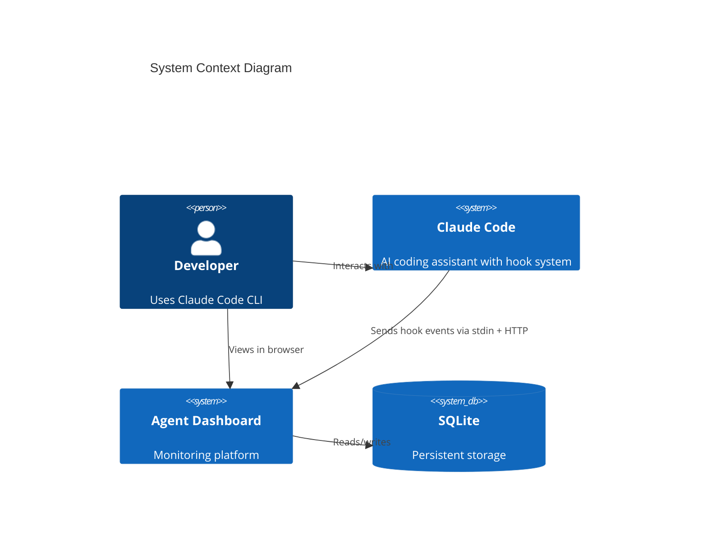

**Design goals:**

- Zero-config operation -- auto-discovers sessions from hook events
- Never block Claude Code -- hooks fail silently with timeouts
- Instant feedback -- WebSocket push, no polling
- Portable -- SQLite, no external services, runs on any OS with Node.js 20+
- Extensible -- plugin marketplace with 10 plugins (53 skills, 14 agents, 30 slash commands, 3 CLI tools)

---

## High-Level Architecture

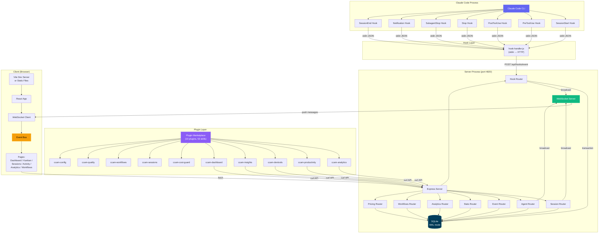

---

## Data Flow

### Event Ingestion Pipeline

```mermaid
sequenceDiagram
    participant CC as Claude Code
    participant HH as hook-handler.js
    participant API as POST /api/hooks/event
    participant TX as SQLite Transaction
    participant WS as WebSocket.broadcast()
    participant UI as React Client

    CC->>HH: stdin: {"session_id":"abc","tool_name":"Bash",...}
    Note over HH: Reads stdin, parses JSON,<br/>wraps with hook_type

    HH->>API: POST {"hook_type":"PreToolUse","data":{...}}
    Note over API: Validates hook_type + data

    API->>TX: BEGIN TRANSACTION
    TX->>TX: ensureSession(session_id)
    Note over TX: Creates session + main agent<br/>if first contact. Also persists<br/>data.transcript_path onto the session row<br/>(SQL-guarded, so subsequent events no-op).<br/>Syncs sessions.name from the transcript title<br/>(custom-title &gt; ai-title &gt; first user prompt).

    TX->>TX: Process by hook_type
    Note over TX: Dispatches by hook_type. Maintains the agent and<br/>session state machines plus the awaiting_input_since flag.<br/>SubagentStop also triggers a JSONL scan that emits per_tool<br/>events under each subagent. See the hook table below for<br/>the full per_event behaviour.

    TX->>TX: insertEvent(...)
    TX->>TX: COMMIT

    API->>WS: broadcast("agent_updated", agent)
    API->>WS: broadcast("new_event", event)

    WS->>UI: {"type":"agent_updated","data":{...}}
    UI->>UI: eventBus.publish(msg)
    UI->>UI: Page re-renders with new data
```

### Client Data Loading Pattern

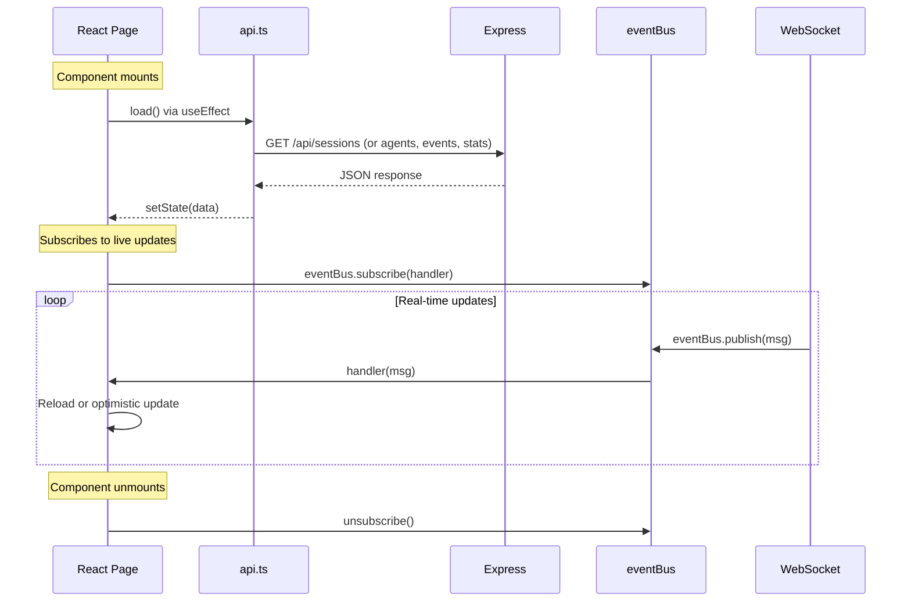

---

## Server Architecture

### Module Dependency Graph

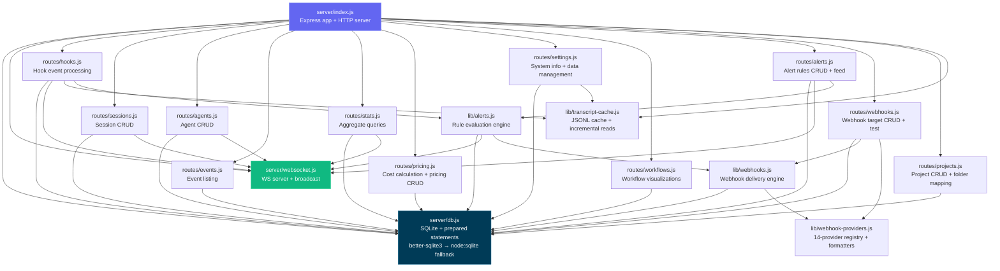

### Server Components

| Module                    | Responsibility                                                                                                                                                                                                                                                                                                                                                                                                                                                                                                                       |
|---------------------------|--------------------------------------------------------------------------------------------------------------------------------------------------------------------------------------------------------------------------------------------------------------------------------------------------------------------------------------------------------------------------------------------------------------------------------------------------------------------------------------------------------------------------------------|
| `server/index.js`         | Express app setup, middleware, route mounting, static file serving in production, HTTP server creation. Static middleware sets explicit `Cache-Control` headers — `immutable` for `/assets/*`, `no-cache, must-revalidate` for `index.html` / `sw.js` / `manifest.json`, a short revalidation window otherwise — so a rebuild always replaces the in-browser bundle without a hard refresh. Runs a periodic maintenance sweep — cadence derived from `DASHBOARD_STALE_MINUTES` (¼ of the threshold, clamped to 60 s – 5 min, default ~45 min) — that abandons stale sessions with transcript cache eviction and scans active sessions for new compaction entries by reading `sessions.transcript_path` directly (an O(active sessions) lookup; the previous `SELECT DISTINCT json_extract(events.data,'$.transcript_path')` scan grew with the events table and is gone). **Error detection watchdog** runs every 15 seconds: finds active sessions with no recent hook events (>10 s stale), re-reads their transcript files looking for API errors (401 auth, rate limits, quota exhaustion), derives transcript paths from session `cwd` for imported sessions, and marks sessions/agents as `error` when API errors are found — catches cases where the CLI doesn't fire a hook after API errors. The same watchdog also performs **user-interrupt (Esc) recovery**: `Esc` fires no hook, so a cancelled turn would otherwise leave the main agent stuck `working`. It detects this two ways — (a) the transcript's `[Request interrupted by user]` marker, surfaced as `result.pendingInterrupt` from `TranscriptCache` (computed from transcript ordering alone, immune to server/transcript clock skew), and (b) an idle-working fallback for an Esc pressed *before any output* (which writes no marker): when the main agent has been `working` with `current_tool` null and neither a hook event nor the transcript mtime has advanced for `DASHBOARD_WORKING_IDLE_SECONDS` (default 120) — and moves the session to **Waiting** (agent → `waiting`, `awaiting_input_since` stamped) with an `Interrupted` event. Both paths share the same working-fleet guard as the Stop handler (`findDeepestWorkingAgent`): a Task/Agent subagent's `PostToolUse` clears the main agent's `current_tool` as soon as it spawns, which can look identical to a dead interrupted turn if the subagent then runs long past the idle threshold with no further hook events, so neither recovery path fires while a subagent is still `working` — the row isn't reclassified as a false `interrupted` Waiting on top of whatever it already reads (typically Waiting/"SubAgents", proactively stamped by `Stop`). Triggers legacy session import (with active-session detection for recently-modified JSONL files) and compaction backfill on startup, plus a boot **liveness reap** — immediately for rows from a previous run and again ~5 s later for rows the startup sync just imported (see the `routes/hooks.js` row) — so sessions that died while the dashboard was down never render as Waiting. Also starts the **Remote Data Sources** sync poller (`startRemoteSourceSync`) that pulls each enabled remote source on an interval — `DASHBOARD_REMOTE_SYNC_MS` (default 60000; 0 disables) — reusing `server/lib/remote-sync.js`. **Graceful shutdown** (SIGTERM/SIGINT) tears down in order: drop realtime clients first (`closeWebSocket` terminates WS clients so their sockets release), then `httpServer.close()` to stop new connections, then `httpServer.closeAllConnections()` to drop lingering keep-alive sockets so `close()` fires promptly, and only **then** close SQLite — inside the `close()` callback, after the HTTP server has drained. Closing the DB before drain made in-flight requests throw `The database connection is not open`; leaving WS/keep-alive sockets open stalled the shutdown until the 5 s force-exit backstop (the "waiting for graceful termination" hang under `node --watch`). A second signal forces an immediate exit                                                                                                                                                                                                                    |
| `server/openapi.js`       | OpenAPI 3.0.3 document generator for the backend API (metadata, schemas, endpoint paths), merging supplementary fragments from `server/openapi-extra/` in `createOpenApiSpec()`. Feeds the raw spec endpoint (`/api/openapi.json`), Swagger UI (`/api/docs`), **ReDoc** (`/api/redoc`, served via `server/lib/redoc.js` with a self-hosted bundle — never a CDN), and the committed `openapi.yaml` regenerated by `npm run openapi:yaml`                                                                                                                                                                                                                                                          |
| `server/lib/redoc.js`     | Serves the **ReDoc** API reference (`/api/redoc`) as a self-hosted three-panel rendering of the OpenAPI spec, with the ReDoc bundle served locally from `/api/redoc/redoc.standalone.js` (bundled via the `redoc` dependency, never a CDN) so the reference works fully offline / air-gapped                                                                                                                                                                                                                                                                                                                                                                            |
| `server/openapi-extra/`   | Supplementary OpenAPI path/schema fragments merged into the spec by `createOpenApiSpec()` — covers `cc-config.js`, `push.js`, `run.js`, and `misc.js` route groups                                                                                                                                                                                                                                                                                                                                                                                                                                                                                                                    |
| `server/db.js`            | SQLite connection with WAL mode, schema migration (CREATE TABLE IF NOT EXISTS + ALTER TABLE for column additions), all prepared statements as a reusable `stmts` object. Tries `better-sqlite3` first, falls back to `node:sqlite` via `compat-sqlite.js`. Migrations use literal defaults for ALTER TABLE since SQLite does not support expressions like `strftime()` in column defaults added via ALTER TABLE                                                                                                                      |
| `server/compat-sqlite.js` | Compatibility wrapper that gives Node.js built-in `node:sqlite` (`DatabaseSync`) the same API as `better-sqlite3` — pragma, transaction, prepare. Used as automatic fallback when the native module is unavailable (Node 22+)                                                                                                                                                                                                                                                                                                        |
| `server/websocket.js`     | WebSocket server on `/ws` path, 30s heartbeat with ping/pong dead connection detection, typed broadcast function. Upgrades run through the same Host-header allowlist and optional `DASHBOARD_TOKEN` check as the HTTP surface (`isWebSocketAuthorized`)                                                                                                                                                                                                                                                                                                                                                  |
| `server/lib/security.js`  | Network-hardening module (fix for GHSA-gr74-4xfh-6jw9). `resolveHost()` picks the bind address — `127.0.0.1` by default, widened only by `DASHBOARD_HOST` (logs a warning for non-loopback binds). `hostGuard` rejects requests whose `Host` header isn't in the loopback set or `DASHBOARD_ALLOWED_HOSTS` (DNS-rebinding defense). `corsOptions()` allows only loopback origins while letting No-Origin (curl/CLI) requests through. `tokenGuard` + `isWebSocketAuthorized` enforce the optional `DASHBOARD_TOKEN` on `/api/*` and WebSocket upgrades (accepted as `Authorization: Bearer`, `x-dashboard-token`, or `?token=`; off by default). Exempt paths and token-matching helpers (`tokensMatch`, `extractToken`) live here too                                                                                                                  |
| `routes/hooks.js`         | Core event processing inside a SQLite transaction. Auto-creates sessions/agents. Handles 8 hook types: SessionStart, UserPromptSubmit, PreToolUse, PostToolUse, Stop, SubagentStop, Notification, SessionEnd, plus synthetic `Compaction` events. Manages the agent state machine plus the `awaiting_input_since` overlay and its paired `awaiting_reason` (one of `notification` | `stop` | `session_start` | `interrupted` | `subagent` | `shell` | `monitor` — the last three mean "still actively working via a child", not blocked on the human): stamped on SessionStart for fresh CLIs — `startup`/`resume`/`clear` only, reason `session_start`, since a `compact`-source SessionStart fires mid-turn while Claude is working and is deliberately skipped so a working session stays Active — on non-error Stop, reason `stop`, or proactively `subagent` when a subagent fleet is still `working` at Stop time (rather than silently staying Active with no explanation) — and on Notification, reclassified by `classifyWaitingReason` instead of always assuming `notification`: a permission/approval-worded message always wins, otherwise a working subagent → `subagent`, `current_tool==='Bash'` → `shell`, `current_tool==='Monitor'` → `monitor`, else the genuine `notification`. Cleared on UserPromptSubmit / PreToolUse / PostToolUse / SessionStart-resume / SessionEnd — `clearAwaitingInputRespectingActor` preserves a `notification` or `subagent` wait against a background subagent's own routine tool events, clearing unconditionally only when main itself is the actor; SubagentStop intentionally does NOT clear it, but its drain check downgrades a `subagent` stamp (or stamps the deferred flag if none was set) to `stop` when the last working subagent completes after such a Stop; and stamped by the 15 s watchdog on user-interrupt (Esc) recovery — see the `index.js` row — since `Esc` fires no hook). After `res.json()` returns on `SubagentStop`, fires a fire-and-forget `scanAndImportSubagents` (from `scripts/import-history.js`) that parses every `subagents/agent-*.jsonl`, pairs `tool_use` ↔ `tool_result` blocks by `tool_use_id`, and emits per-tool `PreToolUse` + `PostToolUse` events under each subagent's own `agent_id` — closes the gap where subagent-internal tool calls would otherwise never reach the events table. The same scan also reparents nested subagents under their true spawner (see the `import-history.js` row); it returns `{ created, reparented }`, and the follow-up `new_event` refetch nudge fires when **either** is non-zero so a pure re-parent (tree shape changed, no new rows) still refreshes the UI. The same scan attributes each subagent's tokens to **its own model** (resolved from the subagent transcript) and stamps `metadata.model` on the subagent row (issue #185), so a tiered pipeline (Opus orchestrator + Sonnet/Haiku subagents) is priced per real model rather than entirely at the orchestrator's rate; the parent-model bucket is skipped to avoid colliding with the main-transcript token writer's compaction baseline logic. Session reactivation on resume (including Stop/SubagentStop reactivation for imported completed/abandoned sessions), orphaned-session cleanup uses `DASHBOARD_STALE_MINUTES` (default 180). Uses a shared `TranscriptCache` instance (`server/lib/transcript-cache.js`) for extraction of tokens, API errors, turn durations, thinking blocks, and usage extras — stat-based caching with incremental byte-offset reads avoids re-reading entire JSONL files on every event. Detects compaction via `isCompactSummary` in JSONL transcripts and creates compaction agents + events (deduplicated by uuid). Token baselines (`baseline_*` columns) preserve pre-compaction totals so no usage is lost. Also writes one `context_snapshots` row per transcript-bearing event (deduped by `transcript_uuid`, `INSERT OR IGNORE`) from `TranscriptCache`'s `lastUsage` — the current turn's ACTIVE context size (`input + cache_read + cache_creation` for that one turn) plus that turn's own `output_tokens`, distinct from `token_usage`'s cumulative lifetime totals — plus that same turn's own `input_tokens`/`cache_read_tokens`/`cache_write_tokens` (the components `context_tokens` sums, carried alongside it purely for the token-baggage chart's hover breakdown) — powering both the Session Overview page's context-over-time chart (`GET /:id/stats` → `context_series`, a sawtooth that drops at `/compact`/`/clear`) and its token-baggage bar chart (`GET /:id/stats` → `token_baggage_series`, a running SUM of `context_tokens + output_tokens` per turn that never decreases) so a long-running session's context bloat, whether a `/compact` or `/clear` actually brought it back down, and how fast tokens are being burned overall are all visible. Cache entries are evicted on SessionEnd. **SessionEnd preserves error state** — but only when the error is still unrecovered at the transcript tail (`isErrorAtTail`: latest API error with no successful turn after it); a transient error the CLI retried past finalizes as `completed` instead of freezing in a stale `error`. **Error recovery**: `UserPromptSubmit` and `PreToolUse` recover a session from `error`; additionally the 15 s watchdog now scans `error` sessions and self-heals one back to `active` when its transcript has progressed past the last API error (`isErrorAtTail` false) — closing the gap where a transient API error left an imported or sweep-monitored session (no live recovery hook) pinned in `error` forever. **Session naming**: on every event, syncs `sessions.name` from the transcript title surfaced by `TranscriptCache` and broadcasts `session_updated` — an explicit `custom-title` (`/rename`, `claude -n`, picker Ctrl+R) always wins, an `ai-title` (auto / plan-accept) only fills a placeholder/auto name (`Session <id8>` or a cwd-folder import name) so a user-chosen name is never clobbered. When neither title exists, the session's **first user prompt** (surfaced by `TranscriptCache` as `firstUserMessage`; tool-result / meta / slash-command plumbing entries skipped) fills the placeholder session name plus the main agent's placeholder name and empty task (issue #201) — a later `ai-title` can still replace a descriptor-filled name, and the agent fill passes the in-flight `current_tool` through (the shared `updateAgent` statement writes that column verbatim) so it is never wiped mid-turn. The guarded `updateSessionName` no-ops on the unchanged case, so the broadcast path stays quiet; the 15 s error-watchdog runs the same sync for idle sessions that fire no hook after a rename. **Dead-session liveness reap**: the same watchdog completes any `active` session whose `cwd` has no running `claude` CLI process (probe via `lib/session-liveness.js`) — recovering a `SessionEnd` lost while the dashboard was down (e.g. Ctrl+C) that previously left the session in Waiting until the 3 h stale sweep; watchdog ticks are gated on the transcript mtime (fallback `updated_at` when no transcript exists) being older than `DASHBOARD_LIVENESS_IDLE_SECONDS` (default 60 s); the boot passes — immediately at startup and again ~5 s later (post-import) — skip the gate so a session quit moments before launch clears at once, disabled via `DASHBOARD_LIVENESS_PROBE=0` / on Windows / in containers, and a false completion self-heals through hook reactivation. Sessions whose `cwd` is not POSIX-absolute (household-hook-forwarded from another machine, e.g. a Windows `D:\…` path a local `/proc`/`lsof` scan can never match) are skipped by the reap — so a mixed local + forwarded deployment stays correct without disabling the whole probe. **Remote Data Source sessions** (`sessions.source` ≠ `local`) are excluded from the reap, the error/interrupt watchdog scan, and both stale sweeps (all gated on `source = 'local'`): their POSIX-absolute `cwd` lives on another machine, so local process/clock heuristics would wrongly terminate a running remote session — their status is reconciled from the SSH mirror by `remote-sync.js` instead |
| `routes/sessions.js`      | Standard CRUD with pagination. GET includes agent count via LEFT JOIN. POST is idempotent on session ID. GET `/:id/transcript` also surfaces `custom-title` lines as synthetic `session_event` (rename) messages — deduped, with `ai-title` excluded — so TUI-only `/rename` (which writes no user/assistant turn) is still visible in the conversation viewer. It also surfaces `system`/`local_command` lines: newer Claude Code builds write a local slash command's invocation and captured output (`<command-name>`, `<local-command-stdout>`/`stderr`) as `system`/`local_command` entries with the TUI markup in a top-level `content` string (older builds used `user` messages), so the route re-emits those as user-side text and the client's `tuiSegments` parser renders the command pill + its output (e.g. `/color` → a `/color` pill plus "Session color set to: cyan"). Content-less `local_command` lines (e.g. `/clear`) and every other `system` subtype (`turn_duration`, `stop_hook_summary`, …) are dropped as noise. `GET /:id/stats` also returns `context_series` — the session's per-turn `context_snapshots` rows, oldest first — alongside the existing cumulative `tokens` totals, plus `token_baggage_series` — a running-SUM window query (`SUM(context_tokens + output_tokens) OVER (ORDER BY transcript_ts, id)`) over the same table, so it shares `context_series`'s per-turn points but never decreases; each point also carries that turn's own (non-cumulative) `input_tokens`/`output_tokens`/`cache_read_tokens`/`cache_write_tokens` so the chart's hover tooltip can show a per-turn breakdown alongside the running total. The list endpoint (`GET /`) attaches a per-session `tokens: {input, output, cache, cache_read, cache_write, effective}` alongside `cost`, summed from the same `token_usage` rows it already joins for pricing — `cache_read`/`cache_write` are the split figures (`cache`, their sum, is retained for back-compat) and `effective` is the cost-weighted input-equivalent total: cache reads and 5m/1h writes weighted by each bucket's matched pricing rule relative to its input rate (via `matchPricingRule`/`ratesForBucket` exported from `routes/pricing.js`, falling back to the standard 0.1×/1.25×/2× multipliers for unpriced models), so the figure moves in lockstep with `cost` instead of counting a ~10%-rate cache-read token like full-rate input — powers the Kanban `SessionCard`'s compact token strip (`client/src/components/SessionCard.tsx`) |
| `routes/agents.js`        | CRUD with status/session_id filtering. PATCH broadcasts `agent_updated`. Agent-list responses (`GET /api/agents`, `GET /api/sessions/:id/agents`) attach a per-agent `cost` via `pricing.attachAgentCosts` — each subagent's OWN cost, computed from its `metadata.tokens` at current rates (main agents get 0; their cost is the session total), so a subagent card shows only what that subagent spent rather than the session total |
| `routes/events.js`        | Read-only event listing with session_id filter and pagination                                                                                                                                                                                                                                                                                                                                                                                                                                                                        |
| `routes/stats.js`         | Single aggregate query returning total/active counts + status distributions                                                                                                                                                                                                                                                                                                                                                                                                                                                          |
| `routes/metrics.js`       | Prometheus / OpenMetrics text-exposition endpoint (`GET /api/metrics`) — re-exposes the dashboard's live counters (sessions/agents by status, event + token totals, connected WebSocket clients, configured remote sources, process uptime/RSS, build version) in the v0.0.4 text format for scraping into Prometheus / Grafana. Read-only; reads the same `db.js` prepared statements the REST API uses, so numbers match the UI. Status series are enumerated so a gauge never drops out at zero. Mounted under `/api`, so it sits behind the Host-header (DNS-rebinding) guard and the optional `DASHBOARD_TOKEN` guard — a non-loopback scraper needs `DASHBOARD_ALLOWED_HOSTS` (+ token if set). A turnkey Prometheus + Grafana stack with four auto-provisioned dashboards lives in `monitoring/` (`npm run monitoring:up` or `npm run docker:full:up`) |
| `monitoring/`             | Optional npm-managed or Docker Compose Prometheus + Grafana stack that scrapes `GET /api/metrics`. Ships four Grafana dashboards (`ccam-overview`, `ccam-sessions-agents`, `ccam-tokens-events`, `ccam-platform`), recording rules (`prometheus/ccam-rules.yml`), a Prometheus 3.x-compatible static HTML console (`prometheus/consoles/index.html`), and lifecycle scripts (`monitoring:install`, `monitoring:up`, `monitoring:verify`). See [`monitoring/README.md`](./monitoring/README.md) |
| `routes/analytics.js`     | Extended analytics — token totals, tool usage counts, daily event/session trends, agent type distribution. The client-side analytics heatmap grid is aligned to a Sunday start for correct day-of-week positioning                                                                                                                                                                                                                                                                                                                   |
| `routes/pricing.js`       | Model pricing CRUD (list/upsert/delete) and per-session / global cost calculation with pattern-based model matching. `PUT /api/pricing` upserts a rule and accepts optional time-limited **introductory** rates (`intro_*_per_mtok` + `intro_until`): usage on/before the cutoff date prices at the intro rate, after it at the standard rate — the calculator picks the effective rate per usage day (`ratesForBucket`), so a promo like Sonnet 5's launch discount is correct before AND after the cutoff, retroactively. Intro columns are written only when the caller sends them (a standard-rate edit never disturbs a promo). Cost is computed per token bucket — keyed by (model, speed, inference_geo, service_tier) — applying fast-mode premium, US data-residency (1.1x), and Batch (0.5x) modifiers, the 5m/1h cache-write split, plus server-tool surcharges (web search $10/1k; code execution estimated by container-time with the monthly free-hours allowance; web fetch free). `attachAgentCosts`/`agentOwnCost` reuse the same calculator to price each agent's `metadata.tokens` for the per-agent `cost` on agent-list responses. Feature rates + modifier math live in `lib/pricing-constants.js`; usage normalization in `lib/token-usage.js` |
| `routes/settings.js`      | System info (DB size, hook status, server uptime, transcript cache stats, focus-window-summary cache stats), data export as one versioned JSON bundle and matching import/restore (`POST /api/settings/import` via `server/lib/data-transfer.js` — idempotent, session-atomic, non-destructive; consolidates machines), session cleanup (abandon stale, purge old — also purges `focus_summary_access_log`), clear all data (including the fired-alert feed, webhook delivery log, and focus-summary access log; alert *rules*, webhook *targets*, and the `focus_summaries` cache itself are preserved), reset pricing, reinstall hooks, and the focus-summary cache's day timeline/drill-down (`GET /api/settings/cache/timeline`, `GET /api/settings/cache/day` — reads `focus_summary_access_log`, written by `lib/focus-summary.js`)                                                                                                                                                                                                                                                                                                                                           |
| `routes/alerts.js`        | HTTP surface for the rules-based alerting engine: alert-rule CRUD (`GET/POST /api/alerts/rules`, `PATCH/DELETE /api/alerts/rules/:id` — rule_type is immutable after creation, config re-validated against the stored type on PATCH), the fired-alert feed (`GET /api/alerts` with `?unacked=true` + pagination, response carries `total` and `unacked` counts), and acknowledgement (`POST /api/alerts/:id/ack`, `POST /api/alerts/ack-all`, broadcasting `alert_updated`). Every rule mutation calls `invalidateRuleCache()` so the evaluation engine picks up changes immediately |
| `lib/alerts.js`           | Rule evaluation engine for the alerting feature. Four rule types: `event_pattern` (match `event_type` / `tool_name` / `summary_contains`, optionally requiring ≥ `count` matching events within `window_minutes` — counted via a dynamically built, statement-cached SQL query), `token_threshold` (session total tokens ≥ `total_tokens`, only evaluated on token-bearing events: PostToolUse / Stop / SubagentStop / SessionEnd), `inactivity` (active session whose `updated_at` — bumped on every ingested event — is older than `minutes`), and `status_duration` (agent stuck in `working`/`waiting` with no activity for `minutes`, joined against active sessions). Event-driven types run via `evaluateEvent()` called from `routes/hooks.js` **after** the ingest transaction commits and the HTTP response is sent — alerting can never slow down or fail hook ingestion, and `evaluateEvent` is itself fully try/catch-guarded per rule. Time-based types run via `sweepTimeRules()` on a 60 s unref'd interval (same pattern as the hooks watchdog). `fireAlert()` applies per-(rule, session, agent) cooldown dedup (`cooldown_seconds`, default 300) by checking the most recent `alert_events` row for the scope, then persists and broadcasts `alert_triggered`. Enabled rules are cached in memory (hook ingest is hot) and invalidated on every CRUD mutation. `validateRuleConfig()` normalizes + validates type-specific config and is shared with the routes. After persisting and broadcasting a fired alert, `fireAlert()` hands it to `lib/webhooks.js` `dispatchAlert()` fire-and-forget (lazy-required to keep the module graph acyclic) — webhook delivery never blocks or fails alert firing |
| `routes/webhooks.js`      | HTTP surface for universal webhook targets: target CRUD (`GET/POST /api/webhooks`, `PATCH/DELETE /api/webhooks/:id` — `type` is immutable after creation), a redacted provider catalog (`GET /api/webhooks/providers`, drives the UI form), a synchronous test probe (`POST /api/webhooks/:id/test` — always 200, the `ok` flag carries the downstream delivery result), and a per-target delivery log (`GET /api/webhooks/:id/deliveries`). Validation is registry-driven: required URL (per provider), per-provider config fields, https enforcement, generic-family secret/headers. **Security**: target URLs are masked (host + last 4 chars) and secret config fields + custom-header values are redacted in every response — full URLs, signing secrets, and credentials (routing keys, api keys, bot tokens) are stored server-side and never leave the server. PATCH uses "set-flag" semantics (omit `url`/`secret`/`headers`/`config` to leave unchanged); `config` is merged over the existing config so one field can change without re-sending secrets. Every mutation calls `invalidateWebhookCache()` |
| `lib/webhook-providers.js`| Declarative registry of the 14 first-class providers (+ generic). Each entry declares a `family` (`chat` / `api` / `generic`), a payload `format`ter, URL resolution (`urlFrom(config)` for Telegram/Opsgenie that derive the endpoint, `defaultUrl` for PagerDuty, or a user-supplied URL), optional `authFrom(config)` headers (Opsgenie GenieKey), and the credential `fields` the UI renders + the route validates. Formatters emit each platform's native body: Slack Block Kit, Discord embed, Teams Adaptive Card wrapped in the Power Automate Workflows `{ type: "message", attachments: [...] }` envelope (the legacy O365-connector MessageCard transport was retired May 2026), Google Chat text, Mattermost/Rocket.Chat Slack-style attachments, Telegram sendMessage (HTML), PagerDuty Events API v2 (with `dedup_key`), Opsgenie Alert API, Splunk On-Call/VictorOps, and the generic `{ event, alert }` envelope. A provider may also declare `verifyResponse(body)` to veto a 2xx that actually signals failure (Splunk On-Call returns 200 with `result:"failure"`). `publicProviders()` returns the redacted catalog. Adding a provider = one registry entry + a formatter — no route or delivery changes |
| `lib/webhooks.js`         | Universal webhook delivery engine driven by the provider registry. `buildRequest()` resolves the URL, formats the provider-native payload, and assembles headers (provider auth headers + generic-family custom headers + optional HMAC-SHA256 signature via `X-Webhook-Signature` / `X-Webhook-Timestamp`). `dispatchAlert()` fans a fired alert out to every enabled, in-scope target (optional per-rule scoping via `rule_ids`); each `deliver()` POSTs with an `AbortController` timeout and bounded retry/backoff (retries transport errors / 429 / 5xx, never other 4xx) and records the attempt-chain outcome in `webhook_deliveries` (pruned to the newest 2000 rows). Delivery is detached and fully fail-safe — it never throws into the alert path. Enabled targets are cached like alert rules; tunables (`WEBHOOK_TIMEOUT_MS`, `WEBHOOK_MAX_ATTEMPTS`, `WEBHOOK_RETRY_BASE_MS`) are env-overridable. `sendTest()` awaits a synthetic delivery for the test endpoint |
| `routes/workflows.js`     | Aggregate workflow visualization data (agent orchestration graphs, tool transition flows, collaboration networks, workflow pattern detection, model delegation, error propagation, concurrency timelines, session complexity metrics, compaction impact). Accepts `?status=active\|completed` query parameter to filter all data by session status. Per-session drill-in endpoint with agent tree, tool timeline, and event details |
| `lib/transcript-cache.js` | Stat-based JSONL transcript cache with incremental byte-offset reads. Shared between `hooks.js` (token extraction on every event) and the periodic compaction scanner (`index.js`). Extracts tokens, compaction entries, API errors (`isApiErrorMessage` + raw error responses), turn durations (`system` subtype `turn_duration`), thinking block counts, usage extras (service_tier, speed, inference_geo), user-interrupt markers (the transcript `[Request interrupted by user]` entry / `interruptedMessageId` field — surfaced as `pendingInterrupt`, computed from transcript ordering: latest interrupt vs latest real turn activity, both on Claude Code's clock), and the latest session title — `custom-title` (`/rename`, `claude -n`, picker Ctrl+R) and `ai-title` (auto / plan-accept), append-only so the last value wins, carried through both full and incremental reads — plus the session's **first user prompt** (`firstUserMessage`: tool-result, meta/caveat, slash-command plumbing, compact-summary, and interrupt entries skipped; whitespace-collapsed, capped at 500 chars; first value wins across incremental reads), used as a fallback descriptor for placeholder-named sessions/agents. Also tracks `lastUsage` — an overwrite-not-accumulate snapshot (`uuid`/`timestamp`/`model`/context-tokens/output-tokens) of the most recent turn's usage, kept separately from the running `tokensByModel` accumulator via the same append-only "newest wins" pattern as `latestModel` — consumed by `hooks.js` to write `context_snapshots`. Uses `(path, mtime, size)` cache key — unchanged files return cached results instantly, grown files only parse new bytes, shrunk files (compaction) trigger full re-read. Each cache entry stores **only** `{mtimeMs, size, bytesRead, result}` — the previous shape that duplicated every growable array at both the top level and inside `result` is gone, halving steady-state memory per entry. Per-entry growable arrays (`turnDurations`, `errors`, `compaction.entries`, `usageExtras.*`) are bounded to `TRANSCRIPT_CACHE_MAX_ARRAY_LEN` (default `1000`, tail-kept) — older items remain in the `events` table thanks to hook dedup, so the cap only affects the in-memory view. Trimming runs both during parse (when an array reaches `2 * MAX_ARRAY_LEN`, amortized O(N)) and at finalize, so even a fresh full-file parse on a multi-day session cannot accumulate an unbounded transient before returning. **Chunked sync byte-stream reader** (`_streamRange`, 4 MiB chunks split on `0x0A` bytes — safe across UTF-8 multibyte sequences — with a growable per-line byte buffer capped at 64 MiB) replaces the previous `readFileSync("utf8")` so transcripts larger than V8's max JS string length (~512 MiB on 64-bit Node 20) parse without aborting Node with `FATAL ERROR: v8::ToLocalChecked Empty MaybeLocal`. Both full and incremental reads share the same line-level state machine (`_initParseState` / `_consumeLine` / `_finalizeState`). LRU eviction caps at 200 entries. Entries evicted on SessionEnd and abandoned session cleanup |
| `lib/session-liveness.js` | Process-liveness probe for the watchdog's dead-session reap. `probeLiveCwds()` enumerates running `claude` CLI processes (`ps -Ao pid=,args=`, then `lsof -a -p <pids> -d cwd -Fn` on macOS or `/proc/<pid>/cwd` on Linux) and returns the set of their working directories; `isClaudeCommand()` matches the bare binary and `node`/`bun`-launched shims while rejecting lookalikes (`claude-mem`, `Claude.app`). Fail-safe by contract: returns `available: false` (callers must change nothing) on Windows, inside containers (reuses `isInsideContainer` from `scripts/install-hooks.js` — host processes are invisible there, so an empty list would lie), on `ps`/`lsof` failure, or when `DASHBOARD_LIVENESS_PROBE=0` |
| `lib/terminal-focus.js` | Backs `POST /api/sessions/:id/focus-terminal` and `POST /api/sessions/:id/open-terminal` (both macOS only). **focus-terminal** jumps the user to the exact Terminal.app tab running a session's `claude` process. `resolveSessionPid(hintPid)` turns the pid hint `scripts/hook-handler.js` reports on every hook (`process.ppid` — the hook's own parent, which may be an intermediate shell wrapper rather than `claude` itself) into the real `claude` process by walking `ps -Ao pid=,ppid=,args=` up to `MAX_ANCESTOR_HOPS` (4) parents, reusing `isClaudeCommand` from `lib/session-liveness.js`; called from `routes/hooks.js`'s `ensureSession` and persisted first-seen-wins onto `sessions.pid` (same idempotent guard idiom as `transcript_path`). At click time, `focusTerminalForSession` re-validates the stored pid is still alive and still `claude` (`isPidLiveClaude` — it may have died or been reused since resolution), resolves its controlling tty (`ps -o tty= -p <pid>`), then shells out to the bundled `lib/scripts/focus-terminal-tab.applescript` (`on run argv`, tty passed as an argv element so it's never string-interpolated into the script) which selects the matching Terminal.app tab, fronts the window, and flashes the tab's background a few times so it's visually unmistakable rather than a silent focus-steal. Every unresolvable step returns a typed `{ok:false, code, message}` instead of throwing (`UNSUPPORTED_PLATFORM` off-macOS, `NOT_LOCAL` for a Remote Data Source session, `NO_PID`, `PROCESS_GONE`, `TERMINAL_NOT_FOUND`, `AUTOMATION_ERROR` — commonly a not-yet-granted macOS Automation permission), mapped to HTTP status by `routes/sessions.js`. **open-terminal** is the sibling action for starting a *second* instance against the same project rather than locating the first: `openTerminalForSession`/`openTerminalForCwd` only need the recorded `cwd` (no pid/liveness re-check, since it isn't touching the original process at all) plus an optional `name`, build a `cd <shellQuote(cwd)>` command and a separate `claude` command — with a trailing ` -n <shellQuote(name)>` appended to the latter when a name was given, so the fresh session starts already titled via the same custom-title channel as `/rename` and the picker's Ctrl+R (see `routes/sessions.js`'s `TRANSCRIPT_RENDER_TYPES` comment) — (`shellQuote` single-quotes the path/name with the standard `'\''`-escape idiom so either can't break out of the command), and shell out to `lib/scripts/open-terminal-session.applescript` (`on run argv`, the two finished shell commands passed as separate argv elements, never interpolated into the script source) which opens a brand-new Terminal.app window, runs the `cd` via `do script`, then submits the `claude` command into that same tab as a distinct second `do script ... in <tab>` call — rather than one chained `cd ... && claude` line. Two race guards protect that ordering: if Terminal.app wasn't already running, the script waits a beat after `activate` before creating its own tab, since a cold launch can restore the user's previous windows/tabs at the same time (racing over which tab is "ours"); and between the two `do script` calls it polls the new tab's `busy` property (bounded) so a slow shell startup (nvm, oh-my-zsh, direnv, etc.) can't have `claude` typed in before `cd` actually finished. `runOpenTerminalScript` uses its own longer `OPEN_TERMINAL_TIMEOUT_MS` (8s, vs. `focus-terminal`'s 5s `OSASCRIPT_TIMEOUT_MS`) to leave room for both guards. Typed failure codes: `UNSUPPORTED_PLATFORM`, `NOT_LOCAL`, `NO_CWD`, `AUTOMATION_ERROR`. A third variant, `openLoginTerminalForConfigDir(configDir)` (backing `POST /api/accounts/:id/login-terminal`, the Usage page's clickable "Needs login" badge), reuses the same AppleScript with `cd <home>` + `CLAUDE_CONFIG_DIR=<shellQuote(configDir)> claude` as its two commands, dropping the user into that account profile's interactive login flow (typed codes: `UNSUPPORTED_PLATFORM`, `NO_CONFIG_DIR`, `AUTOMATION_ERROR`). `openTerminalForCwd` also takes an optional third `prompt` arg, appended as `claude`'s trailing shell-quoted positional argument (the first message of the fresh session) — backing `POST /api/projects/:id/continue-worktree`'s per-worktree "Continue" action (`routes/projects.js`, see below); omitted by every pre-existing caller, so their built command is unchanged. Deliberately no `-c`/`--continue` support: silently resuming whatever prior conversation `claude` has for `cwd` was judged unsafe (stale context, a different task than what's actually in progress, an inherited permission/tool state nobody reviewed) — every terminal this opens starts a genuinely fresh session, oriented only by `prompt`. `listProcesses`/`isPidLiveClaude`/`resolveTty`/`runFocusScript`/`focusTerminalForSession`/`shellQuote`/`runOpenTerminalScript`/`openTerminalForSession` are all assigned onto `exports` (not destructured internally) so tests can swap them for deterministic fixtures — same idiom `routes/hooks.js`'s watchdog uses for `liveness.probeLiveCwds` |
| `bin/ccam.js` | Dependency-free umbrella CLI (`ccam <command>`) exposing the full dashboard surface in the terminal: monitoring (health / stats / kanban / tail via short-interval event polling), data browsing (sessions, per-session detail with an indented agent tree + cost + recent events, agents, events), insights (analytics, workflow intelligence, dynamic Workflow-tool runs, per-model cost), alerts + rules + webhook test probes, pricing CRUD, imports (rescan / scan-path), and administration (doctor, info, export, cleanup, reinstall-hooks, clear-data). Linked globally by `npm run setup` via a fail-soft `npm link` (`link-cli` script). Discovers the live server through `server/lib/server-info.js` (`~/.claude/.agent-dashboard.json`, PID-liveness-checked) with `CLAUDE_DASHBOARD_PORT` / `DASHBOARD_PORT` env overrides and a 4820 fallback; renders a full terminal UI — box-drawn width-fitted tables with right-aligned numeric columns, status icons, inline bar charts (stats / analytics / cost), `├─`/`└─` agent trees, and a TTY spinner for `start` — whose ANSI styling degrades to plain text when piped (`--no-color` / `NO_COLOR` / `FORCE_COLOR` / `CCAM_COLOR` respected); the one destructive command (`clear-data`) refuses to run without `--yes`. Server lifecycle: `ccam status` shows a ●/○ up/down indicator and `ccam start` boots a detached production server (waits for /api/health, logs to `data/ccam-server.log`). `ccam repl` (aliases `shell` / `i`) opens an interactive shell — a readline prompt with tab-completion (commands / subcommands / flags), persisted arrow-key history (`data/.ccam_repl_history`), and a live server-status prompt; each entered line runs as a short-lived child `ccam` process (via `runCommand` dispatch), so an offline refusal or a blocking `tail` cannot take the shell down, and piped input runs each line in order then exits at EOF. When the server is down, read-only commands (sessions / session / agents / events / kanban / stats / pricing list / alerts list / rules / export / doctor) fall back to direct SQLite reads of `data/dashboard.db` under a ⚠ Offline-mode banner — the connection is opened without SQLite readonly mode so a live WAL stays visible, and is SELECT-only by construction — while server-only commands (tail, analytics, workflows, runs, cost, mutations) refuse with the specific reason |
| `scripts/import-history.js` | Batch history importer used by (a) server startup auto-import, (b) the `/api/import/*` routes, (c) the `import-history` CLI, and (d) live `SubagentStop` ingestion via the exported `scanAndImportSubagents(dbModule, sessionId, transcriptPath)`. Exposes `importAllSessions(dbModule)` for the default `~/.claude/projects` tree, `syncDefaultProjects(dbModule, {mtimeCache})` (the incremental, mtime-fingerprinted re-sweep that backs the continuous background sync — parses only new/changed files and reports `[{sessionId, isNew}]`), and the generalized `importFromDirectory(dbModule, rootDir, {onProgress})` which walks any directory recursively, classifies each `.jsonl` as session vs subagent (with `findSessionSubagents` probing both `<proj>/<sid>/subagents/*` and `<proj>/subagents/<sid>/*` layouts), and funnels everything through the shared `parseSessionFile` + `importSession` pipeline. The durable transcript snapshot (`snapshotTranscript`) additionally preserves **nested** Workflow-tool inner-agent transcripts (`subagents/workflows/<runId>/agent-*.jsonl`) via the separate `findSessionWorkflowSubagents` probe — mirroring the run subpath so the read route resolves the snapshot identically to the live file, without pulling those nested agents into the flat sub-agent import (no double-count). After each batch imports, `importAllSessions` / `importFromDirectory` also call `ingestWorkflowsForSession` (from `server/lib/workflow-ingest.js`) per session — outside the SQLite transaction, since the ingest is async — so a **Workflow-tool** run whose journal never reached a live server (a headless `claude -p` run, a CI job, or an HPC/cluster node emits no hooks) still links its inner agents to their `run_id` on a plain `ccam import rescan` / `ccam import path`, instead of leaving them orphaned (`workflow_run_id = NULL`) with the run stuck at 1 agent — see "Workflow-Tool Run Ingestion". `parseSubagentFile` extracts ordered `toolEvents` (tool_use + tool_result paired by `tool_use_id`) so `importSubagentFromJsonl` can emit per-tool `PreToolUse` + `PostToolUse` rows under each subagent's own `agent_id`. The importer dedups against live hook-created subagent rows via `findLiveSubagentForJsonl` (session + subagent_type + start-time within 30 s) so backfill never produces parallel `<sid>-jsonl-*` rows. It also **skips `importSubagents` entirely when subagent transcripts exist** — the main-transcript `Agent`-block rows (`<sid>-subagent-N`) and the transcript rows (`<sid>-jsonl-*`) would otherwise both be created and only deduped by a fragile type+timing match, doubling every subagent; when transcripts are present the richer `-jsonl-` rows are authoritative and the `-subagent-N` fallback runs only when there are none. `importSession` now also **persists `transcript_path`** on the session row (via `setSessionTranscriptPath`) so the abandon sweep, compaction scanner, and per-agent cost backfill can locate the transcript later, and **stamps each subagent's own token buckets into `metadata.tokens`** (used for per-agent cost). `backfillSubagentTokenMetadata` (a deferred, self-limiting startup pass) fills `metadata.tokens` on subagents that predate per-agent cost, deriving the transcript path from `<projectsDir>/<slug>/<sid>.jsonl` when `transcript_path` is null and covering both subagent-dir layouts — metadata-only, so it never touches session `token_usage`. `classifyJsonl` treats any file under a `subagents/` ancestor at any depth (including the `subagents/workflows/<runId>/` tree) as a subagent, so workflow inner-agent transcripts are never misimported as top-level sessions. **Nested-subagent hierarchy** is rebuilt by `reconcileSubagentParents`: every subagent is inserted flat under the main agent (no single hook/JSONL carries the spawner id), then `parseSubagentFile` also returns `spawnedChildren` — the child agent ids named on each Task tool result (`toolUseResult.agentId`) — which are inverted to a child→parent map and used to repoint `parent_agent_id` (via the `setAgentParent` statement) so a subagent that spawns its own subagents nests under its true spawner instead of collapsing flat under main; any subagent no other subagent claims stays under main. It resolves both the child and parent to their live-or-jsonl DB id (mirroring `importSubagentFromJsonl`), so it also corrects the live hook heuristic's guesses once the transcripts land. Idempotent and additive (only rewrites `parent_agent_id`), it runs in all three group-import paths (`importSession` ×2, live `scanAndImportSubagents`); `scanAndImportSubagents` returns a `reparented` count alongside `created`. **Re-import is fully incremental**: for each existing session a per-event-type high-water mark (`MAX(created_at) GROUP BY event_type`) is read up-front and only JSONL entries with `ts > cutoff[type]` are inserted for Stop / PostToolUse / TurnDuration / ToolError — so long-running sessions whose transcripts grow across multiple days continue to receive new events on every re-run instead of being blocked by the old "if zero of type X then dump all" check. `sessions.ended_at` is rolled forward to the JSONL's last activity when it surpasses the stored value, and `metadata.user_messages` / `assistant_messages` / `turn_count` are refreshed on every pass. `parseSessionFile` also captures the transcript title (`custom-title` / `ai-title`) and `importSession` prefers it for `sessions.name` over the cwd-folder fallback, backfilling existing auto/placeholder names on re-import (same precedence as the live hook sync). Other idempotency keys are unchanged: `data LIKE '%"tool_use_id":"X"%'` skips any tool event already inserted, compaction agents/events dedup by uuid, API errors dedup by summary, and `baseline_*` columns preserve pre-compaction token totals. Token totals, per-model cost, compactions, subagents, tool events, API errors, and turn durations are identical to live ingestion. Creates `APIError`, `TurnDuration`, and `ToolError` event types during import; subagent tool events carry `imported: true, source: "subagent_jsonl"` in their data payload so analytics can distinguish backfilled rows when needed |
| `server/routes/import.js`   | Express router for the Import History feature. Three endpoints funnel into the same pipeline: `POST /api/import/rescan` (default projects dir), `POST /api/import/scan-path` (arbitrary absolute dir with `~` expansion), `POST /api/import/upload` (multer multipart accepting `.jsonl`, `.meta.json`, `.zip`, `.tar`, `.tar.gz`, `.tgz`, `.gz`). `GET /api/import/guide` returns OS-aware instructions + archive command + default-dir stats. Each request uses a per-request temp dir (`req._ccamUploadDir` for multer staging, a separate `workDir` for extraction) that is reclaimed in `finally`. Progress is broadcast as `import.progress` websocket messages throttled at ~150 ms. Limits configurable via `CCAM_IMPORT_MAX_BYTES` / `CCAM_IMPORT_MAX_FILES` |
| `server/lib/data-transfer.js` | Full-dataset export/import ("backup / restore"). `buildExportBundle(db, stmts)` serializes every user-owned table (sessions, agents, events, token_usage, workflows, dashboard_runs, alert_rules, model_pricing) into one versioned JSON bundle (`format: "ccam-export"`); machine-bound/secret tables (push_subscriptions, webhook_targets/deliveries, alert_events) are excluded. `importExportBundle(db, bundle)` restores it session-atomically inside one transaction with `defer_foreign_keys` ON: a session already present (by UUID) is skipped WHOLE (with its agents/events/token_usage/workflows) so re-import and cross-machine merges never duplicate or clobber; events are re-inserted without their non-portable autoincrement id; config rows use `INSERT OR IGNORE` on their natural key. Backs `GET/POST /api/settings/{export,import}` and `ccam import-data` |
| `server/lib/archive.js`     | Safe archive extraction: `.zip` via `adm-zip`, `.tar`/`.tar.gz`/`.tgz` via `tar`, plain `.gz` via `zlib` in streaming mode. Every entry is validated through `safeJoin` which rejects absolute paths and `..` traversal before any bytes are written. Enforces a hard extraction cap (`MAX_EXTRACT_BYTES`, default 4 GB, tunable via `CCAM_IMPORT_MAX_EXTRACT_BYTES`) with `ExtractionLimitError` surfaced as HTTP 413 from the upload route — defense against zip/tar/gzip bombs. Also provides `detectKind` for filename-based dispatch and `mkTempDir`/`rmTempDir` helpers |
| `server/lib/remote-sync.js` | **Remote Data Sources** — live remote/multi-machine data collection over SSH. Pulls Claude Code history from another machine: rsyncs the remote's `~/.claude/projects` into a **sandboxed per-source staging dir** under the data dir, then feeds it through the **same** importer used for local history (`importFromDirectory` from `scripts/import-history.js`) and tags every imported session with the source id (`sessions.source`). Also runs the connectivity probe behind the test route. Auth **defers entirely to the host SSH stack** (ssh-agent / `~/.ssh/config` / identity file) — **no secrets are ever stored**; every shell-out uses `execFile`/`spawn` argument arrays (never a shell string), and `StrictHostKeyChecking` is left at its SSH default. Sync timeout `DASHBOARD_REMOTE_SYNC_TIMEOUT_MS` (default 600000); connectivity-test timeout `DASHBOARD_REMOTE_TEST_TIMEOUT_MS` (default 15000). Each status transition is broadcast as `remote_source.status` over the WebSocket. After each pull, `reconcileRemoteSessionStatus` sets each of the source's sessions' live status from the fresh mirror — a transcript touched within `DASHBOARD_REMOTE_ACTIVE_WINDOW_MS` (default 600000 = 10 min) ⇒ `active`, otherwise `completed`. Remote sessions get no live hooks and are excluded from every local liveness/stale heuristic (the process reap, the watchdog transcript scan, and the startup + periodic abandon sweeps are all gated on `source = 'local'`), so this reconciliation is the sole owner of their active/completed lifecycle |
| `server/routes/remote-sources.js` | HTTP surface for **Remote Data Sources**: `GET /api/remote-sources` (list), `POST /api/remote-sources` (create), `PATCH /api/remote-sources/:id`, `DELETE /api/remote-sources/:id` (`?purge=true` also deletes that source's imported sessions), `POST /api/remote-sources/:id/test` (SSH connectivity probe), and `POST /api/remote-sources/:id/sync` (on-demand pull). Delegates the pull/validation to `remote-sync.js`; broadcasts `remote_source.status` on every transition |
| `server/lib/source-filter.js` | Parses the optional `?sources=` query param (comma-separated source ids) into SQL predicates + bind params, shared by the data endpoints (`GET /api/sessions`, `/api/events`, `/api/agents`, `/api/stats`, `/api/analytics`) so a client **data-scope** selection narrows every query consistently. No filter → the existing unscoped queries run unchanged |
| `server/lib/scoped-stats.js` | Source-scoped variants of the stats/analytics aggregates, used **only** when a `?sources=` scope filter is active — the unscoped fast paths in `routes/stats.js` / `routes/analytics.js` are untouched when no scope is set |
| `server/routes/projects.js` | HTTP surface for **Projects** — a user-named grouping of one or more session working directories: `GET /api/projects` (every project with its mapped folders + server-aggregated `session_count`/`active_count`/`last_activity`, plus an `unassigned` bucket for cwds with sessions not mapped to any project), `POST /api/projects` (create, optionally attaching folders — 409 `ALREADY_MAPPED` if any is already claimed elsewhere), `PATCH /api/projects/:id` (rename and/or set `pinned` — pinned projects sort first in `GET /api/projects`, ahead of the regular alphabetical order — and/or set `siblingScanEnabled`, default `false`, which gates the `"disk-sibling"` source in `GET /:id/repos`'s `detectedSiblings`), `DELETE /api/projects/:id` (folder mappings cascade; sessions are untouched and fall back to unassigned), `POST`/`DELETE /api/projects/:id/paths[/:pathId]` (add/remove a folder mapping — a folder belongs to at most one project), `PATCH /api/projects/:id/paths/:pathId` (toggle one mapped folder's `terminal_default` — whether it's offered/accepted by the open-terminal folder picker below; only a project's first mapped folder defaults on, every folder mapped alongside/after it via `cwds` or a later add-folder call defaults off, this route flips either; returns the freshly recomputed repo topology, same shape as `GET /:id/repos`), `GET /api/projects/:id/focus-report` (project-scoped focus-time report — see `server/lib/focus-report.js`), and `POST /api/projects/:id/open-terminal` (macOS only — opens a new Terminal.app window running `claude` in one of the project's `terminal_default`-eligible mapped folders via `terminalFocus.openTerminalForCwd`; a project with exactly one eligible folder opens it directly, more than one requires `cwd` in the body naming which of its own eligible `paths` to use, 400 `INVALID_INPUT` otherwise (also 400 if `cwd` names a folder that's mapped but not eligible), 409 `NO_FOLDERS` if none are eligible; the body may also carry an optional `name` (effort/session name), forwarded to `openTerminalForCwd` as `claude -n <name>` — backs the shared `client/src/components/OpenTerminalModal.tsx` project/session picker, reachable from two entry points: the Kanban board header's "Open terminal in project…" icon button and the sidebar's "New session…" icon button next to the Projects nav row (expanded sidebar only, `client/src/components/Sidebar.tsx`) — the picker sorts its project list client-side: past 3 projects with any usage, the top 3 by `session_count` are promoted into a "Most used" section above an "All projects" section holding the rest alphabetically; otherwise it's one plain alphabetical list; each folder row shows just its own name (`pathTail`), full path on hover. Its own optional effort-name text field sits below the header and persists across the project/folder navigation). No `sessions` schema change: membership is derived by joining `sessions.cwd` against `project_paths.cwd`. Also `GET /api/projects/:id/repos` (git repo/worktree topology, each entry carrying its own `terminalDefault` — see `server/lib/repo-topology.js`), `POST`/`DELETE /api/projects/:id/ignored-repos[/:ignoredId]` (dismiss/restore a detected repo suggestion — `{path, name, source}` body on POST, idempotent; both return the freshly recomputed topology), `GET /api/projects/:id/intake` (team-intake initiative status — see `server/lib/intake-scan.js`), `GET /api/projects/:id/trunk-drift` (Phase 1a direct-to-trunk commit detection — see `server/lib/trunk-drift.js`; per-repo failure isolation, so one mapped repo’s git error never suppresses another’s populated result in the same response; capped at 25 actual `detectTrunkDrift` calls per request — sibling of `repo-topology.js`’s `MAX_DIRTY_CHECKS_PER_REQUEST` — repos beyond the cap still appear with `drift.skipped: "budget_exceeded"`, never dropped), and `POST /api/projects/:id/continue-worktree` (macOS only — the Project Detail Repos card's per-worktree **Continue** button: recomputes the project's repo topology live, rejects a `path` that isn't one of its worktrees' own paths with 400 `INVALID_INPUT`, otherwise builds a resume-nudge prompt naming that worktree's branch and dirty state and opens it via `terminalFocus.openTerminalForCwd(path, name, prompt)` — a FRESH `claude` instance primed with that prompt, never `-c`/`--continue` (silently resuming a prior conversation for that directory is considered unsafe — see `lib/terminal-focus.js` above); unlike `open-terminal` above, `path` isn't restricted to `terminalDefault`-eligible folders since this acts on a specific live worktree, not the folder picker), all backing the **Project Detail** page (`client/src/pages/ProjectDetail.tsx`, route `/projects/:id`) and computed live on every call — except the ignore list itself (`project_ignored_repos`), the one part of this that's persisted |
| `server/routes/focus-report.js` | HTTP surface for the **cross-project aggregate** focus-time report powering the standalone Calendar board (`GET /api/focus-report`, mounted independently of both `/api/projects` and the unrelated `/api/focus` "declared focus" hydrate endpoint). A thin session-selection + explicit time-window layer in front of the same `buildProjectFocusReport` (`server/lib/focus-report.js`) — resolves the session set from optional `?project_id=`/`?session_id=` (each 404s if unknown), `?unassigned=true` (the inverse of `project_id`: `cwd NOT IN (SELECT cwd FROM project_paths)`, mutually exclusive with `project_id` — a structured 400 if both are sent), and an optional `?sources=` (via `server/lib/source-filter.js` — unlike the older per-project route, which doesn't support it, a deliberately unfixed pre-existing gap), and **requires** `?from=`/`?to=` ISO-8601 instants bounding the query: either missing or unparseable is a structured 400, never a silent unbounded/all-time query. `from`/`to` don't just select which sessions qualify (by overlap) — every selected session's segments are also **clipped** to `[from, to)` (`clipSegmentToWindow`) before `wall_ms`/`active_ms`/`idle_ms`/`chunks`/`wall_clock_ms`/`concurrency_ratio`/`active_wall_clock_ms`/`active_concurrency_ratio` are computed, so a session that merely overlaps the window (e.g. still running from a prior day) only contributes its windowed slice, not its full real span — unlike the unbounded per-project route, which always reports a session's complete history. Response mirrors the per-project route's shape plus the resolved `project_id`/`session_id` echoed back (`null` when unfiltered, including for an `unassigned`-scoped query). Also hosts `GET /api/focus-report/summary` — the stakeholder-readable LLM window synthesis (`server/lib/focus-summary.js`), **grouped by project** (`{ summary: { groups } }`: scoped request = one group; all-projects scope partitions sessions per project via `project_paths` with unmapped cwds as an Unassigned group, summarized serially, largest wall-clock share first, each group's cache key identical to the equivalent directly-scoped request so nothing generates twice), sharing the exact same validation/session-resolution via an extracted `resolveWindowSessions` helper so both endpoints always agree on which sessions a window contains; unavailability is `{ summary: null }` with a 200, never an error. A companion `GET /api/focus-report/summary/config` returns `{ model }` — the model the next generation would use — so the client's loading state can name it up front |
| `server/routes/monitors.js` | HTTP surface for the Kanban Board's global **monitor layout** — the "Projects" view swimlane groups: `GET /api/monitors` (current `{ monitors, monitorMap, collapsedProjects }`) and `PUT /api/monitors` (patch any subset; validated, persisted to the singleton `dashboard_layout` row). A single global config shared by every connected computer, not per-user — broadcasts `monitors_updated` with the full resulting state on every write, so a change on one client shows up live on every other without a reload |
| `server/routes/color-thresholds.js` | HTTP surface for the Usage page's global **color thresholds** — the green/yellow/orange/red percentage bands: `GET /api/color-thresholds` (current `{ session, weekly, sessionRate, weeklyRate }`, each `{yellowAt,orangeAt,redAt}`) and `PUT /api/color-thresholds` (patch any subset of the four scopes, validated strictly increasing per scope, persisted to the singleton `color_thresholds` row). Four independent scopes: `session`/`weekly` since the session (5h) window and the weekly window are separate quotas, plus `sessionRate`/`weeklyRate` for the Consumption Rate card's runway-risk percentage (a different quantity from raw %-used). A single global config shared by every connected computer, not per-user — broadcasts `color_thresholds_updated` with the full resulting state on every write, so a change on one client shows up live on every other without a reload |
| `server/routes/playbook.js` | HTTP surface for the Coach's **Playbook** — the practice catalog (`server/lib/playbook/practices.js`, ships two practices: `session-token-ceiling`, scope session, and `account-weekly-balance`, scope global) merged with its user-editable config: `GET /api/playbook/practices` (every practice with `{ id, category, scope, kind, defaultSeverity, fields, enabled, config }`, config merged from the `playbook_practice_config` row or the catalog's own defaults if none exists — a new practice needs no migration/seed) and `PUT /api/playbook/practices/:id/config` (patch `{ enabled?, config? }`; validates each config key against that practice's own `fields` schema — unknown key or a value below its `min` is a 400). A single global config shared by every connected computer, not per-user — broadcasts `playbook_practice_config_updated` with the full resulting practice on every write, same pattern as `color-thresholds.js` |
| `server/routes/coach.js` | HTTP surface for the Coach's **Feed** — Observations the Playbook engine (`server/lib/playbook/engine.js`) has recorded: `GET /api/coach/observations?status=` (most recent first, optional status filter) and `POST /api/coach/observations/:id/respond` `{response}` (one of acknowledged/dismissed/resolved; broadcasts `coach_observation_updated`). `coach_observation_created` itself is broadcast by the engine's own tick, not this router — this router only ever broadcasts state a human explicitly changed |
| `server/routes/plans.js`  | HTTP surface for **Plan-Aware Monitoring**: `GET /api/plans` (every known plan with its items — small N, one per repo), `GET /api/plans/for-cwd?cwd=` (one working directory's plan; query-param form because cwds contain slashes), `GET /api/plans/project/:projectId` (per-project rollup — one `{cwd, plan, items}` entry per mapped folder that has a plan), and `POST /api/plans/refresh` `{cwd}` (force an ingest now — the CLI/test escape hatch when the background poll is disabled; broadcasts `plan_updated` when anything changed). Also exports the separate `focusRouter` mounted at `GET /api/focus` — the bulk hydrate returning every **active** session's declared focus as wire shapes in one round-trip. Errors use the standard `{error:{code,message}}` envelope |
| `server/routes/detours.js` | HTTP surface for **layer-4 detour dispositions**: `GET /api/detours?cwd=&project_id=&status=&limit=` and `POST /api/detours/:id/resolve` `{disposition, note, proposed_*, expected_hash}` — for `fold_in`/`new_item` this calls `plan-writeback.applyDisposition` synchronously within the request (the human-resolve DEC-13 auto-write trigger point) and returns `{write_status, resolved_item_id, write_error}`; broadcasts `detour_disposition` |
| `server/routes/decision-queue.js` | HTTP surface for **layer-6's decision queue**: `GET /api/decision-queue?status=&kind=&cwd=&project_id=` (`project_id` filters on the column stamped onto each row at write time, no join) and `POST /api/decision-queue/:id/resolve` `{action: "resolve"\|"dismiss"\|"retry_write"}` — `retry_write` re-invokes `applyDisposition` with a fresh optimistic check (never a stale hash from the failed attempt); resolving a `detour_disposition` row also resolves its linked `detour_dispositions` row. Broadcasts `decision_queue_updated` |
| `server/routes/portfolio.js` | HTTP surface for the **layer-7 portfolio read model**: `GET /api/portfolio/summary`, a thin wrapper over `server/lib/portfolio.js`'s `buildPortfolioSummary()`. No mutation, no broadcast — purely a computed read, recomputed on every request |
| `server/lib/plan-ingest.js` | Mirrors each monitored repo's human-owned `<cwd>/AGENT-PLAN.md` (a `# Title` plus numbered checkbox items `- [ ] 4. Text — acceptance: note`) into the `plans`/`plan_items` tables. The file is still the single source of truth, human-owned; the dashboard now appends to it through one audited path (`server/lib/plan-writeback.js`) and reads it back through this same ingest like every other trigger — `plan-ingest.js` remains the only place that knows what the file's syntax means (its field regexes, caps, and `findItemBlockEndLine` boundary helper are exported for `plan-writeback.js` to reuse, never re-derived). Deliberately tolerant grammar: non-item lines are ignored, indented continuations append to the previous item, duplicate numbers keep the first occurrence. Safety caps: 256 KB file (stat-before-read), 100 items, field-length clamps that keep `plan_updated` broadcasts far below the WebSocket's 64 KB `maxPayload`. A file that parses to **zero items keeps the last good DB state** (far more likely a human mid-edit than an intentional wipe), and a deleted file stamps `plans.missing_at` while keeping the row (focus history still references its items). All entry points are fail-safe — it runs from the hook path and a background poll and must never break either. Contract mirrors `workflow-ingest`: takes the db module, returns what changed, the **caller** owns broadcasting |
| `server/lib/pace.js` | **Pace tracking (layer 5)** — the single shared computation of whether a plan item is on schedule: `paceStatus(item, {now, graceDays})` → `no_target \| on_track \| behind \| done`, `isComplete(item)` (complete when `checked` **or** `declared_done_at` is set, `checked` taking precedence — `completed_signal` names which fired), `localDayString(date)`, and `paceGraceDaysFromEnv()` (reads `DASHBOARD_PACE_GRACE_DAYS`, default 1 — the single source both `reconciliation.js`'s R1 rule and `portfolio.js`'s live summary read, so their grace period can never drift apart). Pure, no DB/IO, `now` injectable. `target_date` (`plan_items.target_date`, optional `YYYY-MM-DD` local calendar day) is authored out-of-band via `POST /api/plans/items/target` / `ccam focus target <n> <date>\|--clear` — deliberately excluded from `upsertPlanItem`'s `SET` list, mirroring `declared_done_at`, so it survives every re-ingest untouched. Boundary pinned: `target_date === today` is `on_track`; `behind` starts the next local day. A completed item is never `behind`, however overdue; an unparseable/missing `target_date` degrades to `no_target`, never `behind`. Layer 6's R1 pace-breach rule and layer 7's portfolio summary both call this — no second implementation of "is this item behind" exists anywhere else |
| `server/lib/atomic-file.js` | **Atomic write primitive** — `atomicWriteFile(filePath, content)`: exclusive-create the tmp file, best-effort `fsync`, `renameSync` into place; the tmp is unlinked on every failure path, including a missing parent directory (callers are responsible for `mkdirSync`ing it first). Extracted from `cc-mutate.js` (which still imports it — zero behavior change to the Claude Config Explorer) so it can serve as shared, doubly-relied-on infrastructure for `plan-writeback.js`'s file mutation too, without a second "write safely to a human-owned file" implementation |
| `server/lib/plan-writeback.js` | **Plan write-back (layer 4)** — the single audited path by which the dashboard mutates a human-owned `AGENT-PLAN.md` (DEC-2/DEC-13 in this effort's intake). `sanitizeLlmPlanText(input, maxLen)` collapses every newline boundary `plan-ingest.js`'s own parser recognizes (imported, never hand-copied) to a space, strips a forged `id:`/`acceptance:`/`detail:` prefix, and truncates to an imported cap — the mandatory guard between an unattended LLM classification and Sara's stakeholder-facing plan file. `appendPlanItem`/`appendSubItem` (reachable only via a `__testonly` namespace outside this module) read the file fresh, optimistically lock against a concurrent human edit (a pre-rename re-hash — on conflict, Sara's bytes win and the write aborts, never clobbers), pre-flight the reader's own `MAX_ITEMS`/`MAX_FILE_BYTES` caps, back up to `<cwd>/.claude/agent-plan-backups/AGENT-PLAN.<timestamp>.bak.md`, atomic-write, then call the real `ingestPlanForCwd` in-process — this module never inserts into `plan_items` directly. `applyDisposition(dbModule, dispositionId, opts)` is the **sole write-composer** both DEC-13 trigger points call (the human `POST /api/detours/:id/resolve` route and `reconciliation.js`'s unattended tick — neither hand-rolls its own write sequence; enforced by `single-writer-guard.test.js`): dispatches `fold_in`→`appendSubItem`/`new_item`→`appendPlanItem`, retries exactly once on `CONFLICT` with no reused hash, escalates to `decision_queue` (`writeback_conflict`/`writeback_failed`) on a second failure, and is idempotent on an already-`written` disposition |
| `server/lib/detours.js` | **Detour dispositions (layer 4)** — owns every read/write of `detour_dispositions` except the write-audit columns (`plan-writeback.js`'s exclusively). `DISPOSITIONS = ["fold_in","new_item","deliberate","discard"]` is the one place the enum is spelled (route, `reconciliation.js`, tests all import it, so the JS check and the SQL `CHECK` cannot drift). `recordInferredDetour` writes a `pending` row the instant the classifier sees a detour (called from `focus-inference.js`'s `inferSession`, its own try/catch a per-stage fail-safe) — it never writes a file; recording an observation isn't deciding one. `backfillDeclaredDetours` upserts one row per declared `bug`/`feature`/`push` event. `resolveDisposition` records a verdict (never writing the file itself — that's `applyDisposition`'s job for `fold_in`/`new_item`; `deliberate`/`discard` stamp `resolved_at` directly). Re-inference of a session never clobbers an already-decided disposition (the upsert's `ON CONFLICT` only refreshes observation fields) |
| `server/lib/reconciliation.js` | **Reconciliation pass (layer 6)** — a per-cwd tick using deterministic rules ONLY to decide *whether* to escalate, then, only for what the rules flagged, one batched hermetic `claude -p` call (reusing `focus-inference.js`'s `runClaudePromptJson` — never a second invocation path) to decide *what a detour is*. `evaluateRules` (zero LLM calls, pure enough to unit test) computes R1 pace breaches (calls `pace.js`, never re-derives it), R2 detour-volume ratio over a created_at-ordered lookback window, and R3 which pending detours are flagged this tick (stale-pending threshold, or the cwd already escalated via R1/R2 — reviewed in the same batched pass rather than waiting out its own clock). `classifyFlaggedDetours` is only ever called with what `evaluateRules` returned. `fold_in`/`new_item` verdicts call `plan-writeback.applyDisposition` in-process — the unattended DEC-13 trigger point; `deliberate`/`discard` resolve quietly; low-confidence/malformed output leaves the row `pending` and enqueues a `needs_review` `decision_queue` item, never a guessed verdict. Skips any cwd whose plan is missing or has zero items *before* the LLM step (a dead/planless cwd can never fire a false pace alarm or an impossible write). Env: `DASHBOARD_RECONCILE_MODE` (`on`/`off` — also the kill switch for unattended file writes) additionally honors `DASHBOARD_FOCUS_INFER_MODE=off` for its LLM half only; `DASHBOARD_RECONCILE_MS` (default 4h) |
| `server/lib/portfolio.js` | **Portfolio summary (layer 7 read model)** — aggregates layers 1-6 per project into the shape the Project Manager page renders: `buildPortfolioSummary(dbModule, opts)` maps every real project (the unassigned bucket is out of scope — no objectives to track) through `buildProjectPortfolio()`, which sums `milestones.{done,total}` across every mapped cwd's plan items (via `pace.isComplete()`, never re-derived) and buckets `pace.counts`/`pace.behind` via `pace.paceStatus()` — filtered to items with a numeric `item_number`, mirroring `reconciliation.js`'s own R1 filter exactly, so this endpoint's "behind" list can never disagree with what the real scheduler would flag. No caching, no DB writes — a pure aggregation recomputed on every request |
| `server/lib/git-env.js` | Shared `isolatedGitEnv()` — strips `GIT_DIR`/`GIT_WORK_TREE`/`GIT_INDEX_FILE`/`GIT_OBJECT_DIRECTORY`/`GIT_ALTERNATE_OBJECT_DIRECTORIES` from the child-process env before any `git` invocation, since a hook-inherited value would otherwise silently redirect the call at the wrong repo even with an explicit `cwd`/`-C`. Extracted from `server/lib/update-check.js` (its sole consumer until this feature) so `server/lib/repo-topology.js` doesn't hand-roll a second copy of security-relevant env-stripping logic |
| `server/lib/repo-topology.js` | **Project Detail repo/worktree topology** (`GET /api/projects/:id/repos`) — computed live on every call, nothing persisted. `isGitRepo(dir)` checks for a `.git` entry; `listGitWorktrees(repoPath)` runs `git worktree list --porcelain` (via `execFile` + `git-env.js`'s isolated env, never a shell string) and parses each blank-line-separated block into `{path, head, branch, bare, detached, locked, prunable}`; `checkWorktreeDirty(path)` runs `git status --porcelain --ignore-submodules -uno`, returning `true`/`false`, or `null` when genuinely undetermined (missing path, timeout, error) — callers must render `null` as "unknown", never a false "clean". Capped at 25 dirty-checks per request so a project with many worktrees can't turn one page load into dozens of blocking git calls. `findDetectedSiblings(repoPath, mappedCwds)` is a best-effort PROJECT-CONTEXT.md reader — extracts bold-faced repo names from a "Repo topology" heading's bullet list (matching this repo's own `PROJECT-CONTEXT.md` format), resolves each as a sibling directory, and keeps only ones that exist, are git repos, and aren't already mapped. Two more detection sources run alongside it, live on every call: `findSiblingReposOnDisk(repoPath, mappedCwds)` lists the repo's own parent directory (one level, capped at 200 entries) for other git repos sitting next to it — called only when the project's `sibling_scan_enabled` column is truthy (default `0`/off, set via `PATCH /api/projects/:id`'s `siblingScanEnabled`; a flat workspace folder holding many unrelated repos would otherwise get every one of them suggested regardless of relatedness); `findNestedReposOnDisk(folderPath, mappedCwds)` walks the folder's own subfolders (depth-capped at 4, max 2000 dirs scanned, skipping `node_modules`/`.git`/`dist`/`build`/etc.) for nested git repos such as submodules, vendored checkouts, or unrelated checkouts inside a plain "workspace" folder, and stops descending as soon as it finds one. `findNestedReposOnDisk` is the only one of the three called against BOTH a mapped repo's own subfolders AND a mapped folder that isn't a git repo at all (`buildProjectRepoTopology` runs it either way, since "does this folder contain repos" doesn't require the folder itself to be one) — the other two only make sense relative to an actual repo. `buildProjectRepoTopology` runs in two passes: pass 1 classifies each mapped folder and gathers every mapped repo's live worktrees; pass 2 runs the three detection sources against an exclusion set built from BOTH the mapped cwds AND every one of those worktree paths, so a linked worktree — which can legitimately live at an arbitrary, unrelated-looking path on disk — is never mistaken for a brand-new repo to suggest. All three merge into `detectedSiblings`, each tagged `source: "context" \| "disk-sibling" \| "disk-nested"` (`"context"` wins when the same path is found more than one way), then filtered against `project_ignored_repos` (the one thing this module persists) and returned alongside the filtered-out rows as `ignoredRepos` — surfaced as suggestions the client must explicitly add via `POST /api/projects/:id/paths` or dismiss via `POST /api/projects/:id/ignored-repos`, never auto-added |
| `server/lib/git-refs.js` | Shared "which git ref is this repo's trunk" primitives, extracted from `server/lib/update-check.js`: `execGit` (10s default timeout), `listRemotes`, `pickCanonicalRemote` (`REMOTE_PRIORITY = ["upstream","origin"]`), all moved verbatim, plus a new remote-optional `resolveDefaultBranch(repoPath, opts)`. Order, first hit wins, never a fetch: remote HEAD symref → remote ref candidates (`main`/`master`) → local ref candidates → the sole local branch if exactly one exists → otherwise `{ branch: null, via: null }`. Never guesses `main`/`master` and never falls back to the current checkout's `HEAD` (a detached/feature-branch worktree must not be mistaken for trunk). `update-check.js` imports `listRemotes`/`pickCanonicalRemote`/`REMOTE_PRIORITY` from here and keeps its own private `execGit` (120s default, sized for `git fetch`) and `resolveCompareRefForRemote` (fork-workflow-specific) unchanged |
| `server/lib/trunk-drift.js` | **Direct-to-trunk detection** (`GET /api/projects/:id/trunk-drift`, Phase 1a) — same recompute-per-request, never-cached posture as `repo-topology.js`: reads no SQLite, writes nothing, caches nothing. `detectTrunkDrift(repoPath, opts)` resolves the trunk branch via `git-refs.resolveDefaultBranch`, then runs one bounded `git log --first-parent --no-merges --since=<lookback> --max-count=<cap+1> --shortstat refs/heads/<branch> --not --exclude=<branch> --branches` walk — DEC-5's git-native false-positive guard (`intake/2026-08-02-trunk-drift-detection/decisions.md`): a commit counts as "direct-to-trunk" only if it's on the default branch's first-parent line, is not itself a merge commit, and is not reachable from any other local branch (so `--no-ff` merges, fast-forwarded feature branches, and worktree-flow merges are all correctly excluded). Commit order is git's own DAG order, never re-sorted by commit date. Bounded by `MAX_TRUNK_DRIFT_COMMITS` (200) and `DASHBOARD_TRUNK_DRIFT_LOOKBACK_DAYS` (default 7). Every git failure resolves to `{ skipped: "git_error" }` — never a throw, never a false "clean"; other `skipped` reasons (`not_a_repo`, `no_default_branch`, `no_commits`) are likewise explicit, never a guess. Accepts a caller-supplied `seenShas` Set for idempotency filtering with no DB read of its own (DB-free by design). Phase 1a is read-only: no schema change, no `detour_dispositions` write — see DEC-1/WATCH-5 for the gated Phase 1b (persistence + reconciliation pickup) |
| `server/lib/intake-scan.js` | **Project Detail team-intake status** (`GET /api/projects/:id/intake`) — computed live on every call, nothing persisted. `findIntakeDirs(cwd)` walks each mapped folder's subdirectories up to `INTAKE_SCAN_MAX_DEPTH` (3) levels deep looking for `intake/` directories — not just at the mapped folder's own root, since some projects nest their app code (and `intake/`) a few folders down (e.g. `<cwd>/app/intake`) — stopping descent the moment one is found in a given branch, skipping the same dependency/build/cache directory names as `repo-topology.js`'s `DISK_SCAN_EXCLUDED_DIR_NAMES` (imported from there, not duplicated), and entry-capped at `INTAKE_SCAN_MAX_DIRS_PER_CWD` (2000) so a pathologically large tree degrades to "found what we found so far" rather than blocking the request — same bounding precedent as `repo-topology.js`'s `findNestedReposOnDisk`. Scans each found `intake/<slug>/` directory (the layout the `team-intake`/`team-qa`/`team-build`/`team-release` delivery-team pipeline skills produce) and infers a pipeline stage — `requested → planned → qa → built → released` — purely from a `fs.existsSync` check against known artifact files (`request-brief.md`, `technical-plan.md`, `qa/qa-assessment.md`\|`qa/test-plan.md`, `build/*/build-report.md`, `merge.json`); no markdown content is ever parsed. `ARTIFACT_CHECKS` is the single ordered table both `computeArtifactFlags` and `deriveIntakeStage` read from, so the stage list and the flag-check logic can't drift into two hand-copied forms |
| `server/lib/focus-commands.js` | Parses and applies `ccam focus set\|push\|bug\|feature\|pop\|done` declarations. `extractFocusCommand()` recognizes the invocation inside a Bash `tool_input.command`; `applyFocusCommand()` updates `session_focus` (item pointer + detour stack, depth cap 10), writes a `Focus` event (verb, `item_number`, an `item_text_snapshot` for the timeline, plus `unknown_item`/stack-cap flags), and broadcasts `new_event` + `session_focus` (and `plan_updated` after `done`, since `declared_done_*` changes the rollup). `bug`/`feature` push a detour frame like `push` but additionally carry `kind`/`title`/`detail`, rendered as an icon badge in the client Plan view. Two modes: **hook path** (permissive — unknown items are recorded flagged, pop-on-empty is a flagged no-op; hooks can't return errors) and **API path** (strict — violations are 409s, and a declaration whose end state equals the current state dedupes to a no-op so CLI-write + hook-parse double delivery is harmless). Declarations **never** touch the `drift_*` columns — an agent cannot silence its own drift badge by re-declaring |
| `server/lib/focus-audit.js` | **Focus drift audit** — periodically asks, per focused active session, "does the recent activity match the declaration?" and stamps a verdict on `session_focus.drift_*` (broadcasting `session_focus`); it never rewrites the declaration itself. Primary judge: a one-shot headless `claude -p --output-format json` on a small model using the user's existing CLI auth — spawned hermetically with hooks disabled (`--settings '{"disableAllHooks":true}'`, or every audit would ingest *itself* and become a session to audit), all tools disallowed, cwd = tmpdir, `CLAUDECODE` stripped from the env (run-spawner precedent). CLI availability is probe-cached; fallback is a conservative keyword-overlap heuristic. Max 5 sessions per tick, judged serially; sessions with no activity since their last check are skipped, and an `unknown` verdict never overwrites a real one. Env knobs: `DASHBOARD_FOCUS_AUDIT_MS` (default 300000; ≤0 disables), `DASHBOARD_FOCUS_AUDIT_MODE` (`llm` \| `heuristic` \| `off`), `DASHBOARD_FOCUS_AUDIT_MODEL` (default `haiku`), `DASHBOARD_FOCUS_AUDIT_TIMEOUT_MS` (default 30000 — SIGTERM then SIGKILL) |
| `server/lib/focus-report.js` | **Focus-time report** — two independent replays over the same `events` table, both driving `GET /api/projects/:id/focus-report`. (1) `buildFocusSegments` walks a session's ordered `Focus` rows only, tracking the declared item pointer plus a detour stack, into timestamped segments (one per interval a single `item`/`detour`/`feature`/`bug` state was current — a detour's `item_number` is the item that was current when it *started*, the same "prior_item" concept `PlanModal` buckets detours under). (2) `activeIntervals` walks EVERY event for the session (any hook, any agent) and credits each gap as active from its start for at most `DASHBOARD_FOCUS_IDLE_GRACE_SECONDS` (default 300; ≤0 disables), keeping the credit as positioned intervals (they sum to each segment's `active_ms` and union into `active_wall_clock_ms` below) — deliberately an event-gap proxy rather than a replay of the guarded Waiting/Active state machine in `hooks.js`, so a still-working subagent (which keeps emitting events) correctly keeps its time counted without duplicating that guard logic. `buildProjectFocusReport` composes both across every session in a project's mapped folders, plus a per-item rollup (bucketing each detour segment under its `item_number`) and project-wide totals by kind. A session with **zero** declared `Focus` history falls back to the focus-inference verdict (`focus_inferences`) as one whole-session segment flagged `inferred: true` — declared history always wins. When there's no usable inference either (`unclassified`, no plan in the cwd, or never classified yet — e.g. a currently-running session too fresh for the classifier's quiet/ended gate), `noFocusSegment()` fabricates one whole-session segment, `kind: "none"` (`NONE_KIND`), instead of dropping the session from the report; it's excluded from `by_kind`/the item rollup but still counts toward the aggregate totals and wall-clock/concurrency figures. It also separates **effort** time (`totals.active_ms`, the plain per-session sum — inflates with concurrency) from **wall-clock** time (`wall_clock_ms`, the union of each session's own span via `mergeIntervals()`, session-level granularity — concurrent sessions collapse into shared coverage instead of stacking), plus `concurrency_ratio` (effort ÷ wall-clock), and additionally from **active wall-clock** time (`active_wall_clock_ms`, the union of every session's grace-credited active intervals — the calendar time at least one session was actually doing something, which an open-but-silent session does NOT extend), plus `active_concurrency_ratio` (effort ÷ active wall-clock — "how parallel while work was actually happening", ≥ 1 when non-null, undiluted by sessions left open overnight). Every segment also carries `chunks` (`buildActivityChunks`) — its span sliced into fixed 10-minute windows, each flagged `active` if any real event landed inside it, no grace-window credit unlike `active_ms`/`idle_ms` — so the client can color a segment's actually-quiet stretches distinctly from its worked ones instead of one solid block implying continuous activity |
| `server/lib/focus-inference.js` | **Focus inference** — classifies sessions that never declared a focus so the focus-time report has no silent holes. Digests a silent session's activity (first user prompts, most-touched files, distinct Bash commands); in a plan-bearing cwd, matches it against the cwd's plan items: a conservative keyword heuristic gets first look (only ever claims a clear item match), then a one-shot headless `claude -p` on a small model (same hermetic spawn contract as `focus-audit.js`) decides item / detour-with-generated-title / unclassified. A cwd with **no plan at all** (candidate query is a `LEFT JOIN plans`, not an inner join) skips item/detour matching entirely and calls `llmSummarize`/`buildSummaryPrompt` instead — a distinct prompt asking only for a one-sentence description of what the session's activity accomplished, stored as `kind: "unclassified"` with that sentence as `reason` (no confidence gate, unlike item/detour matching — any non-empty summary is accepted); when the LLM is unavailable, a reason-less `"unclassified"` row is still written so the session isn't retried every tick. Verdicts persist to `focus_inferences` keyed by the item's *stable* `item_id` (reorder-safe); a session active after its `inferred_at` is re-classified once ended or quiet (10 min). One backfill tick ~30 s after boot, then a slow interval; max 5 sessions per tick. Env knobs: `DASHBOARD_FOCUS_INFER_MS` (default 600000; ≤0 disables), `DASHBOARD_FOCUS_INFER_MODE` (`llm` \| `heuristic` \| `off`), `DASHBOARD_FOCUS_INFER_MODEL` (default `haiku`), `DASHBOARD_FOCUS_INFER_TIMEOUT_MS` (default 30000) |
| `server/lib/focus-summary.js` | **Window summary** — the synthesis layer behind `GET /api/focus-report/summary`: compresses a whole report window's per-session focus segments (labels, kinds, one-sentence `inferred_reason`s, wall/active times) into stakeholder-readable bullets via `runClaudePromptJson` — the hermetic one-shot `claude -p` spawn contract exported by `focus-inference.js` (same `DASHBOARD_FOCUS_INFER_TIMEOUT_MS` kill timer), never a second slightly-different spawn path. Model: `DASHBOARD_FOCUS_SUMMARY_MODEL` when set (a dedicated override so this stakeholder-facing prose can use a stronger model), else the shared `DASHBOARD_FOCUS_INFER_MODEL`, else `haiku`. On-request, not a background tick. **Two paths, split at 2 local calendar days**: direct (one call over raw session facts, ≤4 bullets; past 40 sessions the MOST RECENT are kept, earlier ones dropped with an explicit note — never the reverse, which would cut the newest work) and hierarchical (each local day summarized via the direct path first, cached under its own scope-qualified key, then one rollup call synthesizes the window from the per-day bullets — bullet budget scaling 4/6/8 with the span, a failed day degrading to raw fact lines instead of vanishing). Caches to the `focus_summaries` table keyed by the full scope+window request identity and gated by an **input digest** (raw report slice for direct; per-day summary contents for hierarchical): a cached row is served only while the digest matches, so a finished day generates once and serves forever, a still-running day regenerates only when its data actually changed, and an unchanged multi-day window serves with zero LLM calls. Unavailable (mode ≠ `llm`, CLI missing, empty window, parse failure) resolves `null` — the route answers `{ summary: null }` with a 200 and the Focus page hides its Summary block. Every hit/miss resolution at a real decision point (direct window, per-day building block, hierarchical fast-path/rollup) is also logged to `focus_summary_access_log` via `recordAccess` — history `focus_summaries` itself doesn't keep, backing the Settings → Focus Summaries timeline/drill-down |
| `lib/cc-discovery.js`     | Read-only discovery of every Claude Code config surface for the Config Explorer page. Pure file reads; never writes. Surfaces: skills (`<root>/skills/<name>/SKILL.md`), subagents (`<root>/agents/*.md`), slash commands (`<root>/commands/*.md`), output styles (`<root>/output-styles/*.md`), plugins (`<CLAUDE_HOME>/plugins/installed_plugins.json` joined with `enabledPlugins` in settings + per-plugin `contributes` count by scanning the install dir + `plugin.json` metadata), marketplaces (`known_marketplaces.json` enriched with each `marketplace.json`), MCP servers (top-level + per-project from `~/.claude.json`), hooks (across user / project / project-local settings.json), keybindings (`<CLAUDE_HOME>/keybindings.json`), statusline config + `statusline.py` / `statusline-command.sh` content, hook scripts dir (`<CLAUDE_HOME>/hooks/`), settings (with secret-key redaction matching `/token\|secret\|password\|api[_-]?key\|auth/i`), memory (`CLAUDE.md` at user + project **plus** the per-project file-based auto-memory store — every `*.md` under `~/.claude/projects/<slug>/memory/`, returned as `scope:"auto-memory"` items carrying `project`, `name`, `isIndex`, and parsed `frontmatter`, so a `MEMORY.md` index and one file per remembered fact, often 100+, all surface). Path containment via `isUnder()` — every read must resolve under CLAUDE_HOME, project `.claude/`, or be a project CLAUDE.md. 256 KB read cap. Minimal YAML frontmatter parser handles `key: value` + quoted strings + indented continuation lines |
| `lib/cc-mutate.js`        | Create / overwrite / delete for the **low-risk text-file surfaces only** (skills, subagents, slash commands, output styles, memory — including the per-project file-based auto-memory store, mutated via `scope: "auto-memory"`, `type: "auto-memory"`, `project`, `name`, with its backups landing in `<memory-dir>/.cc-config-backups/auto-memory/`), plus `writeKeybindings()` for the structured `keybindings.json` editor (read-modify-write that preserves top-level metadata, rejects duplicate contexts/keys, and backs up to `<CLAUDE_HOME>/cc-config-backups/keybindings/`). Plugins, MCP, hooks-in-settings, and `settings.json` files are NEVER written from here — they have concurrent-write races with the live Claude Code CLI. Every mutation creates a timestamped backup at `<root>/cc-config-backups/<type>/<base>.<ISO>.bak[.dir]` BEFORE the change — backups land outside the directories Claude Code scans, so a deleted skill cannot resurface as a backup-named one. Writes are atomic: temp file in same dir → fsync → `renameSync`. Tmp removed on every failure path. Skill dirs are backed up whole (preserving bundled assets) before recursive removal. Strict `name` regex (`^[A-Za-z0-9][A-Za-z0-9._-]{0,63}$`), 256 KB content cap, double-checked path containment via `isUnder()` |
| `routes/cc-config.js`     | HTTP surface for the Claude Config Explorer. Read endpoints for every surface (skills, agents, commands, output-styles, plugins, marketplaces, mcp, hooks, hook-scripts, keybindings, statusline, settings, memory, file, overview), plus mutation endpoints (`PUT /file`, `DELETE /file`, and a structured `PUT /keybindings`) that delegate to `cc-mutate.js`, plus a `GET /backups` listing for the recovery modal. After every successful PUT/DELETE the route broadcasts `cc_config_changed` over the WebSocket so any open `/cc-config` tab refetches without polling. All errors return structured `{error: {code, message}}` shapes mapped to 400/404/413/500 statuses |
| `lib/cc-watcher.js`       | Best-effort `fs.watch` over `~/.claude/` (recursive where the platform / Node version honors it — macOS / Windows always; Linux from Node 20) plus `~/.claude.json`. Coalesces bursts at 500 ms and broadcasts `cc_config_changed` with `{ source: "fs", paths: [...] }` so the Config Explorer picks up changes from external tools (CLI installs a plugin, manual `settings.json` edits, dropping a new skill) without a manual refresh. Started from `server/index.js` after the HTTP server boots; failures are caught and logged so a flaky watcher can't take the server down |
| `lib/stream-json-parser.js` | Newline-delimited JSON line buffer for parsing `claude --output-format stream-json` output. Reassembles arbitrarily chunked stdout into discrete envelopes. Robust: malformed lines are reported via an `onError` callback but never throw |
| `lib/run-spawner.js`      | Spawns and supervises `claude` subprocesses for the Run page. Two modes: **headless** (`-p "<prompt>"` in argv, stdin closed, exits after one turn) and **conversation** (`--input-format stream-json`, prompt + follow-ups piped over stdin, multi-turn). Conversation mode also supports `resumeSessionId` → `--resume <id>`; an empty `prompt` is permitted in this case (the spawner skips the initial stdin write so `claude` idles on the resumed transcript until the user POSTs a follow-up via `/run/:id/message`). The argv builder also passes through an optional `effort` (`low`/`medium`/`high`) → `--effort`. Output is always `--output-format stream-json --verbose --include-partial-messages` so the parser yields character-level deltas (`stream_event` envelopes) the UI can render token-by-token; each envelope is broadcast as `run_stream` over the existing WebSocket. Status transitions broadcast as `run_status`. Concurrency is effectively uncapped (default ceiling 10000 — matches the terminal TUI which has no cap; the cap is sanity-only to prevent fork-bomb footguns from a buggy client; override with `RUN_MAX_CONCURRENT`, NaN-safe). Per-handle bounded envelope log (cap 500) lets late-attaching clients replay history via `?envelopes=1`. The Run page additionally reconciles this in-memory log against the session's on-disk JSONL transcript on every attach (incl. clicking Resume / View on a row) — when the transcript has more user/assistant messages than the spawner saw (e.g., a resumed run whose prior history never traversed stdout), it supersedes; otherwise the spawner's log wins (it has stream_event deltas the transcript doesn't carry until each turn finalizes). This is what makes leaving a resumed run and coming back show the same chat the user saw initially. Completed handles reaped after 5 min; full transcripts persist via the normal hook ingestion pipeline because every spawned `claude` fires hooks like any other CLI session |
| `routes/run.js`           | HTTP surface for the Run feature. **Same-origin guard** on every route — browser requests must come from a localhost-ish Origin (`localhost`, `127.0.0.1`, `::1`, `0.0.0.0`); missing-Origin (curl/CLI) requests pass. When `DASHBOARD_TOKEN` is configured it is **also** required on these routes (same as the rest of `/api/*`). cwd sanitization: must be absolute and exist as a directory. `GET /` lists handles + concurrency state. `GET /binary` probes whether `claude` is on `PATH`. `GET /cwds` suggests cwds (dashboard + home + recent from sessions table). `GET /files?cwd=&q=` powers the Run page's `@`-file autocomplete: scoped fuzzy search inside `cwd` skipping `node_modules`, `.git`, `dist`, `build`, `.next`, `.cache`, `coverage`, `vendor`, etc., capped result count, ranked by basename match. `POST /` spawns (accepts `effort` in body). `POST /:id/message` sends a follow-up turn. `GET /:id` returns the handle; `?envelopes=1` includes the in-memory envelope log for re-attach. `DELETE /:id` SIGTERMs (escalates to SIGKILL after 5 s) |
| `lib/origin-guard.js`     | `sameOriginGuard` — the loopback-Origin CSRF check, extracted out of `routes/run.js` so `routes/usage.js` can share the identical guard instead of duplicating it. Browser requests must carry a localhost-ish Origin (or Referer as a fallback); missing-Origin (curl/CLI) requests pass |
| `lib/usage-capture.js`    | Drives a real `claude` CLI session inside a detached tmux pane for the Usage page: spawns `claude` in `cwd`, sends `/status` then `/usage`, captures each rendered pane as plain text (`tmux capture-pane -p`), tears the session down, and best-effort regex-parses both panes into the `usage_captures` row shape — account/model fields from `/status`, session cost/duration/lines/tokens and the two rate-limit percentages (session-window + weekly, with per-model weekly breakdown) from `/usage`. Always persists the raw pane text regardless of parse success; sets `status` to `ok`/`partial`/`error` accordingly. Single-flight guarded in-process (only one capture at a time — `ECAPTURING` if another is running) |
| `lib/usage-captures-db.js`| Persistence layer for the `usage_captures` table — insert (`recordCapture`), paginated history (`listCaptures`, list view omits the two raw-text columns), and single-row fetch (`getCapture`, includes raw text). Both `recordCapture` and `listCaptures` accept an optional `accountId`/`account_id` (nullable FK-ish column, no formal constraint) for the multi-account capture path below; omitted, behavior is identical to before that feature existed. Mirrors the read/write split `lib/dashboard-runs.js` uses for the Run page's history table |
| `routes/usage.js`         | HTTP surface for the Usage page, mounted at `/api/usage`. Same **same-origin guard** as `routes/run.js` (shared via `lib/origin-guard.js`) since `POST /capture` spawns a real process. `GET /` lists capture history (`?limit=`, default 50, max 500, `?accountId=` to scope to one named account) plus a `capturing` flag. `GET /:id` returns one full row incl. raw pane text. `POST /capture` triggers `lib/usage-capture.js` and blocks for the ~10-15s round-trip rather than exposing a pollable handle (single-user local action, no benefit from async polling); optional body `{ cwd? }`; `409` if a capture is already in flight |
| `lib/claude-cli-credentials.js` | Reads the OAuth credential the `claude` CLI already stores for a given `CLAUDE_CONFIG_DIR`, for the multi-account Usage feature — never logs in itself, never stores a secret of its own. On macOS the CLI stores the token only in the Keychain (never a `.credentials.json` file), under service name `Claude Code-credentials` (default `~/.claude`) or `Claude Code-credentials-<first 8 hex chars of SHA-256(absolute config dir path)>` for a custom dir; other platforms fall back to that dir's `.credentials.json`. Also best-effort reads that dir's `.claude.json` for display-only `oauthAccount` email/org. Returns `ok`/`expired`/`not_found`/`invalid` — never attempts to refresh an expired token itself, since consuming the CLI's own refresh token without writing the new one back could break the user's real `claude` login |
| `lib/usage-fetch-oauth.js` | Fetches usage for one account using the access token `lib/claude-cli-credentials.js` reads. Sends a minimal (1 `max_tokens`) `POST` to the real `api.anthropic.com/v1/messages` with the OAuth bearer token and `anthropic-beta: oauth-2025-04-20`, and reads the session (5h) and weekly (7d) rate-limit percentages/resets off the **response headers** (`anthropic-ratelimit-unified-5h/7d-utilization`/`-reset`), discarding the response body — an undocumented, reverse-engineered technique third-party Claude usage trackers use for their own CLI-OAuth fallback. Treats headers as authoritative on any status code (200 or 429) that carries them; a response with no usage headers (e.g. a 401 from a revoked token) is reported as `status: "error"` |
| `routes/accounts.js`      | HTTP surface for named Claude accounts, mounted at `/api/accounts`. Same same-origin guard as `routes/usage.js` since `POST /:id/capture` makes a real outbound network call with a live OAuth token. `GET /` lists accounts + each one's latest known usage, `last_used_at`/`is_active` — a real-usage gauge from `lib/account-activity.js`, inferred from movement in the account's own session/weekly rate-limit percentage between captures (not from anything CLAUDE_CONFIG_DIR-local, since real work is often done through whichever profile is logged into the *default* `~/.claude` dir instead) rather than `last_capture_at` (which only reflects manual dashboard refreshes or the scheduler's tick); `is_active` is true within 15 minutes of `last_used_at`. Powers the Usage page's "Activity" card. Also carries a Consumption Rate prediction (`session_burn_rate_pct_per_hour`/`week_burn_rate_pct_per_hour` + `session_predicted_exhaustion_at`/`week_predicted_exhaustion_at`) from `lib/consumption-rate.js` — powers the Usage page's "Consumption Rate" card. `POST /` adds `{ label, configDir }` (400 if the dir doesn't exist, 409 if already registered). `DELETE /:id` removes the account row only — its past `usage_captures` rows keep their (now orphaned) `account_id`. `POST /:id/capture` delegates to the shared `lib/account-capture.js` flow (also used by the automatic scheduler below), which reads the credential via `lib/claude-cli-credentials.js`; if not `ok`, responds `200` with an actionable `{ account, status, message }` (never a `500` for "not logged in yet"); if `ok`, fetches via `lib/usage-fetch-oauth.js` and persists a `usage_captures` row scoped to this account, updating the account's own `status`/`last_error`/`last_capture_*`. `POST /:id/login-terminal` (macOS only) opens a new Terminal.app window already running `CLAUDE_CONFIG_DIR=<dir> claude` via `lib/terminal-focus.js`'s `openLoginTerminalForConfigDir` — the click-through behind the Usage page's "Needs login" badge |
| `lib/account-capture.js`  | The shared "capture one account's usage" flow used by both `POST /api/accounts/:id/capture` and `lib/account-capture-scheduler.js`'s automatic tick, so the two callers can't drift |
| `lib/account-capture-scheduler.js` | Automatic per-account usage capture on a tick — scheduler shape mirrors `lib/playbook/engine.js` (boot delay, `setInterval`, a `running` re-entrancy guard, `unref()`'d timers). Captures every enabled account sequentially every `DASHBOARD_ACCOUNT_CAPTURE_MS` (default 5m; `DASHBOARD_ACCOUNT_CAPTURE_MODE=off` disables), so rate-limit %'s — and the Activity card's percentage-delta inference — stay fresh without a manual Refresh click; one account's failure doesn't stop the rest of the tick |
| `lib/account-activity.js` | Pure inference logic behind an account's `last_used_at`/`is_active`: `pctIncreased` compares two captures (a *drop* means a window reset, not usage, and never counts), `computeLastUsedAt` walks an account's captures newest-first for the most recent qualifying rise (over the last 500 captures), `isAccountActive` checks that timestamp against the 15-minute threshold |
| `lib/consumption-rate.js` | Pure burn-rate/exhaustion-prediction logic behind the Usage page's Consumption Rate card: for each of the session (5h) and weekly windows independently, fits a least-squares %/hour trend over an account's own captures since the *current* window started (a window reset drops the percentage back toward 0, so blending across that boundary would read as a usage crash rather than a fresh window — same 500-capture lookback cap as `lib/account-activity.js`, which for the weekly window narrows the trend to roughly the most recent ~41h of pace once more than ~1.7 days have passed since the last weekly reset) and, only when that trend is actually rising, projects the ISO instant it would cross 100% |

### API Documentation

Both JSDoc and Swagger/OpenAPI 3.0.3 are used for API documentation. JSDoc comments in route handlers provide inline documentation and type hints, while the OpenAPI spec is generated centrally and rendered three ways for interactive and read-optimized API exploration.

| Layer | Source | Purpose |
|-------|--------|---------|
| Inline code docs | JSDoc blocks in `server/index.js`, `server/db.js`, `server/routes/*.js`, and `server/lib/*.js` | Explain route behavior, lifecycle logic, and internal contracts close to implementation |
| Machine-readable API contract | `server/openapi.js` (`createOpenApiSpec()`) + fragments under `server/openapi-extra/` | Defines OpenAPI 3.0.3 `info`, schemas, parameters, and all documented `/api/*` paths (75 path entries, comprehensive route coverage) |
| Interactive docs | `GET /api/openapi.json` and `GET /api/docs` | Exposes raw OpenAPI JSON and Swagger UI (try-it-out) for exploration and integration testing |
| Read-optimized reference | `GET /api/redoc` (served by `server/lib/redoc.js`) | ReDoc three-panel rendering of the same spec; the ReDoc bundle is self-hosted at `/api/redoc/redoc.standalone.js` (never a CDN) so it works offline / air-gapped |
| Committed spec snapshot | `openapi.yaml` (repo root) | Generated from `server/openapi.js` via `npm run openapi:yaml` — mirrors the live spec, never hand-edited |

The OpenAPI metadata is grounded in real project data (`package.json` version/license/repository/bugs), and route coverage is enforced in `server/__tests__/api.test.js` by asserting expected paths exist in the spec.

<p align="center">
  
</p>

<p align="center">
  
</p>

### Request Processing

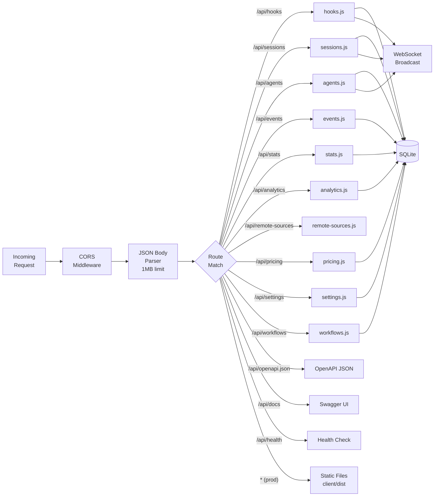

---

## Client Architecture

### Component Tree

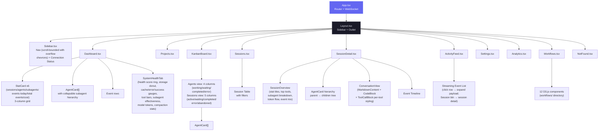

### Splash & loading UX

- **`SplashScreen.tsx`** — rendered by `App.tsx` as a fixed full-screen overlay alongside the router. Shows once per browser session (`sessionStorage` gate, read synchronously so a repeat mount never flashes). Time-aware greeting + localized tagline/subtexts (`splash` i18n namespace, en/zh/vi/ko) + an animated node-graph brand mark on a dark backdrop (radial glow, drifting constellation, grain). The backdrop is **opaque from the first paint** (no entrance fade on the root) so the app rendered behind it never flashes through; only the inner content cascades in. Holds ~2.5 s, then fades out and unmounts; click-to-skip; honors `prefers-reduced-motion`. CSS-only keyframes, no added dependencies.
- **Loading skeletons** — the shared `Skeleton` primitive (`components/Skeleton.tsx`) uses Tailwind `animate-pulse`. `Analytics.tsx` now renders a pulsing `AnalyticsChartsSkeleton` for the whole chart region while `data` is null (previously it fell back to empty/zero charts).
- **`workflows/CompactionImpact.tsx`** — redesigned from a one-bar-per-session chart into a "sessions by compaction count" histogram (D3) with axis titles, stat tiles (total / sessions affected / avg / peak), an explanatory help line, a plain-English summary, and rich React-managed hover tooltips (full-height per-bucket hit-area + bar highlight) matching the other charts.
- **`Workflows.tsx` `Section`** — the right-aligned section subtitle is clamped to a single line (`truncate` + `max-w` + hover `title`) so a long translation never wraps and unbalances the header; the full text stays in the section's `i` popover.

### Self-hosted assets (no external CDN)

Nothing the dashboard or docs render is fetched from a third-party CDN at runtime — all fonts and scripts are served locally, so every surface works fully offline and leaks nothing to external hosts.

- **React app fonts** — Inter + JetBrains Mono are imported from `@fontsource` (latin subset) in `client/src/main.tsx`. Vite bundles the per-weight WOFF2 into `client/dist/assets/` with content hashes at build time; there is no Google Fonts `<link>`. Importing the `latin-*` subset entry points keeps the emitted set to one WOFF2 per weight.
- **Static pages (landing + wiki)** — load a self-hosted `@font-face` sheet at the repo-root `fonts/` directory (`fonts/fonts.css` + the `*.woff2` files). The root `index.html` references `fonts/fonts.css`; the wiki references `../fonts/fonts.css` (relative paths resolve under GitHub Pages).
- **Wiki Mermaid** — vendored as `wiki/mermaid.min.js` (the genuine minified `mermaid@10.9.6` from npm, with a provenance banner; `.prettierignore`d) and loaded via a local `<script>` instead of `cdn.jsdelivr.net`.
- **VS Code extension** — the inline `getErrorHtml()` error page dropped its Google Fonts loader for a system font stack (no bundler / local font path available in that webview).

Net effect: no `fonts.googleapis.com`, `fonts.gstatic.com`, or `cdn.jsdelivr.net` requests anywhere (verified by `git grep`).

### PWA Architecture

The project ships three independent Progressive Web Apps. Each has its own Web App Manifest and Service Worker, so the browser treats them as separate installable applications with isolated caches.

```
┌─────────────────────────────────────────────────────────────────┐
│                        PWA Surface Map                          │
├──────────────────┬──────────────────┬───────────────────────────┤
│   Dashboard      │   Landing Page   │         Wiki              │
│   (client/)      │   (root)         │         (wiki/)           │
├──────────────────┼──────────────────┼───────────────────────────┤
│ manifest.json    │ manifest.json    │ manifest.json             │
│ sw.js            │ sw.js            │ sw.js                     │
│ id: dashboard    │ id: landing      │ id: wiki                  │
├──────────────────┼──────────────────┼───────────────────────────┤
│ Precache:        │ Precache:        │ Precache:                 │
│ /, manifest,     │ index.html,      │ index.html, style.css,    │
│ favicon.svg      │ favicon, og-img, │ script.js, manifest,      │
│                  │ manifest         │ favicon                   │
│ Runtime cache:   │ Runtime cache:   │ Runtime cache:            │
│ JS/CSS bundles   │ screenshot PNGs  │ (all precached)           │
│ (cache-first)    │ (cache-first)    │                           │
│                  │                  │                           │
│ Skip: /api/*,    │ N/A              │ N/A                       │
│ /ws, __vite      │                  │                           │
│                  │                  │                           │
│ + Push notifs    │                  │                           │
│ (VAPID pipeline) │                  │                           │
└──────────────────┴──────────────────┴───────────────────────────┘
```

**Service Worker lifecycle (all three):**

1. **Install** → `skipWaiting()` — new SW activates immediately, no waiting for tabs to close.
2. **Activate** → old caches deleted (keyed by `CACHE_NAME`: `dashboard-v1`, `landing-v1`, `wiki-v1`). Bump the version string to force a cache bust.
3. **Fetch** → Navigation requests are network-first with offline fallback to cached HTML. Static assets are cache-first with runtime caching on miss.

**Dashboard SW specifics:** The fetch handler skips `/api/*`, `/ws`, and Vite HMR (`__vite`) URLs so live data and development tooling are never cached. Only responses with `response.type === "basic"` (same-origin) are stored. The existing push notification handlers (`push`, `notificationclick`) are preserved alongside the caching logic.

**Manifest icons:** All three manifests reference `favicon.svg` with `sizes="any"` and `type="image/svg+xml"` — supported in Chrome 107+, Firefox 110+, Edge 107+. Two icon entries per manifest: one with `purpose: "any"` and one with `purpose: "maskable"`.

**iOS meta tags:** All HTML files include `<meta name="apple-mobile-web-app-capable" content="yes">` and `<meta name="apple-mobile-web-app-status-bar-style" content="black-translucent">` for standalone home-screen mode on Safari.

### Client Module Graph

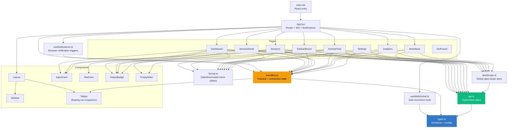

### Routing

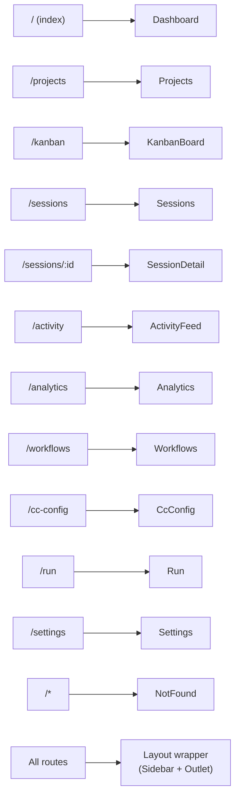

| Route           | Page          | Data Sources                                           |
| --------------- | ------------- | ------------------------------------------------------ |
| `/`             | Dashboard     | Two tabs (Monitor / Health). Monitor: `GET /api/stats`, `GET /api/agents`, `GET /api/events`, `GET /api/agents?session_id={sid}` (subagent hierarchy), dynamic item counts via `ResizeObserver`. Health: `GET /api/settings/info` + `GET /api/workflows` (5 s auto-refresh) — composite health score, storage donut, cache/error/success gauges, tool invocation bars, subagent effectiveness, model token distribution, compaction stats |
| `/kanban`       | KanbanBoard   | View toggle persisted in `localStorage`. Agents view: `GET /api/agents?status={each}` per-status (default 10000 cap). Sessions view: `GET /api/sessions?status={each}&limit=10000` per-status. Projects view: `GET /api/projects` + sessions grouped client-side by `cwd`; once at least one **monitor** group exists (`lib/monitorGroups.ts` — a server-backed global store shared across every computer connected to the dashboard, hydrated from `GET /api/monitors` and kept live via `monitors_updated` WebSocket pushes, mirroring `lib/focusStore.ts`'s pattern; a one-time migration seeds the server from any pre-existing `localStorage` layout the first time it hydrates empty), its assigned project columns render as real DOM children inside a bordered, drag-reorderable box for that monitor (`MonitorBox`) rather than as loose columns, with each box sitting side by side with the others in the same single row plus a trailing **Ungrouped** box (`UngroupedBox` — a container just like a monitor's box, but non-draggable/non-renameable and backed by no stored group) whose unassigned project columns render inside it — dragging a box by its header repositions it left/right; dragging a project column onto a box (or a column already inside one) reassigns it, deferred to `dragend` via a ref rather than previewed live, since a column moving into a *different* box is a genuine reparent across two real DOM elements that would detach it from the tree the native HTML5 drag is tracking mid-gesture. `Column`'s own drag handlers call `stopPropagation()` so a nested column's drag doesn't bubble into its enclosing box and misfire the box's own reposition handlers. A monitor box's header chevron toggles `MonitorGroup.collapsed` (persisted alongside name/id); collapsing hides the columns row (`hidden` class, not a conditional unmount of the *columns* - a card's own "show more" state survives the toggle) and drops the box's own `self-align` to `start` so it shrinks to its header's height instead of stretching to match the row's tallest sibling. A second header control (`LayoutGrid` icon, opening `LayoutMenu`) sets `MonitorGroup.orientation` and `MonitorGroup.wrap` together via `handleSetMonitorLayout` — the popover renders two rows of visual tiles (Columns 1–4/Auto, Rows 1–4/Auto), each a miniature `grid`/`flex` preview of that exact combination, and a single tile click applies both fields and closes the menu. `orientation` is `"horizontal"` (default, omitted for pre-existing stored monitors) or `"vertical"`, switching the columns row's own `flex-row`/`flex-col` class so that monitor's project columns lay out side by side or stacked independently of every other monitor's box. `wrap` is `"*"` (default, omitted for pre-existing stored monitors — today's unbounded row/column) or `"1"`-`"4"`; whenever it isn't `"*"`, the columns row switches from `flex` to CSS `grid` (`wrapGridStyle`, shared with `Column` below) with `grid-template-columns: repeat(N, max-content)` for horizontal orientation or `grid-template-rows: repeat(N, max-content)` + `grid-auto-flow: column` for vertical, so N project columns land per row/column before wrapping to a new one. The box itself is additionally split out of the main row: `collapsedMonitorClusters` vs `expandedMonitorClusters` (filtered from `monitorClusters` by `monitor.collapsed`) render in two separate sibling rows - a `kanban-collapsed-monitor-row` strip above `kanban-board-row`, shared by every collapsed monitor, and the main row for everything expanded - so a collapsed box frees the horizontal space it would otherwise still occupy rather than just sitting there narrow (this does mean the `MonitorBox` itself unmounts from one row and remounts in the other on toggle, since React can't preserve a component instance across two different parent elements; the state that matters - each column's pagination limit - lives in `KanbanBoard`'s own `expanded` map, not in `Column`, so nothing is lost). Every `Column` (project columns and the standalone Unassigned column) carries its own chevron toggling a `collapsed` prop the same way — persisted separately, per column key, in the same server-backed layout's `collapsedProjects` map (`monitorStore.saveCollapsedProjects`) — hiding that column's card list and shrinking its width (`w-72` → `w-56`) independently of any monitor box it sits inside. Every Agents/Sessions status `Column` also gets its own `orientation`/`wrap`/`onLayoutChange` prop trio (Projects-view project columns never pass these) — the same `LayoutMenu` popover as `MonitorBox` above, reusing its `LayoutGrid` trigger icon and visual tile grid, that sets that single column's card list between the default `"vertical"` stack and a `"horizontal"` row of fixed-width (`w-72`) cards in their own `overflow-x-auto` strip, plus its wrap count, in one tile click. State lives in `KanbanBoard`'s own `statusColumnOrientation` and `statusColumnWrap` maps, both updated together by `setStatusColumnLayout`, keyed by `${view}-${status}` (e.g. `agents-working`, `sessions-active`) and persisted client-side only, in sibling `kanban-status-column-orientation`/`kanban-status-column-wrap` `localStorage` keys — unlike `MonitorGroup.orientation`/`.wrap`, a status column has no server-backed identity to hang a shared value off, so this menu is intentionally per-browser and not pushed over `monitors_updated`, and scoped to that one column's cards instead of a monitor's project columns. Each column then paginates client-side at `COLUMN_PAGE_SIZE=10`; the WS subscription scopes to the active view. |
| `/sessions`     | Sessions      | `GET /api/sessions?status=&q=&limit=PAGE_SIZE&offset=page*PAGE_SIZE` — true server-side pagination. The search box passes `q` to the server (300 ms debounced). Response carries `total` for the paginator UI. Cost computation runs server-side over the visible page only. Polls `/api/run` (and listens for `run_status`) to badge any row whose session is currently being driven from `/run` with a clickable green **▶ Run** pill |
| `/sessions/:id` | SessionDetail | `GET /api/sessions/:id` (agents + events), `GET /api/sessions/:id/stats` (overview tiles, top tools, subagent breakdown, token totals — debounced live-refresh on `new_event`/`agent_*`/`session_updated`), `GET /api/sessions/:id/transcripts` (Conversation tab transcript list), `GET /api/sessions/:id/transcript` (cursor-paginated message stream, including inline `session_event` rename markers; optional `run_id` resolves a workflow inner agent's nested transcript), `DELETE /api/sessions/:id` (header "Delete session" button, two-click arm/confirm; disabled while the session is `active`, 409 if forced anyway; navigates back to `/sessions` on success, and any other open tab/page for this session gets bounced back too via the `session_deleted` broadcast). Probes `/api/run` (and listens for `run_status`) to surface a green "Open in Run page" banner when this session is currently being driven by an in-flight Run handle. When the session sits in the Waiting overlay, renders a yellow waiting-for-input banner naming the `awaiting_reason` (Needs input / Turn done / At prompt / Interrupted) and how long it has waited; every Waiting `StatusBadge` across the app carries the same reason as a hover tooltip, with an inline nested chip on the wider surfaces (Sessions table, session-detail header) — compact card badges (Kanban/Dashboard) stay tooltip-only. Three more reasons — SubAgents / Shell / Monitor — mean Claude is still actively working via a child (a subagent fleet, a synchronous Bash call, or a Monitor tool call), not blocked on the human, so they replace the badge's whole word (and the banner's title) instead of nesting inside "Waiting", even on compact cards |
| `/activity`     | ActivityFeed  | `GET /api/events?limit=100` — click row to expand inline payload; "Session →" button navigates to `/sessions/:id` |
| `/analytics`    | Analytics     | `GET /api/analytics`                                   |
| `/workflows`    | Workflows     | `GET /api/workflows?status=active\|completed`, `GET /api/workflows/session/:id` + WebSocket auto-refresh (3s debounce) |
| `/cc-config`    | CcConfig      | 12-tab Claude Code configuration explorer. Reads via `GET /api/cc-config/{overview,skills,agents,commands,output-styles,plugins,marketplaces,mcp,hooks,hook-scripts,keybindings,statusline,settings,memory}`. Mutations for skills/agents/commands/output-styles/memory — including the per-project file-based auto-memory store (`*.md` under `~/.claude/projects/<slug>/memory/`, grouped by project and searchable in the Memory tab, with clickable `MEMORY.md` index links that scroll to + highlight the matching fact file) — via `PUT /api/cc-config/file` + `DELETE /api/cc-config/file` (timestamped backups, atomic writes). The Keybindings tab additionally offers a structured inline editor that persists via `PUT /api/cc-config/keybindings` (same backup-first, atomic-write guarantees). `GET /api/cc-config/file?path=…` for single-file viewer. `GET /api/cc-config/backups` for the recovery modal. Subscribes to `cc_config_changed` WS messages for live refresh on both dashboard mutations and external file edits picked up by `cc-watcher`. The Settings tab leads with a client-side **Current configuration** summary that resolves the `/config` options (model, verbose, theme, output style, effort, auto-compact, notifications, …) across user / project / project-local scopes, showing defaults when unset. Live / Offline indicator next to the title |
| `/run`          | Run           | Spawns `claude` subprocesses with chat-style streaming UI. `GET /api/run/{binary,cwds,files}` for pre-flight + `@`-file autocomplete; `POST /api/run` to spawn (accepts `effort: low\|medium\|high`); `POST /api/run/:id/message` for follow-up turns; `DELETE /api/run/:id` to stop; `GET /api/run/:id?envelopes=1` for attach-with-history. WS messages: `run_stream` (includes `stream_event` deltas from `--include-partial-messages`), `run_status`, `run_input_ack`. Streaming pipeline: each WS envelope is dispatched through `flushSync` so React 18 doesn't batch bursts into a single render; a `useTypewriterEnvelopes` hook drips text/thinking deltas via `requestAnimationFrame` so even short replies type in; the merge code preserves `_streaming` and the delta-accumulated content array when claude's canonical `assistant` envelope arrives mid-stream so thinking blocks aren't dropped. Tier 1 TUI parity: collapsible-to-pill limitations banner, slash + `@`-file autocomplete (dropdowns open upward, slash matching uses tiered scoring), live token / context-window meter, status header. Live / Offline indicator next to the title |
| `/usage`        | Usage         | Rate-limit/plan-usage standing for the current Claude account. `GET /api/usage` for capture history + `capturing` flag; `GET /api/usage/:id` for one full capture (incl. raw pane text); `POST /api/usage/capture` to launch `claude` in tmux, drive `/status` + `/usage`, and persist the best-effort parsed result (~10-15s blocking request, `409` if one's already running). Latest capture card shows account info, model, session cost/tokens, and color-coded session-window (5h) + weekly rate-limit bars with reset times; history list below with per-row raw-text fallback. No WebSocket message — the client just awaits the capture request |
| `/settings`     | Settings      | `GET /api/settings/info`, `GET /api/pricing`, `GET /api/pricing/cost` + `localStorage` for notification prefs. Hosts the **Remote Data Sources** panel (`components/RemoteSources.tsx`) — CRUD + test + sync over `/api/remote-sources`, live status from `remote_source.status` WS messages |
| `/*`            | NotFound      | None (static 404 page)                                 |

### Activity Feed Interaction Model

The Activity Feed (`/activity`) separates two previously conflated interactions into distinct affordances:

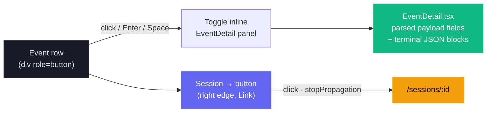

- **Row click** (anywhere except the Session button) toggles the `EventDetail` dropdown for the selected event. Chevron rotates 90° as a visual indicator.
- **Session → button** uses `e.stopPropagation()` to navigate to session details without triggering the expand toggle.
- Expanded state is tracked in a `Set<number>` (`expandedEvents`) allowing multiple rows to be open simultaneously.
- Keyboard accessible: `Enter` and `Space` on the row trigger expand; the Session button is a standard `<a>` element navigable by Tab.

### Workflows Page Architecture

The Workflows page (`/workflows`) is the most visualization-heavy page, composed of 12 child components in `client/src/components/workflows/`. Most D3.js rendering is done client-side using data from two API endpoints. The aggregate endpoint accepts an optional `?status=active|completed` query parameter to filter all workflow data by session status.

```mermaid
graph TD
    WF["Workflows.tsx<br/>Page orchestrator"]:::root
    API_AGG["GET /api/workflows?status=...<br/>Aggregate data (filterable)"]
    API_DI["GET /api/workflows/session/:id<br/>Session drill-in"]
    WS_D["WebSocket auto-refresh<br/>(3s debounce)"]

    WF --> API_AGG
    WF --> API_DI
    WS_D --> WF

    WF --> S1["WorkflowStats<br/>Summary cards"]
    WF --> S2["OrchestrationDAG<br/>Horizontal DAG —<br/>Sessions → Main → Subagents → Outcomes"]
    WF --> S3["ToolExecutionFlow<br/>d3-sankey tool transitions"]
    WF --> S4["AgentCollaborationNetwork<br/>Force-directed pipeline graph"]
    WF --> S5["SubagentEffectiveness<br/>SVG success rings +<br/>day-of-week sparklines"]
    WF --> S6["WorkflowPatterns<br/>Auto-detected sequences"]
    WF --> S7["ModelDelegationFlow<br/>Model → agent routing"]
    WF --> S8["ErrorPropagationMap<br/>React horizontal bars +<br/>API/session error support"]
    WF --> S9["ConcurrencyTimeline<br/>Swim-lane parallel execution"]
    WF --> S10["SessionComplexityScatter<br/>D3 bubble chart"]
    WF --> S11["CompactionImpact<br/>Token compression analysis"]
    WF --> S12["SessionDrillIn<br/>Searchable session explorer<br/>(3 tabs: tree / timeline / events)"]

    classDef root fill:#6366f1,stroke:#818cf8,color:#fff
```

| Component | Visualization | D3 Feature |
| --- | --- | --- |
| `OrchestrationDAG` | Horizontal DAG of aggregate spawning patterns | Custom DAG layout, capped at top 7 subagent types with overflow node |
| `ToolExecutionFlow` | Tool-to-tool transition Sankey diagram | `d3-sankey` |
| `AgentCollaborationNetwork` | Agent pipeline graph with directed edges | `d3-force` with arrowheads and frequency labels |
| `SubagentEffectiveness` | Scorecard grid with success rate rings | SVG arc rendering, day-of-week sparklines (Mon-Sun). Per-bar tooltip is rendered through `createPortal` to `document.body` and positioned with viewport-clamped fixed coordinates so it escapes the card's `overflow:hidden` (and any `hover:translate` containing block) and is never clipped by the card edge — fixes Sun/Sat/Mon/Fri visibility |
| `WorkflowPatterns` | Common orchestration sequences | Pattern detection from event data; clicking a row expands an inline detail panel with the full step chain, a stats grid, a deterministic narrative (shape buckets: solo / two-step / short / long; loop detection; frequency bucket: dominant > 50% / common > 25% / regular > 10% / niche), and a practical suggestion bucket. All copy is i18n-driven (`workflows.patterns.detail.*`) |
| `ModelDelegationFlow` | Model routing through agent hierarchies | Hierarchical layout |
| `ErrorPropagationMap` | Error clustering by hierarchy depth with API/session event errors | Pure React horizontal bars (replaced D3 bar chart), `eventErrors` support for API and session-level errors |
| `ConcurrencyTimeline` | Swim-lane parallel agent execution | Time-scaled horizontal bars |
| `SessionComplexityScatter` | Duration vs agents vs tokens | D3 bubble/scatter chart |
| `CompactionImpact` | Token compression events and recovery | Before/after comparison |
| `SessionDrillIn` | Per-session agent tree, tool timeline, events | Searchable dropdown with pagination, 3 tabs |

**Cross-filtering:** Clicking nodes in the OrchestrationDAG filters data in other sections. **JSON export:** All workflow data can be exported as JSON from the page header.

### Tooltip rendering strategy

Every chart in the Workflows page follows a single, deterministic tooltip pattern designed to avoid the failure modes of naive React tooltips (laggy mousemove re-renders, sticky tooltips after D3 re-renders, clipping by parent `overflow:hidden`):

- **One DOM-ref tooltip element per chart.** Each chart owns a single `<div ref={tipRef}>` that lives at the bottom of its render tree. D3 mouse handlers mutate that element's content imperatively (`textContent`, `appendChild`, inline `style`), so hovering never triggers a React re-render of the SVG.
- **No `mousemove` follow.** The tooltip is positioned once on `mouseenter` from the hovered element's `getBoundingClientRect()`, with viewport clamping (8 px margin) and an automatic flip below → above when there's no room. Position never updates as the cursor moves, which removes per-pixel state churn.
- **Container-level `mouseleave` fallback.** The chart's outer wrapper also calls `hideTip()` on leave. If a node-level handler is missed because D3 destroyed the element under the cursor on data refresh, the wrapper guarantees dismissal.
- **Re-render safety.** Each chart's render effect ends with `hideTip()` so any stale tooltip from before a websocket-driven refresh is cleared the moment new data arrives.
- **Fade transitions.** Tooltips stay in the DOM with `opacity: 0` and `pointer-events: none`, transitioning over 120 ms — show/hide feels smooth instead of flickering, and the element never intercepts pointer events that would prevent `mouseleave` from firing on the chart.
- **Portal escape for clipped containers.** `SubagentEffectiveness` cards use `overflow:hidden` plus a hover `translate` (which becomes the fixed-position containing block), so its sparkline tooltip is rendered with `react-dom.createPortal(…, document.body)` rather than as a child of the card. Coordinates are computed from the bar's bounding rect and clamped to the viewport, so the tooltip is visible on every day of the week regardless of the card's screen position.

### Structured info popovers

Two classes of explanatory popover sit on top of the chart layer, both i18n-driven:

- **Stat-card popovers** (`WorkflowStats.tsx`). Each of the six headline cards (Avg Agent Depth, Avg Subagents/Session, Agent Success Rate, Most Common Flow, Avg Compactions, Avg Duration) carries an info `i` icon at the bottom-right of the card. Hovering it opens a fixed-positioned, viewport-clamped popover with three sections: a value+label header, a "How it's calculated" paragraph (`workflows.stats.tooltip.calc.*`), and a "What this number means" paragraph that renders `"{value} {phrase} means {interpretation}"`. The interpretation comes from a deterministic, value-bucket function (`interp*`) — pure rule-based mapping with no AI generation, so the same input always yields the same explanation across all three locales.
- **Chart-section popovers** (`Workflows.tsx → ChartInfoPopover`). The `i` icon next to each section title (1–11) opens a structured "What this shows / How to read it / Why it matters" popover sourced from `workflows.chartInfo.<sectionKey>.*`. Each of the 11 charts has its own three-paragraph entry, fully translated to en/vi/zh.

Both popover classes use the same fixed-position + viewport-clamp algorithm: anchor right of the icon (or center for chart-section popovers), clamp to a viewport margin, and flip above when there isn't enough room below. They are never clipped by the sidebar, the right edge of the screen, or any ancestor's `overflow:hidden`.

---

## Internationalization Architecture

The client localization stack is powered by `i18next` + `react-i18next` (`client/src/i18n/index.ts`) and currently supports four languages: English (`en`), Chinese (`zh`), Vietnamese (`vi`), and Korean (`ko`). Language detection prefers `localStorage` (`i18nextLng`) and falls back to the browser locale (`navigator`) with `en` as final fallback.

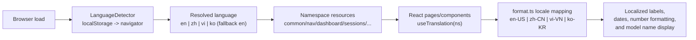

See [docs/I18N.md](docs/I18N.md) for resource strategy, key naming conventions, localization tests, troubleshooting, and rollout checklists.

**Coverage scope.** The translation layer extends end-to-end through the Workflows tooltip surfaces — `workflows.stats.tooltip.*` (calculation copy, deterministic value-bucket interpretations, metric phrases), `workflows.chartInfo.*` (per-chart "What / How to read / Why" entries for all 11 sections), `workflows.{orchestration,toolFlow,pipeline,modelDelegation,concurrency}.tooltip.*` (per-graph hover content), and `workflows.patterns.detail.*` (Workflow Patterns expansion narrative + suggestion buckets) — plus the Settings additions: `settings.pricing.tooltip.*` (pricing rule lookup, `%` wildcard syntax, manual-update reminder), `settings.claudeHome.*` (CLAUDE_HOME panel labels), and the full `settings.import.*` block (now translated to vi/zh, where the panel previously fell back to English).

---

## Database Design

### Entity Relationship Diagram

```mermaid
erDiagram
    sessions ||--o{ agents : has
    sessions ||--o{ events : has
    sessions ||--o{ token_usage : tracks
    sessions ||--o{ context_snapshots : "context snapshots"
    agents ||--o{ events : generates
    agents ||--o{ agents : spawns

    sessions {
        TEXT id PK "UUID"
        TEXT name "Human-readable label"
        TEXT status "active|completed|error|abandoned"
        TEXT cwd "Working directory"
        TEXT model "Claude model ID"
        TEXT started_at "ISO 8601"
        TEXT ended_at "ISO 8601 or NULL"
        TEXT metadata "JSON blob"
        TEXT awaiting_input_since "ISO 8601 or NULL — set by waiting Notifications"
        TEXT awaiting_reason "notification|stop|session_start|interrupted|subagent|shell|monitor or NULL"
        TEXT source "Data source — 'local' or a remote source id; NOT NULL DEFAULT 'local'"
        INTEGER pid "claude CLI process id, resolved from a hook payload hint; NULL until resolved"
    }

    agents {
        TEXT id PK "UUID or session_id-main"
        TEXT session_id FK "References sessions.id"
        TEXT name "Main Agent — {session name} or subagent description"
        TEXT type "main|subagent"
        TEXT subagent_type "Explore|general-purpose|etc"
        TEXT status "working|waiting|completed|error"
        TEXT task "Current task description"
        TEXT current_tool "Active tool name or NULL"
        TEXT started_at "ISO 8601"
        TEXT ended_at "ISO 8601 or NULL"
        TEXT parent_agent_id FK "References agents.id"
        TEXT metadata "JSON blob"
        TEXT awaiting_input_since "ISO 8601 or NULL — main-agent waiting flag"
        TEXT awaiting_reason "notification|stop|session_start|interrupted|subagent|shell|monitor or NULL"
    }

    events {
        INTEGER id PK "Auto-increment"
        TEXT session_id FK "References sessions.id"
        TEXT agent_id FK "References agents.id"
        TEXT event_type "PreToolUse|PostToolUse|Stop|etc"
        TEXT tool_name "Tool that triggered the event"
        TEXT summary "Human-readable summary"
        TEXT data "Full event JSON"
        TEXT created_at "ISO 8601"
    }

    token_usage {
        TEXT session_id PK "FK to sessions + part of composite PK"
        TEXT model PK "Model identifier + part of composite PK"
        TEXT speed PK "standard or fast (fast mode) — pricing dimension"
        TEXT inference_geo PK "global or us (data residency) — pricing dimension"
        TEXT service_tier PK "standard or batch (Batch API) — pricing dimension"
        INTEGER input_tokens "Current JSONL total"
        INTEGER output_tokens "Current JSONL total"
        INTEGER cache_read_tokens "Current JSONL total"
        INTEGER cache_write_tokens "Total ephemeral cache writes (5m + 1h)"
        INTEGER cache_write_1h_tokens "Subset stored at the 1h tier; 5m = total - 1h"
        INTEGER web_search_requests "server_tool_use web search count"
        INTEGER web_fetch_requests "server_tool_use web fetch count"
        INTEGER code_execution_requests "server_tool_use code execution count"
        INTEGER baseline_input "High-water baseline; effective = live + baseline = max ever seen (one per metric)"
    }

    context_snapshots {
        INTEGER id PK "Auto-increment"
        TEXT session_id FK "References sessions.id"
        TEXT transcript_uuid "Dedup key — one row per transcript turn"
        TEXT transcript_ts "Turn's own timestamp, not ingestion wall-clock"
        INTEGER context_tokens "input + cache_read + cache_creation for that ONE turn — the active context size, not a cumulative total"
        INTEGER output_tokens "That turn's own newly-generated output tokens — added to context_tokens and running-summed for token_baggage_series"
        INTEGER input_tokens "context_tokens' own input component for that turn — carried for the token-baggage hover breakdown only"
        INTEGER cache_read_tokens "context_tokens' own cache-read component for that turn — carried for the token-baggage hover breakdown only"
        INTEGER cache_write_tokens "context_tokens' own cache-write component for that turn — carried for the token-baggage hover breakdown only"
        TEXT model "Model at that turn, or NULL"
        TEXT created_at "ISO 8601"
    }

    model_pricing {
        TEXT model_pattern PK "SQL LIKE pattern e.g. claude-opus-4-6%"
        TEXT display_name "Human-readable name"
        REAL input_per_mtok "Cost per million input tokens"
        REAL output_per_mtok "Cost per million output tokens"
        REAL cache_read_per_mtok "Cost per million cache read tokens (cache hits)"
        REAL cache_write_per_mtok "Cost per million 5m cache-write tokens"
        REAL cache_write_1h_per_mtok "Cost per million 1h cache-write tokens"
        REAL fast_input_per_mtok "Fast-mode input rate (0 = none)"
        REAL fast_output_per_mtok "Fast-mode output rate (0 = none)"
        REAL intro_input_per_mtok "Intro input rate, used when usage date <= intro_until (0 = none)"
        REAL intro_output_per_mtok "Intro output rate"
        REAL intro_cache_read_per_mtok "Intro cache-read rate"
        REAL intro_cache_write_per_mtok "Intro 5m cache-write rate"
        REAL intro_cache_write_1h_per_mtok "Intro 1h cache-write rate"
        TEXT intro_until "Promo cutoff YYYY-MM-DD; usage on/before uses intro rates, after uses standard (NULL = no intro)"
        TEXT updated_at "ISO 8601"
    }

    push_subscriptions {
        TEXT endpoint PK "Subscription URL"
        TEXT p256dh "Public key"
        TEXT auth "Auth secret"
        TEXT created_at "ISO 8601"
    }

    remote_sources {
        TEXT id PK "Source id — also stamped onto sessions.source"
        TEXT label "Human-readable name"
        TEXT host "SSH host"
        INTEGER ssh_port "SSH port"
        TEXT identity_file "Optional SSH identity file path or NULL (no secrets stored)"
        TEXT remote_home "Remote home holding ~/.claude/projects, or NULL"
        INTEGER enabled "1|0 — polled by the background sync when 1"
        TEXT status "idle|syncing|ok|error"
        TEXT last_error "Last sync error or NULL"
        TEXT last_sync_at "ISO 8601 or NULL"
        TEXT last_sync_counts "JSON import counters from the last sync or NULL"
        TEXT created_at "ISO 8601"
        TEXT updated_at "ISO 8601"
    }

    alert_rules ||--o{ alert_events : fires

    alert_rules {
        TEXT id PK "UUID"
        TEXT name "User-facing rule name"
        TEXT rule_type "event_pattern|inactivity|status_duration|token_threshold"
        TEXT config "Type-specific JSON config"
        INTEGER enabled "1|0"
        INTEGER cooldown_seconds "Per-scope dedup window, default 300"
        TEXT created_at "ISO 8601"
        TEXT updated_at "ISO 8601"
    }

    alert_events {
        INTEGER id PK "Auto-increment"
        TEXT rule_id FK "References alert_rules.id, ON DELETE CASCADE"
        TEXT rule_name "Snapshot — survives rule edits"
        TEXT rule_type "Snapshot"
        TEXT session_id "No FK — alert history survives session cleanup"
        TEXT agent_id "Affected agent or NULL"
        TEXT message "Human-readable alert text"
        TEXT details "JSON context blob"
        TEXT triggered_at "ISO 8601"
        TEXT acknowledged_at "ISO 8601 or NULL"
    }

    webhook_targets ||--o{ webhook_deliveries : delivers

    webhook_targets {
        TEXT id PK "UUID"
        TEXT name "User-facing target name"
        TEXT type "provider key — slack|discord|teams|telegram|pagerduty|… (15)"
        TEXT url "Endpoint URL (may be '' when derived) — server-only, masked in responses"
        INTEGER enabled "1|0"
        TEXT secret "Generic-family HMAC-SHA256 signing secret or NULL"
        TEXT headers "Generic-family extra request headers (JSON) or NULL"
        TEXT rule_ids "JSON array scoping to rules, or NULL = all"
        TEXT config "Provider params JSON (routing_key, chat_id, …); secrets redacted in responses"
        TEXT created_at "ISO 8601"
        TEXT updated_at "ISO 8601"
    }

    webhook_deliveries {
        INTEGER id PK "Auto-increment"
        TEXT target_id FK "References webhook_targets.id, ON DELETE CASCADE"
        TEXT target_name "Snapshot"
        TEXT target_type "Snapshot"
        INTEGER alert_id "alert_events.id, NULL for test pings (no FK)"
        TEXT status "success|failed"
        INTEGER status_code "Last HTTP status or NULL"
        INTEGER attempts "Attempt-chain length"
        TEXT error "Failure reason or NULL"
        TEXT created_at "ISO 8601"
    }

    projects ||--o{ project_paths : claims
    projects ||--o{ project_ignored_repos : dismisses

    projects {
        TEXT id PK "UUID"
        TEXT name "User-assigned display name"
        TEXT created_at "ISO 8601"
        TEXT updated_at "ISO 8601 — bumped on rename or pin/unpin"
        INTEGER pinned "0/1 — floats the project above regular alphabetical order"
        INTEGER sibling_scan_enabled "0/1, default 0 — gates the disk-sibling suggestion scan"
    }

    project_paths {
        INTEGER id PK "Auto-increment"
        TEXT project_id FK "References projects.id, ON DELETE CASCADE"
        TEXT cwd "Working directory this project claims — UNIQUE (one project per folder)"
        TEXT created_at "ISO 8601"
        INTEGER terminal_default "0/1, column default 1 — but only a project's FIRST folder stays on it"
    }

    project_ignored_repos {
        INTEGER id PK "Auto-increment"
        TEXT project_id FK "References projects.id, ON DELETE CASCADE"
        TEXT path "Dismissed suggestion's resolved path — UNIQUE per (project_id, path)"
        TEXT name "Suggestion name as of when it was ignored"
        TEXT source "context / disk-sibling / disk-nested, as of when ignored"
        TEXT ignored_at "ISO 8601 — refreshed, not duplicated, on a re-ignore"
    }

    plans ||--o{ plan_items : contains
    sessions ||--o| session_focus : "declares focus"

    plans {
        TEXT cwd PK "Working directory holding AGENT-PLAN.md"
        TEXT title "First markdown heading"
        TEXT file_path "Absolute path to the ingested AGENT-PLAN.md"
        TEXT content_hash "Fingerprint of the last ingested content"
        INTEGER item_count "Items parsed on the last ingest"
        TEXT missing_at "Stamped when the file disappears — row is kept"
        TEXT created_at "ISO 8601"
        TEXT updated_at "ISO 8601"
    }

    plan_items {
        TEXT cwd PK "FK to plans (ON DELETE CASCADE) + part of composite PK"
        INTEGER item_number PK "The file's own item number + part of composite PK"
        TEXT text "Item text"
        TEXT acceptance "Optional acceptance note or NULL"
        INTEGER checked "Mirrors the file's checkbox — human-owned"
        INTEGER position "File order"
        TEXT declared_done_at "Agent's ccam focus done claim or NULL — survives re-ingest"
        TEXT declared_done_session "Declaring session id (no FK — audit trail outlives deletion)"
        TEXT updated_at "ISO 8601"
    }

    session_focus {
        TEXT session_id PK "FK to sessions, ON DELETE CASCADE"
        TEXT cwd "Working directory whose plan the item belongs to"
        INTEGER item_number "Declared plan item or NULL"
        TEXT note "Optional note from focus set"
        TEXT set_at "When the current item was declared"
        TEXT detour_stack "JSON stack of in-flight detours (depth cap 10)"
        TEXT drift_status "NULL, ok, drift or unknown — written only by the drift auditor"
        TEXT drift_reason "Auditor's one-line justification or NULL"
        TEXT drift_checked_at "ISO 8601 or NULL"
        TEXT updated_at "ISO 8601"
    }

    sessions ||--o| focus_inferences : "has inferred focus"

    focus_inferences {
        TEXT session_id PK "FK to sessions, ON DELETE CASCADE"
        TEXT cwd "Working directory whose plan the session was classified against"
        TEXT kind "item, detour or unclassified"
        TEXT item_id "Matched plan item's stable id or NULL"
        TEXT label "Generated detour title or NULL"
        REAL confidence "Classifier confidence 0..1 or NULL"
        TEXT method "llm or heuristic"
        TEXT reason "Classifier's one-line justification or NULL"
        TEXT inferred_at "ISO 8601 stamp of the verdict"
    }

    focus_summaries {
        TEXT cache_key PK "Scope+window request identity of GET /api/focus-report/summary"
        TEXT input_digest "Hash of the summary-relevant report slice - gates cache reuse"
        TEXT bullets "JSON array of 2-4 stakeholder-readable bullet strings"
        TEXT model "LLM model that produced it, e.g. haiku"
        TEXT created_at "ISO 8601 stamp of the synthesis"
    }

    focus_summary_access_log {
        INTEGER id PK "Autoincrement"
        TEXT cache_key "Same identity space as focus_summaries.cache_key"
        TEXT level "window or day"
        TEXT outcome "hit or miss"
        TEXT project_id "Scope, or NULL"
        TEXT session_id "Scope, or NULL"
        INTEGER unassigned "Scope flag, 0 or 1"
        TEXT model "LLM model, or NULL"
        INTEGER bullet_count "Bullets in the resolved summary, or NULL"
        TEXT access_day "UTC calendar day, reference only - queries use accessed_at range"
        TEXT accessed_at "ISO 8601 stamp of the resolution"
    }
```

`sessions` carries **no** `project_id` column — project membership is derived at query time by joining `sessions.cwd` against `project_paths.cwd`, so a session created (or imported) before its folder was ever mapped retroactively belongs to that project the instant the mapping is added, with no backfill needed. `plans` follows the same convention: it is keyed by `cwd` (no `project_id`), so a project's plans aggregate through the `project_paths` join exactly like its sessions. Focus **history** is deliberately not a table — every focus change also writes a `Focus` row to the existing `events` table, which the timeline already renders; `session_focus` holds only the *current* declaration per session.

### Indexes

| Index                  | Table    | Column(s)         | Purpose                        |
| ---------------------- | -------- | ----------------- | ------------------------------ |
| `idx_agents_session`   | agents   | `session_id`      | Fast agent lookup by session   |
| `idx_agents_status`    | agents   | `status`          | Kanban board column queries    |
| `idx_events_session`   | events   | `session_id`      | Session detail event list      |
| `idx_events_type`      | events   | `event_type`      | Filter events by type          |
| `idx_events_created`   | events   | `created_at DESC` | Activity feed ordering         |
| `idx_events_session_type` | events | `session_id, event_type` | Per-session event-type filters |
| `idx_events_agent_type` | events  | `agent_id, event_type` | Keeps `importSubagentFromJsonl`'s per-tool-event `data LIKE` dedup an index seek instead of a full events scan — a large re-import (startup sweep touching a subagent-heavy session) drops from tens of seconds to sub-second |
| `idx_sessions_status`  | sessions | `status`          | Status filter on Sessions page and Kanban Sessions view |
| `idx_sessions_started` | sessions | `started_at DESC` | Default sort order             |
| `idx_sessions_source`  | sessions | `source`          | Data-scope (`?sources=`) filtering by source            |
| `idx_alert_events_triggered` | alert_events | `triggered_at DESC` | Alert feed ordering      |
| `idx_alert_events_rule` | alert_events | `rule_id`        | Cooldown lookup per rule       |
| `idx_alert_events_session` | alert_events | `session_id`  | Per-session alert history      |
| `idx_webhook_deliveries_target` | webhook_deliveries | `target_id, created_at DESC` | Per-target delivery log + last-delivery lookup |
| `idx_webhook_deliveries_created` | webhook_deliveries | `created_at DESC` | Delivery-log pruning (newest 2000)  |
| `idx_session_focus_cwd` | session_focus | `cwd`             | Per-repo focus rollup (plan panel's per-item session chips) |
| `idx_focus_summary_access_log_day` | focus_summary_access_log | `access_day` | Settings → Focus Summaries timeline's day `GROUP BY` |
| `idx_focus_summary_access_log_key` | focus_summary_access_log | `cache_key` | Per-cache-key access history lookup |

### SQLite Configuration

| Pragma         | Value  | Rationale                                                                  |
| -------------- | ------ | -------------------------------------------------------------------------- |
| `journal_mode` | `WAL`  | Concurrent reads during writes, better performance for read-heavy workload |
| `foreign_keys` | `ON`   | Referential integrity enforcement                                          |
| `busy_timeout` | `5000` | Wait up to 5s for write lock instead of failing immediately                |

### Prepared Statements

All queries use prepared statements (`db.prepare()`) for:

- **Security** -- parameterized queries prevent SQL injection
- **Performance** -- compiled once, executed many times
- **Reliability** -- syntax errors caught at startup, not runtime

Notable prepared statements include `findStaleSessions` (used by `SessionStart` to identify active sessions with no activity for a configurable number of minutes), `touchSession` (bumps `updated_at` on every event), and `reactivateSession` / `reactivateAgent` (used when a previously completed/abandoned session receives new work or stop events — Stop/SubagentStop reactivate completed/abandoned sessions to handle sessions imported before the server started).

---

## WebSocket Protocol

### Connection

- **Path:** `/ws`
- **Protocol:** Standard WebSocket (RFC 6455)
- **Heartbeat:** Server sends `ping` every 30 seconds; clients that don't `pong` are terminated

### Message Format

All messages are JSON with this envelope:

```typescript
{
  type: "session_created" | "session_updated" | "session_deleted" | "agent_created" | "agent_updated" | "new_event"
      | "alert_triggered" | "alert_updated" | "workflow_upserted" | "plan_updated" | "session_focus"
      | "remote_source.status" | "monitors_updated" | "color_thresholds_updated"
      | "playbook_practice_config_updated" | "coach_observation_created" | "coach_observation_updated";
  data: Session | { id: string } | Agent | DashboardEvent | AlertEvent | WorkflowRun | PlanUpdate | SessionFocus
      | RemoteSourceStatus | MonitorLayoutPayload | ColorThresholdsConfig
      | PlaybookPractice | CoachObservation;
  timestamp: string; // ISO 8601
}
```

The `remote_source.status` message (emitted by the **Remote Data Sources**
sync poller and the `/api/remote-sources` routes) carries
`{ id, status, error?, last_sync_at? }`, where `status` is one of
`idle | syncing | ok | error | deleted`.

The two **Plan-Aware Monitoring** messages (see
[Plan-Aware Monitoring](#plan-aware-monitoring)): `plan_updated` carries
`{ plan, items }` — the freshly ingested `plans` row plus its full
`plan_items` list — whenever an `AGENT-PLAN.md` changes on disk or a
`focus done` declaration updates the rollup; `session_focus` carries one
session's focus wire shape
`{ session_id, cwd, item_number, item_text, note, detour_stack, since, drift, drift_reason, updated_at }`
whenever a declaration is applied or the drift auditor stamps a verdict.

The `monitors_updated` message (emitted by `PUT /api/monitors`) carries the
full resulting global Kanban Board monitor layout —
`{ monitors, monitorMap, collapsedProjects }` — so every computer connected
to the dashboard, not just the one that made the change, stays in sync
without a reload.

The `color_thresholds_updated` message (emitted by `PUT /api/color-thresholds`)
carries the full resulting global Usage-page color thresholds —
`{ session: {yellowAt,orangeAt,redAt}, weekly: {yellowAt,orangeAt,redAt} }` —
so every computer connected to the dashboard, not just the one that made the
change, stays in sync without a reload.

The `playbook_practice_config_updated` message (emitted by
`PUT /api/playbook/practices/:id/config`) carries the full resulting merged
practice — `{ id, category, scope, kind, defaultSeverity, fields, enabled,
config }` — so every computer connected to the dashboard stays in sync
without a reload, same pattern as `color_thresholds_updated`.

The `coach_observation_created`/`coach_observation_updated` messages carry
one Coach Observation row — `{ id, practice_id, scope_type, scope_id, kind,
severity, values_json, status, detected_at, responded_at }`.
`coach_observation_created` is emitted by the Playbook engine's own tick
(`server/lib/playbook/engine.js`) when a practice fires for a scope;
`coach_observation_updated` is emitted by `POST
/api/coach/observations/:id/respond` when a human dismisses/acknowledges/
resolves one — see the `server/routes/playbook.js` / `server/routes/coach.js`
rows in the module table above for the full route surface.

Every project mutation (create, rename, folder add/remove, delete) stays
unbroadcast — the client re-fetches after each change.

### Message Flow

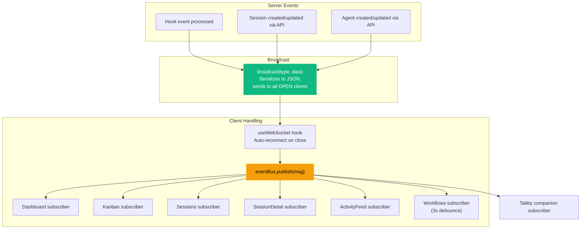

The **Tabby companion** (see [Tabby Companion Subsystem](#tabby-companion-subsystem)) is an additional read-only `eventBus` subscriber. It consumes the existing message envelope above and introduces **no new WebSocket message types** and no protocol changes.

### Client Reconnection

The `useWebSocket` hook implements automatic reconnection:

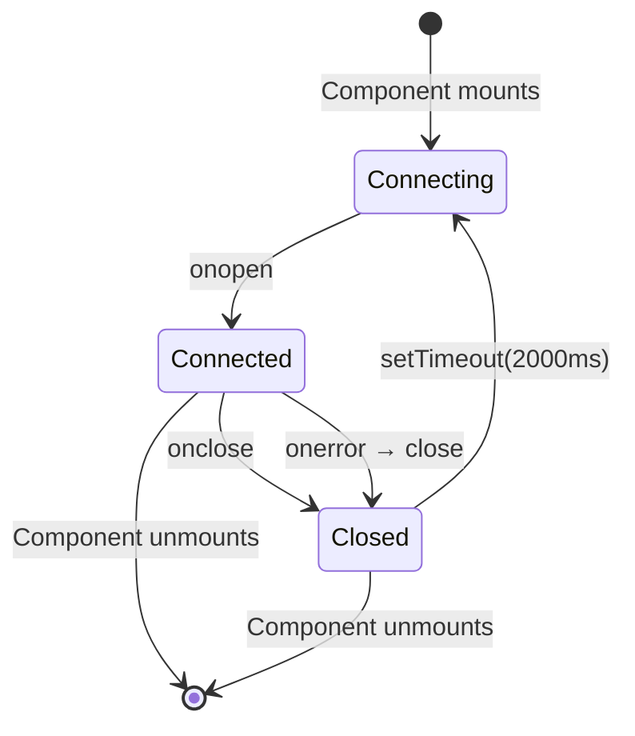

---

## Hook Integration

### Hook Handler Design

`scripts/hook-handler.js` is designed to be a minimal, fail-safe forwarder
that POSTs each hook to **one ingest target per unique SQLite data directory**
(different databases still each get hooks; same database never double-ingests):

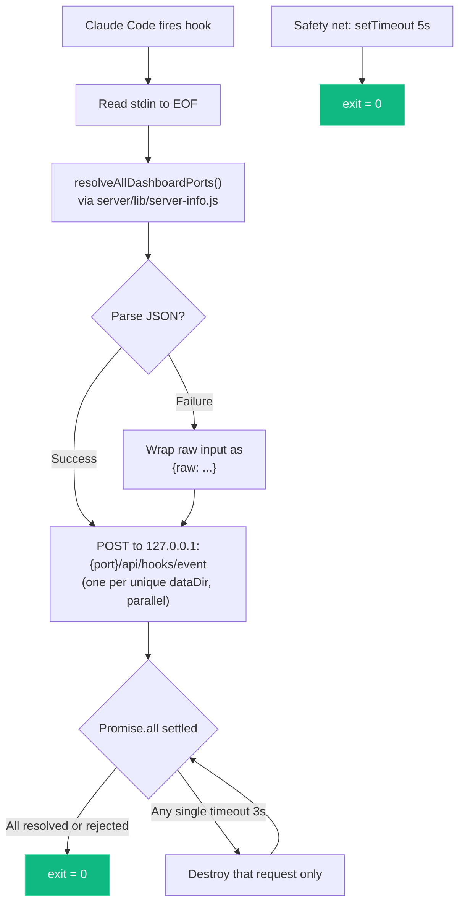

**Key design decisions:**

- Always exits 0 — never blocks Claude Code regardless of any server's state.
- 3-second HTTP timeout per target + 5-second process-wide safety net.
- Uses Node.js `http` module directly — no dependencies.
- Resolution order is **env override → discovery file → default**:
  - `CLAUDE_DASHBOARD_PORT` forces a single target (no fan-out, no discovery).
  - Otherwise `server/lib/server-info.js` reads `~/.claude/.agent-dashboard.json`, prunes dead-PID entries, and returns one live `port` per unique `dataDir` (lowest port wins when Docker and `npm run dev` share `~/.claude/agent-dashboard`). The handler POSTs to each returned port in parallel.
  - If neither yields anything, the handler falls back to `4820`.
- Per-target promises never reject — a dead listener can't starve the others, and the handler can wait on `Promise.all` for clean exit timing.

### Hook Installation

`scripts/install-hooks.js` modifies `~/.claude/settings.json`:

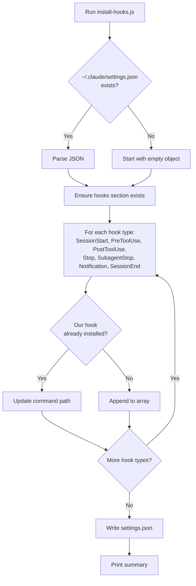

**Preserves existing hooks** -- only adds or updates entries containing `hook-handler.js`.

---

## Import Pipeline

The dashboard ships with a first-class **history importer** that backfills
sessions, agents, events, tokens, and costs from Claude Code JSONL
transcripts. Live hook ingestion and manual import share the exact same
parser (`parseSessionFile` + `importSession` in `scripts/import-history.js`),
which is the architectural contract that guarantees imported token and cost
values are identical to those captured in real time.

<p align="center">
  
</p>

### Design goals

- **Accuracy by construction** — any code path that creates a session goes
  through a single `importSession` entry point. There is no "import math"
  distinct from "live math."
- **Idempotence** — re-importing the same source must never double-count.
  Session IDs are the dedup key; compaction `baseline_*` columns preserve
  pre-compaction token totals so re-ingesting a compacted transcript never
  shrinks historical cost.
- **Source flexibility** — users bring history from the default location,
  any folder, or a drag-dropped archive. A single generalized walker feeds
  the parser regardless of the source.
- **Safety** — archive extraction enforces path containment and an extraction
  size cap (zip/tar/gzip-bomb defense), and every request has its own
  staging directory reclaimed on both success and error paths.

### Component overview

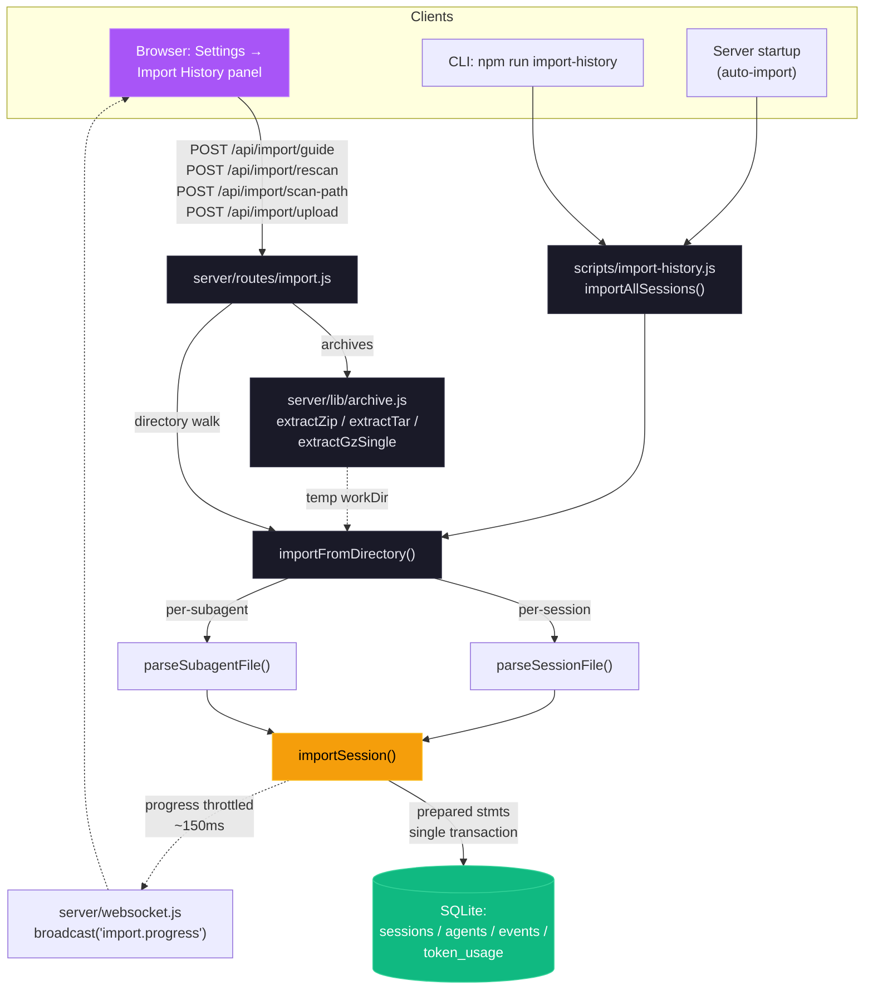

**Continuous background sync.** The startup auto-import
(`autoImportLegacySessions`) is a **one-time** backfill, marker-gated by
`.legacy-import.done` — so a project folder that appears *after* first launch,
and whose sessions never flow through hooks (e.g. a checkout run with host-only
hooks disabled), would otherwise stay invisible until a manual rescan. To close
that gap, `startSessionSync` (`server/index.js`) keeps `~/.claude/projects` in
sync through three triggers that share one `mtimeCache` and a single coalesced
sweep, the exported `syncDefaultProjects(dbModule, { mtimeCache })`:

1. **Immediate** — one sweep at startup, so a project the marker-gated backfill
   missed surfaces right away rather than after the first interval.
2. **Watcher** — a debounced `fs.watch` on the projects tree fires a sweep the
   instant a *new* session file or project folder appears (near-real-time, no
   poll wait). Events for files already in `mtimeCache` — active transcripts
   being appended to — are ignored, so a busy session never thrashes the
   importer. Recursive watching is used only on macOS/Windows (native, stable);
   on Linux, where Node's userland recursive watcher trips on the high-churn
   projects tree (same hazard `lib/cc-watcher.js` avoids), the root plus each
   immediate child folder are watched non-recursively instead.
3. **Poll** — a periodic safety-net sweep (watchers can miss events / not fire
   on network filesystems), tunable via `DASHBOARD_SESSION_SYNC_MS` (default
   30 s); `0` disables the poll but leaves the watcher running.

Each sweep re-parses **only** files whose mtime is new or has advanced (the
common "nothing changed" tick is just a handful of `stat` calls), funnels them
through the same `parseSessionFile` + `importSession` pipeline as every other
path, and broadcasts `session_created` for newly imported sessions /
`session_updated` for grown ones — the same events hooks emit, so the UI
refreshes live. All timers and watchers are `unref`'d and best-effort; nothing
here blocks shutdown or can take down the server.

### Upload request sequence

The upload path is the most complex of the three — it must accept multipart
data, extract archives safely, stage them on disk, then invoke the shared
importer. The sequence below captures the complete request/response path
including the failure modes explicitly guarded against.

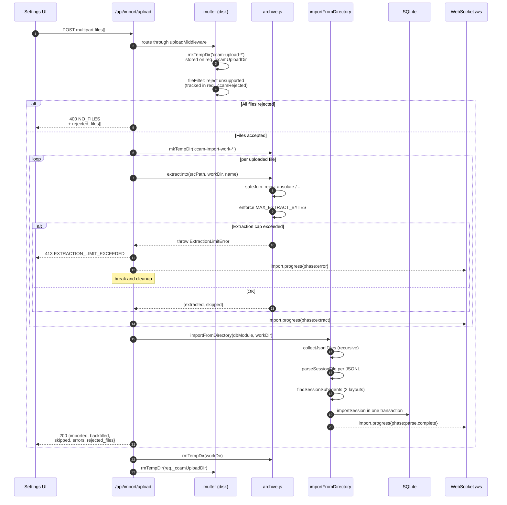

### Idempotence and cost accuracy

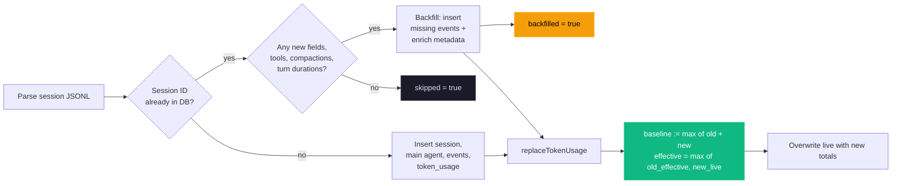

The `baseline_*` columns keep the effective total (`live + baseline`) a
**monotonic high-water mark**: the cost endpoint sums `input_tokens +
baseline_input` (and the matching `output`, `cache_read`, `cache_write`
pairs), and `replaceTokenUsage` sets `baseline := max(old_live +
old_baseline − new_live, 0)` so `effective = max(old_effective, new_live)`.
This never decreases (a compaction that shrinks the transcript keeps its
pre-compaction usage) and — crucially — never inflates past the largest
value ever seen. The earlier formula added the current value into baseline
on _any_ decrease, which two writers of different scope (the live hook
writer stores main-only tokens; `importSession` stores main+subagents)
could ratchet upward on every downward fluctuation — one 26-day session
accumulated a baseline ~11× its real usage before this was fixed.

### Supported source layouts

| Layout                                          | Example                                      | Handling                                                                |
| ----------------------------------------------- | -------------------------------------------- | ----------------------------------------------------------------------- |
| Default Claude Code                             | `<proj>/<sid>.jsonl`                         | Session transcript                                                      |
| Default subagent                                | `<proj>/<sid>/subagents/agent-*.jsonl`       | Paired with parent on discovery                                         |
| Alternative subagent                            | `<proj>/subagents/<sid>/agent-*.jsonl`       | Paired with parent on discovery                                         |
| Workflow inner-agent (nested)                   | `<proj>/<sid>/subagents/workflows/<runId>/agent-*.jsonl` | Summarized by Workflow-run ingest; transcript resolved on read + preserved in the durable snapshot |
| Orphan subagent (no parent JSONL in source)     | `<proj>/subagents/<sid>/agent-*.jsonl`       | `importFromDirectory` probes both candidates; attaches if `sid` exists  |
| Flat JSONL drop                                 | `<root>/<sid>.jsonl`                         | Recognized as a loose session                                           |
| Archives (`.zip`, `.tar`, `.tar.gz`, `.tgz`)    | any of the above nested inside               | Extracted into a per-request temp dir, then walked by the same importer |
| Single-file gzip                                | `any.jsonl.gz`                               | Gunzipped in streaming mode with size cap                               |

### Safety model

| Threat                                      | Mitigation                                                                                           |
| ------------------------------------------- | ---------------------------------------------------------------------------------------------------- |
| Path traversal via archive entries          | `archive.safeJoin` resolves under the extraction root; any `..` or absolute path returns `null`      |
| Zip / tar / gzip bombs                      | `MAX_EXTRACT_BYTES` (default 4 GB) enforced by running byte counter; aborts with `ExtractionLimitError` |
| Per-file upload size abuse                  | multer `limits.fileSize = MAX_UPLOAD_BYTES` (default 1 GB)                                           |
| Too many files per request                  | multer `limits.files = MAX_UPLOAD_FILES` (default 2000)                                              |
| Unsupported file types                      | `fileFilter` drops them early and reports them in `rejected_files[]`                                 |
| Concurrent upload temp-dir collisions       | Per-request temp dir on `req._ccamUploadDir`; created in multer `destination`, cleaned in `finally`  |
| Arbitrary absolute path on `scan-path`      | Validated: must be absolute (after `~` expansion), exist, and be a directory                         |
| Relative / traversal paths on `scan-path`   | Rejected with `INVALID_INPUT`                                                                        |

### Environment variables

| Variable                          | Default     | Purpose                                                           |
| --------------------------------- | ----------- | ----------------------------------------------------------------- |
| `CCAM_IMPORT_MAX_BYTES`           | 1 GB        | Maximum size per uploaded file                                    |
| `CCAM_IMPORT_MAX_FILES`           | 2000        | Maximum files per upload request                                  |
| `CCAM_IMPORT_MAX_EXTRACT_BYTES`   | 4 GB        | Ceiling on total uncompressed bytes from any single archive       |

### WebSocket progress events

Every import emits `import.progress` messages on `/ws`. Messages are
throttled to at most one every ~150 ms to avoid flooding the channel on
multi-thousand-session imports; the terminal `complete` and `error` frames
are never throttled.

```json
{
  "type": "import.progress",
  "timestamp": "2026-04-18T15:48:34.123Z",
  "data": {
    "importId": "upload-1729264114000",
    "phase": "parse",
    "source": "upload",
    "processed": 184,
    "total": 512,
    "current": "/tmp/ccam-import-work-xyz/project/<uuid>.jsonl",
    "counters": { "imported": 120, "backfilled": 40, "skipped": 20, "errors": 4 }
  }
}
```

Phases: `start` → `scan` → `extract` (upload only) → `parse` →
`complete`, with `error` / `extract_error` replacing `complete` on failure.

---

## Workflow-Tool Run Ingestion

"Dynamic workflows" — the fleets of sub-agents spawned by the Claude Code
`Workflow` tool (and self-paced `/loop` runs) — are **invisible to hooks**.
Inner `agent()` calls emit no `PreToolUse`/`SubagentStop` events, so hook-based
ingestion can never see the fleet. Instead, everything is persisted on disk
under the launching session's transcript folder:

```
<projects>/<enc-cwd>/<sessionId>/
  workflows/
    scripts/<name>-wf_<runId>.js          # the workflow script — written at LAUNCH
    wf_<runId>.json                       # the run journal — written at COMPLETION
  subagents/
    workflows/<runId>/agent-<agentId>.jsonl  # inner-agent transcript (current builds — NESTED per run)
    agent-<agentId>.jsonl                    # flat layout — older builds / regular sub-agents
```

The run journal (`wf_<runId>.json`) is the first-class record: identity
(`runId`, `taskId`, `workflowName`), lifecycle (`status`, `startTime`,
`durationMs`, `defaultModel`), aggregates (`agentCount`, `totalTokens`,
`totalToolCalls`), `phases[]`, and `workflowProgress[]` — one entry per inner
agent with `agentId`, `agentType`, `model`, `state`, `label`, `phaseTitle`,
tokens, tool calls, duration, and previews. Critically,
`workflowProgress[].agentId` is the **exact** `agent-<agentId>.jsonl` basename,
so the workflow → inner-agent linkage is explicit. Current Claude Code builds
write that transcript **nested** under `subagents/workflows/<runId>/`; older
builds (and all regular sub-agents) write it **flat** under `subagents/`. Both
layouts are resolved on read — see "Reading full agent text in the UI" below.

### The terminal-journal constraint

`wf_<runId>.json` is written **only when the workflow finishes**. While a run
is in flight, its live state lives in a per-run dir
`subagents/workflows/<runId>/`: a streaming `journal.jsonl` (a `started` /
`result` event per inner agent) and the growing `agent-<id>.jsonl` transcripts.
The ingester handles both phases:

- **Completed runs** are ingested in full from the terminal journal: a
  `workflows` row (keyed by `run_id`) plus linked inner-agent rows, with phases
  and per-agent labels.
- **Running runs** (no terminal journal yet) are ingested **live** by
  `ingestLiveWorkflow`: it reads `journal.jsonl` for each agent's started/done
  state + result, and parses the live `agent-<id>.jsonl` transcripts (via
  `parseSubagentFile`) for real-time per-agent tokens, tool calls, duration, and
  model. It synthesizes a `progress[]` so the UI shows live activity
  (phase/label aren't known until the terminal journal lands). The run is
  `status: running` and **replaced by the terminal journal on completion**
  (idempotent upsert by `run_id`; launch time preserved). A launch script with
  no run dir yet falls back to a minimal `running` row.

### Ingestion module and triggers

`server/lib/workflow-ingest.js` (`ingestWorkflowsForSession`) reuses the
import pipeline's `parseSubagentFile` and `importSubagentFromJsonl`, so inner
agents become agent rows under the **same** `${sessionId}-jsonl-<agentId>` id
scheme the subagent importer already uses — ingestion therefore **converges**
with any prior subagent import (no duplicate rows). Each inner agent is stamped
with `agents.workflow_run_id` + `agents.workflow_phase`. The per-agent table in
the UI is read from the journal's `progress[]` JSON.

**Cost folding.** Inner agents are sidechain contexts whose token usage is NOT
in the parent transcript (the same reason `combineSessionTokens` *adds*
subagent tokens). So the fleet's real token split — parsed from each
`agent-<id>.jsonl` — is written into the session's `token_usage` under a
namespaced `service_tier = 'workflow'` bucket. That bucket is isolated from the
main-transcript writer's rows (which use the real tier), so the two never
collide or clobber, while `calculateCost` still sums them per model. The write
is a full recompute each ingest → `replaceTokenUsage`'s replace semantics make
it idempotent (no double-count across re-ingests).

Ingestion runs from five fail-safe, off-the-response-path triggers:

1. **Live** — `routes/hooks.js`, on `Stop` / `SubagentStop` / `SessionEnd`
   (the lifecycle hooks that bracket a workflow finishing).
2. **Real-time poll** — `startWorkflowPoll` (`server/index.js`) scans active
   sessions every ~12 s, skipping any whose workflow artifacts are unchanged.
   The newest-mtime fingerprint (`workflowsMaxMtime`) includes the **live**
   `journal.jsonl` + `agent-*.jsonl` of any in-flight run (bounded to runs
   without a terminal journal), so the poll re-ingests as a running workflow's
   tokens/tools/agents grow — the UI updates live without waiting for a hook or
   completion. Tunable via `DASHBOARD_WORKFLOW_POLL_MS` (0 disables).
3. **Periodic** — the `server/index.js` maintenance sweep, scanning active
   sessions' `workflows/` directories (flips `running` → `completed` when a
   journal lands without a subsequent hook).
4. **Backfill** — a one-time pass in `autoImportLegacySessions` ingests
   historical on-disk workflows for every recorded session.
5. **Offline CLI import** — the batch importer (`importAllSessions` /
   `importFromDirectory` in `scripts/import-history.js`, backing `ccam import
   rescan` / `ccam import path` and the `/api/import/*` routes) calls
   `ingestWorkflowsForSession` per imported session, **after** the batch's
   transcripts land and **outside** the SQLite transaction (the ingest is
   async). Triggers 1–3 all run inside the server; this is the only path that
   links a fleet whose journal never reached a live server — a headless `claude
   -p` run, a CI job, or an HPC/cluster compute node emits no hooks — so an
   offline rescan links the inner agents instead of leaving them orphaned
   (`workflow_run_id = NULL`, run stuck at 1 agent). Idempotent: converges on the
   same `${sessionId}-jsonl-<agentId>` rows, cheap for sessions with no workflow
   artifacts (early return).

Each ingest that changes anything broadcasts `workflow_upserted` and a
`session_updated` (so the cost views refetch) over WebSocket. Runs surface via
`GET /api/workflows/runs` (list) and `GET /api/workflows/runs/:runId` (detail
with linked agents + events), and are attached to the launching session via the
`workflows[]` field on `GET /api/sessions/:id`. The UI shows them in a
"Workflow Runs" panel on the Workflows page and a subsection on Session Detail.

### Reading full agent text in the UI

The run journal only carries **truncated** `promptPreview` / `resultPreview`
strings (Claude Code truncates them with a trailing `…`), so the panel alone can
never show an inner agent's complete prompt or result. The full text lives in the
per-agent `agent-<agentId>.jsonl` transcript, which the dashboard surfaces
on demand:

- **Dual-layout resolution.** `server/lib/claude-home.js` exposes
  `resolveAgentTranscriptInDir(subagentsDir, agentId, runId?)`, used by all three
  sub-agent path resolvers (`getSubagentTranscriptPath`,
  `findSubagentTranscriptPath`, `getSnapshotSubagentTranscriptPath`). It checks
  the **flat** path first (so regular sub-agents resolve exactly as before), then
  the **nested** `workflows/<runId>/` path. When `runId` is known the run dir is
  read directly; when it is unknown the nested tree is scanned and a match is
  returned only if **exactly one** run contains that `agentId` — an ambiguous id
  across runs resolves to `null` rather than guessing.
- **`run_id` query param.** `GET /api/sessions/:id/transcript` accepts an
  optional `run_id=wf_<…>` alongside `agent_id`, threaded into the resolver chain
  so a workflow inner agent's nested transcript is found deterministically. The
  endpoint shape is unchanged; the param is additive.
- **Lazy fetch on expand.** The Workflow Runs panel
  (`client/src/components/workflows/WorkflowRunsPanel.tsx`) fetches the transcript
  the first time a result row is expanded (deduped per `${run_id}::${agentId}`),
  derives prompt + result via `extractPromptResult`, and renders the full text —
  falling back to the journal teaser while loading, on error, or for schema-mode
  agents whose final turn is a tool call rather than text. Nothing is eagerly
  ingested into the DB. "Full text" means the complete message body up to the
  endpoint's per-message 10,240-char cap (`limit` ≤ 200 messages).
- **Durable snapshot.** The snapshot writer (`snapshotTranscript` in
  `scripts/import-history.js`) preserves nested workflow transcripts via the
  dedicated `findSessionWorkflowSubagents` discovery — mirroring the live
  `subagents/workflows/<runId>/` subpath into the snapshot dir — so the full text
  still resolves after Claude Code prunes the live files under its
  `cleanupPeriodDays` retention. This is kept **separate** from
  `findSessionSubagents` (flat sub-agents) so the regular sub-agent import path is
  unchanged and nested inner-agents are never double-counted.

### Schema

A `workflows` table (`run_id` PK, `session_id` FK `ON DELETE CASCADE`, status
as an open string, `phases`/`progress` as JSON blobs, `source` = `journal` |
`live`) plus two additive `agents` columns (`workflow_run_id`,
`workflow_phase`). No existing table, response shape, or WebSocket message type
changes.

---

## Plan-Aware Monitoring

Plan-Aware Monitoring answers "which part of the project plan is this session
serving?" Each monitored repo may keep a human-approved **`AGENT-PLAN.md`** at
its root — a `# Title` plus numbered checkbox items
(`- [ ] 4. Text — acceptance: note`). The file is still the single source of
truth, human-owned; the dashboard mirrors it into the `plans` /
`plan_items` tables via `server/lib/plan-ingest.js`, keyed by `cwd` so
projects aggregate through the `project_paths` join exactly like sessions do
(see the ERD above). As of layer 4 (below), the dashboard also **appends**
real content to the file itself through one audited path
(`server/lib/plan-writeback.js`) when a detour disposition is decided
`fold_in`/`new_item` — atomically, sanitized, optimistically locked against a
concurrent human edit — and then reads it back through this exact same
ingest, so `plan_items` still has exactly one writer and a dashboard-authored
item is indistinguishable from one Sara typed.

**Ingestion** runs from three fail-safe triggers, mirroring the workflow-ingest
pattern: (1) `startPlanPoll` (`server/index.js`, wired into
`startBackgroundServices` alongside `startWorkflowPoll` / `startSessionSync`)
stat-fingerprints `<cwd>/AGENT-PLAN.md` across every distinct session cwd ∪
project-mapped folder (cap 200) on a `DASHBOARD_PLAN_POLL_MS` interval
(default 10000 ms; ≤0 disables) — unchanged mtime skips outright, and the
ingest layer's content hash catches the restart-with-stale-cache case; (2) an
opportunistic ingest on every `SessionStart` carrying a cwd (post-response, so
a freshly opened project shows its plan immediately); (3) the
`POST /api/plans/refresh` escape hatch. Any ingest that changes anything
broadcasts `plan_updated`.

**Focus declarations** flow through the hook stream: an agent runs
`ccam focus set <n> [note]` / `push <desc>` /
`bug "<title>" "<summary>" [--detail "<text>"]` /
`feature "<title>" "<summary>" [--detail "<text>"]` / `pop` / `done <n>` in
its Bash tool, and `routes/hooks.js` parses the invocation out of the `PostToolUse`
event's `tool_input.command` (`server/lib/focus-commands.js`) — PostToolUse
only, because a blocked/denied command never fires it (exactly-once semantics
with no dedupe bookkeeping), and because that event already carries the
session id, the one thing no out-of-band channel natively has. Each applied
declaration updates `session_focus`, writes a `Focus` event (the timeline's
history source), and broadcasts `new_event` + `session_focus` (plus
`plan_updated` after `done`). `focus status` is read-only and records nothing.
Outside a Claude Code session the CLI POSTs the strict
`POST /api/sessions/:id/focus` endpoint instead (409 on unknown items /
empty-stack pops, idempotent same-state dedupe).

**Drift audit** (`server/lib/focus-audit.js`, `startFocusAudit`) periodically
checks that a focused session's recent activity matches its declaration and
stamps only the `session_focus.drift_*` columns (broadcast as
`session_focus`): a headless hermetic `claude -p` on a small model with a
keyword-overlap fallback — `DASHBOARD_FOCUS_AUDIT_MS` /
`DASHBOARD_FOCUS_AUDIT_MODE` / `DASHBOARD_FOCUS_AUDIT_MODEL` /
`DASHBOARD_FOCUS_AUDIT_TIMEOUT_MS` (see the Server Components table).
Declarations never touch the drift columns, so an agent cannot clear its own
badge.

**Focus inference** (`server/lib/focus-inference.js`, `startFocusInference`)
closes the report's remaining hole: sessions that never declared a focus at
all. It digests each silent session's activity (prompts, files touched,
commands run). In a plan-bearing cwd it attributes that time to a plan item
or an inferred detour — keyword heuristic first, headless `claude -p` for
the ambiguous rest. A plan-LESS cwd (`listCandidates`'s `LEFT JOIN plans`
means it's still a candidate) has no item list to match against, so
`inferSession` calls `llmSummarize` instead — a distinct prompt
(`buildSummaryPrompt`) asking only for a one-sentence description of the
session's activity, with no confidence gate on accepting it (unlike
item/detour matching's `MIN_LLM_CONFIDENCE`). Either path persists to the
`focus_inferences` table (`DASHBOARD_FOCUS_INFER_MS` /
`DASHBOARD_FOCUS_INFER_MODE` / `DASHBOARD_FOCUS_INFER_MODEL` /
`DASHBOARD_FOCUS_INFER_TIMEOUT_MS`). The focus-time report consults it only
for sessions with zero declared segments. An item/detour verdict flags
`inferred: true` (an "≈ inferred" chip in the UI); an `unclassified` verdict
does too, AS LONG AS it carries a `reason` (a low-confidence miss in a
planned project, or a plan-less project's one-sentence summary) —
`inferredSegment()` (`server/lib/focus-report.js`) surfaces that reason on a
`NONE_KIND` segment instead of discarding it. Only a session with no verdict
at all yet (e.g. still running and not quiet/ended long enough for a tick to
pick it up) or an `unclassified` verdict with nothing to say falls through
one level further to `noFocusSegment()`: one whole-session segment, `kind:
"none"`, `inferred: false`, rather than a guess or a silent omission from the
report.

**Client surface.** `client/src/lib/focusStore.ts` is a module-level store
(same pattern as `dataScope.ts`): one bulk hydrate from `GET /api/focus` plus
live `session_focus` WebSocket merges, consumed by every session card. The
Projects page renders each plan as a collapsible checklist with a progress bar
and per-item session chips (`client/src/components/PlanPanel.tsx`);
`SessionCard` gets a one-line focus breadcrumb whenever a session has *any*
declared focus — a known plan item, or a detour with no base item — with an
icon (`FOCUS_KIND_ICONS` in `PlanModal.tsx`, shared with the Plan view) for
which of the four states applies: known item, plain detour, feature, or bug;
detours render in amber, plus a drift pill. Session Detail gains a focus
banner plus a **Plan** tab (checklist, focus timeline from `Focus` events,
and the session's latest TodoWrite micro-plan via
`GET /api/sessions/:id/todos`). A report icon (`BarChart3`, next to the
existing "view plan" `ClipboardList` icon on a project's card/header in both
`Projects.tsx` and `KanbanBoard.tsx`) opens `FocusReportModal.tsx`, which
fetches `GET /api/projects/:id/focus-report` on open (not pre-computed). A
header toggle switches its body between two views on that same fetched
report — no second request: the default **List** view (effort/wall-clock/
concurrency stat tiles, a per-session segmented timeline bar, a per-item
rollup, and a project-wide split, all built from
`server/lib/focus-report.js`'s segment-replay + idle-grace math) and a
**Calendar** view (`FocusCalendarView.tsx`) — a day-view swimlane calendar
that positions each session's segments on a real 24-hour axis (2x a plain
one-pixel-per-minute scale, `DAY_HEIGHT_PX` ~120px/hour, with a quarter-hour
tick grid beneath it) and snaps each segment's rendered box outward to that
same 15-minute grid — floor the start, ceil the end — rather than the exact
minute, so even a very short segment stays a comfortably clickable block
(the true start/end/duration still drive the hover popup and events modal;
only the box is padded). Segments whose SNAPPED spans overlap split into
side-by-side lanes via `assignLanes()` (`client/src/lib/calendarLanes.ts`,
greedy earliest-available-lane interval scheduling run on the padded boxes,
not the real times, so two segments that only start touching once padded
still separate like a genuine overlap would), making concurrency visually
obvious instead of a number to interpret. Each lane is a fixed
`LANE_WIDTH_PX` (300px) rather than a shrinking `100 / laneCount` share, so
a session's column never gets more cramped as concurrency grows; the grid's
own width is `laneCount * LANE_WIDTH_PX`, inside an `.overflow-x-auto`
wrapper that scrolls horizontally past that point, while the hour-label
time axis is a sibling OUTSIDE that wrapper, staying fixed in place rather
than scrolling away with the lanes. Any day's view can additionally "zoom"
to an hour-window (`hourWindow` state, `HOUR_WINDOW_OPTIONS`: 4/8/12/24h,
default 4, a button group shown regardless of `hideDateNav`) instead of
always showing the full day; `24` is the plain, unzoomed full day. Under 24,
the window's start time follows one of two anchor modes
(`windowAnchorMode`): `"live"` (today only) shows `hourWindow` hours BEHIND
the real current time plus 2 hours (`FUTURE_PAD_MS`) ahead of it,
re-anchoring to "now" every minute (`ZOOM_REFRESH_MS`, a forced re-render
since nothing else here would otherwise notice real time passing); `"custom"`
freezes the window at an explicit start time (`customOffsetMs`, an offset
from that day's own local midnight, so it survives day navigation as a
time-of-day rather than an absolute instant) picked via a stepper (pages by
the window's own size), an `<input type="time">`, a row of quick-start
preset buttons (`quickStartOptions` — every 4-hour mark from midnight up to
the latest start that still fits the current window size, e.g. 12am/4am/
8am/12pm/4pm/8pm for a 4h window, stopping at 4pm for an 8h window — shown
on any day, today included), or reverted with a "Live" toggle (today only,
hidden on any other day since there's no "now" to follow). A past/future
day always renders in "custom" mode regardless of the stored
`windowAnchorMode` — there's no meaningful "now" to default-follow once
you're not looking at today, so it starts at midnight until the user moves
it, letting a past day zoom to (and page through) any of its own
hour-windows exactly like today does, just without a live-follow option.
Whenever the window actually on screen starts after the real current time
(`windowIsFuture`, only possible on today's own view, however that start
was reached — preset, stepper, or typed input), a persistent inline warning
banner explains the window will show no data yet; the offending quick-start
preset itself is also styled amber rather than disabled, since it becomes
meaningful again once "now" catches up to it. This state/logic and its
toolbar JSX now live in `client/src/hooks/useHourWindowZoom.ts` and
`client/src/components/HourWindowZoomBar.tsx` respectively — extracted
verbatim out of `FocusCalendarView.tsx` (see `FocusPage.tsx` below) so the
Focus page can offer the identical control without a calendar grid; every
behavior described in this paragraph is otherwise unchanged.
Container height and every tick/block position scale to the current window,
not always the full day, at the same fixed per-minute pixel density
`DAY_HEIGHT_PX`/`DAY_MS` establishes. `FocusCalendarView` reports that same
current window outward
via an optional `onVisibleWindowChange` prop (`{startMs, endMs}` while
zoomed, `null` when not), which `FocusReportBody` (see below) uses to scope
its own stat tiles — Total agent time, Concurrency, On-item/Off-plan %, Idle
excluded — to match what's actually visible instead of always the full
fetched report; `client/src/lib/windowedTotals.ts`'s `computeWindowedTotals()`
re-derives that scoped total client-side from each segment's already-fetched
`chunks` grid rather than a second network round-trip. Both views share the
same icon/color vocabulary
(`FOCUS_KIND_CONFIG`/`FOCUS_KIND_SOLID` in `lib/types.ts`), keyed by
`FocusSegmentKind` — the real `FocusKind`s (item/detour/feature/bug) plus a
report-only `"none"` sentinel (see below) — rather than `FocusKind` itself,
which stays the 4 real kinds everywhere else (SessionCard's breadcrumb,
PlanModal's per-item focus lines) since a session's *live* current focus is
never "none" (it's simply absent). Copy lives in the dedicated `plan` i18n
namespace (en / zh / vi / ko).

A Calendar card's own always-visible text is exactly two lines: the
session's name (or `report.calendar.noName`, "No-name," if it has none —
the same fallback used consistently for this data everywhere it renders:
the hover popup, the events-modal header, and the aria-label, never a bare
truncated session id) and which project it belongs to via
`projectLabelForCwd` (falling back to `projects:unassigned`). The
kind/label/timing detail that used to be a third line on the card lives
only in the hover popup and events modal now. `FocusReportModal` now passes
`projectLabelForCwd` too (a resolver that always returns its own single
already-known project, since every session in a per-project report belongs
to it by construction) — this prop used to be board-only.

Sessions whose cwd is a scratch/temp directory (`isScratchCwd` — matches
`/tmp/...` or `/private/var/folders/...`, macOS's per-process `$TMPDIR`)
aren't tied to a real project and are usually short one-off runs, so the
Calendar groups every scratch-cwd segment into 15-minute-window "Scratch
Work" bundle cards instead of rendering each as its own full-width card.
Bundles render in one dedicated lane (lane index 0, present only on a day
that has at least one bundle — `laneOffset` in the lanes `useMemo`), deduped
per real `session.session_id` per bundle window so a session with several
scratch segments in the same window still counts once. A bundle card shows
only a title + session count, never a project; hovering it lists each
bundled session's real name, kind/label, cwd, and time range, keyed by that
same real `session_id`. A segment straddling a 15-minute boundary
intentionally appears in BOTH adjacent bundle cards (each clipped to that
window) rather than being assigned to just one. A "Scratch Work" legend
swatch renders only on days that actually have a bundle.

This stat-tile/List-Calendar-toggle/list-body rendering was extracted out of
`FocusReportModal.tsx` into `client/src/components/FocusReportBody.tsx`
(exporting `FocusReportBody`, `FocusReportViewToggle`, and the `ViewMode`
type) so a second entry point, the standalone **Calendar** board page
(`/focus-calendar`, `client/src/pages/FocusCalendarBoard.tsx`), can consume
the exact same implementation instead of copy-pasting it — `FocusReportModal`
now owns only its dialog chrome (header, loading/error states) around this
shared body. The board renders the same `FocusCalendarView`/`FocusReportBody`
across **every** monitored project at once, filterable by three independent
controls (project, a global session list, and a time period — see
`server/routes/focus-report.js` above), and passes an additive
`projectLabelForCwd` prop through to `FocusCalendarView` so concurrent
same-named sessions from different projects stay disambiguated; the modal
passes none of the board-only props, so its own rendering is unchanged. The
board's own page-level day-nav/custom-range control
(`client/src/components/TimePeriodPicker.tsx`) visually mirrors
`FocusCalendarView`'s internal Prev/Today/Next row but triggers a new server
fetch rather than re-slicing already-fetched data; both share one
`startOfDay`/`DAY_MS` implementation (`client/src/lib/calendarWindow.ts`)
rather than defining day-boundary math twice. Per DEC-6
(see `decisions.md` in a completed intake cycle), the board's Concurrency
stat tile is relabeled "Concurrent agent sessions" (`report.board.
concurrentSessions`) since the same `concurrency_ratio` figure now reads as
cross-project overlap once a report can span more than one project — the
modal's own per-project "Concurrency" copy is unaffected. That tile is
`client/src/components/ConcurrencyStatTile.tsx`, shared by `FocusReportBody`
and `FocusPage`: it renders both concurrency figures at once
(`concurrency_ratio` primary, `active_concurrency_ratio` as the "while
active" sub-line by default), shows the primary ratio's own denominator
total right under the value ("of X open-session time" / "of X active
time"), and carries a small swap button that inverts which is primary —
tooltip, denominator total, and sub-line all swap with it — persisting the
choice per browser in `localStorage` (`agent-monitor-concurrency-primary`)
so it survives a refresh.

A third entry point, `client/src/pages/FocusPage.tsx` (route `/focus`,
sidebar label "Focus", positioned right after Calendar), answers "what did we
actually do" as a plain list rather than a swimlane grid — deliberately does
NOT render `FocusCalendarView`/the List-Calendar toggle at all. It reuses the
same `ProjectScopeFilters` chip/session-select block (itself extracted out of
`FocusCalendarBoard.tsx` for this purpose — a pure lift-and-shift, no
behavior change) and the same `GET /api/focus-report` endpoint, so no
backend work was needed. It also offers the Calendar page's own intraday
hour-window zoom (the `hourWindow`/`windowAnchorMode` state and toolbar
described above) via `client/src/hooks/useHourWindowZoom.ts` and
`client/src/components/HourWindowZoomBar.tsx` — extracted verbatim out of
`FocusCalendarView.tsx` (which now calls the same hook/component itself, no
behavior change — its full test suite passes unmodified through the
extraction) so this page can offer the identical control without a calendar
grid attached. Unlike `FocusCalendarView`'s own 4h default, `FocusPage` calls
the hook with `{ defaultHourWindow: 24 }` so it defaults to unzoomed — the
full period the endpoint already clipped server-side to `from`/`to` — since
this page previously always showed that whole window and the zoom is meant
as a purely additive, opt-in narrowing rather than a changed default. When
zoomed, the page reads `computeWindowedTotals()` (`lib/windowedTotals.ts`,
the same client-side re-derivation `FocusReportBody` uses for the Calendar)
instead of `report.totals`/`report.wall_clock_ms`/`report.concurrency_ratio`
directly. Its stat tiles (`StatTile`, likewise lifted out of
`FocusReportBody.tsx` into its own file) use the identical on-item/off-plan
formula as `FocusReportBody` (`totals.by_kind.item.active_ms /
totals.active_ms`) so the same window/scope reads the same percentage on
either page. Below them sits `FocusActivityCard.tsx`, driven by
`client/src/lib/focusActivity.ts`'s `groupFocusActivity()` — a new
aggregation (there was previously no rollup of detour/bug/feature time by
title; only plan items got one, in `FocusReport.items`) that groups every
segment across `report.sessions` into one row per distinct plan item /
detour-bug-feature title / unclassified bucket, keyed per-cwd (so the same
item number in two different projects never merges), summing wall/active/
idle time. An optional third `window` param (`{startMs, endMs}`) additionally
clips each segment first via `windowedTotals.ts`'s (now-exported)
`clipSegment` — the same per-segment clip `computeWindowedTotals` itself
uses — so the activity list narrows in step with the stat tiles above it
whenever the hour-window zoom is active, rather than the list silently still
reflecting the full unzoomed period while the tiles read a narrower one.
When more than one segment lands on the same key, the displayed
label/`inferred`/reason come from whichever contributed the largest
(window-clipped, when given) wall-time share, with a "+N more sessions" note
for the rest. Each row shows a kind chip reusing the existing
`FOCUS_KIND_CONFIG`/`FOCUS_KIND_ICONS` vocabulary (same colors/icons as
`PlanModal`'s focus lines and `SessionCard`'s breadcrumb), the label, a
wall/active time figure, a human-friendly clock-time start/stop range
(`formatTimeRange()`, a new helper in `client/src/lib/format.ts` — falls
back to a dated format when the two endpoints land on different calendar
days), followed by an em dash and the elapsed day/hour/minute duration
between those same two timestamps (`formatDurationLong()`, e.g.
"8:49 AM – 9:12 AM — 23m"; unlike the existing two-unit `formatMs()`, its
`formatMsLong()` helper always spans down to minutes and spills into whole
days for merged entries crossing a day boundary), and — only for a
classifier-**inferred** entry —
its one-sentence `inferred_reason`; a live `ccam focus push/bug/feature`
declaration has no separate reason distinct from its own label today
(`data.title || data.description` collapses to one string in
`focus-commands.js`/`focus-report.js`), a known, not-yet-closed gap.
`showProjectLabel` (project-name prefix per row) is true only in
"all projects" scope. The list collapses past 5 rows behind a "show more"/
"show fewer" toggle.

A segment's wall-clock span can run far longer than its real worked time
(a whole-session inferred segment rides straight through to the session's
`ended_at` regardless of how much of that was silence), so a solid block
alone can't be trusted at a glance. Each segment carries `chunks` from the
API — its span sliced into fixed 10-minute windows, each flagged `active` if
any real event landed inside it (`buildActivityChunks` in
`server/lib/focus-report.js`) — and both views draw an off-white
(`bg-stone-100/60`) overlay stripe over any idle chunk, via one shared
`idleStripesInRange()` helper
(`client/src/lib/idleStripes.ts`, extracted from `FocusCalendarView`'s
original per-block math so a second consumer never re-implements it): a
Calendar block draws it directly, and the List view's per-session
segmented bar (`FocusReportBody.tsx`'s `SegmentedBar`, `sizeField="wall_ms"`)
draws the same overlay inside each of its wall_ms-sized slices; an active
chunk needs no overlay, the block's/slice's own kind color already reads
correctly for it. List view's other two duration bars — the per-item
rollup and the project-wide split, which have no single segment's `chunks`
to overlay — instead size directly off the already idle-aware
`active_ms` field on `FocusKindTotals.by_kind[kind]`
(`SegmentedBar`'s `sizeField="active_ms"`), never a new client-side rollup.
Hovering a Calendar block (a floating popup, portaled to `document.body`,
replacing a plain `title` tooltip), the events-inspector modal below it, and
List view's per-session header (when wall-clock and agent time diverge) all
state wall-clock time AND idle-grace-discounted active ("agent") time side
by side, rather than only the raw span. Clicking a small "`</>`" icon on a
block (a sibling of the block's own link, not nested inside it) opens
`SegmentEventsModal.tsx` — the raw hook events recorded in that segment's
real time window (`GET /api/events?session_id=&from=&to=`), grouped into
10-minute buckets (`bucketEvents()` in `client/src/lib/eventBuckets.ts`, the
same grain as the chunk stripes) so the row count stays bounded by how long
the segment ran rather than by how many raw events it produced; each bucket
shows a count per `event_type` and expands into its individual events, each
further expandable into the full hook payload via the same `EventDetail`
viewer the Activity Feed page uses. This exists so a segment's attributed
duration can be checked against what actually happened instead of taken on
faith.

A fourth entry point, `client/src/pages/ProjectManager.tsx` (route
`/project-manager`, sidebar label "Project Manager", positioned right after
Focus), is the layer-7 portfolio rollup UI: one page per portfolio answering
"what's going on across every project I'm tracking," rather than per-project
focus/pace facts scattered across separate views. It composes three
independent fetches — `api.projects.list()` (names, session counts, last
activity), `api.portfolio.summary()` (`GET /api/portfolio/summary`,
`server/lib/portfolio.js` — per-project milestone completion and live pace
status, computed fresh from `pace.js` on every request), and
`api.decisionQueue.list()` (the layer-6 decision queue, split client-side
into pending cards and a resolved/dismissed rail) — rather than one combined
endpoint, mirroring `Projects.tsx`'s own `Promise.all(...)` pattern; each
already has its own single-responsibility owner server-side, so this page
only renders what those endpoints computed and never re-derives pace or
completion itself (§9.1 DERIVED-DUAL-VIEW). A project-scope chip row filters
the rollup table, decision queue, and pace-watch rail to one project at a
time. Resolving a `detour_disposition` queue row goes through
`api.detours.resolve()` (`fold_in`/`new_item`/`deliberate`/`discard` — the
full layer-4 lifecycle; `fold_in`/`new_item` synchronously write into the
cwd's `AGENT-PLAN.md`), pre-filled with the row's `payload.verdict
.proposed_text` when the reconciliation tick left one; every other kind goes
through `api.decisionQueue.resolve()` (`resolve`/`dismiss`/`retry_write`).
Both re-fetch on success rather than optimistically patching local state, so
a concurrent reconciliation tick can never be silently clobbered by a stale
client-side merge. Subscribes to `plan_updated`/`decision_queue_updated`/
`detour_disposition`/`session_*` over the WebSocket for a debounced reload —
this was previously a server-only surface (layers 4-6 shipped "zero client
changes," `WATCH-3`); layer 7 is the first client consumer.

---

## Agent Extension Layer

The repository includes a triple extension strategy:

- Claude Code-native extensions (`CLAUDE.md`, `.claude/rules`, `.claude/skills`)
- Codex-native extensions (`AGENTS.md`, `.codex/rules`, `.codex/agents`, `.codex/skills`)
- Plugin marketplace (`plugins/`, `.claude-plugin/marketplace.json`) — 10 plugins with 53 skills, 14 agents, 30 slash commands, 3 CLI tools
- Codex-native extensions (`AGENTS.md`, `.codex/rules`, `.codex/agents`, `.codex/skills`)

```mermaid
graph TD
    USER["Developer"] --> CLAUDE["Claude Code"]
    USER --> CODEX["Codex"]

    CLAUDE --> C_MEM["CLAUDE.md"]
    CLAUDE --> C_RULES[".claude/rules/*"]
    CLAUDE --> C_SKILLS[".claude/skills/*"]
    CLAUDE --> C_PLUGINS["plugins/<br/>10 plugins, 53 skills"]

    CODEX --> X_MEM["AGENTS.md"]
    CODEX --> X_RULES[".codex/rules/*.rules"]
    CODEX --> X_AGENTS[".codex/agents/*.toml"]
    CODEX --> X_SKILLS[".codex/skills/*"]

    style C_PLUGINS fill:#8b5cf6,stroke:#a78bfa,color:#fff
```

### Claude Code extension scope

- `CLAUDE.md` defines always-on project working agreements.
- `.claude/rules/` adds path-scoped guidance by file area.
- `.claude/skills/` provides reusable workflows:
  - onboarding
  - feature shipping
  - MCP operations
  - live issue debugging
- `.claude/agents/` provides specialized review workers:
  - backend reviewer
  - frontend reviewer
  - MCP reviewer
- `plugins/` provides distributable plugin marketplace (see [Plugin Marketplace](#plugin-marketplace)):
  - ccam-analytics (session reports, cost analysis, usage trends, productivity scoring)
  - ccam-productivity (standups, weekly reports, sprint summaries, workflow optimization)
  - ccam-devtools (session debugging, hook diagnostics, data export, health checks)
  - ccam-insights (pattern detection, anomaly alerting, optimization, session comparison)
  - ccam-dashboard (status checks, quick stats, MCP integration)
  - ccam-cost-guard (budget guardrails, week/month-end spend forecasting, cost-threshold alerts, model-routing savings)
  - ccam-sessions (session forensics: search, timeline, transcript replay, per-cwd rollup, cleanup)
  - ccam-workflows (multi-agent orchestration & fleet intelligence: DAG map, delegation audit, concurrency, error propagation, fleet runs)
  - ccam-quality (reliability & SLOs: error scan, API-error report, hook-failure audit, SLO check, regression alert)
  - ccam-config (Claude Code config & memory governance: config audit, memory review, skill/MCP/hook inventory)

### Codex extension scope

- `AGENTS.md` provides project-wide default behavior.
- `.codex/rules/default.rules` controls external execution decisions.
- `.codex/agents/` provides custom subagent templates.
- `.codex/skills/` provides reusable task workflows.

---

## Plugin Marketplace

The repository includes an official Claude Code plugin marketplace with ten production-ready plugins. These extend Claude Code itself (not just the dashboard) with skills, agents, slash commands, hooks, CLI tools, and MCP integration — all deeply grounded in the actual dashboard data model. The five original plugins (ccam-analytics, ccam-productivity, ccam-devtools, ccam-insights, ccam-dashboard) were each deepened with more agents/skills and a `commands/` dir of slash commands, and five new plugins were added: **ccam-cost-guard** (budget guardrails — set budgets, forecast week/month-end spend, cost-threshold alerts, model-routing savings, with a fail-safe Stop hook), **ccam-sessions** (session forensics — search, timeline, transcript replay, per-cwd rollup, cleanup), **ccam-workflows** (multi-agent orchestration & fleet intelligence — DAG map, delegation audit, concurrency, error propagation, fleet runs, built on the 11-dataset workflow intelligence API), **ccam-quality** (reliability & SLOs — error scan, API-error report, hook-failure audit, SLO check, regression alert), and **ccam-config** (Claude Code config & memory governance — config audit, memory review, skill/MCP/hook inventory via the Config Explorer API).

### Marketplace Architecture

```mermaid
graph TD
    subgraph Marketplace[".claude-plugin/marketplace.json"]
        M["Marketplace Manifest"]
    end

    subgraph Plugins["plugins/"]
        A["ccam-analytics<br/>4 skills, 1 agent, 1 CLI"]
        P["ccam-productivity<br/>4 skills, 1 agent"]
        D["ccam-devtools<br/>4 skills, 1 agent, 2 CLIs"]
        I["ccam-insights<br/>4 skills, 1 agent"]
        C["ccam-dashboard<br/>2 skills, MCP config"]
        G["ccam-cost-guard<br/>5 skills, 1 agent, Stop hook"]
        S["ccam-sessions<br/>5 skills, 1 agent"]
        W["ccam-workflows<br/>5 skills, 1 agent"]
        Q["ccam-quality<br/>5 skills, 1 agent"]
        F["ccam-config<br/>5 skills, 1 agent"]
    end

    subgraph API["Dashboard API (port 4820)"]
        STATS["/api/stats"]
        ANALYTICS["/api/analytics"]
        PRICING["/api/pricing/cost"]
        WORKFLOWS["/api/workflows/session/:id"]
        SESSIONS["/api/sessions"]
    end

    M --> A & P & D & I & C & G & S & W & Q & F
    A & P & I --> ANALYTICS & PRICING & WORKFLOWS
    D --> STATS & SESSIONS
    C --> STATS & ANALYTICS
    G --> PRICING & ANALYTICS
    S --> SESSIONS
    W --> WORKFLOWS
    Q --> STATS & SESSIONS
    F --> STATS

    style M fill:#6366f1,stroke:#818cf8,color:#fff
    style A fill:#10b981,stroke:#34d399,color:#fff
    style P fill:#f59e0b,stroke:#fbbf24,color:#000
    style D fill:#ef4444,stroke:#f87171,color:#fff
    style I fill:#8b5cf6,stroke:#a78bfa,color:#fff
    style C fill:#06b6d4,stroke:#22d3ee,color:#000
    style G fill:#ec4899,stroke:#f472b6,color:#fff
    style S fill:#14b8a6,stroke:#2dd4bf,color:#000
    style W fill:#a855f7,stroke:#c084fc,color:#fff
    style Q fill:#f43f5e,stroke:#fb7185,color:#fff
    style F fill:#3b82f6,stroke:#60a5fa,color:#fff
```

### Plugin Structure

Each plugin follows the official Claude Code plugin specification:

```
plugins/ccam-{name}/
├── .claude-plugin/
│   └── plugin.json              # Manifest: name, version, description, author
├── skills/
│   └── {skill-name}/
│       └── SKILL.md             # Skill definition with $ARGUMENTS placeholder
├── agents/
│   └── {agent-name}.md          # Agent: model, tools, instructions
├── hooks/
│   └── hooks.json               # Event hooks (fail-safe, non-blocking)
├── bin/
│   └── {cli-tool}               # Executable scripts (added to PATH)
├── .mcp.json                    # MCP server configuration (optional)
└── settings.json                # Plugin settings (optional)
```

Skills are namespaced: `/ccam-analytics:session-report`, `/ccam-productivity:daily-standup`, etc.

### Plugin Catalog

| Plugin | Skills | Agent | CLI Tools | Hooks |
|--------|--------|-------|-----------|-------|
| **ccam-analytics** | `session-report`, `cost-breakdown`, `usage-trends`, `productivity-score` | `analytics-advisor` | `ccam-stats` | Stop, SubagentStop |
| **ccam-cost-guard** | `budget-set`, `spend-forecast`, `cost-alert`, `model-savings`, `daily-budget-check` | `budget-sentinel` | — | Stop |
| **ccam-productivity** | `daily-standup`, `weekly-report`, `sprint-summary`, `workflow-optimizer` | `productivity-coach` | — | SessionStart, SessionEnd |
| **ccam-devtools** | `session-debug`, `hook-diagnostics`, `data-export`, `health-check` | `issue-triager` | `ccam-doctor`, `ccam-export` | — |
| **ccam-insights** | `pattern-detect`, `anomaly-alert`, `optimization-suggest`, `session-compare` | `insights-advisor` | — | — |
| **ccam-sessions** | `session-search`, `session-timeline`, `transcript-replay`, `cwd-rollup`, `session-cleanup` | `session-investigator` | — | — |
| **ccam-workflows** | `dag-map`, `delegation-audit`, `concurrency-report`, `error-propagation`, `fleet-runs` | `orchestration-analyst` | — | — |
| **ccam-quality** | `error-scan`, `api-error-report`, `hook-failure-audit`, `slo-check`, `regression-alert` | `reliability-engineer` | — | — |
| **ccam-config** | `config-audit`, `memory-review`, `skill-inventory`, `mcp-audit`, `hook-inventory` | `config-auditor` | — | — |
| **ccam-dashboard** | `dashboard-status`, `quick-stats` | — | — | — |

**Totals**: 10 plugins, 53 skills, 14 agents, 30 slash commands, 3 CLI tools, 3 hook configurations, 1 MCP config. Each plugin is installable via `claude plugin install <name>@hoangsonww-claude-code-agent-monitor`, and a server test (`server/__tests__/plugins-marketplace.test.js`) validates the marketplace↔directory bijection plus every `plugin.json`, agent, skill, and command.

### Data Model Grounding

Every skill and agent references the actual dashboard API response shapes:

| Data Source | Key Fields Used by Plugins |
|-------------|---------------------------|
| Token tracking | `input_tokens`, `output_tokens`, `cache_read_input_tokens`, `cache_creation_input_tokens` + 4 `baseline_*` columns (preserve pre-compaction data) |
| Cost engine | `(tokens / 1M) × rate_per_mtok` for each type; longest `model_pattern` match wins; pre-seeded Opus/Sonnet/Haiku rates |
| Session metadata | `thinking_blocks`, `turn_count`, `total_turn_duration_ms`, `usage_extras` (`{ service_tiers[], speeds[], inference_geos[] }`) |
| Event types | `PreToolUse`, `PostToolUse`, `Stop`, `SubagentStop`, `SessionStart`, `SessionEnd`, `Notification`, `Compaction`, `APIError`, `TurnDuration`, `ToolError`, `Interrupted`, `Focus` |
| Workflow intelligence | 11 datasets per session: `stats`, `orchestration` (DAG), `toolFlow` (transitions), `effectiveness`, `patterns`, `modelDelegation`, `errorPropagation` (by depth), `concurrency` (lanes), `complexity` (score), `compaction` (impact), `cooccurrence` (agent pairs) |
| Agent hierarchy | Recursive CTE with `parent_agent_id`, `subagent_type`, depth tracking |

### Key Derived Metrics

Plugins compute these from raw API data:

- **Cache efficiency**: `cache_read / (cache_read + input)` — trending up = improving prompt reuse
- **Compaction pressure**: `sum(baseline_*) / sum(effective_tokens)` — high = frequent context overflow
- **Tool success rate**: `PostToolUse count / PreToolUse count` — should be ~1.0; gap = tool failures
- **Turn velocity**: `turn_count / (total_turn_duration_ms / 1000)` — turns per second
- **Cost per completed session**: `total_cost / completed_sessions`

### Installation

```bash
# Marketplace install
claude plugin marketplace add hoangsonww/Claude-Code-Agent-Monitor
claude plugin install ccam-analytics@hoangsonww-claude-code-agent-monitor

# Local development testing
claude --plugin-dir plugins/ccam-analytics
```

Full documentation: [`docs/plugins.md`](docs/PLUGINS.md)

---

## MCP Integration

The repository includes an enterprise-grade local MCP server in `mcp/` that exposes dashboard functionality as tools for MCP hosts such as Claude Code and Claude Desktop. It supports three transport modes: stdio (for MCP host child-process integration), HTTP+SSE (for remote/networked clients), and an interactive REPL (for operator debugging).

### MCP Transport Selection

```mermaid
flowchart TD
    START["MCP Server Start"] --> ARG{"CLI arg or env?"}
    ARG -->|"--transport=stdio\nor default"| STDIO["stdio transport\nJSON-RPC over stdin/stdout"]
    ARG -->|"--transport=http\nor --http"| HTTP["HTTP + SSE transport\nExpress on :8819"]
    ARG -->|"--transport=repl\nor --repl"| REPL["Interactive REPL\nreadline with tab completion"]

    STDIO --> HOST["MCP Host\n(Claude Code / Desktop)"]
    HTTP --> ENDPOINTS["Endpoints:\n/mcp (Streamable HTTP)\n/sse (Legacy SSE)\n/messages (Legacy POST)\n/health (status)"]
    REPL --> CLI["Operator Terminal\ncolored output, JSON highlighting\ntool invocation, domain browsing"]

    style STDIO fill:#6366f1,stroke:#818cf8,color:#fff
    style HTTP fill:#f59e0b,stroke:#fbbf24,color:#000
    style REPL fill:#a855f7,stroke:#c084fc,color:#fff
```

### MCP Runtime Topology

```mermaid
graph LR
    HOST["MCP Host<br/>(Claude Code / Claude Desktop)"]
    HTTP_CLIENT["Remote MCP Client"]
    OPERATOR["Operator CLI"]

    MCP_STDIO["MCP Server<br/>stdio"]
    MCP_HTTP["MCP Server<br/>HTTP+SSE :8819"]
    MCP_REPL["MCP Server<br/>REPL"]

    API["Dashboard API<br/>http://127.0.0.1:4820/api/*"]
    DB["SQLite"]

    HOST -->|"stdin/stdout"| MCP_STDIO
    HTTP_CLIENT -->|"POST /mcp · GET /sse"| MCP_HTTP
    OPERATOR -->|"interactive CLI"| MCP_REPL

    MCP_STDIO -->|"validated HTTP"| API
    MCP_HTTP -->|"validated HTTP"| API
    MCP_REPL -->|"validated HTTP"| API
    API --> DB

    style HOST fill:#6366f1,stroke:#818cf8,color:#fff
    style HTTP_CLIENT fill:#f59e0b,stroke:#fbbf24,color:#000
    style OPERATOR fill:#a855f7,stroke:#c084fc,color:#fff
    style MCP_STDIO fill:#0f766e,stroke:#14b8a6,color:#fff
    style MCP_HTTP fill:#0f766e,stroke:#14b8a6,color:#fff
    style MCP_REPL fill:#0f766e,stroke:#14b8a6,color:#fff
    style API fill:#339933,stroke:#5cb85c,color:#fff
    style DB fill:#003B57,stroke:#005f8a,color:#fff
```

### MCP Module Architecture

```mermaid
graph TD
    ENTRY["src/index.ts<br/>(transport router)"]
    SERVER["src/server.ts"]
    CONFIG["config/app-config.ts"]
    CLIENT["clients/dashboard-api-client.ts"]
    CORE["core/*<br/>logger, tool-registry, tool-result"]
    POLICY["policy/tool-guards.ts"]
    TOOLS["tools/index.ts"]
    DOMAINS["tools/domains/*<br/>observability, sessions, agents,<br/>events, pricing, maintenance"]

    T_HTTP["transports/http-server.ts<br/>Express SSE + Streamable HTTP"]
    T_REPL["transports/repl.ts<br/>readline + tab completion"]
    T_COLL["transports/tool-collector.ts<br/>handler collection for REPL"]
    UI["ui/*<br/>banner, colors, formatter"]

    ENTRY --> CONFIG
    ENTRY --> SERVER
    ENTRY --> T_HTTP
    ENTRY --> T_REPL
    ENTRY --> T_COLL
    SERVER --> TOOLS
    TOOLS --> DOMAINS
    DOMAINS --> CLIENT
    DOMAINS --> POLICY
    DOMAINS --> CORE
    T_HTTP --> UI
    T_REPL --> UI
```

### MCP Safety Model

- API target is restricted to loopback hosts only (`127.0.0.1`, `localhost`, `::1`)
- Tool inputs are schema-validated with zod before execution
- Mutating tools require `MCP_DASHBOARD_ALLOW_MUTATIONS=true`
- Destructive tools additionally require `MCP_DASHBOARD_ALLOW_DESTRUCTIVE=true` and explicit confirmation token
- Logging is written to `stderr` only so stdio protocol traffic is never corrupted

### MCP Tool Domains

- Observability: health/stats/analytics/system/export/snapshot
- Sessions: list/get/create/update
- Agents: list/get/create/update
- Events: list + hook event ingestion
- Pricing: rule CRUD + total/per-session cost
- Maintenance: cleanup/reimport/reinstall-hooks/clear-data (guarded)

---

## State Management

### Client-Side Architecture

The client uses a deliberately simple state management approach:

```mermaid
graph TD
    subgraph "Data Sources"
        REST["REST API<br/>(initial load + refresh)"]
        WSM["WebSocket Messages<br/>(real-time updates)"]
        LS["localStorage<br/>(notification prefs)"]
    end

    subgraph "Distribution"
        EB["eventBus<br/>(Set-based pub/sub)"]
    end

    subgraph "App-Level Hooks"
        NOTIF_H["useNotifications<br/>reads prefs, fires<br/>browser notifications"]
        TABBY_H["useTabbyBrain<br/>derives cat mood +<br/>speech from WS stream"]
    end

    subgraph "Page State"
        US1["useState<br/>Dashboard"]
        US2["useState<br/>KanbanBoard"]
        US3["useState<br/>Sessions"]
        US4["useState<br/>SessionDetail"]
        US5["useState<br/>ActivityFeed"]
        US6["useState<br/>Analytics"]
        US8["useState<br/>Workflows"]
        US7["useState<br/>Settings"]
    end

    REST --> US1 & US2 & US3 & US4 & US5 & US6 & US8 & US7
    WSM --> EB
    EB --> US1 & US2 & US3 & US4 & US5 & US6 & US8 & US7
    EB --> NOTIF_H
    EB --> TABBY_H
    LS --> NOTIF_H
    LS --> TABBY_H
    LS --> US7
```

**Why no Redux / Zustand / Context:**

- Each page owns its data and lifecycle
- No cross-page state sharing needed (notification prefs use `localStorage` as the shared store; the few small exceptions are module-level `useSyncExternalStore` stores — `lib/dataScope.ts` holds the app-wide **data scope** (the set of sources whose data is shown, appended as `?sources=` to data queries), `lib/focusStore.ts` holds each session's declared focus, and `lib/monitorGroups.ts` holds the Kanban Board's global, server-shared monitor layout)
- WebSocket events trigger reload or append, not complex state merging
- Simpler mental model, fewer abstraction layers, easier to debug

### Event Bus

The `eventBus` is a Set-based pub/sub with `subscribe()` returning an unsubscribe function. It also tracks WebSocket connection state, exposing `connected` (boolean getter), `setConnected(value)`, and `onConnection(handler)` so any component can subscribe to connection status changes.

```typescript
// Subscribe to messages in useEffect, unsubscribe on cleanup
useEffect(() => {
  return eventBus.subscribe((msg) => {
    if (msg.type === "agent_updated") load();
  });
}, [load]);

// Read connection state reactively (e.g. with useSyncExternalStore)
const wsConnected = useSyncExternalStore(eventBus.onConnection, () => eventBus.connected);
```

This pattern ensures:

- No memory leaks (cleanup on unmount)
- No stale closures (subscribe with latest callback ref)
- Only active pages receive messages
- Connection state is available to any component without prop drilling

---

## Browser Notification System

The dashboard implements a robust notification system using the Web Push API (VAPID) and Service Workers, allowing for reliable delivery even when the browser is backgrounded or closed.

### Notification Architecture

```mermaid
graph TD
    subgraph "Server Side"
        API_P["Push API<br/>(/api/push/*)"]
        WP["web-push lib<br/>(VAPID)"]
        DB_P["push_subscriptions<br/>table"]
        KEYS["vapid-keys.json<br/>(persisted)"]
    end

    subgraph "Client Side"
        SW["Service Worker<br/>(sw.js)"]
        PUSH["useNotifications hook<br/>(subscribes via SW)"]
        PREFS["localStorage<br/>(event preferences)"]
        BROWSER["Browser Push Service<br/>(FCM/Mozilla/Safari)"]
    end

    API_P --> WP
    WP -->|signed push| BROWSER
    BROWSER --> SW
    SW -->|showNotification| USER["Developer"]
    PUSH -->|subscribe| SW
    PUSH -->|POST /subscribe| API_P
    API_P --> DB_P
    WP -->|read keys| KEYS

    style SW fill:#f59e0b,stroke:#fbbf24,color:#000
    style BROWSER fill:#10b981,stroke:#34d399,color:#fff
```

### Key Components

| Component | Responsibility |
| --- | --- |
| **VAPID Pipeline** | Uses the `web-push` library on the server. VAPID keys are auto-generated on first run and persisted to `data/vapid-keys.json` to ensure subscription continuity. |
| **Service Worker** | Located at `client/public/sw.js`. It runs independently of the dashboard tab, listening for `push` events from the browser's push service. It handles `notificationclick` to focus/open the dashboard. |
| **macOS Audio Support** | Notifications are explicitly sent with `silent: false` and `sound: "default"`. This overrides macOS behavior that would otherwise suppress audio for web notifications. |
| **Subscription Management** | The dashboard registers the service worker and requests a `PushSubscription`. This subscription (endpoint and keys) is stored in the `push_subscriptions` table, indexed by endpoint. |
| **Event Routing** | When a WebSocket event (e.g., `session_created`) is broadcast, the server also triggers `sendPushToAll()`, which iterates through active subscriptions and sends signed VAPID payloads. |

### Notification Flow

```mermaid
flowchart TD
    EVENT["Server Event<br/>(e.g. SessionStart)"] --> PREFS{"User Prefs<br/>Enabled?"}
    PREFS -->|No| SKIP[Skip]
    PREFS -->|Yes| SUBS["Fetch all subscriptions<br/>from DB"]
    SUBS --> LOOP["For each subscription:"]
    LOOP --> SEND["webpush.sendNotification()"]
    SEND --> BROWSER["Browser Push Service"]
    BROWSER --> SW["Service Worker"]
    SW --> SHOW["showNotification(title, body)<br/>silent: false"]

    style SHOW fill:#10b981,stroke:#34d399,color:#fff
```

### Preference Storage

Notification preferences remain in `localStorage` (`agent-monitor-notifications`) for UI-side filtering, while the actual push delivery is managed by the server-side subscription store.

| Preference | UI Key | Logic |
| --- | --- | --- |
| Master Toggle | `enabled` | Controls whether the subscription is active |
| New Session | `onNewSession` | Filtered during push fan-out |
| Session Error | `onSessionError` | Filtered during push fan-out |
| Session Complete | `onSessionComplete` | Filtered during push fan-out |
| Subagent Spawn | `onSubagentSpawn` | Filtered during push fan-out |

### Service Worker Caching

The dashboard's Service Worker (`client/public/sw.js`) serves dual purposes: push notification delivery (described above) and runtime caching. The fetch handler is split by URL shape so a rebuild can never leave a user stuck on a stale UI:

- **Cache-first** for `/assets/*` — Vite emits content-hashed filenames, so a given URL is immutable for the lifetime of that build. Cached aggressively for fast warm starts; old entries simply never get re-requested when a new build ships different hashes.
- **Network-first with cache fallback** for everything else (navigations, the SW itself, `manifest.json`, icons, root `/`). The user always gets the freshest UI while online; the cache is only consulted when the network fails.
- **Bypass** for `/api/*`, `/ws`, and Vite HMR (`__vite`) — these are never cached.

Cache versioning is controlled by the `CACHE_NAME` constant (`dashboard-v2`). On activate, any caches whose key doesn't match are deleted, so bumping the version string forces a clean refresh. `skipWaiting()` + `clients.claim()` ensure the new SW takes over immediately.

`client/src/main.tsx` snapshots `navigator.serviceWorker.controller` before registration and listens for `controllerchange`: when a new SW activates on an already-controlled page, it reloads exactly once so the page picks up the new asset URLs without a hard refresh. The first install (no previous controller) does **not** reload.

These behaviors are reinforced by explicit `Cache-Control` headers from the production Express static middleware in `server/index.js`: `immutable, max-age=31536000` for `/assets/*`; `no-cache, must-revalidate` for `index.html`, `sw.js`, and `manifest.json`; a short revalidation window for other static files. The SPA fallback `sendFile` sends the same `no-cache` header. The native desktop shell (macOS and Windows) loads the dashboard from this same in-process server (`NODE_ENV=production`), so it inherits the policy automatically.

---

## Update Notifier Subsystem

The Update Notifier is a **detection-only** subsystem that tells the user when the dashboard's git checkout is behind its tracked upstream branch. It never mutates the checkout or restarts the server — those actions are intentionally left to the user in a terminal, because a process cannot reliably replace itself without an external supervisor.

<p align="center">
  
</p>

### Module Layout

```mermaid
graph TD
    subgraph Server
        LIB["update-check.js<br/>getUpdatesStatus"]
        SCHED["update-scheduler.js<br/>startUpdateScheduler"]
        ROUTE["routes/updates.js<br/>GET status, POST check"]
        WS["websocket.js<br/>broadcast update_status"]
    end

    subgraph Client
        API["lib/api.ts<br/>api.updates"]
        BUS["lib/eventBus.ts<br/>subscribe and publish"]
        MODAL["UpdateNotifier.tsx<br/>dismissedSha in localStorage"]
        SIDEBAR["Sidebar.tsx<br/>Check-for-updates button"]
    end

    SCHED -->|tick every 5 min| LIB
    ROUTE -->|on request| LIB
    SCHED -->|fingerprint changed| WS
    ROUTE -->|on POST check| WS
    WS -->|update_status frame| API
    API -->|mirror to bus| BUS
    WS --> BUS
    BUS --> MODAL
    BUS --> SIDEBAR
    SIDEBAR -->|click| API
    MODAL -->|click| API

    style WS fill:#6366f1,stroke:#818cf8,color:#fff
    style LIB fill:#10b981,stroke:#34d399,color:#fff
```

### Detection Pipeline

```mermaid
sequenceDiagram
    autonumber
    participant Sched as Scheduler
    participant Lib as update-check lib
    participant Git as git
    participant WS as WebSocket broadcast
    participant Client as Modal and Sidebar

    Sched->>Lib: tick
    Lib->>Lib: check .git exists
    alt not a git repo
        Lib-->>Sched: soft payload, git_repo false
    else git repo
        Lib->>Git: git remote, pick upstream then origin
        alt no remotes configured
            Lib-->>Sched: soft payload, no remotes message
        else
            Lib->>Git: git fetch canonical remote, 120s timeout
            alt fetch fails
                Lib-->>Sched: soft payload with fetch_error
            else
                Lib->>Git: rev-parse HEAD and canonical ref
                Lib->>Git: rev-list --count HEAD..ref
                Lib->>Git: read current branch and its tracked upstream
                Lib-->>Sched: full payload with situation and manual_command
            end
        end
    end
    Sched->>Sched: compute fingerprint
    alt fingerprint changed
        Sched->>WS: broadcast update_status
        WS->>Client: WS frame
        Client->>Client: syncFromPayload, render modal or badge
    else unchanged
        Sched->>Sched: skip broadcast
    end
```

### Component Responsibilities

| Component | Responsibility |
| --- | --- |
| **`server/lib/update-check.js`** | Pure function `getUpdatesStatus(root?, { skipFetch? })`. Runs every git call via `execFile` (no shell, 10s–120s timeouts), with the child-process env isolated via the shared `server/lib/git-env.js#isolatedGitEnv()` (also used by `server/lib/repo-topology.js`'s worktree listing, so the env-stripping logic exists in exactly one place). **Branch- and fork-aware:** prefers `upstream` over `origin` when both exist (standard fork convention), resolves `<remote>/master`/`/main`/`/HEAD`, reads the current branch and its tracked upstream, and shapes `manual_command` per situation: `git pull --ff-only` only when the local branch tracks the canonical ref; `git fetch <remote> && git merge --ff-only <ref>` for forks (local branch name matches canonical but tracks a different remote); `git fetch <remote>` only on a feature branch or detached HEAD. Non-git installs, missing remotes, fetch failures, and unresolvable upstream refs are returned as soft payloads — never throws. Adds `situation`, `situation_note`, `canonical_remote`, `current_branch`, `tracking_upstream`, and `tracks_canonical` to the response. |
| **`server/update-scheduler.js`** | Ticks the lib every `DASHBOARD_UPDATE_CHECK_INTERVAL_MS` (default 300 000, floor 60 000). First tick is scheduled 8s after server start with `.unref()` so it doesn't block shutdown. Broadcasts only when the fingerprint `{update_available, remote_sha, commits_behind, fetch_error, manual_command}` changes — `manual_command` is included so situation transitions (e.g. user switches branches, or adds an `upstream` remote) trigger a re-broadcast even when the SHA and commit count are unchanged. Emits a framed message to stdout on "up-to-date → behind" transitions, and only suggests "restart the dashboard" when the printed command actually rewrites the working tree. `DASHBOARD_UPDATE_CHECK=0\|false\|off` disables the scheduler entirely. |
| **`server/routes/updates.js`** | Two endpoints: `GET /status` (read-only check), `POST /check` (check + broadcast). Mounted under `/api/*`, so they ride the default loopback bind as their trust boundary and are gated by `DASHBOARD_TOKEN` when one is set. There is **no** `POST /apply` route. |
| **`UpdateNotifier.tsx`** | Modal. Hydrates from `api.updates.status()` on mount and mirrors the payload back into the local `eventBus` so the Sidebar can listen without a second git fetch. Subscribes to `update_status` WS frames for ongoing sync. Keeps `dismissedSha` in `localStorage` (`agent-monitor-update-dismissed-sha`) and in React state; a window event `dashboard:reset-update-dismissal` from the Sidebar clears both. ESC / backdrop click dismisses. |
| **`Sidebar.tsx`** | Always-visible "Check for updates" button in the footer. Subscribes to `update_status` (no own fetch). On click: clears dismissed SHA in localStorage, dispatches `dashboard:reset-update-dismissal`, then calls `api.updates.check()`. Visual state: emerald badge when `update_available`, amber when `fetch_error`, neutral otherwise. |

### Payload Shape

```ts
interface UpdateStatusPayload {
  git_repo: boolean;
  update_available: boolean;
  repo_root?: string;
  remote_ref?: string | null;          // "upstream/master" | "origin/main" | ...
  canonical_remote?: string | null;    // "upstream" preferred, else "origin"
  current_branch?: string | null;      // null on detached HEAD
  tracking_upstream?: string | null;   // e.g. "origin/feature/foo", null if no upstream
  tracks_canonical?: boolean;          // true when branch upstream === remote_ref
  situation?:                          // categorical hint for the UI
    | "tracking_canonical"
    | "fork_or_diverged_tracking"
    | "feature_branch"
    | "detached_head";
  situation_note?: string | null;      // human-readable explanation when not tracking_canonical
  local_sha?: string | null;
  remote_sha?: string | null;
  commits_behind?: number;
  manual_command?: string | null;      // shaped for the user's situation
  message?: string | null;
  fetch_error?: string;                // set when git fetch fails
}
```

The same shape is used by `GET /status`, `POST /check`, and the `update_status` WS message.

### Failure Mode Matrix

| Condition | Returned payload | User-visible effect |
| --- | --- | --- |
| Not a git clone | `{git_repo:false, update_available:false, message:"Install directory is not a git clone..."}` | Modal suppressed (`update_available` false). Sidebar stays neutral. |
| No remotes configured | `{git_repo:true, update_available:false, message:"No git remotes configured..."}` | Same as above. |
| `git fetch` failed (offline, auth) | `{git_repo:true, update_available:false, canonical_remote, fetch_error:"<stderr>"}` | Sidebar button goes amber; modal stays suppressed until a successful check. |
| Canonical default branch unresolvable | `{git_repo:true, update_available:false, canonical_remote, message:"Could not resolve <remote>/master..."}` | Modal suppressed. |
| Healthy, up to date | `{git_repo:true, update_available:false, commits_behind:0, situation:"tracking_canonical"\|...}` | Sidebar neutral, modal suppressed. |
| Healthy, behind, on canonical branch | `{update_available:true, situation:"tracking_canonical", manual_command:"...git pull --ff-only..."}` | Modal opens with `git pull` flow + restart hint. |
| Healthy, behind, fork (origin = fork, upstream = canonical) | `{update_available:true, situation:"fork_or_diverged_tracking", manual_command:"...git fetch upstream && git merge --ff-only upstream/master..."}` | Modal opens with merge flow + restart hint + `situation_note` explaining the divergence. |
| Healthy, behind, on a feature branch | `{update_available:true, situation:"feature_branch", manual_command:"...git fetch <remote>"}` | Modal opens; `situation_note` explains the user is off the canonical branch; restart hint suppressed because the working tree isn't being changed. |

### Why Detection-Only

The dashboard does not expose an apply/restart endpoint by design. A process cannot reliably replace itself without an external supervisor, and several real constraints make an in-process self-update path strictly worse than letting the user run two commands in a terminal:

- **Supervisor ambiguity.** `npm run dev` (concurrently), `npm start`, `pm2`, `systemd`, `launchd`, and Docker each need different restart logic; an in-process helper could only encode one of them and would silently mis-restart the rest.
- **Silent failures.** `npm install` / `npm run build` / port-release timing issues surface as a dead server with no user-facing feedback once the original process has exited.
- **No rollback.** A partial pull + install leaves a broken checkout with no atomic recovery — the working tree is mutated mid-flight.
- **Branch coverage.** Even with the situation-aware `manual_command` produced by the detection layer, an automatic apply would still need branch-aware integration (rebase vs merge vs switch) and merge-conflict handling. That belongs in the user's shell, not in a background daemon.

The detection layer carries all of the signal value: the dashboard tells the user *when* to update and *exactly what to run*; the user owns the *how* in their own shell.

---

## Tabby Companion Subsystem

Tabby is a **client-only** floating cat companion that reacts to live session activity. It is purely additive UI: there is **no server/backend code**, **no new API routes**, **no new WebSocket message types**, and **no database changes**. Tabby reuses the existing real-time event stream (the same `eventBus` every page already consumes) and the existing **Run** page for its "ask a real question" path. The entire subsystem lives under `client/src/components/Tabby/`.

The design follows a strict **pure-core / hook / presentational** split: a framework-free brain (a `WSMessage` reducer plus a mood state machine with an injected clock and zero side effects) is fully unit-tested in isolation, a single React hook is the only consumer of the global `eventBus` and the only owner of timers and side effects, and the SVG/markup components are pure presentational views driven by props.

### Module Layout

```mermaid
graph TD
    subgraph "Pure Core (framework-free, unit-tested)"
        BRAIN["brain.ts<br/>reduceTabby reducer +<br/>deriveMood state machine<br/>(injected clock, no side effects)"]
        INTENTS["intents.ts<br/>local Q&A over cached status;<br/>unmatched → Run handoff"]
        QUIPS["quips.ts<br/>mood → phrase pools"]
        PREFS["prefs.ts<br/>localStorage enabled/muted<br/>(cross-tab sync)"]
    end

    subgraph "Hook (only eventBus consumer)"
        HOOK["useTabbyBrain.ts<br/>wires brain to real timers<br/>(idle/sleep/stuck), speech-bubble<br/>queue, mute, clear-alerts"]
    end

    subgraph "Presentational (pure)"
        SHELL["Tabby.tsx<br/>shell: open/closed state,<br/>⌘B / Esc, reduced-motion,<br/>navigation"]
        AVATAR["CatAvatar.tsx<br/>SVG cat; data-mood drives CSS;<br/>cursor-tracking pupils"]
        BUBBLE["SpeechBubble.tsx<br/>bubble"]
        PANEL["TabbyPanel.tsx<br/>status + quick actions + Ask box"]
        CSS["tabby.css<br/>keyframes + per-mood expressions"]
    end

    BUS["lib/eventBus.ts<br/>(existing WS stream)"]

    BUS --> HOOK
    HOOK --> BRAIN
    HOOK --> QUIPS
    HOOK --> PREFS
    SHELL --> HOOK
    SHELL --> INTENTS
    SHELL --> AVATAR & BUBBLE & PANEL
    AVATAR --> CSS

    style BRAIN fill:#10b981,stroke:#34d399,color:#fff
    style BUS fill:#f59e0b,stroke:#fbbf24,color:#000
    style HOOK fill:#6366f1,stroke:#818cf8,color:#fff
```

### Data Flow

```mermaid
flowchart LR
    WSS["Server WebSocket<br/>broadcast"] --> UWS["useWebSocket"]
    UWS --> PUB["eventBus.publish"]
    PUB --> SUB["useTabbyBrain<br/>(subscriber)"]
    SUB --> DERIVED["derived state<br/>{ mood, status, bubble }"]
    DERIVED --> AVATAR["CatAvatar"]
    DERIVED --> BUBBLE["SpeechBubble"]
    DERIVED --> PANEL["TabbyPanel"]
    PANEL -->|"unmatched Ask"| RUN["/run?prompt=…<br/>(existing Run page)"]

    style PUB fill:#f59e0b,stroke:#fbbf24,color:#000
    style RUN fill:#10b981,stroke:#34d399,color:#fff
```

The mood state machine in `deriveMood` resolves to a single expression using a fixed priority order: `disconnected > worried > stuck > happy > thinking > watching > sleeping > idle`. The resolved mood is written to a `data-mood` attribute on the SVG cat, and `tabby.css` maps each mood to its keyframe animation and expression.

### Component Responsibilities

| Component | Responsibility |
| --- | --- |
| **`brain.ts`** | Pure, framework-free core. Exposes a `WSMessage` reducer (`reduceTabby`) and a mood state machine (`deriveMood`) with the priority order `disconnected > worried > stuck > happy > thinking > watching > sleeping > idle`. Also exposes `checkExpensiveModel`, a clock-only (no WS message) check the hook re-runs every tick: once a live session has been reporting an opus/fable model continuously for `EXPENSIVE_MODEL_MS` (15 min), it fires a one-shot `expensive_model` pulse, tracked per session id in `TabbyState.expensiveModelSince` / `expensiveModelNagged` so it nags once per streak, not once per second. The clock is injected and there are zero side effects, so the brain is fully unit-tested in isolation. |
| **`useTabbyBrain.ts`** | The **only** consumer of the global `eventBus`. Wires the pure brain to real timers (idle / sleep / stuck), the speech-bubble queue, mute, and clear-alerts. Produces the derived `{ mood, status, bubble }` the presentational components render. |
| **`CatAvatar.tsx`** | Pure presentational SVG cat. The `data-mood` attribute drives CSS; pupils track the cursor. |
| **`SpeechBubble.tsx`** | Pure presentational speech bubble. |
| **`TabbyPanel.tsx`** | Pure presentational panel: status readout + quick actions + the Ask box. |
| **`Tabby.tsx`** | Shell component. Mounted once in `client/src/components/Layout.tsx` as a sibling of `UpdateNotifier`. Owns open/closed state, the `⌘B` / `Esc` shortcuts, reduced-motion detection, and navigation. |
| **`intents.ts`** | Pure local Q&A over the cached status snapshot. Queries that don't match a local intent become a handoff to the existing Run page via `/run?prompt=…`. |
| **`quips.ts`** | Pure mood → phrase pools. |
| **`prefs.ts`** | `localStorage`-backed enabled / muted preferences with cross-tab sync. |
| **`tabby.css`** | Keyframes and per-mood expressions; selected via the `data-mood` attribute. |

### Touchpoints Outside the Folder

Tabby's only contact with the rest of the app is four light, additive touchpoints — nothing in the server, database, or WebSocket protocol changes:

| File | Touchpoint |
| --- | --- |
| `client/src/components/Layout.tsx` | Mounts `<Tabby />` once, as a sibling of `<UpdateNotifier />`. |
| `client/src/pages/Settings.tsx` | On/off toggle wired to `tabbyPrefs` (`localStorage`). |
| `client/src/pages/Run.tsx` | Reads `?prompt=` to prefill the prompt box for Tabby's Ask handoff. |
| `client/src/i18n/locales/{en,zh,vi,ko}/settings.json` | `tabby.*` strings for the Settings toggle (en / zh / vi / ko). |

---

## VS Code Extension Architecture

The **Claude Code Agent Monitor** VS Code extension provides an integrated monitoring experience directly within the editor. It communicates with the local dashboard server via standard HTTP APIs and renders the dashboard UI in a webview.

<p align="center">
  
</p>

### Extension Components

| Component | Responsibility |
| --- | --- |
| **Extension Host** (`extension.js`) | Manages the extension lifecycle, registers commands, creates the status bar item, and coordinates the webview panel. |
| **Sidebar Provider** (`sidebar.js`) | Implements the `TreeDataProvider` for the Activity Bar. It performs background polling of the dashboard APIs (`/api/stats`, `/api/analytics`, `/api/sessions`) every 5 seconds. |
| **Status Bar Item** | Provides a persistent "Pulse" indicator in the VS Code status bar, showing active session and agent counts. |
| **Webview Panel** | A native VS Code tab that renders the dashboard React application. It supports deep linking to specific sessions or sub-pages. |

### Data Flow

```mermaid
graph TD
    subgraph "VS Code Process"
        SB[Status Bar]
        SIDE[Sidebar TreeView]
        WV[Webview Panel]
    end

    subgraph "Extension Host"
        EH[extension.js]
        SP[sidebar.js]
    end

    subgraph "Dashboard Server (localhost)"
        API["/api/stats<br/>/api/analytics<br/>/api/sessions"]
        DS[Express Server]
    end

    SIDE -->|Poll 5s| SP
    SP -->|HTTP GET| API
    EH -->|HTTP GET| API
    SB -->|Pulse| EH
    WV -->|Iframe src| DS
```

### Key Implementation Details

1. **Auto-Detection**: The extension checks both port `9200` (Vite dev server) and `4820` (Production server) on `localhost`. It prioritizes the production port for API data but can render the UI from either.
2. **Real-time Status**: The `SidebarProvider` uses a background loop with `onDidChangeTreeData` to automatically toggle between **Online** and **Offline** states as the local server starts or stops.
3. **Deep Linking**: Commands like `claude-code-agent-monitor.openDashboard` accept arguments (e.g., a session ID or page path like `analytics`) to route the webview to specific views within the React SPA.
4. **Theme Awareness**: The Activity Bar icon (`icon.svg` or `apple-touch-icon.png`) and sidebar icons use VS Code's `ThemeIcon` and `ThemeColor` to ensure they adapt to Light, Dark, and High Contrast themes.

For the extension source code, refer to the [vscode-extension/](./vscode-extension/) directory.

> [!TIP]
> Extension on VS Code Marketplace: [Claude Code Agent Monitor](https://marketplace.visualstudio.com/items?itemName=hoangsonw.claude-code-agent-monitor)

---

## Desktop App Architecture (macOS & Windows / Electron)

The `desktop/` workspace ships the dashboard as a **native desktop app** for **macOS** (`Claude Code Monitor.app`, distributed as a `.dmg`) **and Windows** (`Claude Code Monitor.exe`, distributed as an NSIS installer plus a no-install portable build). It is an Electron shell that **embeds the existing Express server in-process** and renders the already-built React client in a `BrowserWindow`. The desktop app does not reimplement the dashboard -- it `require()`s `server/index.js` directly, in the same Node runtime as the Electron main process, and points a Chromium window at it.

For the user-facing guide (download, install, Gatekeeper / SmartScreen, tray menu, auto-start), see [DESKTOP.md](./DESKTOP.md). For the full contributor/architecture reference -- including build performance, code signing, notarization, and CI details -- see [desktop/README.md](./desktop/README.md).

### Workspace Position

`desktop/` is a **sibling workspace**, not an npm-workspaces conversion. It has its own `package.json`, its own `node_modules`, and its own TypeScript toolchain. It pins **Electron 35** (bundled Node 22.16). It consumes the rest of the repo as plain files and touches no other workspace's runtime behavior.

```mermaid
flowchart TD
    subgraph repo["Claude-Code-Agent-Monitor (repo root)"]
        server["server/<br/>Express API · SQLite · WebSocket"]
        client["client/<br/>React + Vite SPA"]
        scripts["scripts/<br/>hook installer/handler, import, seed"]
        mcp["mcp/<br/>local MCP server"]
        vscode["vscode-extension/"]
        desktop["desktop/<br/>Electron shell (sibling workspace)"]
    end

    desktop -->|"require() in-process"| server
    desktop -->|"loads built SPA from"| client
    desktop -->|"auto-installs hooks via"| scripts
    server -->|"serves static"| client

    style desktop fill:#1f6feb,stroke:#1158c7,color:#fff
    style server fill:#238636,stroke:#196c2e,color:#fff
```

The **only** change outside `desktop/` is a behavior-preserving refactor of `server/index.js` (see [Background Services & Hook Bootstrap](#background-services--hook-bootstrap-1) below). `client/`, `scripts/`, `mcp/`, and `vscode-extension/` are untouched.

### Process Model

Electron runs a **main process** (Node.js) and one or more **renderer processes** (Chromium). In this app:

- The **main process** hosts the embedded Express server _and_ manages the window, tray, and menus. There is **no child process and no IPC** for the server -- it runs inside the main process's own event loop.
- The **renderer** is plain Chromium loading `http://127.0.0.1:<port>` -- exactly the same origin a normal browser would use. `preload.ts` is intentionally empty (`contextIsolation: true`, `nodeIntegration: false`, `webSecurity: true`), so the renderer has **zero privileged surface**.

```mermaid
flowchart LR
    subgraph main["Electron Main Process (Node 22 / Electron 35)"]
        boot["main.ts<br/>lifecycle"]
        host["server-host.ts<br/>embedded server"]
        express["server/index.js<br/>Express + WS + SQLite"]
        tray["tray.ts"]
        menu["menu.ts"]
        host --> express
        boot --> host
        boot --> tray
        boot --> menu
    end

    subgraph renderer["Renderer Process (Chromium)"]
        win["BrowserWindow<br/>React dashboard"]
        preload["preload.ts<br/>(empty -- no bridge)"]
    end

    express -->|"http + ws on 127.0.0.1:port"| win
    win -.->|loads| preload

    hooks["Claude Code hooks<br/>(separate node processes)"] -->|"POST /api/hooks/event"| express

    style main fill:#0d1117,stroke:#30363d,color:#e6edf3
    style renderer fill:#161b22,stroke:#30363d,color:#e6edf3
```

### In-Process Server Hosting

`server-host.ts` is the **only file** that imports `server/index.js`. The dashboard server already exports `{ createApp, startServer, startBackgroundServices }` and serves the built React client (`client/dist`) as static assets in production -- so the host imports that module directly, with no child process, no IPC, and no port marshalling.

| Component | Responsibility |
| --- | --- |
| **`main.ts`** | Main-process entry. Single-instance lock, app menu + tray wiring, dashboard window, `Restart Server`, lifecycle (`window-all-closed`, `before-quit`). |
| **`server-host.ts`** | In-process Express boot: port discovery, adoption, `better-sqlite3` ABI patch, `startBackgroundServices()` + hook bootstrap, clean DB close. Returns a `ServerHandle`. |
| **`window.ts`** | `BrowserWindow` with persisted geometry (`userData/window-state.json`). External links open in the system browser. Sets the window/taskbar `icon` to the colored app logo (`assets/icon.ico` on Windows, `icon.png` elsewhere) so an unpackaged `desktop:dev` run no longer shows the generic Electron icon. |
| **`menu.ts` / `tray.ts`** | Native application menu and menu-bar / notification-area (tray) icon. `tray.ts` selects a platform tray image — a macOS template glyph that the OS tints for the menu bar, or the colored `assets/icon.ico` for the Windows notification area (a black template would vanish on the dark taskbar). Tray uses a single-click dropdown (left or right) with a **live status snapshot** queried straight from SQLite at click time — server port, active sessions, working agents, events today — followed by *Open Dashboard*, *Open in Browser*, *Restart Server*, *Show Logs*, *Open at Login* (toggle), and *Quit*. The menu is rebuilt on each open so every value stays current. Snapshot rows are enabled and click-to-open-dashboard rather than disabled (which the OS dims). The application menu's *File ▸ Open Dashboard* (⌘1) is **macOS-only** — there the global menu bar persists after the window hides; on Windows/Linux the window-attached menu can't reopen a hidden window, so reopening is the tray's job. `focusOrCreateWindow` calls `show()` unconditionally so the tray reliably raises a backgrounded/minimized window (a bare `focus()` on Windows often only flashes the taskbar). |
| **`login-item.ts`** | Auto-start-at-login toggle through Electron's first-party `app.setLoginItemSettings` API on every platform. On macOS it drives the modern `SMAppService` Login Items (not a `LaunchAgent` plist); on Windows it writes a per-user `HKCU\Software\Microsoft\Windows\CurrentVersion\Run` entry. Login launches are tagged with a `--ccam-hidden` arg so the app can stay tray-only at startup — Windows has no `wasOpenedAtLogin` signal, so the arg is the cross-platform detection mechanism. |
| **`shell-path.ts`** | (macOS) Recovers the user's login-shell `PATH` at startup and merges it onto `process.env.PATH`, so the embedded server (and the `claude` CLI it spawns) is not limited to launchd's minimal `PATH`. On Windows the process already inherits the full user `PATH`, so no recovery is needed. |
| **`logger.ts`** | File logger to `~/Library/Logs/Claude Code Monitor/desktop.log` (macOS) or `%APPDATA%\Claude Code Monitor\logs\desktop.log` (Windows) -- the main process has no console when launched from Finder / Explorer. |
| **`constants.ts`** | Shared identifiers, including the `APP_ID` (`com.hoangsonww.ccam.desktop`) that `main.ts` sets as the Windows AppUserModelId. |

`server-host.ts` resolves the directory containing the bundled `server/` and `client/dist/` via `resolveAppRoot()`: `process.resourcesPath/app` when packaged, or the repo root (one directory up from `desktop/`) in development.

The `ServerHandle` returned to `main.ts`:

```ts
interface ServerHandle {
  url: string; // e.g. "http://127.0.0.1:4820"
  port: number;
  ownedByUs: boolean; // false when an existing server was adopted
  stop: () => Promise<void>;
}
```

### Port Discovery & Adoption

On startup `server-host.ts` picks a port, then either adopts an already-healthy server or boots its own. **Adoption** -- `probePort()` connects to `:4820`, then checks that the listener answers `GET /api/health` with `{ status: "ok" }`. If a healthy dashboard server is already running there (e.g. the user ran `npm start` in a terminal), the desktop app **adopts** it rather than double-binding -- no SQLite contention. An adopted server is not owned by the app, so quitting the app leaves it running.

```mermaid
flowchart TD
    start["startEmbeddedServer()"] --> forced{"CCAM_DESKTOP_BIND_PORT set?"}
    forced -->|yes| bind["bind exactly that port<br/>(no adoption, no fallback)"]
    forced -->|no| adopt{"healthy server<br/>already on :4820?"}
    adopt -->|yes| reuse["adopt it<br/>ownedByUs = false"]
    adopt -->|no| pick["pickFreePort()"]

    pick --> p1{":4820 free?"}
    p1 -->|yes| use4820["use 4820"]
    p1 -->|no| p2{"any of<br/>:4821–:4829 free?"}
    p2 -->|yes| usefb["use that"]
    p2 -->|no| p3{"any of<br/>:49152–:49500 free?"}
    p3 -->|yes| userand["use that"]
    p3 -->|no| fail["throw — no free port"]

    bind --> bootsrv["createApp() + startServer()"]
    use4820 --> bootsrv
    usefb --> bootsrv
    userand --> bootsrv
    bootsrv --> healthy["waitForHealthy()<br/>poll /api/health ≤ 30s"]
    healthy --> bg["bootstrapOwnedServer()"]
    bg --> handle["ServerHandle ownedByUs = true"]
    reuse --> handleR["ServerHandle ownedByUs = false"]

    style reuse fill:#9e6a03,stroke:#7d5300,color:#fff
    style fail fill:#da3633,stroke:#b62324,color:#fff
```

Port preference order is **4820 → 4821–4829 → a random port in 49152–49500**. Two environment overrides exist primarily for testing: `CCAM_DESKTOP_BIND_PORT` binds an exact port (disabling adoption and fallback, used by the smoke test), and `CCAM_DESKTOP_NO_ADOPT=1` always starts a fresh server. Before `require()`ing the server module, the host sets `NODE_ENV=production`, `DASHBOARD_PORT=<port>`, and `DASHBOARD_DATA_DIR=<userData>/data` (see [Writable Data Directory](#writable-data-directory) below) so the server reads them from `process.env`.

### Writable Data Directory

A packaged install directory is **read-only** in practice: on macOS a `.app` bundle installed under `/Applications`, code-signed, or run through **app translocation** cannot write to `Resources/app/`, and on Windows the NSIS install dir under `%ProgramFiles%` (or the read-only mount a portable build runs from) is no place for mutable state. The dashboard's SQLite database and the VAPID keypair (`server/lib/push.js`) are writable state, so they must not live inside the bundle / install dir. Before booting the embedded server, `server-host.ts` creates `app.getPath('userData')/data` and points the server at it via the `DASHBOARD_DATA_DIR` environment variable:

- `server/db.js` honors `DASHBOARD_DATA_DIR` for the SQLite file.
- `server/lib/push.js` honors it for the persisted VAPID keys.

The resulting per-user location is `~/Library/Application Support/Claude Code Monitor/data/` on macOS and `%APPDATA%\Claude Code Monitor\data\` on Windows. Because this lives outside the bundle / install dir, imported history and persisted events **survive an app reinstall or update** (the Windows NSIS uninstaller keeps this data by default). Without this, writing a database into the read-only install location failed on a packaged build and broke History Import and event persistence.

The standalone `node server/index.js` path is **unaffected**: `DASHBOARD_DATA_DIR` is unset there, and `server-host.ts` only sets it when it is not already defined -- so `server/db.js` falls back to its usual repo-relative default.

### Shell `PATH` Recovery (macOS)

This step is **macOS-only**. A macOS app launched from Finder, the Dock, or Login Items auto-start is spawned by `launchd`, which hands it a **minimal `PATH`** (roughly `/usr/bin:/bin:/usr/sbin:/sbin`) and does **not** source the user's shell profile. The dashboard's "Run Claude" feature (`server/routes/run.js`, `server/lib/run-spawner.js`) spawns the `claude` CLI, which is almost always installed somewhere only the shell `PATH` knows about (`/opt/homebrew/bin`, `~/.local/bin`, `~/.claude/local`, a Node version-manager's bin dir). Under launchd's `PATH`, `claude` cannot be resolved or spawned.

`shell-path.ts` repairs this **before the server boots**: at startup it runs the user's login+interactive shell once (`$SHELL -ilc`, so `.zprofile`/`.zshrc` are sourced), captures the resulting `PATH` between sentinel markers, and merges it -- plus a fallback list of common CLI install directories -- onto `process.env.PATH`. The merge is order-preserving and deduplicated, so it is idempotent. Because the embedded server runs in the same process, it and every `claude` it spawns inherit the corrected `PATH`. (A `claude` shell _alias_ or _function_ still cannot be spawned -- only a real executable on the `PATH` can.)

On **Windows** there is no equivalent step: a process launched from Explorer, the Start menu, or the `HKCU\…\Run` startup entry already inherits the full user `PATH`, so the embedded server can resolve `claude` directly.

### `better-sqlite3` Native-Module Handling

`better-sqlite3` is the only **native** module in the dependency tree, and a native module must be compiled against the exact Node ABI it runs on. The repo-root copy is built for the **system Node** (so `npm run test:server` works for contributors); Electron ships its **own Node ABI**.

The desktop workspace solves this without disturbing the root install: the desktop workspace has its own `better-sqlite3`, rebuilt for Electron's Node ABI by `electron-builder install-app-deps` (run in its `postinstall`). `server-host.ts` then installs a one-time, **process-local** patch to `Module._resolveFilename` that redirects `require("better-sqlite3")` -- from anywhere in the embedded server -- to that ABI-correct copy.

Desktop setup is **guarded** so a missing or unbuilt binary never escapes as a raw node-gyp trace or a runtime crash: `desktop/scripts/preflight.js` (shared by `install.js` and `prebuild.js`) verifies the Electron-ABI binary exists and, when it doesn't, prints actionable, copy-pasteable setup help -- the per-OS C++ toolchain prerequisites (or a no-toolchain alternative that fetches Electron's prebuilt binary directly) -- before exiting non-zero. `desktop:install` runs this on install; the `prebuild` gate enforces it before every `desktop:*` build, turning a would-be runtime failure into a build-time error.

```mermaid
flowchart TD
    subgraph desk["desktop/node_modules"]
        d1["better-sqlite3<br/>rebuilt for Electron's ABI<br/>(electron-builder install-app-deps)"]
    end
    subgraph root["node_modules (repo root)"]
        r1["better-sqlite3<br/>built for system Node<br/>(used by npm run test:server)"]
    end

    patch["ensureNativeModulesPatched()<br/>overrides Module._resolveFilename"]
    srv["server/db.js<br/>require('better-sqlite3')"]

    srv -->|"request intercepted"| patch
    patch -->|"redirected to"| d1
    patch -.->|"everything else<br/>passes through"| root

    style d1 fill:#238636,stroke:#196c2e,color:#fff
    style patch fill:#1f6feb,stroke:#1158c7,color:#fff
```

- The patch is installed exactly once, **before** `server/index.js` is `require()`d, and rewrites _only_ `require("better-sqlite3")` -- every other module resolves normally.
- `electron-builder.yml` therefore **excludes** the root `better-sqlite3` from the bundle (it would trip `@electron/universal`'s identical-file detector) and `asarUnpack`s the desktop copy (native `.node` files cannot live inside an `asar` archive).
- The `compat-sqlite` (`node:sqlite`) fallback remains a safety net -- one reason the desktop app pins **Electron 35**, whose bundled Node 22.16 has `node:sqlite`.

### Background Services & Hook Bootstrap

`node server/index.js` runs its production bootstrap from an `if (require.main === module)` block. Because the desktop app **`require()`s** that module, the block never fires -- so the bootstrap was extracted into an exported `startBackgroundServices()` that both paths call. This is a **behavior-preserving refactor** of `server/index.js`: the standalone server path is functionally unchanged.

```mermaid
flowchart LR
    subgraph standalone["node server/index.js"]
        s1["require.main === module"] --> s2["startBackgroundServices()"]
    end
    subgraph desktopapp["desktop app"]
        d1["server-host.ts<br/>bootstrapOwnedServer()"] --> d2["startBackgroundServices()"]
        d1 --> d3["installHooks()"]
    end

    d2 --> svc
    s2 --> svc
    subgraph svc["Background services"]
        u["update scheduler"]
        w["cc-watcher (Claude config watcher)"]
        r["orphaned-run reconciliation"]
    end

    style d1 fill:#1f6feb,stroke:#1158c7,color:#fff
```

`bootstrapOwnedServer()` runs **once** -- guarded by a module-level flag so a `Restart Server` does not double-register schedulers or watchers -- and:

1. Calls `startBackgroundServices()` -- the update scheduler, the `cc-watcher` config watcher, and one-time orphaned-run reconciliation.
2. Calls `installHooks()` -- writes the Claude Code hook configuration to `~/.claude/settings.json`, so an install-only user (DMG on macOS, `.exe` on Windows) gets events flowing without ever running `npm run install-hooks` from a checkout.

It runs only when the server is **owned** by the app -- an adopted server has already done its own bootstrap.

### App Lifecycle

```mermaid
sequenceDiagram
    autonumber
    participant OS as macOS / Windows
    participant Main as main.ts
    participant Host as server-host.ts
    participant Srv as server/index.js
    participant UI as BrowserWindow

    OS->>Main: launch app
    Main->>Main: setAppUserModelId (win32) · requestSingleInstanceLock()
    alt lock not acquired
        Main->>OS: exit(0) — focus existing instance
    end
    Main->>Host: ensureUserPath() — recover login-shell PATH (macOS only)
    Main->>Host: startEmbeddedServer()
    Host->>Host: probe :4820 — adopt if a healthy server answers
    alt no server to adopt
        Host->>Host: pickFreePort() · set DASHBOARD_DATA_DIR · patch better-sqlite3 ABI
        Host->>Srv: require() · createApp() · startServer(port)
        Host->>Srv: waitForHealthy() — poll /api/health ≤ 30s
        Host->>Srv: bootstrapOwnedServer() — schedulers, cc-watcher, install hooks
    end
    Host-->>Main: ServerHandle { url, port, ownedByUs, stop }
    Main->>Main: installApplicationMenu() · createTray()
    alt launched at login (--ccam-hidden / wasOpenedAtLogin)
        Main->>OS: stay tray-only, hide dock (macOS)
    else normal launch
        Main->>UI: createDashboardWindow(url)
        UI->>Srv: GET http://127.0.0.1:port
    end
    Note over Main: window "close" → hide (server keeps running)
    Note over Main: ⌘Q / Ctrl+Q → confirm (second press bypasses)
    Note over Main: before-quit → stop owned server + closeEmbeddedDatabase()
```

| Event | Behavior |
| --- | --- |
| **Second launch** | `requestSingleInstanceLock()` (enabled on **every platform**) fails -- the new process exits and the existing window is focused. |
| **Window close** | Intercepted -- the window **hides** (`hide()`); the server and tray keep running. |
| **`window-all-closed`** | App stays alive in tray-only mode (the handler is intentionally a no-op). |
| **Launched at login** | The dashboard window is **not** shown -- only the tray icon. Detected via macOS `wasOpenedAtLogin` (dock hidden, `openAsHidden`) or, on Windows, the `--ccam-hidden` arg written into the `HKCU\…\Run` startup command. |
| **Quit shortcut** | ⌘Q (macOS) / Ctrl+Q (Windows) shows a confirmation dialog; a second press bypasses it. |
| **`before-quit`** | If the server is owned: stop the HTTP server, then `closeEmbeddedDatabase()` for a clean WAL checkpoint, then `app.exit(0)`. The DB handle is closed here -- never on `Restart Server`, where the cached `server/db.js` singleton must stay usable. |

### Packaged App Layout

`electron-builder` produces `Claude Code Monitor.app` on macOS and `Claude Code Monitor.exe` (NSIS installer + portable) on Windows. On both platforms the Electron main-process code is compiled (`tsc` → `out/`) and packed into `app.asar`; the rest of the repo is shipped as **`extraResources`** -- plain files under the bundle's `Resources/app/` (macOS) or the install dir's `resources\app\` (Windows). The internal layout is the same shape on both:

```mermaid
flowchart TD
    appbundle["Claude Code Monitor.app (macOS)<br/>Claude Code Monitor install dir (Windows)"]
    appbundle --> contents["Contents/ (macOS)<br/>install root (Windows)"]
    contents --> macos["MacOS/ — Electron binary (macOS)<br/>Claude Code Monitor.exe (Windows)"]
    contents --> res["Resources/ (macOS)<br/>resources\ (Windows)"]
    res --> asar["app.asar<br/>(compiled out/**, package.json)"]
    res --> unpacked["app.asar.unpacked/<br/>node_modules/better-sqlite3 (.node)"]
    res --> appdir["app/"]
    appdir --> a1["server/   — Express server (no tests)"]
    appdir --> a2["client/dist/ — built React SPA"]
    appdir --> a3["scripts/  — hook-handler, install-hooks"]
    appdir --> a4["node_modules/ — server runtime deps"]
    appdir --> a5["package.json"]

    style asar fill:#1f6feb,stroke:#1158c7,color:#fff
    style appdir fill:#238636,stroke:#196c2e,color:#fff
```

At runtime `server-host.ts` resolves this root as `process.resourcesPath/app` when packaged, on both platforms. Everything under the packaged `app/` is **read-only** on a packaged, signed, or app-translocated macOS bundle and on a Windows install under `%ProgramFiles%` (or a portable build's mount) -- so all writable state (the SQLite database, VAPID keys) lives in the per-user data dir (`~/Library/Application Support/Claude Code Monitor/data/` on macOS, `%APPDATA%\Claude Code Monitor\data\` on Windows), **never inside the bundle / install dir** (see [Writable Data Directory](#writable-data-directory)).

On macOS `electron-builder` produces **two per-architecture DMGs** — one `arm64` (Apple Silicon), one `x64` (Intel) — via `--mac --arm64 --x64` (not a merged universal binary; the release ships both), ad-hoc signed by default so anyone can build a working `.dmg` without a paid Apple Developer account; real Developer ID signing and notarization are opt-in via environment variables (`CSC_LINK`, `APPLE_ID`, etc.). On Windows it produces an **NSIS installer `.exe`** and a **no-install portable `.exe`** (both x64), using `assets/icon.ico` (generated from the source PNG by `desktop/scripts/build-win-icon.ps1`) as the application and tray icon. **`electron-builder` packages for the host OS** -- DMGs build on macOS, Windows `.exe`s build on Windows -- so the two artifacts come from two CI jobs (see below). The `desktop/scripts/prebuild.js` guard also **self-heals** a `better-sqlite3` native binary that a prior cross-arch DMG build (`electron-builder --mac --x64/--arm64`) left compiled for the wrong CPU architecture -- it detects the mismatch via `file` and re-runs `electron-builder install-app-deps`, so `desktop:dev` and `desktop:test` do not fail with `ERR_DLOPEN_FAILED`; on Windows it shells the `.cmd` shims for `npm`/`npx`. CI runs a path-filtered `🍎 macOS Desktop (DMG)` job on `macos-latest` (artifact `ClaudeCodeMonitor-dmg`) and a `🪟 Windows Desktop (EXE)` job on `windows-latest` (artifact `ClaudeCodeMonitor-win`); the release attaches both. See [`desktop/README.md`](./desktop/README.md) for the full build pipeline, build-performance notes, and signing details.

### Relation to Standalone Deployment

The desktop app is a fourth deployment mode alongside Development, Production, and Container (see [Deployment Modes](#deployment-modes)). The data path is **identical to the standalone Production path** -- Claude Code hooks `POST /api/hooks/event` to the embedded Express server, which writes to SQLite and broadcasts over WebSocket to the renderer. The only structural difference is that the server runs inside the Electron main process instead of a standalone `node server/index.js`, and the renderer is a `BrowserWindow` rather than a browser tab pointed at the same origin.

---

## Security Considerations

| Area                   | Approach                                                                                                                                                   |
| ---------------------- | ---------------------------------------------------------------------------------------------------------------------------------------------------------- |
| **SQL injection**      | All queries use prepared statements with parameterized values                                                                                              |
| **Request size**       | Express JSON body parser limited to 1MB                                                                                                                    |
| **Input validation**   | Required fields checked before database operations; CHECK constraints on status enums                                                                      |
| **Hook safety**        | Hook handler always exits 0; 5s max lifetime; uses `127.0.0.1` not external hosts                                                                          |
| **CORS**               | Loopback-only (`corsOptions()` in `server/lib/security.js`): cross-origin pages can't read responses; No-Origin requests (curl/CLI) still pass. The legacy `Access-Control-Allow-Origin: *` via bare `cors()` is gone                                          |
| **Network posture**    | Server binds **`127.0.0.1` (loopback) by default** — not network-reachable out of the box (fix for GHSA-gr74-4xfh-6jw9; it previously bound `0.0.0.0` with no auth). Widen the bind via `DASHBOARD_HOST` (e.g. `0.0.0.0`), which logs a startup warning. A Host-header allowlist on HTTP + WebSocket upgrades blocks DNS-rebinding; extra LAN names go in `DASHBOARD_ALLOWED_HOSTS` (comma-separated) |
| **Auth (optional)**    | Off by default — the loopback bind is the trust boundary. Set `DASHBOARD_TOKEN` to gate every `/api/*` request **and** the WebSocket, presented as `Authorization: Bearer <token>`, an `x-dashboard-token` header, or `?token=`. Exempt even when set: `/api/health`, `/api/openapi.json`, `/api/docs`, and `/api/hooks` (local Claude Code hook ingestion) |
| **No secrets**         | No API keys, tokens, or credentials stored or transmitted                                                                                                  |
| **Dependency surface** | Minimal: 5 runtime server deps, 6 runtime client deps (includes `d3` and `d3-sankey` for Workflows visualizations)                                          |

---

## Performance Characteristics

| Metric                         | Value                        | Notes                                                            |
| ------------------------------ | ---------------------------- | ---------------------------------------------------------------- |
| **Server startup**             | < 200ms                      | SQLite opens instantly; schema migration is idempotent           |
| **Hook latency**               | < 5ms (cache hit), < 50ms (miss) | TranscriptCache: stat-check only on cache hit; incremental byte-offset read on file growth; full read only on first contact or compaction |
| **Client bundle**              | 200 KB JS, 17 KB CSS         | Gzipped: ~63 KB JS, ~4 KB CSS                                    |
| **WebSocket latency**          | < 5ms                        | Local loopback, JSON serialization only                          |
| **SQLite write throughput**    | ~50,000 inserts/sec          | WAL mode on SSD; far exceeds hook event rate                     |
| **Max events before slowdown** | ~1M rows                     | SQLite handles this easily; pagination prevents full-table scans |
| **Memory usage**               | ~30 MB server, ~15 MB client | SQLite in-process, no ORM overhead. TranscriptCache adds ~1 KB per active session (LRU-capped at 200 entries) |

### SQLite WAL Mode Benefits

```mermaid
graph LR
    subgraph "Without WAL"
        W1[Writer] -->|blocks| R1[Reader]
    end

    subgraph "With WAL"
        W2[Writer] --- R2[Reader]
        Note["Concurrent reads<br/>during writes"]
    end

    style Note fill:#10b981,stroke:#34d399,color:#fff
```

---

## Deployment Modes

### Development

```mermaid
graph LR
    subgraph "Terminal"
        DEV["npm run dev<br/>(concurrently)"]
    end

    DEV --> SERVER["node --watch server/index.js<br/>Port 4820<br/>Auto-restart on changes"]
    DEV --> VITE["vite dev server<br/>Port 9200<br/>HMR, proxies /api + /ws to 4820"]
    BROWSER["Browser"] --> VITE
    VITE -->|proxy| SERVER

    style VITE fill:#646CFF,stroke:#818cf8,color:#fff
    style SERVER fill:#339933,stroke:#5cb85c,color:#fff
```

### Production

```mermaid
graph LR
    BUILD["npm run build<br/>(vite build in client/)"] --> DIST["client/dist/<br/>Static files"]
    START["npm start"] --> SERVER["node server/index.js<br/>Port 4820"]
    SERVER -->|serves| DIST
    BROWSER["Browser"] --> SERVER

    style SERVER fill:#339933,stroke:#5cb85c,color:#fff
    style DIST fill:#646CFF,stroke:#818cf8,color:#fff
```

| Aspect            | Development                          | Production                      |
| ----------------- | ------------------------------------ | ------------------------------- |
| **Processes**     | 2 (Express + Vite)                   | 1 (Express)                     |
| **Client**        | Vite HMR on :9200                    | Static files from `client/dist` |
| **API proxy**     | Vite proxies `/api` + `/ws` to :4820 | Same origin, no proxy needed    |
| **File watching** | `node --watch` + Vite HMR            | None                            |
| **Source maps**   | Inline                               | External files                  |

### Desktop App (macOS & Windows)

The native desktop app (macOS `.app`/`.dmg`, Windows NSIS / portable `.exe`) is a self-contained deployment mode: a single Electron process embeds the Express server in-process and renders the React client in a `BrowserWindow`. No terminal, no separate `npm start`.

```mermaid
graph LR
    LAUNCH["Open Claude Code Monitor<br/>(.app / .exe)"] --> MAIN["Electron main process<br/>(Node 22 / Electron 35)"]
    MAIN --> HOST["server-host.ts<br/>port discovery + adopt"]
    HOST --> SERVER["server/index.js (in-process)<br/>Port 4820 → fallback"]
    SERVER -->|serves| DIST["client/dist/<br/>(extraResources)"]
    MAIN --> WIN["BrowserWindow"]
    WIN --> SERVER

    style MAIN fill:#1f6feb,stroke:#1158c7,color:#fff
    style SERVER fill:#339933,stroke:#5cb85c,color:#fff
    style DIST fill:#646CFF,stroke:#818cf8,color:#fff
```

The hook ingestion path (Claude Code hooks → `POST /api/hooks/event` → SQLite → WebSocket) is **identical to the standalone Production path** -- only the process that hosts the server differs. See [Desktop App Architecture](#desktop-app-architecture-macos--windows--electron) for the full design.

### MCP Sidecar (Optional)

The MCP server runs as a sidecar alongside the dashboard, connecting to the same API. It supports three transport modes:

```mermaid
graph LR
    subgraph "MCP Transports"
        M_STDIO["stdio\nnpm run mcp:start"]
        M_HTTP["HTTP+SSE\nnpm run mcp:start:http\n:8819"]
        M_REPL["REPL\nnpm run mcp:start:repl"]
    end

    HOST["MCP Host"] -->|"stdin/stdout"| M_STDIO
    RC["Remote Client"] -->|"POST /mcp · GET /sse"| M_HTTP
    OP["Operator"] -->|"interactive CLI"| M_REPL

    M_STDIO --> API["Dashboard API<br/>:4820"]
    M_HTTP --> API
    M_REPL --> API

    style M_STDIO fill:#0f766e,stroke:#14b8a6,color:#fff
    style M_HTTP fill:#0f766e,stroke:#14b8a6,color:#fff
    style M_REPL fill:#0f766e,stroke:#14b8a6,color:#fff
```

| Command | Purpose |
| --- | --- |
| `npm run mcp:install` | Install MCP package dependencies |
| `npm run mcp:build` | Compile MCP server to `mcp/build/` |
| `npm run mcp:start` | Start MCP server (stdio, for MCP hosts) |
| `npm run mcp:start:http` | Start MCP HTTP+SSE server on port 8819 |
| `npm run mcp:start:repl` | Start interactive MCP REPL |
| `npm run mcp:dev` | Run MCP server in dev mode (stdio, `tsx`) |
| `npm run mcp:dev:http` | Run MCP HTTP server in dev mode (`tsx`) |
| `npm run mcp:dev:repl` | Run MCP REPL in dev mode (`tsx`) |
| `npm run mcp:typecheck` | Type-check MCP source |
| `npm run mcp:docker:build` | Build MCP container image with Docker |
| `npm run mcp:podman:build` | Build MCP container image with Podman |

### Container (Docker / Podman)

A multi-stage `Dockerfile` builds the client and server into a single production image. Both Docker and Podman are fully supported — the image is OCI-compliant.

```mermaid
graph LR
    subgraph "Multi-Stage Build"
        S1["Stage 1: server-deps\nnode:22-alpine\nnpm ci --omit=dev"]
        S2["Stage 2: client-build\nnode:22-alpine\nnpm ci + vite build"]
        S3["Stage 3: runtime\nnode:22-alpine\nCopies node_modules + client/dist"]
        S1 --> S3
        S2 --> S3
    end

    subgraph "Container Runtime"
        VOL1["~/.claude (ro)\nlegacy session import"]
        VOL2["agent-monitor-data\nSQLite persistence"]
        S3 -->|"EXPOSE 4820"| SRV["node server/index.js\nport 4820"]
        VOL1 --> SRV
        VOL2 --> SRV
    end

    style S3 fill:#339933,stroke:#5cb85c,color:#fff
    style SRV fill:#6366f1,stroke:#818cf8,color:#fff
```

**Usage:**

```bash
# Docker Compose
docker compose up -d --build

# Podman Compose
CLAUDE_HOME="$HOME/.claude" podman compose up -d --build

# Plain Docker / Podman (equivalent)
docker build -t agent-monitor .
docker run -d -p 4820:4820 \
  -v "$HOME/.claude:/root/.claude:ro" \
  -v agent-monitor-data:/app/data \
  agent-monitor
```

> [!NOTE]
> **Hook note:** Claude Code hooks run on the host, not inside the container. The containerized server still receives hook events via HTTP on `localhost:4820` — run `npm run install-hooks` on the host after the container is up. `scripts/install-hooks.js` detects container execution and refuses there (issue #193) so it cannot write a container-internal handler path into a bind-mounted host `~/.claude`; the containerized server's boot-time auto-install is skipped for the same reason. Override with `CCAM_ALLOW_CONTAINER_HOOKS=1` only when Claude Code itself runs inside the container.

### Cloud Deployment

For production cloud deployments, the `deployments/` directory provides enterprise-grade infrastructure supporting four cloud providers and multiple deployment strategies.

```mermaid
graph TB
  subgraph "Deployment Pipeline"
    direction LR
    CI["CI Pipeline<br/>Build · Test · Scan"] --> DEPLOY["Deployment<br/>Helm · Kustomize · Terraform"]
    DEPLOY --> VERIFY["Verification<br/>Health Check · Smoke Tests"]
    VERIFY -->|Fail| ROLLBACK["Rollback<br/>Instant Revert"]
  end

  subgraph "Infrastructure"
    direction TB
    subgraph "Compute"
      BLUE["Blue Slot<br/>Current Version"]
      GREEN["Green Slot<br/>New Version"]
    end
    LB["Load Balancer<br/>TLS 1.3 · WebSocket<br/>Weighted Routing"]
    PV["Persistent Storage<br/>Encrypted NFS"]
    MON["Monitoring<br/>Prometheus · Grafana<br/>13 Alert Rules"]
    OTEL["OTel Collector<br/>Coralogix"]
  end

  LB -->|"Active"| BLUE
  LB -.->|"Standby"| GREEN
  BLUE & GREEN --> PV
  MON -->|"Scrape"| BLUE & GREEN
  BLUE & GREEN -->|"logs + metrics + traces"| OTEL

  style BLUE fill:#2563eb,color:#fff
  style GREEN fill:#16a34a,color:#fff
  style LB fill:#7c3aed,color:#fff
  style CI fill:#2088ff,color:#fff
  style OTEL fill:#4f46e5,color:#fff
```

| Capability | Details |
| --- | --- |
| **Cloud Providers** | AWS (ECS Fargate + ALB), GCP (Cloud Run + GCLB), Azure (ACI + App Gateway), OCI (OKE + LBaaS) |
| **Deployment Methods** | Helm chart, Kustomize overlays, Terraform modules |
| **Release Strategies** | Rolling update, blue-green (instant switchover), canary (automated analysis) |
| **Environments** | Dev, staging, production with per-environment configuration |
| **CI/CD** | GitHub Actions and GitLab CI pipelines with Trivy security scanning |
| **Observability** | Prometheus scraping, 13 alert rules, Grafana dashboard (16 panels), Alertmanager routing, Coralogix full-stack observability (logs, metrics, traces, SLO tracking) via OpenTelemetry Collector |
| **Operations** | Scripts for deploy, rollback, blue-green switch, database backup/restore, teardown |
| **Security** | Restricted PSS, network policies, TLS enforcement, OIDC auth, no long-lived credentials |

> [!NOTE]
> 📘 **Full guide:** See [DEPLOYMENT.md](DEPLOYMENT.md) for step-by-step deployment instructions, and [deployments/README.md](deployments/README.md) for the infrastructure technical reference.

---

## Statusline Utility

The `statusline/` directory contains a standalone CLI statusline for Claude Code, separate from the web dashboard. It renders a color-coded bar at the bottom of the Claude Code terminal showing model, user, working directory, git branch, context window usage, per-direction token counts, and session cost in USD.

### Model Name Formatting (Client)

The `client/src/lib/format.ts` module exports a `formatModelName()` utility that converts raw model identifiers stored in the database into human-readable display names throughout the UI (everywhere **except** the Settings page, which shows raw patterns for pricing rule configuration).

**Transformation rules:**

| Raw identifier | Formatted display |
| -------------- | ----------------- |
| `claude-opus-4-7-20260101` | Claude Opus 4.7 |
| `claude-sonnet-4-5-20250514` | Claude Sonnet 4.5 |
| `claude-haiku-3-5-latest` | Claude Haiku 3.5 |
| `claude-opus-4-7[1m]` | Claude Opus 4.7 (1M) |
| `gpt-4o-mini` | GPT-4o Mini |
| `gemini-1-5-pro` | Gemini 1.5 Pro |
| `anthropic/claude-opus-4-7` | Claude Opus 4.7 |

The function handles:
- Provider prefix stripping (`anthropic/`, `openai/`)
- Date suffix removal (`-YYYYMMDD`)
- `-latest` suffix removal
- Context-window tag extraction (`[1m]` → `(1M)`)
- Brand capitalization (Claude, GPT, Gemini)
- Version number dot-joining (hyphen-separated digits → dotted)
- Title-casing for word segments

Components that consume this: SessionDetail, Analytics (donut chart + breakdown), Dashboard (model stats), MessageList, SessionCard, AgentCard, SessionComplexityScatter, SessionDrillIn, ModelDelegationFlow, and EventDetail.

### Data Flow

```mermaid
sequenceDiagram
    participant CC as Claude Code
    participant SH as statusline-command.sh
    participant PY as statusline.py
    participant GIT as git CLI

    CC->>SH: stdin (JSON payload)
    SH->>PY: Pipes stdin through
    PY->>PY: Parse JSON (model, cwd, context_window, cost)
    PY->>GIT: git symbolic-ref --short HEAD
    GIT-->>PY: Branch name
    PY->>PY: Build ANSI-colored segments (incl. tokens by direction, cost)
    PY-->>CC: stdout (formatted statusline)
```

### Segments

| Segment      | Source                                | Color Logic                                                                          |
| ------------ | ------------------------------------- | ------------------------------------------------------------------------------------ |
| Model        | `data.model.display_name`             | Always cyan                                                                          |
| User         | `$USERNAME` / `$USER` env var         | Always green                                                                         |
| Working Dir  | `data.workspace.current_dir`          | Always yellow, `~` prefix for home                                                   |
| Git Branch   | `git symbolic-ref --short HEAD`       | Always magenta, hidden outside git repos                                             |
| Context Bar  | `data.context_window.used_percentage` | Green < 50%, Yellow 50–79%, Red >= 80%                                               |
| Token Counts | `data.context_window.current_usage`   | Green `↑` input, cyan `↓` output, dim `c` cache reads                                |
| Session Cost | `data.cost.total_cost_usd`            | Green < $5, Yellow $5–$20, Red >= $20 (shown on API and subscription plans)          |

### Integration

The statusline is configured in `~/.claude/settings.json` via the `statusLine` key:

```json
{
  "statusLine": {
    "type": "command",
    "command": "bash \"/path/to/.claude/statusline-command.sh\""
  }
}
```

Claude Code invokes this command on each update, piping a JSON payload to stdin. The script reads the JSON, extracts fields, runs `git` for branch info, and prints ANSI-formatted output to stdout.

**Design decisions:**

- **Python 3.6+** -- available on virtually all systems, handles ANSI and JSON natively
- **No dependencies** -- uses only stdlib (`sys`, `json`, `os`, `subprocess`)
- **Shell wrapper** -- `statusline-command.sh` sets `PYTHONUTF8=1` for Windows Unicode support and resolves the absolute path to the Python script
- **Fail-safe** -- exits silently on empty input or JSON parse errors, never blocks Claude Code

---

## Technology Choices

| Technology                      | Why This Over Alternatives                                                                                                                      |
| ------------------------------- | ----------------------------------------------------------------------------------------------------------------------------------------------- |
| **SQLite** (via `better-sqlite3` or built-in `node:sqlite`) | Zero-config, embedded, no server process. WAL mode gives concurrent reads. Synchronous API is simpler than async alternatives for this use case. Falls back to Node.js built-in `node:sqlite` when `better-sqlite3` cannot be compiled |
| **Express**                     | Battle-tested, minimal, well-understood. Overkill would be Fastify for this scale; underkill would be raw `http` module                         |
| **ws**                          | Fastest, most lightweight WebSocket library for Node. No Socket.IO overhead needed since we only push JSON messages                             |
| **React 18**                    | Stable, widely known, strong TypeScript support. No need for Server Components or RSC given this is a client-rendered SPA                       |
| **Vite**                        | Fast builds, native ESM, excellent dev experience. Proxy config handles the dev server split cleanly                                            |
| **Tailwind CSS**                | Utility-first approach keeps styles colocated with markup. No CSS module boilerplate. Custom theme config for the dark UI                       |
| **React Router 6**              | Standard routing for React SPAs. Layout routes with `<Outlet>` give clean shell composition                                                     |
| **Lucide React**                | Tree-shakeable icon library. Only imports what's used (~20 icons)                                                                               |
| **TypeScript Strict**           | Catches null/undefined bugs at compile time. `noUncheckedIndexedAccess` prevents array bounds issues                                            |

---

## Build & Run Targets

A root `Makefile` mirrors every npm script for developers who prefer `make`. Run `make help` for the full list.

```
make setup          Install all dependencies (root + client + MCP)
make dev            Start server + client in watch mode
make build          Build the React client for production
make start          Start the production server
make test           Run all tests (server + client)
make format         Format all files with Prettier
make mcp-build      Compile MCP TypeScript → JavaScript
make mcp-typecheck  Type-check MCP source without emitting
make docker-up      Start via docker-compose
make docker-down    Stop docker-compose stack
```

See `Makefile` for the complete set of 30 targets covering setup, dev, testing, formatting, MCP, data management, Codex extensions, and Docker/Podman workflows.
