# Client Application

Enterprise-grade React + TypeScript dashboard for real-time Claude Code agent monitoring.


---

## Table of Contents

- [Overview](#overview)
- [Architecture](#architecture)
- [Component Hierarchy](#component-hierarchy)
- [State Management](#state-management)
- [WebSocket Integration](#websocket-integration)
- [Routing](#routing)
- [API Client](#api-client)
- [UI Components](#ui-components)
- [Utilities](#utilities)
- [Testing](#testing)
- [Build & Deployment](#build--deployment)
- [Development](#development)
- [Performance](#performance)
- [Accessibility](#accessibility)

---

## Overview

The client is a single-page application (SPA) built with modern web technologies:

- **React 18.3** - Component-based UI with hooks and concurrent features
- **TypeScript 5.7** - Full type safety across components, utilities, and API contracts
- **Vite 6.1** - Lightning-fast HMR during development, optimized production builds
- **Tailwind CSS 3.4** - Utility-first CSS framework for rapid UI development
- **React Router 6.28** - Client-side routing with nested layouts
- **WebSocket** - Real-time event streaming from server
- **Lucide Icons** - Modern, consistent icon set

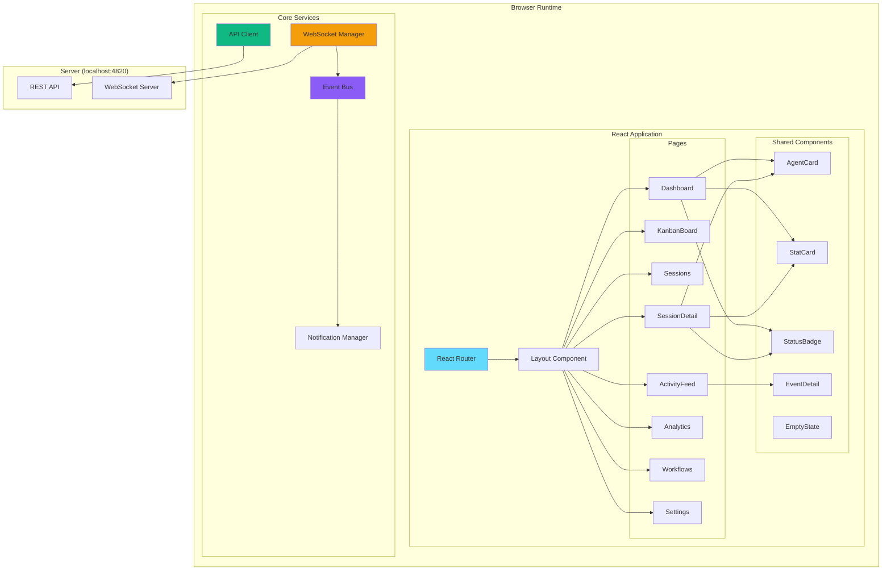

---

## Architecture

### Component Architecture

The client follows a layered architecture with clear separation of concerns:

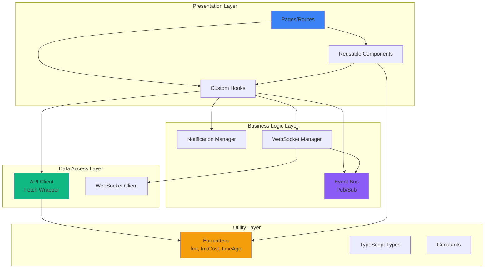

### Directory Structure

```
client/
├── src/
│   ├── components/         # Reusable UI components
│   │   ├── __tests__/      # Component tests
│   │   ├── AgentCard.tsx
│   │   ├── StatCard.tsx
│   │   ├── StatusBadge.tsx
│   │   ├── EventDetail.tsx  # Inline hook payload viewer (used by ActivityFeed + SessionDetail)
│   │   ├── EmptyState.tsx
│   │   ├── Sidebar.tsx
│   │   ├── Layout.tsx
│   │   ├── PlanPanel.tsx   # AGENT-PLAN.md checklist (collapsible; progress bar + per-item session chips) — Projects page + SessionDetail Plan tab
│   │   ├── FocusReportModal.tsx  # Per-project focus-time report popup; dialog chrome only (body lives in FocusReportBody)
│   │   ├── FocusReportBody.tsx   # Single stat-tile/List-Calendar-toggle/list-body implementation — shared by FocusReportModal and FocusCalendarBoard
│   │   ├── FocusCalendarView.tsx # Swimlane day-view calendar for a FocusReport; additive projectLabelForCwd/selectedDate/hideDateNav props for board-mode use; hour-window zoom logic/JSX now live in hooks/useHourWindowZoom.ts + HourWindowZoomBar.tsx, shared with FocusPage
│   │   ├── HourWindowZoomBar.tsx # Presentational hour-window zoom toolbar (4h/8h/12h/24h presets, start-time stepper/input, Live toggle, quick-start presets) — extracted out of FocusCalendarView so FocusPage renders the identical control without a calendar grid
│   │   ├── TimePeriodPicker.tsx  # Page-level day-nav/custom-range control for the Calendar board (server-fetch-triggering sibling of FocusCalendarView's internal nav)
│   │   ├── ProjectScopeFilters.tsx # Project-chip-row + session-select filter pair — extracted out of FocusCalendarBoard so FocusPage reuses it unchanged
│   │   ├── StatTile.tsx        # Single labeled stat cell — extracted out of FocusReportBody so FocusPage reuses it unchanged; optional `action` slot renders a control on the label row
│   │   ├── ConcurrencyStatTile.tsx # The Concurrency tile shared by FocusReportBody + FocusPage — both ratios at once (primary value + secondary sub-line) with a persistent localStorage-backed swap button
│   │   ├── FocusActivityCard.tsx # "What happened" activity list for FocusPage — one row per plan item/detour-bug-feature/unclassified bucket, kind chip + time + inferred reason
│   │   ├── RemoteSources.tsx  # Remote Data Sources settings panel (SSH multi-machine collection)
│   │   └── workflows/      # D3.js workflow visualization components (12 files)
│   │
│   ├── pages/              # Route pages
│   │   ├── Dashboard.tsx
│   │   ├── Projects.tsx       # Projects list/management page (/projects); groups sessions by working-directory-derived "project" into horizontally-scrollable rows; create/rename/delete + folder-mapping CRUD via api.projects
│   │   ├── ProjectDetail.tsx  # Full-page single-project view (/projects/:id, reached from a Projects row's "open detail" icon); plan (PlanPanel/PlanModal reuse), repo/worktree topology + PROJECT-CONTEXT.md-detected sibling repos (GET /api/projects/:id/repos), and team-intake initiative status (GET /api/projects/:id/intake) — both computed live, nothing persisted
│   │   ├── FocusCalendarBoard.tsx # Cross-project Calendar board (/focus-calendar); project/session/time-period filters over GET /api/focus-report
│   │   ├── FocusPage.tsx      # "What did we actually do" activity report (/focus); same filters as the Calendar board, stat tiles + an LLM-synthesized window Summary block (GET /api/focus-report/summary; hidden when null) + FocusActivityCard instead of a swimlane grid
│   │   ├── ProjectManager.tsx # Layer-7 portfolio rollup (/project-manager); per-project milestone/pace rollup (GET /api/portfolio/summary) + the layer-6 decision queue (GET /api/decision-queue) composed into one page — the first client consumer of layers 4-6, which shipped server-only
│   │   ├── KanbanBoard.tsx    # Agents/Sessions/Projects views; Projects view columns render inside drag-reorderable "monitor" boxes (lib/monitorGroups.ts — global, server-shared layout, not localStorage) side by side in the same row once one exists; every Agents/Sessions status Column also carries its own combined layout menu (`LayoutMenu` — one `LayoutGrid` icon opens a popover of visual tiles, each a full orientation+wrap combination, applied in a single click), independent per column and persisted client-side only in the `kanban-status-column-orientation`/`kanban-status-column-wrap` localStorage keys; header's CopyLinkButton copies a shareable URL (with ?token= when DASHBOARD_TOKEN auth is configured)
│   │   ├── Sessions.tsx       # Filterable table; shows each session's real name (synced live from the transcript), falls back to the short ID
│   │   ├── SessionDetail.tsx  # Agent tree + event timeline + Conversation tab (slash-command pills & output, inline rename markers)
│   │   ├── ActivityFeed.tsx  # Real-time event log; row click expands payload; Session btn navigates
│   │   ├── Analytics.tsx
│   │   ├── Workflows.tsx
│   │   ├── Settings.tsx
│   │   └── NotFound.tsx
│   │
│   ├── lib/                # Core utilities & business logic
│   │   ├── __tests__/      # Utility tests
│   │   ├── api.ts          # REST API client; dashboardToken()/captureTokenFromUrl() resolve and auto-persist the optional DASHBOARD_TOKEN (see server README's "Network Exposure Hardening")
│   │   ├── eventBus.ts     # WebSocket pub/sub + connection state
│   │   ├── dataScope.ts    # Global data-scope store (app-wide ?sources= selection)
│   │   ├── focusStore.ts   # Module-level session-focus store (bulk hydrate GET /api/focus + live session_focus WS merges)
│   │   ├── monitorGroups.ts # Kanban Board's global monitor-layout store (bulk hydrate GET /api/monitors + live monitors_updated WS merges); mirrors focusStore.ts's pattern
│   │   ├── colorThresholds.ts # Usage page's global green/yellow/orange/red color-threshold store, two scopes (session, weekly) - bulk hydrate GET /api/color-thresholds + live color_thresholds_updated WS merges; mirrors monitorGroups.ts's pattern
│   │   ├── playbookStore.ts # Coach's Playbook practice-config store (a list, not a singleton) - bulk hydrate GET /api/playbook/practices + live playbook_practice_config_updated WS merges per practice id; mirrors colorThresholds.ts's pattern
│   │   ├── format.ts       # Formatters (formatTime, timeAgo, fmtCost)
│   │   ├── calendarLanes.ts # Swimlane lane-assignment for FocusCalendarView (greedy interval scheduling)
│   │   ├── calendarWindow.ts # Shared startOfDay/DAY_MS day-boundary math (FocusCalendarView, TimePeriodPicker, FocusCalendarBoard)
│   │   ├── focusActivity.ts # groupFocusActivity() — per-cwd rollup of a FocusReport's segments into one row per plan item/detour-bug-feature/unclassified bucket, for FocusPage; unclassified segments WITH an inferred reason stay one narrative row per session (only reason-less ones collapse into the shared tail bucket), and each row carries a per-session `contributors` array (time range, wall/active split, reason) behind FocusActivityCard's expandable "+N more sessions" toggle; optional third `window` param clips to a sub-window (reuses windowedTotals.ts's clipSegment) for the hour-window zoom
│   │   ├── windowedTotals.ts # computeWindowedTotals()/clipSegment() — client-side stat-tile recompute clipped to a [startMs,endMs) sub-window, off a FocusReport's already-fetched segment chunks
│   │   ├── eventBuckets.ts # 10-minute event bucketing for SegmentEventsModal
│   │   ├── projectLookup.ts # Shared cwd->project join (buildCwdProjectIndex/projectForSession) — single canonical extraction consumed by KanbanBoard.tsx's Projects view
│   │   └── types.ts        # TypeScript type definitions
│   │
│   ├── hooks/
│   │   ├── useWebSocket.ts      # Auto-reconnecting WebSocket hook
│   │   ├── useNotifications.ts  # Browser push notification triggers
│   │   └── useHourWindowZoom.ts # Hour-window "zoom" state/logic (4h/8h/12h/24h size, live/custom anchor mode) for one selected day — extracted out of FocusCalendarView so FocusPage can offer the identical control; `defaultHourWindow` option lets FocusPage default to unzoomed (24h) instead of the Calendar's own 4h default
│   │
│   ├── i18n/               # Internationalization (en / zh / vi / ko)
│   ├── App.tsx             # Root component + router setup
│   ├── main.tsx            # Entry point
│   └── index.css           # Tailwind + custom utilities
│
├── public/                 # Static assets (sw.js service worker)
├── index.html              # HTML template
├── vite.config.ts          # Vite + proxy config
├── tailwind.config.js      # Custom dark theme
├── tsconfig.json           # Strict TypeScript config
└── package.json
```

---

## Component Hierarchy

### Page Components

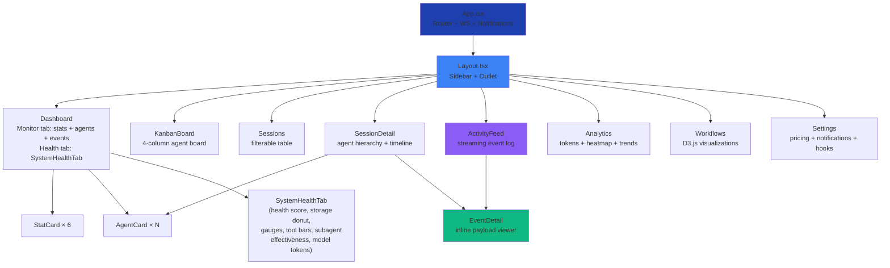

### Component Props Flow

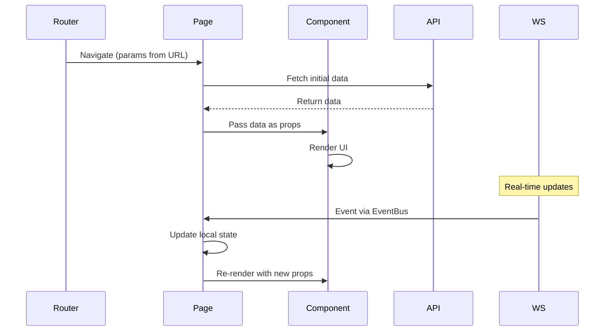

---

## State Management

The client uses **local component state** and **React hooks** for state management. No global state library (Redux, Zustand) is used to keep the architecture simple. The one small exception is the **data-scope store** (`lib/dataScope.ts`): a lightweight app-wide store holding the current set of data sources (`local` plus any configured [Remote Data Sources](../server/README.md#remote-data-sources)). Pages read it and append `?sources=` to their API requests, so a single selector narrows the whole app to one or more machines' data. Remote sources are managed from the Settings page via the `RemoteSources` component (`components/RemoteSources.tsx`), which drives the `/api/remote-sources` CRUD/test/sync endpoints and reflects live `remote_source.status` WebSocket updates.

### State Strategy

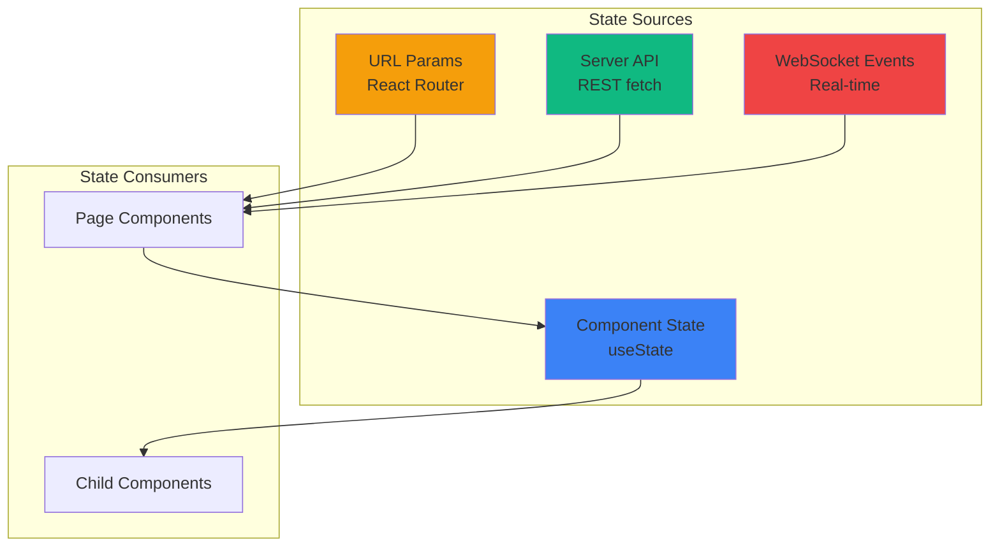

### State Update Pattern

1. **Initial Load**: Page component fetches data via API client on mount (`useEffect`)
2. **URL Changes**: React Router triggers re-render, page refetches data
3. **Real-time Updates**: WebSocket events trigger state updates via `EventBus`
4. **User Actions**: Click handlers call API, optimistically update local state

Example from `SessionDetailPage`:

```typescript
function SessionDetailPage() {
  const { sessionId } = useParams();
  const [session, setSession] = useState(null);
  const [agents, setAgents] = useState([]);
  
  // Initial load
  useEffect(() => {
    fetchSession(sessionId).then(setSession);
    fetchAgents(sessionId).then(setAgents);
  }, [sessionId]);
  
  // Real-time updates
  useEffect(() => {
    const unsubscribe = eventBus.on('agent.created', (agent) => {
      if (agent.session_id === sessionId) {
        setAgents(prev => [...prev, agent]);
      }
    });
    return unsubscribe;
  }, [sessionId]);
}
```

---

## WebSocket Integration

### WebSocket Lifecycle

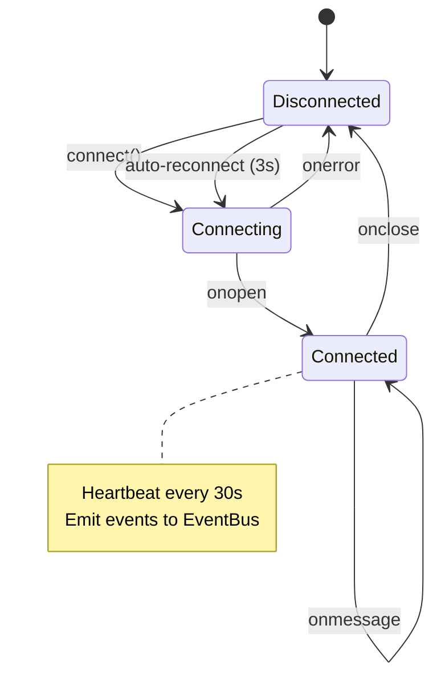

### WebSocket Message Flow

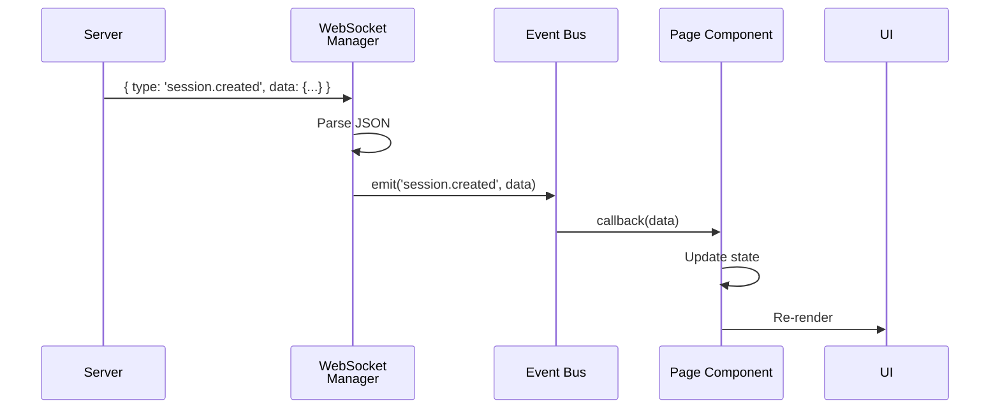

### Event Types

Server broadcasts these event types over WebSocket:

| Event Type | Payload | Triggered By |
|------------|---------|--------------|
| `session.created` | Session object | SessionStart hook |
| `session.updated` | Session object | Any hook touching session |
| `agent.created` | Agent object | PreToolUse hook |
| `agent.updated` | Agent object | PostToolUse/Stop hooks |
| `tool.executed` | Tool execution record | PostToolUse hook |
| `notification.received` | Notification object | Notification hook |
| `remote_source.status` | `{ id, status, error?, last_sync_at? }` (`status`: `idle`/`syncing`/`ok`/`error`/`deleted`) | Remote Data Source sync poller + `/api/remote-sources` routes |
| `plan_updated` | `{ plan, items }` — the ingested plan row plus its full item list | `AGENT-PLAN.md` poll / SessionStart ingest / `POST /api/plans/refresh`, and `focus done` declarations (the `declared_done` rollup changed) |
| `session_focus` | Focus wire shape: `{ session_id, cwd, item_number, item_text, note, detour_stack, since, drift, drift_reason, updated_at }` | Applied focus declarations (hook or API) + the focus drift audit — merged into `lib/focusStore.ts` |
| `monitors_updated` | `{ monitors, monitorMap, collapsedProjects }` — the full resulting global Kanban Board monitor layout | `PUT /api/monitors`, from any connected computer — merged into `lib/monitorGroups.ts`'s store on top of the `GET /api/monitors` hydrate |
| `color_thresholds_updated` | `{ session: {yellowAt,orangeAt,redAt}, weekly: {yellowAt,orangeAt,redAt} }` — the full resulting global Usage-page color thresholds | `PUT /api/color-thresholds`, from any connected computer — merged into `lib/colorThresholds.ts`'s store on top of the `GET /api/color-thresholds` hydrate |
| `playbook_practice_config_updated` | `{ id, category, scope, kind, defaultSeverity, fields, enabled, config }` — the full resulting merged practice | `PUT /api/playbook/practices/:id/config`, from any connected computer — merged into `lib/playbookStore.ts`'s store on top of the `GET /api/playbook/practices` hydrate |
| `coach_observation_created` | `{ id, practice_id, scope_type, scope_id, kind, severity, values_json, status, detected_at, responded_at }` — a new Coach Observation | The Playbook engine's own tick (`server/lib/playbook/engine.js`) when a practice fires — `CoachPage.tsx` prepends it to the Feed |
| `coach_observation_updated` | Same Observation shape as above | `POST /api/coach/observations/:id/respond` — `CoachPage.tsx` removes it from the (open-only) Feed once its status leaves `open` |
| `decision_queue_updated` | The full updated `decision_queue` row (layer 6) | A reconciliation tick enqueuing a `pace_alert`/`detour_volume`/`detour_disposition`/`writeback_*` row, or `POST /api/decision-queue/:id/resolve` — `ProjectManager.tsx` treats this as a debounced reload signal, not a merge-in-place |
| `detour_disposition` | The full updated `detour_dispositions` row (layer 4) | The classifier recording a new detour, or `POST /api/detours/:id/resolve` — same debounced-reload treatment on `ProjectManager.tsx` as `decision_queue_updated` above |

### EventBus Pattern

The `eventBus` is a simple pub/sub system:

```typescript
// lib/eventBus.ts
class EventBus {
  private listeners = new Map<string, Set<Function>>();
  
  on(event: string, callback: Function): () => void {
    if (!this.listeners.has(event)) {
      this.listeners.set(event, new Set());
    }
    this.listeners.get(event)!.add(callback);
    
    // Return unsubscribe function
    return () => this.listeners.get(event)?.delete(callback);
  }
  
  emit(event: string, data: any): void {
    this.listeners.get(event)?.forEach(cb => cb(data));
  }
}

export const eventBus = new EventBus();
```

Usage in components:

```typescript
useEffect(() => {
  const unsubscribe = eventBus.on('session.created', handleNewSession);
  return unsubscribe; // Cleanup on unmount
}, []);
```

---

## Routing

### Route Structure

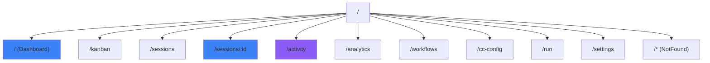

### Route Configuration

```tsx
// App.tsx
import { BrowserRouter, Routes, Route } from 'react-router-dom';

function App() {
  return (
    <BrowserRouter>
      <Routes>
        <Route path="/" element={<Layout />}>
          <Route index element={<Dashboard />} />
          <Route path="kanban" element={<KanbanBoard />} />
          <Route path="sessions" element={<Sessions />} />
          <Route path="sessions/:id" element={<SessionDetail />} />
          <Route path="activity" element={<ActivityFeed />} />
          <Route path="analytics" element={<Analytics />} />
          <Route path="workflows" element={<Workflows />} />
          <Route path="cc-config" element={<CcConfig />} />
          <Route path="run" element={<Run />} />
          <Route path="settings" element={<Settings />} />
          <Route path="*" element={<NotFound />} />
        </Route>
      </Routes>
    </BrowserRouter>
  );
}
```

### Navigation Flow

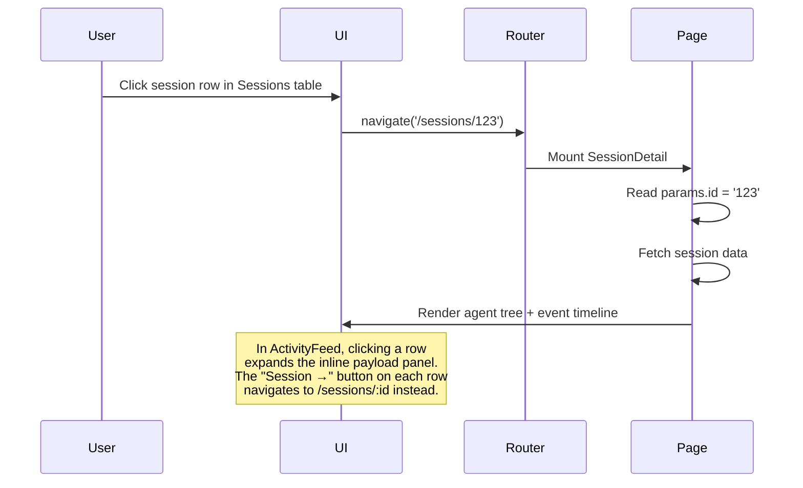

---

## API Client

### API Architecture

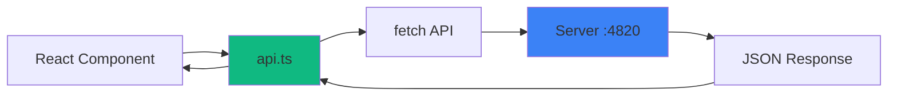

### API Client Structure

```typescript
// lib/api.ts
const BASE_URL = 'http://localhost:4820';

class APIClient {
  private async request(path: string, options?: RequestInit) {
    const response = await fetch(`${BASE_URL}${path}`, options);
    if (!response.ok) throw new Error(`API error: ${response.statusText}`);
    return response.json();
  }
  
  // Sessions
  getSessions() { return this.request('/api/sessions'); }
  getSession(id: string) { return this.request(`/api/sessions/${id}`); }
  
  // Agents
  getAgents(sessionId: string) {
    return this.request(`/api/sessions/${sessionId}/agents`);
  }
  getAgent(id: string) { return this.request(`/api/agents/${id}`); }
  
  // Tools
  getTools(agentId: string) {
    return this.request(`/api/agents/${agentId}/tools`);
  }
  
  // Pricing
  getPricingRules() { return this.request('/api/pricing'); }
  createPricingRule(rule: PricingRule) {
    return this.request('/api/pricing', {
      method: 'POST',
      headers: { 'Content-Type': 'application/json' },
      body: JSON.stringify(rule)
    });
  }
  deletePricingRule(pattern: string) {
    return this.request(`/api/pricing/${encodeURIComponent(pattern)}`, {
      method: 'DELETE'
    });
  }
}

export const api = new APIClient();
```

> **API reference:** the endpoints this client calls are fully documented by the server's OpenAPI 3.0.3 spec. With the dashboard running (default port `4820`), explore them at `/api/docs` (interactive Swagger UI), `/api/redoc` (read-optimized ReDoc reference), or `/api/openapi.json` (raw spec). A committed `openapi.yaml` at the repo root mirrors the live spec.

### Error Handling

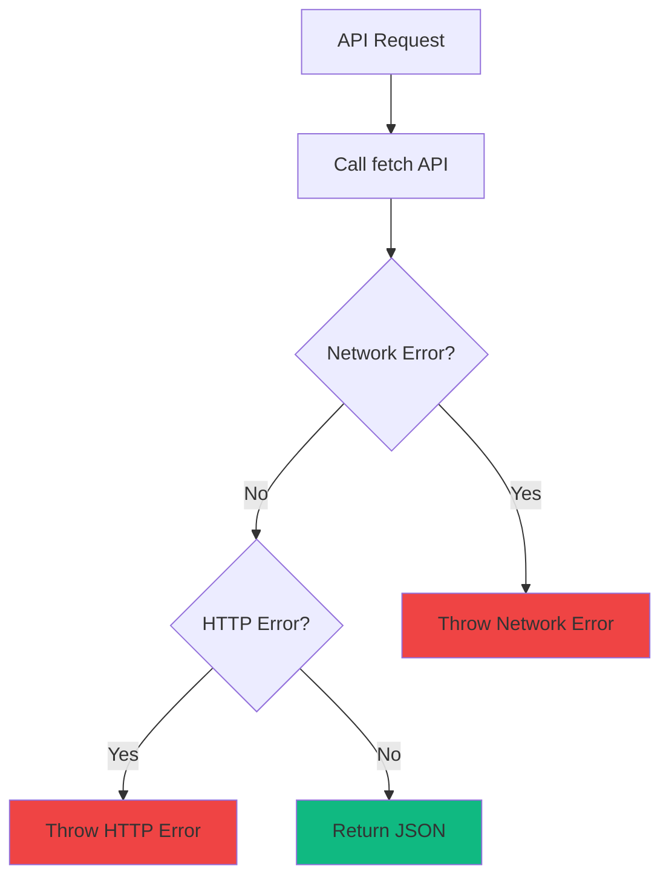

---

## UI Components

### Component Catalog

#### SessionCard

Displays session summary with status, model, cost, and agent count.

**Props:**
```typescript
interface SessionCardProps {
  session: Session;
}
```

**Visual Structure:**
```
┌────────────────────────────────────────┐
│ 🟢 Session Title         $0.45         │
│ claude-sonnet-4                        │
│ Started: 2 hours ago                   │
│ Agents: 3 | Tools: 12                  │
└────────────────────────────────────────┘
```

SessionCard also renders a one-line **focus breadcrumb** whenever the session has *any* declared `AGENT-PLAN.md` focus (from `lib/focusStore.ts`) — a base plan item, a detour, or both — e.g. `Item 4: Migrate auth ▸ npm conflict (23m)`: the current plan item when one is declared, the top detour in amber when the detour stack is non-empty (rendered even when there's no base item), and an amber "possible undeclared detour?" drift pill when the focus drift audit flags the session. A leading icon (`focusKind()` + `FOCUS_KIND_CONFIG`/`FOCUS_KIND_ICONS` in `lib/types.ts`/`PlanModal.tsx`) shows which of the four states applies — known item, plain detour, feature, or bug — the same vocabulary PlanModal's focus lines use.

#### PlanPanel

Renders one repo's ingested `AGENT-PLAN.md` as a collapsible checklist: title, progress bar (checked items over total), and per-item rows with the acceptance note plus **session chips** answering "who is on item N" — the provided sessions joined against the live focus map from `lib/focusStore.ts`. Used on the Projects page (collapsed by default, one panel per mapped folder with a plan) and inside SessionDetail's **Plan** tab (expanded). Copy lives in the `plan` i18n namespace (en / zh / vi / ko).

#### PlanModal

Full-size popup for one or more plans (opened from a PlanPanel strip or a project header's "view plan" icon). Beyond the read-only checklist, it renders one **focus line per active session** under whichever item it's declared on (or an "Unknown item" row when none was set) — an icon for the session's current `FocusKind` (known item / plain detour / feature / bug), the session's name linking to its detail page, and, for detours, a brief description of what's actually happening. Bug/feature lines expand on click to show the full `--detail` text. This is the same `focusKind()` classification and icon set `SessionCard`'s breadcrumb uses, so a session's state reads identically in both places.

#### FocusReportModal

Popup showing a project-scoped **focus-time report** (opened from a report icon — `BarChart3` — next to the "view plan" icon on a project's card/header, on both the Projects page and Kanban's Projects view). Unlike `PlanModal`, it owns its own fetch: `GET /api/projects/:id/focus-report` fires on open rather than the caller pre-loading data, since the report isn't needed until actually looked at. This component now owns only the dialog chrome (header, loading/error states) — the stat-tile/List-Calendar-toggle/list-body rendering below lives in `FocusReportBody` (see below), extracted so the standalone **Calendar** board page can reuse the exact same implementation instead of a copy. A header toggle (`FocusReportViewToggle` — `List`/`CalendarDays` icon buttons, only shown when the project has focus history) switches the body between two views on the SAME already-fetched report — no second request:

- **List** (default) — stat tiles (effort active time, **concurrency ratio**, on-declared-item %, off-plan %, idle time excluded), a per-session segmented timeline bar, a per-item rollup, and a project-wide split — each bar built from `SegmentedBar`, a small internal component sharing the app's `FOCUS_KIND_CONFIG` color vocabulary via `FOCUS_KIND_SOLID` (`lib/types.ts` — a literal per-kind solid-fill map; `FOCUS_KIND_CONFIG`'s own `bg` is a translucent badge wash, not meant for a bar that has to read at a glance, and a *computed* class string like `color.replace("text-","bg-")` would silently produce no styles at all since Tailwind's JIT scanner only generates CSS for literal class-name substrings it finds in source). Hover detail rides each segment's native `title` attribute rather than a custom popup. Like `FocusCalendarView`'s blocks, the per-session bar stays `wall_ms`-sized and overlays a dark idle-chunk stripe via the same shared `idleStripesInRange()` helper (`lib/idleStripes.ts` — extracted once, used by both views, never re-implemented per-view), and its header shows both wall-clock and idle-grace-discounted agent ("active") time, labeled, whenever the two diverge (a single plain number when they don't). The per-item rollup and project-wide split bars have no single segment's `chunks` to overlay, so they size directly off the already idle-aware `active_ms` field (`SegmentedBar`'s `sizeField="active_ms"`) instead — matching the already-`active_ms`-based number printed above each of them. Sessions whose attribution came from the background focus-inference classifier rather than a declaration (segments with `inferred: true`) carry an "≈ inferred" chip beside the session name — its tooltip is the classifier's own one-sentence `inferred_reason` when one was recorded (falling back to a generic "no focus was declared" note otherwise), and each inferred segment's hover title gets the same reason appended. A session with exactly one segment also gets a visible caption naming what it was attributed to (`Item 6: MCP Reliability...` or `Detour: Time tracking investigation`) — the session name and chip alone don't say *what*, and a detour has no other on-screen text at all without it.
- **Calendar** — `FocusCalendarView` (see below), the swimlane day-view alternative.

The stat tiles stay visible in both modes. In Calendar mode, while `FocusCalendarView`'s own hour-window zoom is active (its default for "today"), the tiles scope themselves to that visible window instead of the full fetched report — see `FocusReportBody` below — with a small footnote under the grace note (`report.windowScopedNote`) saying so. Loading/error/empty states; Escape/backdrop/close-button dismissal mirrors `PlanModal`.

**Props:**
```typescript
interface FocusReportModalProps {
  projectId: string;
  projectName: string;
  onClose: () => void;
}
```

#### FocusReportBody

The single implementation of "how a `FocusReport` renders" — stat tiles, the `FocusReportViewToggle` List/Calendar buttons, and the list-style breakdown body — extracted verbatim out of `FocusReportModal.tsx` so a second consumer, the standalone **Calendar** board page (`pages/FocusCalendarBoard.tsx`), can reuse the exact same rendering instead of copy-pasting it. `FocusReportModal` passes none of the three additive props below (so its rendering is unchanged); `FocusCalendarBoard` passes all of them.

In Calendar mode, `FocusReportBody` owns a `visibleWindow` state fed by `FocusCalendarView`'s new `onVisibleWindowChange` callback (fires `{startMs, endMs}` while that view's own hour-window zoom is active, `null` when unzoomed or when `viewMode` isn't `"calendar"`). Whenever it's non-null, the stat tiles (Total agent time, Concurrency, On-item/Off-plan %, Idle excluded) are recomputed from that window instead of read straight off `report`'s own totals — `computeWindowedTotals()` (`lib/windowedTotals.ts`) clips each session's segments to the window and re-derives active/idle time from each segment's `chunks` grid (the same 10-minute active/idle data the calendar's own idle stripes render from, so the numbers stay honest with what's on screen) rather than re-deriving the server's grace-window math, which needs raw event timestamps this client-side report never carries. This closes a real confusion: before this existed, the tiles always reflected the FULL fetched report (a whole day for "today," or an even wider custom range) regardless of the calendar's own zoom — e.g. a "Total agent time" total that looked wildly larger than the visibly-zoomed 4-hour calendar beneath it, with nothing on screen explaining the mismatch. List mode is unaffected; it always shows `report`'s own totals, unchanged. The Concurrency tile (`ConcurrencyStatTile`, shared with `FocusPage`) shows both ratios at once — `concurrency_ratio` primary with `active_concurrency_ratio` as its "while active" sub-figure by default (effort ÷ the union of grace-credited active time, so open-but-idle sessions don't dilute it; the sub-line is omitted when the server didn't send the optional field), or, while zoomed, `computeWindowedTotals()`'s chunk-derived equivalents — and its swap button inverts which is primary, persisted in `localStorage` across reloads.

**Props:**
```typescript
interface FocusReportBodyProps {
  report: FocusReport;
  viewMode: "list" | "calendar";
  // Additive, board-only - all optional, all omitted by the modal:
  projectLabelForCwd?: (cwd: string | null) => string | undefined;
  selectedDate?: Date;
  hideDateNav?: boolean;
  concurrencyLabel?: string; // DEC-6's board-specific Concurrency relabel
}
```

#### FocusCalendarView

Day-view **swimlane calendar** for a project's focus-time report — the visual alternative to `FocusReportBody`'s list body, toggled from `FocusReportModal`'s (or the board's) header, sharing the same already-fetched `report` prop (no fetch of its own). The 24-hour axis renders at 2x a plain one-pixel-per-minute scale (`DAY_HEIGHT_PX`, ~120px/hour) with a quarter-hour tick grid (`QUARTERS_PER_DAY`) beneath it, and every session's segment is positioned by snapping its rendered box outward to that same quarter-hour grid — floor the start, ceil the end — rather than lining it up to the real minute, so even a very short segment renders as a full, comfortably clickable 15-minute-or-more block (the segment's true, unpadded start/end/duration still drive the hover popup, title, and events modal; only the visual box is padded). Segments whose (snapped) spans overlap split into side-by-side lanes via `assignLanes()` (`lib/calendarLanes.ts` — greedy earliest-available-lane interval scheduling, optimal for interval graphs) instead of stacking, so concurrency reads as geometry rather than a number to interpret — lane assignment runs on the already-snapped boxes, so two segments that only start touching once padded still split into separate lanes like a genuine overlap would. Each lane is a fixed `LANE_WIDTH_PX` (300px) wide rather than a `100 / laneCount` share of the available area, so a session's column never gets more cramped as more sessions overlap; the grid's own intrinsic width is `laneCount * LANE_WIDTH_PX`, inside its own `.overflow-x-auto` wrapper that scrolls horizontally once that exceeds the visible area, while the hour-label time axis sits OUTSIDE that wrapper (a sibling, not a child) so it stays in view the whole time instead of scrolling away with the lanes. Blocks are colored by `FOCUS_KIND_CONFIG`, with a dashed border for an inferred segment vs. solid for declared (mirrors `FocusReportModal`'s "≈ inferred" convention) and a pulsing, open-ended block for a session whose `ended_at` is still `null` (genuinely still running, not just "happened to end near fetch time" — the distinction the API's `ended_at` field exists to make). Each card's own always-visible text is deliberately exactly two lines: the session's name (or `report.calendar.noName`, "No-name," when it has none — never a truncated session id, here or anywhere else this data renders: the hover popup, the events-modal header, and the aria-label all share the same fallback) and which project it belongs to (`projectLabelForCwd`, falling back to `projects:unassigned` when a cwd resolves to no project) — the kind/label/timing detail that used to be a third line lives only in the hover popup and events modal now, not duplicated on the card itself. `FocusReportModal` passes a `projectLabelForCwd` that always returns its own single already-known project (every session in a per-project report belongs to it by construction); previously this prop was board-only. An accent-colored "now" line only renders when the selected day is today. Prev/Today/Next buttons navigate days (mirrors `DateTimePicker`'s chevron-nav styling; day-boundary math itself, `startOfDay`/`DAY_MS`, lives once in `lib/calendarWindow.ts`); a segment spanning past midnight is clipped to each day it touches rather than rendering a multi-day continuation. Any day's view can also "zoom" to an hour-window (`hourWindow` state, a 4h/8h/12h/24h button group shown regardless of `hideDateNav` since the board wants it too, default 4h) instead of always showing the full day; `24` is the plain, unzoomed full day. Every control group — date-nav, duration pills, and (under 24) the start-time stepper/typed input/"Live" toggle and the quick-start presets — is a direct child of ONE `flex flex-wrap` row rather than several stacked rows, so they all pack onto a single line when there's enough width and only wrap down to their own line once it runs out. Under 24, the stepper pages by the window's own size, an `<input type="time">` jumps straight to an exact start, and (today only) a "Live" toggle snaps back to following the current time. Two anchor modes (`windowAnchorMode`) drive this: `"live"` (the default, today only) shows `hourWindow` hours behind the real current time plus 2 hours ahead of it, re-anchoring to "now" every minute; `"custom"` freezes the window at whatever start time the user picked (`customOffsetMs`, stored as an offset from that day's own midnight so it survives day navigation as a time-of-day, not an absolute instant). A past/future day always renders in "custom" mode — there's no "now" to live-follow once you're not looking at today — starting at midnight until the user moves it, so a past day can zoom to (and page through) any of its own hour-windows exactly like today does, just without the "Live" option. Container height and every tick/block position scale to the current window, not always the full day, at the same fixed per-minute pixel density.

Below that stepper row, a **quick-start preset** row (`quickStartOptions`) offers a button for every 4-hour mark from midnight up to the latest start that still fits the current window size — 12am/4am/8am/12pm/4pm/8pm for a 4h window, stopping one earlier (4pm) for an 8h window, and so on — available on any day, today included, since a custom start is just as meaningful while "Live" is still an option. Clicking one jumps straight to that start and switches to `"custom"` anchoring, same as the stepper/typed input. Because a preset can legally land after the real current time (only possible on today's own view), each such button is styled amber instead of disabled — it stays clickable, since it becomes meaningful again once "now" catches up to it — and whenever the window actually on screen starts after "now" (`windowIsFuture`, checked regardless of how that start was reached), a persistent inline warning banner explains the window will show no data yet rather than leaving the resulting empty grid unexplained.

A segment's wall-clock span can run far longer than its actual worked time (a whole-session inferred segment rides straight through to the session's `ended_at` regardless of how much of that was silence), so the block does two things a single solid color can't: (1) it overlays an off-white (`bg-stone-100/60`) stripe over any 10-minute chunk with zero real events (`seg.chunks` from the API, same 10-minute grain `SegmentEventsModal` uses), rendered against the block's own (snapped) box — any padding the snap added shows as plain kind-color rather than a fabricated stripe, since there's no real chunk data outside the segment's true span; an active chunk needs no overlay, the block's own kind color already reads correctly for it; (2) hovering a block opens a floating popup (portaled to `document.body`, anchored off the block's rect — not a native `title` tooltip, so it can carry the kind's color-coding and wrap the label/inferred-reason text) stating BOTH wall-clock time and idle-grace-discounted active ("agent") time, not just the raw span. Each block also carries a small "`</>`" icon (top-right corner, a sibling of the block's own link rather than nested inside it) that opens `SegmentEventsModal` — every raw hook event recorded in that segment's real time window, grouped into 10-minute buckets (`bucketEvents()`, `lib/eventBuckets.ts`) with a per-`event_type` count so the row count stays bounded by how long the segment ran rather than by how many events it produced; each bucket expands into its individual events, each further expandable into the full hook payload via `EventDetail` (the same viewer the Activity Feed page uses). This exists so a segment's attributed duration can be checked against what actually happened instead of taken on faith.

Sessions whose cwd is a scratch/temp directory (`isScratchCwd` — matches `/tmp/...` or `/private/var/folders/...`, macOS's per-process `$TMPDIR`) aren't tied to a real project and are usually short one-off runs, so rendering each as its own full-width card would be noise; instead every scratch-cwd segment is grouped into 15-minute-window **"Scratch Work"** bundle cards in one dedicated lane (lane index 0, present only on a day that has at least one bundle — `laneOffset` in the lanes `useMemo`), deduped per real `session.session_id` per bundle window so a session with several scratch segments in the same window still counts once. The card shows only a title + session count, never a project; hovering it lists each bundled session's real name, kind/label, cwd, and time range, keyed by that same real `session_id`. A segment straddling a 15-minute boundary intentionally appears in BOTH adjacent bundle cards (each clipped to that window) rather than being assigned to just one, so hovering either card always shows everything actually happening in that window. A "Scratch Work" legend swatch renders only on days that actually have a bundle.

**v1 scope note:** only Day view + simple date navigation shipped in this component itself — a Week/Month zoom is still deferred. The previously-deferred "aggregate time-range selector" now exists, but as a separate, page-level control (`TimePeriodPicker`, see below) on the standalone Calendar board page, not as a change to this component: `FocusCalendarView` gained only four additive, optional props (`projectLabelForCwd`, `selectedDate`, `hideDateNav`, `onVisibleWindowChange`) so the board can drive which day it renders, suppress its internal nav row in favor of the board's own page-level one, and (the new one) let `FocusReportBody`'s stat tiles scope to its zoom — its core "one day, internal nav" contract is otherwise unchanged, and the existing modal usage (all four omitted) is pixel-identical to before. See the `holistic-focus-history` project memory for the full design history.

**Note (shared with FocusPage):** the `hourWindow`/`windowAnchorMode`/`customOffsetMs` state and every derived value described above (`zoomable`, `windowStartMs`/`windowEndMs`, `quickStartOptions`, `windowIsFuture`, etc.), plus the toolbar JSX itself, now live in `hooks/useHourWindowZoom.ts` and `components/HourWindowZoomBar.tsx` respectively — extracted verbatim out of this file so `pages/FocusPage.tsx` (stat tiles + `FocusActivityCard`, no calendar grid) can offer the identical start+duration control. This component calls `useHourWindowZoom(selectedDate)` and renders `<HourWindowZoomBar {...zoom} leadingRowContent={...} />` (the `leadingRowContent` slot preserves this component's own layout, where the duration pills share one row with the Prev/Today/Next date-nav); every behavior described above is unchanged — `FocusCalendarView.test.tsx`'s full suite, including its own `"hour-window zoom"` tests, passes unmodified through the extraction. `FocusPage` calls the same hook with `{ defaultHourWindow: 24 }` so it defaults to the full, unzoomed period (its own prior behavior) rather than this component's own 4h default — the zoom there is a purely additive, opt-in narrowing, not a changed default.

**Props:**
```typescript
interface FocusCalendarViewProps {
  report: FocusReport;
  // Additive, board-only - all optional, all omitted by the modal:
  projectLabelForCwd?: (cwd: string | null) => string | undefined;
  selectedDate?: Date;   // controlled day override
  hideDateNav?: boolean; // suppresses the internal Prev/Today/Next row
}
```

#### SegmentEventsModal

Big popup opened from a `FocusCalendarView` block's "`</>`" icon (see above), listing every raw hook event recorded in that segment's real (unclipped) time window. Fetches `GET /api/events?session_id=&from=&to=` on open, groups the result into 10-minute buckets (`bucketEvents()`, `lib/eventBuckets.ts`) so a long segment's row count stays bounded — a busy 10-hour segment is at most ~60 bucket rows, not thousands of individual `PreToolUse`/`PostToolUse` pairs. Each bucket row shows the time range, a count per `event_type`, and a total; expanding it reveals its individual events, each further expandable into the full hook payload via `EventDetail`. The header states the segment's session/kind/label plus both wall-clock time and idle-grace-discounted active time. An inferred segment can legitimately have zero events inside its own window (attribution came from the background classifier looking at nearby activity, not from anything strictly inside the window) — the empty state calls that out explicitly.

**Props:**
```typescript
interface SegmentEventsModalProps {
  sessionId: string;
  sessionName: string | null;
  kindLabel: string;
  kindColor: string;
  label: string | null;
  realStart: string;   // segment's real (unclipped) bounds
  realEnd: string;
  wallMs: number;
  activeMs: number;     // idle-grace-discounted active time
  inferred: boolean;
  inferredReason: string | null;
  onClose: () => void;
}
```

#### TimePeriodPicker

Page-level time-period filter for the standalone Calendar board (`pages/FocusCalendarBoard.tsx` — see the **Calendar** row in the Features table above) — visually mirrors `FocusCalendarView`'s own Prev/Today/Next row (reusing its `report.calendar.*` i18n keys, no new keys needed for day mode) plus a "Custom range" toggle exposing two `<input type="date">` fields. Pure/controlled, no fetching, no knowledge of `FocusReport` — same "no fetch" contract as `FocusCalendarView` itself. Different responsibility from `FocusCalendarView`'s internal day-nav, though: that one re-slices an already-fetched report client-side; this one is a data-window selector whose `onChange` drives a new server fetch on the board page. Both share the same `startOfDay`/`DAY_MS` day-boundary math via `lib/calendarWindow.ts` rather than each defining their own slightly-different version.

**Props:**
```typescript
type TimePeriodValue =
  | { mode: "day"; date: Date }
  | { mode: "range"; start: Date; end: Date };

interface TimePeriodPickerProps {
  value: TimePeriodValue;
  onChange: (next: TimePeriodValue) => void;
}
```

#### ProjectScopeFilters

The project-chip-row + session-`<select>` filter pair — extracted out of `pages/FocusCalendarBoard.tsx` (where it used to live as ~150 lines of inline JSX) so a second page, `pages/FocusPage.tsx`, renders the exact same project/session scoping controls without copy-pasting them. Pure lift-and-shift: markup, classes, and behavior are unchanged from the original inline version — `FocusCalendarBoard.test.tsx` stayed green, unmodified, through the extraction. Renders one chip per project reflected in the currently-loaded report plus "All projects", a one-shot "show more" expansion for dormant projects, and a fixed amber "Unassigned" chip; `projectId` and `unassignedOnly` are mutually exclusive, mirrored via `onSelectProject`/`onSelectUnassigned` each updating both.

#### StatTile

A single labeled stat cell (label, big value, optional sub-caption and hover tooltip) — extracted out of `FocusReportBody.tsx` (where it lived as an unexported local component) so `FocusPage.tsx` can render its own stat-tile row without depending on `FocusReportBody`'s calendar/list rendering. An optional `action` slot renders a control at the right end of the label row (used by `ConcurrencyStatTile`'s swap button); omitted, the markup is byte-identical to the original inline version.

#### ConcurrencyStatTile

The Concurrency stat tile shared by `FocusReportBody` (modal + Calendar board) and `FocusPage` — extracted so the primary/secondary ratio swap lives in one place instead of three call sites. Renders both concurrency figures at once: one as the big value with its own denominator total right beneath it (`"of X open-session time"` / `"of X active time"` — the total the big ratio is actually a ratio of, fed by the `wallClockMs`/`activeWallClockMs` props), the other ratio as a second sub-line (`"Nx while active"` / `"Nx across open sessions"`), with a small swap button (`ArrowLeftRight`) on the label row that inverts which is which; the hover tooltip always describes whichever ratio is currently primary. The choice persists per browser in `localStorage` (`agent-monitor-concurrency-primary`, exported as `CONCURRENCY_PRIMARY_KEY` for tests) so it survives a refresh; storage access is try/catch-guarded, so private-mode browsing just forgets the choice on reload. A `null`/absent ratio renders "—" when primary and omits the sub-line when secondary (e.g. a report from a server predating `active_concurrency_ratio`). The board's DEC-6 "Concurrent agent sessions" relabel arrives via the `label` prop and never changes with the swap — value/sub/tooltip carry the semantics.

#### FocusActivityCard

The body of `pages/FocusPage.tsx`'s report: renders `lib/focusActivity.ts`'s `groupFocusActivity()` output — scoped to the page's `HourWindowZoomBar` selection when zoomed (`groupFocusActivity`'s optional third `window` param, clipping each segment the same way `computeWindowedTotals` clips the stat tiles above it, so the two never disagree) — as one row per plan item / detour-bug-feature (grouped by title) / unclassified bucket — a kind chip (icon + color reused from `FOCUS_KIND_CONFIG`/`FOCUS_KIND_ICONS`, the same vocabulary as `PlanModal`'s focus lines and `SessionCard`'s breadcrumb), the label, a wall/active time figure (`formatMs`, single figure when they're equal, both labeled when they diverge — mirrors `FocusReportBody`'s `ListView` convention), an `inferred` tag when the entry came from the background classifier, and — only then — its one-sentence `inferred_reason`. A live `ccam focus push/bug/feature` declaration has no separate reason distinct from its own label today, so a declared entry shows no reason line — a known gap, not a bug. `showProjectLabel` (true only in "all projects" scope) prefixes each row with its resolved project name. Collapses past 5 entries behind a "show more"/"show fewer" toggle so a long tail of small detours doesn't dominate the card.

**Props:**
```typescript
interface FocusActivityCardProps {
  entries: FocusActivityEntry[];
  showProjectLabel: boolean;
}
```

**`groupFocusActivity(report, projectLabelForCwd?, window?)`** (`lib/focusActivity.ts`) — walks every session's segments in an already-window-clipped `FocusReport` (the aggregate `GET /api/focus-report` endpoint clips server-side to the page's `from`/`to`) and groups them by `${cwd}:item:${item_number}` / `${cwd}:${kind}:${label}` / `${cwd}:none`, summing wall/active/idle time. The optional third `window` (`{startMs, endMs}`) additionally clips each segment to that sub-window first, via `windowedTotals.ts`'s `clipSegment` — the same per-segment clip `computeWindowedTotals` uses for the stat tiles — so `FocusPage`'s `HourWindowZoomBar` selection narrows the activity list the same way it narrows the tiles above it; a segment outside the window contributes nothing. When more than one segment lands on the same key, the displayed label/`inferred`/reason come from whichever contributed the largest (window-clipped, when given) wall-time share; `contributions` records how many segments rolled in. Sorted by `wallMs` descending.

**Props:**
```typescript
interface PlanPanelProps {
  plan: Omit<Plan, "items">;    // the plan to render
  items: PlanItem[];             // the plan's items, file order
  sessions: Session[];           // sessions eligible to chip onto items
  focusBySession: ReadonlyMap<string, SessionFocus>; // live focus map (focusStore)
  defaultExpanded?: boolean;     // SessionDetail passes true; Projects collapses
}
```

#### AgentCard

Shows agent type, status, tool usage, and cost breakdown.

**Props:**
```typescript
interface AgentCardProps {
  agent: Agent;
}
```

#### StatusBadge

Colored status pills for agents (`AgentStatusBadge`) and sessions (`SessionStatusBadge`). When a row is in the yellow **Waiting** overlay (`awaiting_input_since` set), an optional `reason` prop explains WHY: a hover tooltip carries the full explanation, and — unless `compact` is set — a small nested chip (icon + short label) renders inline. Card layouts (Kanban / Dashboard trees) pass `compact` so the chip never squeezes the card title; the Sessions table and session-detail header show the full chip. Three reasons (`subagent`/`shell`/`monitor`, `AWAITING_REASON_CONFIG[reason].primary === true`) mean Claude is still actively working via a child rather than blocked on the human, so they replace the badge's whole word instead of nesting a chip — in every mode, compact included:

| `awaiting_reason` | Label | Meaning |
| ----------------- | ----- | ------- |
| `notification` | Needs input | Blocked on a permission prompt / input request (urgent — amber) |
| `stop` | Turn done | Claude finished its reply; idle until the next prompt |
| `session_start` | At prompt | Fresh/resumed CLI sitting at an empty prompt |
| `interrupted` | Interrupted | Turn cut short — Esc or a recovered hook (urgent — amber) |
| `subagent` | SubAgents | Main's own turn ended, but a subagent fleet it spawned is still working — not blocked on you |
| `shell` | Shell | Main is mid a synchronous Bash call — not blocked on you |
| `monitor` | Monitor | Main is mid a Monitor tool call — not blocked on you |

**Props:**
```typescript
interface AgentStatusBadgeProps {
  status: EffectiveAgentStatus;
  pulse?: boolean;
  reason?: AwaitingReason | null; // from agentAwaitingReason(agent)
  compact?: boolean; // tooltip-only (no inline chip) for tight card layouts
}
```

Unknown/future server reasons degrade to a plain Waiting badge (`normalizeAwaitingReason` filters them to null). SessionDetail additionally renders a waiting-for-input banner (same reason + relative time) under the header via the shared `REASON_ICONS` map.

#### ToolCard

Displays tool execution details with timing and token usage.

**Props:**
```typescript
interface ToolCardProps {
  tool: ToolExecution;
}
```

#### EventTimeline

Chronological view of session events (hooks, tools, notifications).

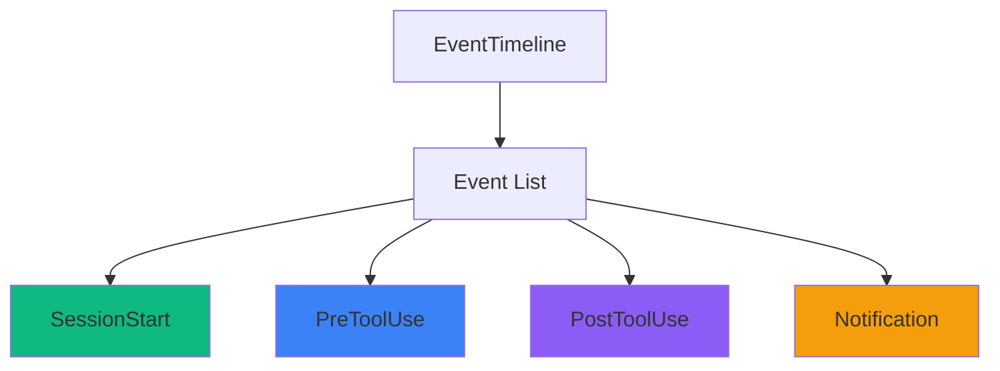

#### ActivityFeed (`pages/ActivityFeed.tsx`)

Real-time streaming event log with pause/resume, pagination, and inline payload expansion.

**UX interaction model:**

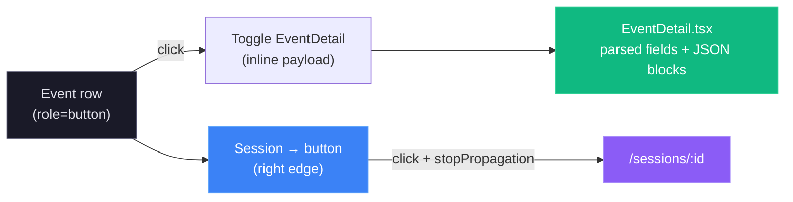

- The entire row is clickable (keyboard accessible via `Enter`/`Space`) and toggles the `EventDetail` dropdown.
- The chevron icon rotates 90° when a row is expanded — it is a visual indicator only, not a separate button.
- The **Session →** button uses `e.stopPropagation()` so navigating to session details never collapses an open payload panel.
- Multiple rows can be expanded simultaneously (state stored in `Set<number>`).

#### EventDetail (`components/EventDetail.tsx`)

Renders the hook payload for a single event inline below its row. Scalars appear as `key: value` pairs; objects and arrays render in a terminal-styled code block with a copy button.

---

## Utilities

### Formatters (lib/format.ts)

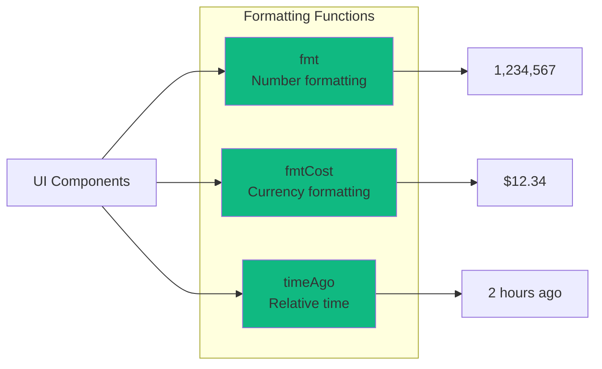

**Function Signatures:**

```typescript
// Format large numbers with commas
export function fmt(n: number | null | undefined): string;
// Examples: fmt(1234) → "1,234"
//           fmt(null) → "—"

// Format cost in dollars
export function fmtCost(cost: number | null | undefined): string;
// Examples: fmtCost(1.234) → "$1.23"
//           fmtCost(0) → "$0.00"

// Relative time string
export function timeAgo(date: string | Date | null | undefined): string;
// Examples: timeAgo('2024-03-18T12:00:00Z') → "2 hours ago"
//           timeAgo(null) → "—"
```

### Type Definitions (lib/types.ts)

All TypeScript interfaces match server response shapes:

```typescript
interface Session {
  id: string;
  session_id: string;
  model: string;
  status: 'active' | 'completed' | 'error' | 'abandoned';
  total_cost: number;
  created_at: string;
  updated_at: string;
}

interface Agent {
  id: number;
  agent_id: string;
  session_id: string;
  agent_type: string;
  status: 'working' | 'waiting' | 'completed' | 'error';
  input_tokens: number;
  output_tokens: number;
  cost: number;
  created_at: string;
}

interface ToolExecution {
  id: number;
  agent_id: string;
  tool_name: string;
  duration_ms: number;
  success: boolean;
  created_at: string;
}
```

---

## Testing

### Test Stack

- **Vitest** - Fast unit test runner (Vite-native)
- **React Testing Library** - Component testing
- **jsdom** - Browser environment simulation

### Test Structure

```
client/src/
├── components/__tests__/
│   ├── AgentCard.test.tsx
│   ├── SessionCard.test.tsx
│   └── EventTimeline.test.tsx
│
├── pages/__tests__/
│   ├── screens.snapshot.test.tsx          # render snapshots for every screen
│   └── __snapshots__/                      # committed .snap baselines
│
└── lib/__tests__/
    ├── format.test.ts
    ├── eventBus.test.ts
    └── api.test.ts
```

### Running Tests

```bash
# Run all tests
npm test

# Watch mode
npm run test:watch

# Coverage report
npm run test:coverage
```

### Example Test

```tsx
// components/__tests__/SessionCard.test.tsx
import { render, screen } from '@testing-library/react';
import { SessionCard } from '../SessionCard';

test('renders session title and cost', () => {
  const session = {
    id: '1',
    session_id: 'sess_123',
    model: 'claude-sonnet-4',
    total_cost: 1.23,
    status: 'active',
    created_at: '2024-03-18T12:00:00Z'
  };
  
  render(<SessionCard session={session} />);
  
  expect(screen.getByText('sess_123')).toBeInTheDocument();
  expect(screen.getByText('$1.23')).toBeInTheDocument();
});
```

### Snapshot Testing

`pages/__tests__/screens.snapshot.test.tsx` renders **every routed screen**
(Dashboard, Kanban, Sessions, Session detail, Activity feed, Analytics,
Workflows, Claude Config, Run, Settings, Not found) and asserts each against a
committed snapshot in `pages/__tests__/__snapshots__/`. These are structural
regression guards — they catch unintended changes to layout, markup, or
localized copy.

To keep snapshots **deterministic** across machines and CI, the suite:

- mocks the API layer (`vi.mock("../../lib/api", …)`) to a loaded-empty state
  (empty collections + zeroed scalars), so no live data or noisy chart DOM
  leaks in — `importOriginal` keeps non-`api` exports real;
- stubs `eventBus`, push notifications, and the jsdom-missing
  `ResizeObserver` / `IntersectionObserver` / `matchMedia` / `scroll*` APIs;
- pins the clock (`vi.useFakeTimers`) and timezone (`TZ=UTC`) so any rendered
  timestamps are stable.

When you change a screen **intentionally**, review the diff and regenerate the
baselines:

```bash
cd client && npx vitest run -u src/pages/__tests__/screens.snapshot.test.tsx
```

Commit the updated `.snap` file alongside the change.

---

## Build & Deployment

### Development Build

```bash
npm run dev
```

Starts Vite dev server with HMR at `http://localhost:9200`

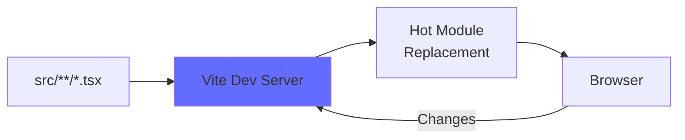

### Production Build

```bash
npm run build
```

Output: `client/dist/` (optimized static files)

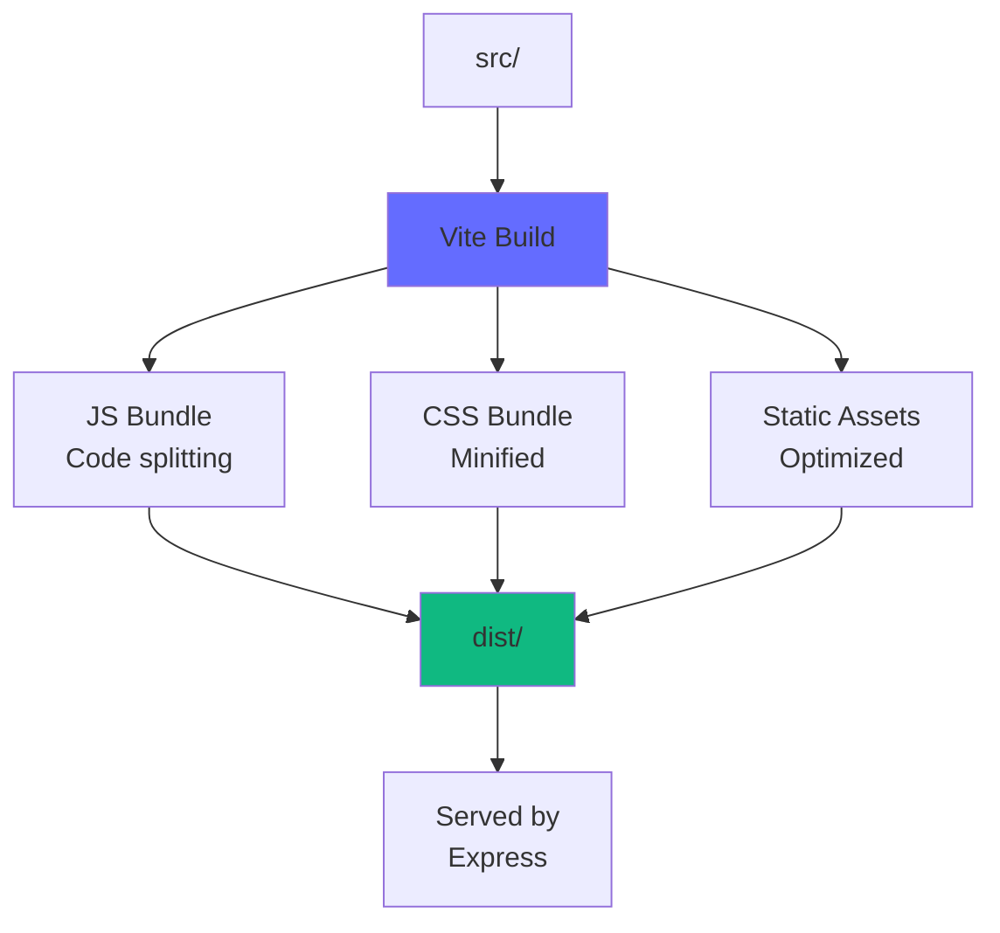

### Build Optimizations

1. **Code Splitting** - Lazy load routes with `React.lazy()`
2. **Tree Shaking** - Remove unused code
3. **Minification** - Terser for JS, cssnano for CSS
4. **Asset Hashing** - Cache busting with content hashes
5. **Compression** - Gzip/Brotli (handled by Express)

---

## Development

### Prerequisites

- Node.js >= 20.0.0
- npm >= 9.0.0

### Setup

```bash
# Install dependencies
npm install

# Start dev server
npm run dev
```

### Environment Variables

The client uses hardcoded API URL (`http://localhost:4820`). For custom configuration, update `lib/api.ts`:

```typescript
const BASE_URL = import.meta.env.VITE_API_URL || 'http://localhost:4820';
```

Then create `.env`:

```
VITE_API_URL=http://localhost:4820
```

### Hot Module Replacement (HMR)

Vite provides instant feedback on code changes:

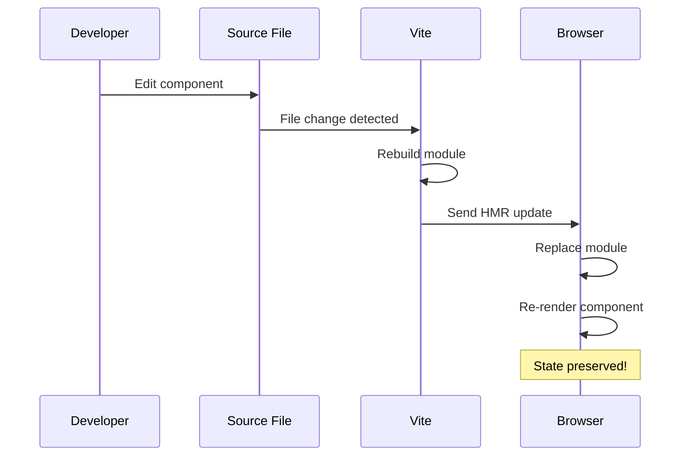

---

## Performance

### Metrics

- **First Contentful Paint (FCP)**: < 0.5s
- **Time to Interactive (TTI)**: < 1.5s
- **Bundle Size**: ~150KB gzipped (main chunk)

### Optimization Techniques

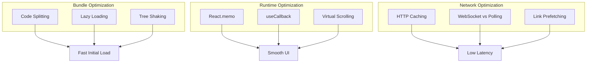

### Virtual Scrolling

For large lists (100+ sessions), implement virtual scrolling:

```tsx
import { useVirtualizer } from '@tanstack/react-virtual';

function SessionList({ sessions }) {
  const parentRef = useRef(null);
  const virtualizer = useVirtualizer({
    count: sessions.length,
    getScrollElement: () => parentRef.current,
    estimateSize: () => 100, // estimated row height
  });
  
  return (
    <div ref={parentRef} style={{ height: '600px', overflow: 'auto' }}>
      <div style={{ height: `${virtualizer.getTotalSize()}px` }}>
        {virtualizer.getVirtualItems().map(virtualRow => (
          <SessionCard
            key={sessions[virtualRow.index].id}
            session={sessions[virtualRow.index]}
          />
        ))}
      </div>
    </div>
  );
}
```

---

## Accessibility

### WCAG 2.1 Level AA Compliance

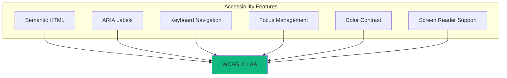

### Implementation Checklist

- ✅ Semantic HTML5 elements (`<nav>`, `<main>`, `<article>`)
- ✅ ARIA labels on interactive elements
- ✅ Keyboard navigation (Tab, Enter, Escape)
- ✅ Focus indicators (outline on :focus)
- ✅ Color contrast ratio >= 4.5:1 for text
- ✅ Alternative text for icons (aria-label)
- ✅ Skip links for screen readers

### Example

```tsx
<button
  onClick={handleDelete}
  aria-label="Delete pricing rule"
  className="focus:outline-blue-500"
>
  <Trash2 aria-hidden="true" />
</button>
```

---

## Summary

The client is a production-ready React application with:

- 🚀 **Modern Stack** - React 18, TypeScript, Vite, Tailwind
- ⚡ **Real-time** - WebSocket integration for live updates
- 🧪 **Tested** - Vitest + React Testing Library
- 📦 **Optimized** - Code splitting, tree shaking, lazy loading
- ♿ **Accessible** - WCAG 2.1 AA compliant
- 🎨 **Maintainable** - Clear architecture, type-safe, well-documented

For server documentation, see [server/README.md](../server/README.md).

