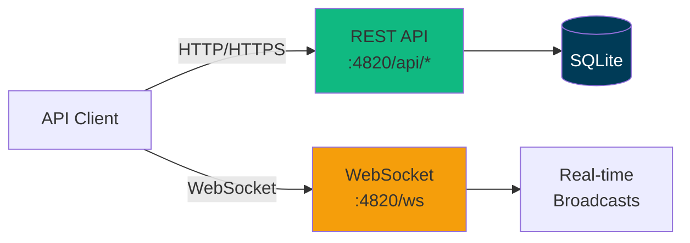
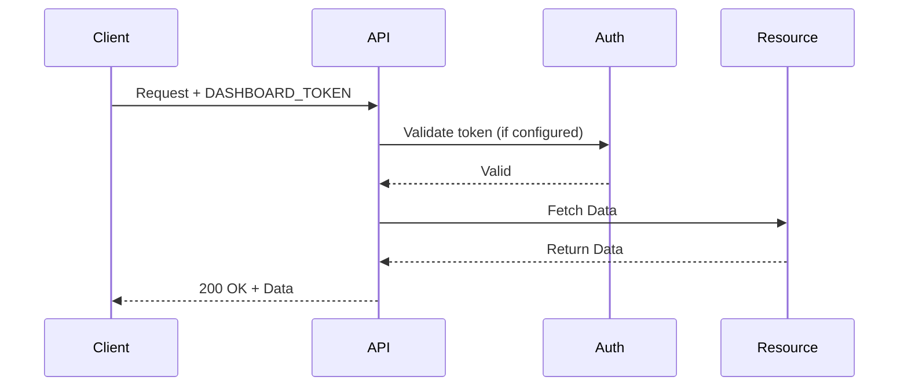
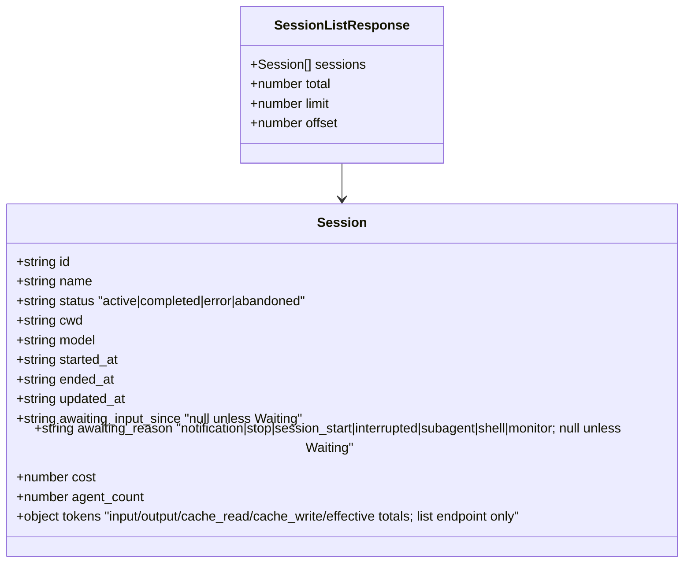
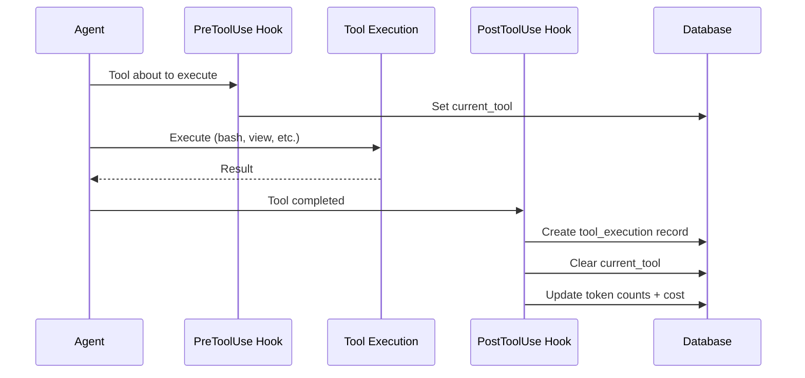
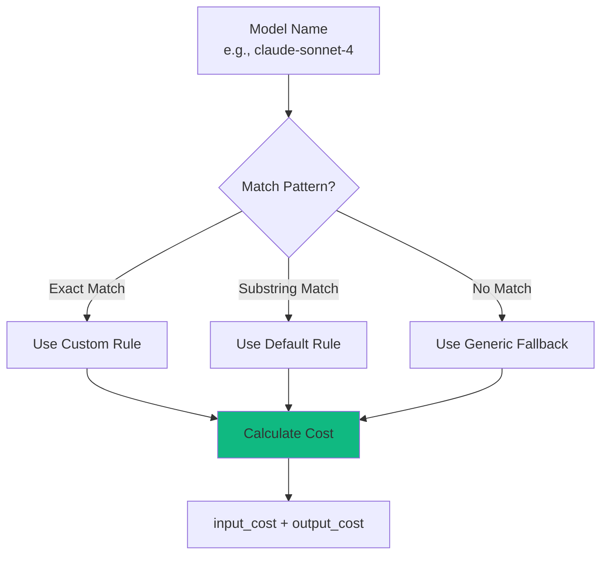
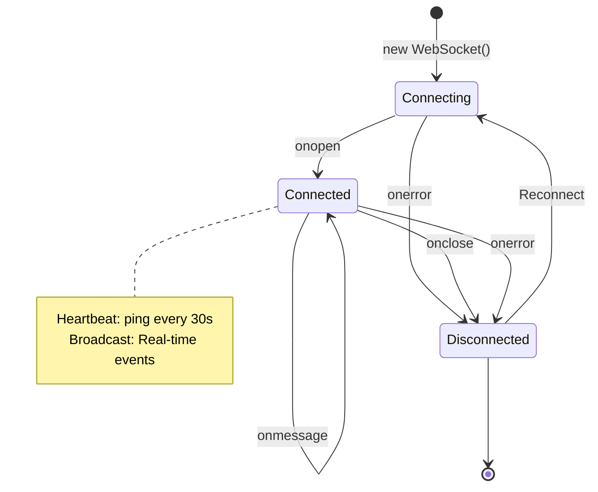
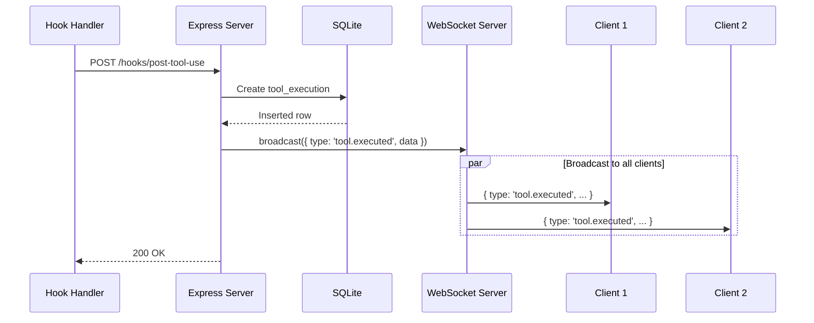
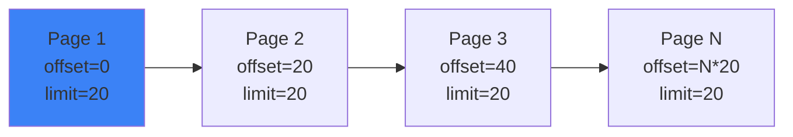

# API Reference

Complete REST API and WebSocket documentation for Agent Dashboard.

---

## Table of Contents

- [Overview](#overview)
- [Authentication](#authentication)
- [Base URL](#base-url)
- [REST API](#rest-api)
  - [Sessions](#sessions)
  - [Agents](#agents)
  - [Tools](#tools)
  - [Metrics](#metrics)
  - [Pricing](#pricing)
  - [Notifications](#notifications)
  - [Remote Data Sources](#remote-data-sources)
  - [Projects](#projects)
  - [Plans & Focus](#plans--focus)
  - [Portfolio](#portfolio)
  - [Playbook](#playbook)
  - [Coach](#coach)
- [WebSocket API](#websocket-api)
- [Error Handling](#error-handling)
- [Rate Limiting](#rate-limiting)
- [Pagination](#pagination)
- [Examples](#examples)

---

## Overview

The Agent Dashboard API provides programmatic access to Claude Code session monitoring data.



**Protocols:**
- **REST API** - HTTP/JSON for queries and mutations
- **WebSocket** - Real-time event streaming

---

## Authentication

The server is **local-first** and is hardened to keep the dashboard off the network by default (see GHSA-gr74-4xfh-6jw9). The trust boundary is the loopback bind, layered with origin and host checks:

- **Loopback bind by default** — the server binds `127.0.0.1`, so it is not network-reachable out of the box. Operators opt into a wider bind with `DASHBOARD_HOST` (e.g. `DASHBOARD_HOST=0.0.0.0` for LAN access), which logs a startup warning.
- **CORS restricted to loopback origins** — cross-origin web pages cannot read API responses. Requests with no `Origin` (curl, server-to-server) still work.
- **Host-header allowlist** — both HTTP requests and WebSocket upgrades are checked against an allowlist to block DNS-rebinding. Add extra LAN names (when you bind beyond loopback) via `DASHBOARD_ALLOWED_HOSTS` (comma-separated).

For deliberate LAN exposure, set `DASHBOARD_HOST` to a non-loopback address and list the names clients use in `DASHBOARD_ALLOWED_HOSTS`.

### Optional token (`DASHBOARD_TOKEN`)

Authentication is **off by default** (the loopback bind is the trust boundary). When `DASHBOARD_TOKEN` is set, every `/api/*` request **and** the WebSocket must present the token. It is strongly recommended whenever you bind beyond loopback. Pass it any of these ways:

- `Authorization: Bearer <token>` header
- `x-dashboard-token: <token>` header
- `?token=<token>` query parameter

These paths stay exempt even when a token is configured: `/api/health`, `/api/openapi.json`, `/api/docs`, and `/api/hooks` (local Claude Code hook ingestion). Requests that fail the check get `401` with error code `EUNAUTHORIZED`.



---

## Base URL

```
http://localhost:4820
```

For production, use HTTPS:

```
https://dashboard.example.com
```

---

## REST API

### Sessions

#### List Sessions

```http
GET /api/sessions
```

Returns all sessions, ordered by most recent activity.

**Query Parameters:**

| Parameter | Type | Default | Description |
|-----------|------|---------|-------------|
| `limit` | integer | 50 | Maximum sessions to return (1-1000) |
| `offset` | integer | 0 | Pagination offset |
| `status` | string | - | Filter by persisted status: `active`, `completed`, `error`, `abandoned`. The UI **Waiting** state is derived from the `awaiting_input_since` column and is not a queryable enum — filter `status=active` and inspect `awaiting_input_since` (non-null = Waiting) |
| `sources` | string | - | Comma-separated data-source ids to include (the built-in local history is `local`; remote SSH machines use their `remote_sources.id`). Omit for all sources. Also accepted on `/api/events`, `/api/agents`, `/api/stats`, `/api/analytics`, and `/api/pricing/cost`. See [Remote Data Sources](#remote-data-sources) |

**Example Request:**

```bash
curl http://localhost:4820/api/sessions?limit=10&status=active
```

**Example Response:**

```json
{
  "sessions": [
    {
      "id": 1,
      "session_id": "sess_abc123",
      "model": "claude-sonnet-4",
      "status": "active",
      "total_cost": 1.23,
      "agent_count": 3,
      "tool_count": 12,
      "created_at": "2024-03-18T12:00:00Z",
      "updated_at": "2024-03-18T14:30:00Z"
    }
  ],
  "total": 42,
  "limit": 10,
  "offset": 0
}
```

**Response Schema:**



> **Note on `tokens`** — only `GET /api/sessions` (this endpoint) attaches a `tokens` object per session: session-lifetime totals summed across every model/speed/tier bucket in `token_usage`, `{ input, output, cache, cache_read, cache_write, effective }`. `cache_read` and `cache_write` are the split figures the Kanban session card displays (`cache`, their combined sum, is retained for backward compatibility). `effective` is the cost-weighted **input-equivalent** total: `input + output + cache_read×(readRate/inputRate) + cache writes at their 5m/1h premium weights`, with the rates resolved per bucket from the same pricing rules `cost` uses (standard Anthropic multipliers ≈ 0.1× for reads, 1.25×/2× for 5m/1h writes; those multipliers are also the fallback for unpriced models) — so `effective` tracks `cost` instead of overstating cache-heavy sessions the way a raw sum would. Undefined on other endpoints — it means "not computed here," not zero usage.

---

#### Get Session

```http
GET /api/sessions/:id
```

Returns single session details.

**Path Parameters:**

| Parameter | Type | Description |
|-----------|------|-------------|
| `id` | string | Session ID (e.g., `sess_abc123`) |

**Example Request:**

```bash
curl http://localhost:4820/api/sessions/sess_abc123
```

**Example Response:**

```json
{
  "session": {
    "id": 1,
    "session_id": "sess_abc123",
    "model": "claude-sonnet-4",
    "status": "active",
    "total_cost": 1.23,
    "created_at": "2024-03-18T12:00:00Z",
    "updated_at": "2024-03-18T14:30:00Z"
  }
}
```

**Error Responses:**

| Code | Description |
|------|-------------|
| 404 | Session not found |
| 500 | Internal server error |

---

#### Delete Session

```http
DELETE /api/sessions/:id
```

Permanently deletes one session and its agents/events/token_usage/workflow runs (FK cascade — `foreign_keys` is `ON` for the whole database). Active sessions are refused with `409` so a live/in-progress session can't be deleted out from under itself; let it complete or wait for it to be marked `abandoned` first. Broadcasts `session_deleted` (`{ id }`) over the WebSocket so any open Session Detail page for this session navigates back to the list.

**Path Parameters:**

| Parameter | Type | Description |
|-----------|------|-------------|
| `id` | string | Session ID |

**Example Request:**

```bash
curl -X DELETE http://localhost:4820/api/sessions/sess_abc123
```

**Example Response:**

```json
{ "ok": true }
```

**Error Responses:**

| Code | Description |
|------|-------------|
| 404 | Session not found |
| 409 | Session is still `active` (code `SESSION_ACTIVE`) — wait for it to complete or abandon first |
| 500 | Internal server error |

---

#### Focus Terminal

```http
POST /api/sessions/:id/focus-terminal
```

macOS only. Jumps the dashboard user to the Terminal.app tab running this session's `claude` process — selecting the tab, fronting the window, and briefly flashing its background so it's visually unmistakable rather than a silent focus-steal. The session's OS process id is resolved server-side from a hook payload hint (`scripts/hook-handler.js`) the first time a session is seen (see `server/lib/terminal-focus.js`); every failure mode below is an expected, typed reason rather than a server bug.

**Path Parameters:**

| Parameter | Type | Description |
|-----------|------|-------------|
| `id` | string | Session ID |

**Example Request:**

```bash
curl -X POST http://localhost:4820/api/sessions/sess_abc123/focus-terminal
```

**Example Response:**

```json
{ "ok": true }
```

**Error Responses:**

| Status | Code | Description |
|--------|------|-------------|
| 404 | `NOT_FOUND` | Session not found |
| 404 | `TERMINAL_NOT_FOUND` | No Terminal.app tab matched the session's process |
| 409 | `NOT_LOCAL` | Session was collected from another machine (Remote Data Sources) |
| 409 | `NO_PID` | No process id was ever recorded for this session (predates this feature, or the hint never resolved) |
| 410 | `PROCESS_GONE` | The session's `claude` process is no longer running |
| 500 | `AUTOMATION_ERROR` | Terminal automation failed — commonly means macOS hasn't yet granted Automation access to control Terminal (System Settings > Privacy & Security > Automation) |
| 501 | `UNSUPPORTED_PLATFORM` | Not running on macOS |

---

#### Open New Terminal

```http
POST /api/sessions/:id/open-terminal
```

macOS only. Opens a brand-new Terminal.app window in this session's recorded working directory and starts a fresh `claude` instance in it, so you can start a second session against the same project without hunting down the existing tab. Unlike Focus Terminal above, this doesn't require the session's original process to still be running — only its `cwd` to be known and the session to be local (see `server/lib/terminal-focus.js`).

**Path Parameters:**

| Parameter | Type | Description |
|-----------|------|-------------|
| `id` | string | Session ID |

**Body Parameters:**

| Parameter | Type | Description |
|-----------|------|-------------|
| `name` | string | Optional. An effort/session name, trimmed server-side; blank or omitted opens untitled. Passed through as `claude -n <name>` so the fresh session starts already titled. |

**Example Request:**

```bash
curl -X POST http://localhost:4820/api/sessions/sess_abc123/open-terminal \
  -H "Content-Type: application/json" \
  -d '{"name": "Fix desktop freeze"}'
```

**Example Response:**

```json
{ "ok": true }
```

**Error Responses:**

| Status | Code | Description |
|--------|------|-------------|
| 404 | `NOT_FOUND` | Session not found |
| 409 | `NOT_LOCAL` | Session was collected from another machine (Remote Data Sources) |
| 409 | `NO_CWD` | No working directory was ever recorded for this session |
| 500 | `AUTOMATION_ERROR` | Terminal automation failed — commonly means macOS hasn't yet granted Automation access to control Terminal (System Settings > Privacy & Security > Automation) |
| 501 | `UNSUPPORTED_PLATFORM` | Not running on macOS |

---

#### Get Session Stats

```http
GET /api/sessions/:id/stats
```

Returns aggregated counts powering the Session Detail overview panel. All aggregation runs in SQL — the response is cheap to compute even for sessions with tens of thousands of events.

**Path Parameters:**

| Parameter | Type | Description |
|-----------|------|-------------|
| `id` | string | Session ID |

**Example Request:**

```bash
curl http://localhost:4820/api/sessions/sess_abc123/stats
```

**Example Response:**

```json
{
  "session_id": "sess_abc123",
  "total_events": 14082,
  "events_by_type": [
    { "event_type": "PreToolUse", "count": 5210 },
    { "event_type": "PostToolUse", "count": 5208 }
  ],
  "tools_used": [
    { "tool_name": "Bash", "count": 1842 },
    { "tool_name": "Read", "count": 1340 }
  ],
  "error_count": 12,
  "first_event_at": "2026-04-26T18:59:00.000Z",
  "last_event_at": "2026-04-29T21:30:14.000Z",
  "agents": {
    "total": 12,
    "main": 1,
    "subagent": 11,
    "compaction": 5,
    "by_status": { "completed": 11, "working": 1 }
  },
  "subagent_types": [
    { "subagent_type": "Explore", "count": 4 }
  ],
  "tokens": {
    "input_tokens": 1376,
    "output_tokens": 760304,
    "cache_read_tokens": 337641891,
    "cache_write_tokens": 5126047
  },
  "context_series": [
    { "ts": "2026-04-26T18:59:03.000Z", "tokens": 4821 },
    { "ts": "2026-04-26T19:02:11.000Z", "tokens": 118400 },
    { "ts": "2026-04-26T19:05:47.000Z", "tokens": 6120 }
  ],
  "token_baggage_series": [
    {
      "ts": "2026-04-26T18:59:03.000Z",
      "tokens": 4821,
      "input_tokens": 42,
      "output_tokens": 611,
      "cache_read_tokens": 3920,
      "cache_write_tokens": 248
    },
    {
      "ts": "2026-04-26T19:02:11.000Z",
      "tokens": 123954,
      "input_tokens": 58,
      "output_tokens": 4813,
      "cache_read_tokens": 113400,
      "cache_write_tokens": 861
    },
    {
      "ts": "2026-04-26T19:05:47.000Z",
      "tokens": 130890,
      "input_tokens": 24,
      "output_tokens": 3720,
      "cache_read_tokens": 2376,
      "cache_write_tokens": 0
    }
  ]
}
```

`tokens` is a lifetime cumulative total across the whole session (used for cost). `context_series` is different: one point per transcript turn, oldest first, each the ACTIVE context size for that single turn (`input_tokens + cache_read_input_tokens + cache_creation_input_tokens`) — not summed. Plotted over time it's a sawtooth that climbs during normal work and drops sharply at each `/compact` or `/clear`, which is what the Session Overview page's context-over-time chart renders. Empty until the session has at least one transcript-bearing hook event.

`token_baggage_series` shares the same shape and the same per-turn points as `context_series`, but each `tokens` value is a running SUM of that turn's `context_series` value plus its own newly-generated output tokens — so, unlike `context_series`, it never decreases, even across a `/compact` or `/clear`. Plotted over time it's a monotonically climbing bar chart; bars getting taller faster means the active context has gotten large enough that each turn is adding more tokens. This is what the Session Overview page's "Token Baggage" chart (rendered directly below the context-over-time chart) renders. Each point also carries that single turn's OWN, non-cumulative `input_tokens` / `output_tokens` / `cache_read_tokens` / `cache_write_tokens` — the components `context_tokens` and the running `tokens` total are built from — purely so the chart's hover tooltip can show a per-turn input/output/cached breakdown; they aren't summed into anything themselves. All four are `0` for turns recorded before this breakdown was added (existing DBs migrate the new columns in with a `0` default).

**Error Responses:**

| Code | Description |
|------|-------------|
| 404 | Session not found |
| 500 | Internal server error |

---

#### Get Session Agents

```http
GET /api/sessions/:id/agents
```

Returns all agents for a session.

**Path Parameters:**

| Parameter | Type | Description |
|-----------|------|-------------|
| `id` | string | Session ID |

**Example Request:**

```bash
curl http://localhost:4820/api/sessions/sess_abc123/agents
```

**Example Response:**

```json
{
  "agents": [
    {
      "id": "sess_abc123-main",
      "session_id": "sess_abc123",
      "name": "Main Agent - my-project",
      "type": "main",
      "subagent_type": null,
      "status": "idle",
      "current_tool": null,
      "task": null,
      "started_at": "2024-03-18T12:00:00Z",
      "ended_at": null,
      "updated_at": "2024-03-18T12:05:00Z",
      "parent_agent_id": null,
      "awaiting_input_since": "2024-03-18T12:05:00Z",
      "awaiting_reason": "stop",
      "cost": 0
    }
  ]
}
```

> **Note on `cost`** — `/api/agents` and `/api/sessions/:id/agents` attach a `cost` (USD) to each agent: the agent's **own** cost, computed server-side from the per-agent token buckets stored in `agents.metadata.tokens` and priced at the current pricing rules (at the agent's start date, so promo/standard cutovers apply — see [Pricing](#pricing)). It is `0` for main agents (whose cost is the session total, reported by `/api/pricing/cost/:sessionId`), for compaction pseudo-agents, and for any subagent whose transcript is unavailable. This lets a subagent card show only what that subagent spent instead of the whole session's total.

> **Note on `status` vs Waiting** — agents are persisted with one of `idle | connected | working | completed | error`. The yellow **Waiting** badge surfaced in the dashboard is a UI overlay derived from `awaiting_input_since` being non-null on a non-terminal agent (typically `idle` after a `Stop`, or `connected` right after `SessionStart`). Filter `?status=idle` on `/api/agents` and inspect `awaiting_input_since` to enumerate currently-waiting main agents.

---

### Agents

#### Get Agent

```http
GET /api/agents/:id
```

Returns single agent details.

**Path Parameters:**

| Parameter | Type | Description |
|-----------|------|-------------|
| `id` | string | Agent ID (e.g., `agent_xyz789`) |

**Example Request:**

```bash
curl http://localhost:4820/api/agents/agent_xyz789
```

**Example Response:**

```json
{
  "agent": {
    "id": 1,
    "agent_id": "agent_xyz789",
    "session_id": "sess_abc123",
    "agent_type": "explore",
    "status": "completed",
    "current_tool": null,
    "input_tokens": 1500,
    "output_tokens": 800,
    "cost": 0.45,
    "created_at": "2024-03-18T12:00:00Z",
    "updated_at": "2024-03-18T12:05:00Z"
  }
}
```

---

#### Get Agent Tools

```http
GET /api/agents/:id/tools
```

Returns tool executions for an agent.

**Path Parameters:**

| Parameter | Type | Description |
|-----------|------|-------------|
| `id` | string | Agent ID |

**Example Request:**

```bash
curl http://localhost:4820/api/agents/agent_xyz789/tools
```

**Example Response:**

```json
{
  "tools": [
    {
      "id": 1,
      "agent_id": "agent_xyz789",
      "tool_name": "bash",
      "duration_ms": 1234,
      "success": 1,
      "error_message": null,
      "created_at": "2024-03-18T12:01:00Z"
    },
    {
      "id": 2,
      "agent_id": "agent_xyz789",
      "tool_name": "view",
      "duration_ms": 45,
      "success": 1,
      "error_message": null,
      "created_at": "2024-03-18T12:02:00Z"
    }
  ]
}
```

**Tool Execution Flow:**



---

### Tools

#### List All Tools

```http
GET /api/tools
```

Returns all tool executions across all sessions.

**Query Parameters:**

| Parameter | Type | Default | Description |
|-----------|------|---------|-------------|
| `limit` | integer | 100 | Max tools to return |
| `tool_name` | string | - | Filter by tool name |
| `success` | boolean | - | Filter by success status |

**Example Request:**

```bash
curl http://localhost:4820/api/tools?limit=50&tool_name=bash
```

**Example Response:**

```json
{
  "tools": [
    {
      "id": 1,
      "agent_id": "agent_xyz789",
      "tool_name": "bash",
      "duration_ms": 1234,
      "success": 1,
      "error_message": null,
      "created_at": "2024-03-18T12:01:00Z"
    }
  ],
  "total": 156
}
```

---

### Metrics

#### Prometheus exposition

```
GET /api/metrics
```

Exposes the dashboard's live counters in the [Prometheus text-exposition format](https://prometheus.io/docs/instrumenting/exposition_formats/) (v0.0.4) so this monitoring dashboard can itself be scraped into Prometheus / Grafana. Read-only. Values are read from the same prepared statements the REST API uses, so they match the UI.

Response `Content-Type: text/plain; version=0.0.4; charset=utf-8`.

| Metric | Type | Labels | Meaning |
| --- | --- | --- | --- |
| `ccam_up` | gauge | — | `1` when the API served the scrape |
| `ccam_build_info` | gauge | `version` | Always `1`; dashboard version rides on the label |
| `ccam_process_uptime_seconds` | gauge | — | Server process uptime |
| `ccam_process_resident_memory_bytes` | gauge | — | Server process RSS |
| `ccam_sessions` | gauge | `status` (`active`/`completed`/`error`/`abandoned`) | Sessions by status |
| `ccam_agents` | gauge | `status` (`working`/`waiting`/`completed`/`error`) | Agents by status |
| `ccam_events_total` | counter | — | Total events recorded |
| `ccam_websocket_clients` | gauge | — | Connected realtime clients |
| `ccam_remote_sources` | gauge | `enabled` (`true`/`false`) | Configured Remote Data Sources |
| `ccam_tokens_total` | counter | `kind` (`input`/`output`/`cache_read`/`cache_write`) | Cumulative token usage |

Status series are always emitted (even at `0`) so a series never disappears from the exposition. The endpoint is mounted under `/api`, so it sits behind the same two guards as every other route: the **Host-header (DNS-rebinding) guard** and the optional **`DASHBOARD_TOKEN`** guard. A scraper that reaches the server as anything other than loopback (e.g. Prometheus in Docker hitting `host.docker.internal`) must be allowlisted with `DASHBOARD_ALLOWED_HOSTS`, or the scrape returns `403 EBADHOST`; if a token is set, the scrape must also send it.

Example scrape config (start the server with `DASHBOARD_ALLOWED_HOSTS=host.docker.internal`):

```yaml
scrape_configs:
  - job_name: ccam
    metrics_path: /api/metrics
    static_configs:
      - targets: ["host.docker.internal:4820"]
    # authorization:              # only if DASHBOARD_TOKEN is set
    #   credentials: "<DASHBOARD_TOKEN>"
```

A ready-to-run Prometheus + Grafana stack (four auto-provisioned dashboards; default home **CCAM — Overview**) lives in [`monitoring/`](../monitoring/README.md). **npm path (no Docker):** `npm run monitoring:install` then `npm run monitoring:up` (binaries are pulled via the monitoring package's `postinstall` — there is no official `grafana`/`prometheus` server package on npm). **Docker path:** `npm run monitoring:docker:up` or `npm run docker:full:up` (set `DASHBOARD_ALLOWED_HOSTS=host.docker.internal` on the dashboard when Prometheus runs in a container). Pre-built Prometheus console: `http://localhost:9090/consoles/index.html`.

---

### Pricing

#### List Pricing Rules

```http
GET /api/pricing
```

Returns all pricing rules (default + custom).

**Example Request:**

```bash
curl http://localhost:4820/api/pricing
```

**Example Response:**

```json
{
  "rules": [
    {
      "id": 1,
      "pattern": "claude-sonnet-4",
      "input_cost_per_1m": 3.0,
      "output_cost_per_1m": 15.0,
      "is_default": true,
      "created_at": "2024-03-18T12:00:00Z"
    },
    {
      "id": 10,
      "pattern": "gpt-5.1-codex",
      "input_cost_per_1m": 2.5,
      "output_cost_per_1m": 10.0,
      "is_default": false,
      "created_at": "2024-03-18T14:30:00Z"
    }
  ]
}
```

**Pricing Rule Matching:**



---

#### Create or Update Pricing Rule

```http
PUT /api/pricing
```

Upsert a pricing rule, keyed by `model_pattern`. The same call creates a new rule or updates an existing one (matched on `model_pattern`). Rates are per **million** tokens.

**Request Body:**

```json
{
  "model_pattern": "claude-sonnet-5%",
  "display_name": "Claude Sonnet 5",
  "input_per_mtok": 3,
  "output_per_mtok": 15,
  "cache_read_per_mtok": 0.3,
  "cache_write_per_mtok": 3.75,
  "cache_write_1h_per_mtok": 6,
  "fast_input_per_mtok": 0,
  "fast_output_per_mtok": 0,

  "intro_until": "2026-08-31",
  "intro_input_per_mtok": 2,
  "intro_output_per_mtok": 10,
  "intro_cache_read_per_mtok": 0.2,
  "intro_cache_write_per_mtok": 2.5,
  "intro_cache_write_1h_per_mtok": 4
}
```

**Fields:**

| Field | Type | Constraints |
|-------|------|-------------|
| `model_pattern` | string | Required. SQL-style glob; `%` matches any characters (e.g. `claude-opus-4-7%`) |
| `display_name` | string | Required |
| `input_per_mtok` / `output_per_mtok` | number | Standard per-MTok rates (default 0) |
| `cache_read_per_mtok` / `cache_write_per_mtok` / `cache_write_1h_per_mtok` | number | Cache rates (default 0) |
| `fast_input_per_mtok` / `fast_output_per_mtok` | number | Fast-mode premium rates (default 0) |
| `intro_until` | string \| null | Optional promo cutoff `YYYY-MM-DD`. Usage **on or before** this date is priced at the `intro_*` rates, after it at the standard rates. Empty/`null` clears the promo (and zeroes the intro rates) |
| `intro_*_per_mtok` | number | Optional introductory (promo) rates, mirroring the standard fields |

The intro block is **optional and backward-compatible**: a request that omits every `intro_*`/`intro_until` field leaves any existing promo untouched, so older clients that send only the standard rates never clobber a promo.

**Validation:** every `*_per_mtok` rate present in the body must be a **non-negative finite number** (numeric strings are coerced); a `NaN`, non-numeric, or negative value is rejected with `400 INVALID_INPUT` naming the offending field, and nothing is written. `intro_until` must be a `YYYY-MM-DD` date (or empty/`null` to clear the promo).

**Example Request:**

```bash
curl -X PUT http://localhost:4820/api/pricing \
  -H "Content-Type: application/json" \
  -d '{
    "model_pattern": "gpt-5.1-codex",
    "display_name": "GPT-5.1 Codex",
    "input_per_mtok": 2.5,
    "output_per_mtok": 10.0
  }'
```

**Example Response:**

```json
{
  "pricing": {
    "model_pattern": "gpt-5.1-codex",
    "display_name": "GPT-5.1 Codex",
    "input_per_mtok": 2.5,
    "output_per_mtok": 10.0,
    "intro_until": null,
    "updated_at": "2026-07-01T14:30:00Z"
  }
}
```

**Error Responses:**

| Code | Description |
|------|-------------|
| 400 | Missing `model_pattern`/`display_name`, or `intro_until` not a `YYYY-MM-DD` date |
| 500 | Database error |

---

#### Delete Pricing Rule

```http
DELETE /api/pricing/:pattern
```

Delete custom pricing rule (default rules cannot be deleted).

**Path Parameters:**

| Parameter | Type | Description |
|-----------|------|-------------|
| `pattern` | string | Pattern to delete (URL-encoded) |

**Example Request:**

```bash
# Pattern must be URL-encoded
curl -X DELETE http://localhost:4820/api/pricing/gpt-5.1-codex
```

**Example Response:**

```json
{
  "deleted": true
}
```

**Error Responses:**

| Code | Description |
|------|-------------|
| 404 | Pattern not found |
| 403 | Cannot delete default rule |
| 500 | Database error |

---

### Notifications

#### Get Session Notifications

```http
GET /api/sessions/:id/notifications
```

Returns notifications for a session.

**Path Parameters:**

| Parameter | Type | Description |
|-----------|------|-------------|
| `id` | string | Session ID |

**Example Request:**

```bash
curl http://localhost:4820/api/sessions/sess_abc123/notifications
```

**Example Response:**

```json
{
  "notifications": [
    {
      "id": 1,
      "session_id": "sess_abc123",
      "notification_type": "backgroundTaskComplete",
      "message": "Explore agent completed",
      "created_at": "2024-03-18T12:05:00Z"
    }
  ]
}
```

### Remote Data Sources

The `/api/remote-sources/*` namespace configures **remote SSH machines** the dashboard pulls Claude Code history from, so one dashboard can consolidate sessions from several machines. **No secrets are stored** — SSH authentication defers entirely to the host's SSH stack (ssh-agent, `~/.ssh/config`, key files). Every imported session is tagged with the source's id in the `sessions.source` column (the built-in local history uses the id `local`), which powers the `sources` filter below.

**RemoteSource shape:**

```json
{
  "id": "4d1f0e2a-7b9c-4c33-8a21-9e0f7b6d4c11",
  "label": "Work laptop",
  "host": "son@studio.local",
  "ssh_port": 22,
  "identity_file": "~/.ssh/id_ed25519",
  "remote_home": "~/.claude",
  "enabled": true,
  "status": "ok",
  "last_error": null,
  "last_sync_at": "2026-07-22T18:41:55.117Z",
  "last_sync_counts": {
    "imported": 9,
    "skipped": 41,
    "backfilled": 0,
    "errors": 0,
    "sessions_seen": 50,
    "sessions_tagged": 50
  },
  "created_at": "2026-07-20T09:15:00.000Z",
  "updated_at": "2026-07-22T18:41:55.117Z"
}
```

`ssh_port`, `identity_file`, `remote_home`, `last_error`, `last_sync_at`, and `last_sync_counts` are nullable. `status` is one of `idle`, `syncing`, `ok`, `error`.

#### List Remote Sources

```http
GET /api/remote-sources
```

Returns all configured remote sources. Response: `{ "sources": RemoteSource[] }`.

#### Create Remote Source

```http
POST /api/remote-sources
```

**Request Body:**

| Field | Type | Required | Description |
|-------|------|----------|-------------|
| `label` | string | Yes | Human-readable name |
| `host` | string | Yes | SSH destination (`user@host`) or a `~/.ssh/config` alias |
| `ssh_port` | integer | No | SSH port (defers to SSH default / config when omitted) |
| `identity_file` | string | No | Private-key path passed to ssh (`-i`) |
| `remote_home` | string | No | Remote Claude home (defaults to remote `~/.claude`) |
| `enabled` | boolean | No | Whether the source is eligible for syncs (default `true`) |

Returns `{ "source": RemoteSource }` with HTTP **201**.

**Error Responses (400):** `{ "error": { "code", "message" } }` with one of:

| Code | Meaning |
|------|---------|
| `INVALID_LABEL` | Missing/blank `label` |
| `INVALID_HOST` | Missing/invalid `host` |
| `INVALID_PORT` | `ssh_port` out of range |
| `INVALID_IDENTITY_FILE` | Invalid `identity_file` value |
| `INVALID_REMOTE_HOME` | Invalid `remote_home` value |

#### Update Remote Source

```http
PATCH /api/remote-sources/:id
```

Partial update — only the keys present in the body change. Same fields (and the same validation codes) as create; both `label` and `host` are optional here. Returns `{ "source": RemoteSource }`, or **404** if the id is unknown.

#### Delete Remote Source

```http
DELETE /api/remote-sources/:id
```

**Query Parameters:**

| Parameter | Type | Default | Description |
|-----------|------|---------|-------------|
| `purge` | boolean | `false` | When `true`, also delete this source's imported sessions. When omitted/`false`, those sessions are **detached** — reassigned to the `local` source so history is preserved |

Returns `{ "ok": true, "purged": <bool> }` (`purged` is `true` only when `?purge=true` deleted the sessions). **404** if the id is unknown.

#### Test Remote Source

```http
POST /api/remote-sources/:id/test
```

Runs an SSH connectivity probe. Returns `{ "ok": <bool>, "message": <string>, "remoteProjects?": string[] }` — `remoteProjects` lists the discovered remote project directories on success. Does not import anything. **404** if the id is unknown.

#### Sync Remote Source

```http
POST /api/remote-sources/:id/sync
```

Pulls Claude Code history from the remote over SSH now, through the same idempotent import pipeline used locally, tagging imported sessions with this source's id. Progress/completion is also broadcast over the WebSocket as [`remote_source.status`](#remote_sourcestatus) frames.

**Example Response:**

```json
{
  "ok": true,
  "imported": 9,
  "skipped": 41,
  "backfilled": 0,
  "errors": 0,
  "sessions_seen": 50,
  "sessions_tagged": 50
}
```

**404** if the id is unknown; **500** with `{ error: { code: "SYNC_FAILED", message } }` on SSH/import failure.

#### Sync All Remote Sources

```http
POST /api/remote-sources/sync-all
```

Pulls history from **every enabled** source sequentially (one SSH connection at a time). Per-source failures are isolated — one unreachable machine never aborts the others — and each outcome is returned in `results`. Always **200**.

**Example Response:**

```json
{ "ok": true, "synced": 2, "results": [{ "id": "src_a", "ok": true }, { "id": "src_b", "ok": false, "error": "ssh exited with code 255" }] }
```

#### The `sources` filter

`GET /api/sessions`, `/api/events`, `/api/agents`, `/api/stats`, and `/api/analytics` accept an optional `sources` query parameter: a comma-separated list of source ids to include (omit for all). `GET /api/sessions/facets` correspondingly returns a `sources: string[]` array (alongside `cwds`) listing the distinct `sessions.source` values so the UI can build the filter dropdown.

```bash
curl "http://localhost:4820/api/sessions?sources=local,4d1f0e2a-7b9c-4c33-8a21-9e0f7b6d4c11"
```

---

### Monitors

The `/api/monitors` namespace persists the Kanban Board's "Projects" view **monitor layout** — the swimlane groups (mirroring physical displays) that project columns can be dragged into. It is a single **global** config, not per-user: this app has no accounts, so every computer connected to the dashboard reads and writes the same layout, and a change from one client is pushed live to every other connected client over the [`monitors_updated`](#monitors_updated) WebSocket message.

**MonitorLayout shape:**

```json
{
  "monitors": [
    {
      "id": "a1b2c3",
      "name": "Left Screen",
      "collapsed": false,
      "orientation": "horizontal",
      "wrap": "2"
    }
  ],
  "monitorMap": { "proj-1": "a1b2c3" },
  "collapsedProjects": { "proj-2": true }
}
```

`monitors[].collapsed` and `monitors[].orientation` (`horizontal`/`vertical`) are optional — absent means expanded/horizontal. `monitors[].wrap` is also optional — one of `"*"`, `"1"`, `"2"`, `"3"`, `"4"`; absent (or `"*"`) means no fixed wrap, the long-standing single unbounded row/column. `"1"`-`"4"` caps how many project columns land per row (horizontal orientation) or column (vertical orientation) before the layout wraps to a new one — an independent control alongside `orientation`, not a replacement for it. `monitorMap` maps a project id to the monitor it's assigned to; a project id absent from the map is ungrouped. `collapsedProjects` maps a project id (or `__unassigned__` for the Unassigned bucket) to its collapsed state.

#### Get Monitor Layout

```http
GET /api/monitors
```

Returns the current global layout (all three fields, defaulting to `[]`/`{}`/`{}` before anything has been saved).

#### Update Monitor Layout

```http
PUT /api/monitors
```

Body is any subset of `{ monitors, monitorMap, collapsedProjects }` — only the provided keys are replaced; omitted keys are left as-is. Broadcasts [`monitors_updated`](#monitors_updated) with the full resulting layout and returns it.

**Error Responses (400):** `{ "error": { "code": "INVALID_LAYOUT", "message" } }` when a provided field doesn't match the shape above (e.g. `monitors` not an array, a monitor missing `id`/`name`, a `monitorMap`/`collapsedProjects` value of the wrong type, or an `orientation` outside `horizontal`/`vertical`).

---

### Color Thresholds

The `/api/color-thresholds` namespace persists the Usage page's **global color thresholds** — the green/yellow/orange/red percentage bands used everywhere a rate-limit percentage is rendered (session/weekly bars, the session-reset marker, the "capped by weekly" callout). It is a single **global** config, not per-user: this app has no accounts, so every computer connected to the dashboard reads and writes the same thresholds, and a change from one client is pushed live to every other connected client over the [`color_thresholds_updated`](#color_thresholds_updated) WebSocket message.

**ColorThresholdsConfig shape:**

```json
{
  "session": { "yellowAt": 50, "orangeAt": 80, "redAt": 100 },
  "weekly": { "yellowAt": 50, "orangeAt": 80, "redAt": 100 }
}
```

Two independent scopes — `session` (the 5h window) and `weekly` — since they're separate quotas rather than one shared ramp. Within a scope, each field is the percentage its band STARTS at (inclusive); below `yellowAt` always renders green. Must satisfy `yellowAt < orangeAt < redAt`.

#### Get Color Thresholds

```http
GET /api/color-thresholds
```

Returns the current global thresholds for both scopes (defaulting to `{ yellowAt: 50, orangeAt: 80, redAt: 100 }` for each before anything has been saved).

#### Update Color Thresholds

```http
PUT /api/color-thresholds
```

Body is either/both of `{ session, weekly }`; within a scope, any subset of `{ yellowAt, orangeAt, redAt }` — only the provided fields are replaced, merged onto that scope's current values. Broadcasts [`color_thresholds_updated`](#color_thresholds_updated) with the full resulting config and returns it.

**Error Responses (400):** `{ "error": { "code": "INVALID_THRESHOLDS", "message" } }` when a provided field isn't a finite number in `[0, 1000]`, or when a scope's merged `yellowAt`/`orangeAt`/`redAt` would no longer be strictly increasing.

---

### Projects

The `/api/projects/*` namespace groups sessions by the folder(s) they run from into a user-named **project** — an organizational view alongside Sessions/Agents, not a new field on sessions. A project claims one or more working directories; a folder belongs to at most one project. Membership is derived server-side by joining `sessions.cwd` against the project's mapped folders, so nothing needs to be backfilled onto existing sessions. Mutations here are **not** broadcast over the WebSocket — like `remote_sources` config CRUD, the client just re-fetches after each change.

**Project shape:**

```json
{
  "id": "b6f1a2d0-3c4e-4f5a-9b8c-1d2e3f4a5b6c",
  "name": "Agent Monitor",
  "paths": [{ "id": 1, "cwd": "/Users/dev/Claude-Code-Agent-Monitor" }],
  "session_count": 12,
  "active_count": 1,
  "last_activity": "2026-07-24T18:41:55.117Z",
  "created_at": "2026-07-01T09:15:00.000Z",
  "updated_at": "2026-07-20T09:15:00.000Z",
  "pinned": false
}
```

`session_count`, `active_count`, and `last_activity` are aggregated server-side across every folder currently mapped to the project; `last_activity` is `null` when the project has no sessions yet. `pinned` floats a project to the top of the list (see List Projects below) — set via PATCH, see Rename / Pin Project.

#### List Projects

```http
GET /api/projects
```

Returns every project, ordered pinned-first then alphabetically (`pinned DESC, name COLLATE NOCASE ASC`), plus an `unassigned` bucket for cwds that have sessions but aren't mapped to any project yet:

```json
{
  "projects": [ /* Project[] */ ],
  "unassigned": {
    "cwds": ["/Users/dev/scratch"],
    "session_count": 3,
    "active_count": 0,
    "last_activity": "2026-07-19T02:10:00.000Z"
  }
}
```

#### Create Project

```http
POST /api/projects
```

**Request Body:**

| Field | Type | Required | Description |
|-------|------|----------|-------------|
| `name` | string | Yes | Display name |
| `cwds` | string[] | No | Folders to attach immediately (deduplicated; each must be unmapped elsewhere) |

Returns `{ "project": Project }` with HTTP **201**. **400** `INVALID_INPUT` for a missing/blank `name` or a non-array `cwds`. **409** `ALREADY_MAPPED` if any requested `cwd` already belongs to another project (no partial creation — the whole request is rejected).

#### Rename / Pin Project

```http
PATCH /api/projects/:id
```

**Request Body:** `{ "name"?: string, "pinned"?: boolean }` — at least one of the two must be present; either can be sent alone (or both together). `name` must be non-blank when provided; `pinned` must be a real boolean. Returns `{ "project": Project }` (with `pinned` normalized to a real boolean), or **404** if the id is unknown, **400** `INVALID_INPUT` if neither field is present or a present field fails its own validation.

#### Delete Project

```http
DELETE /api/projects/:id
```

Deletes the project; its folder mappings cascade away (`ON DELETE CASCADE`). The underlying sessions are **untouched** — they simply fall back into the `unassigned` bucket on the next list call. Returns `{ "ok": true }`, or **404** if the id is unknown.

#### Add Folder to Project

```http
POST /api/projects/:id/paths
```

**Request Body:** `{ "cwd": string }` (required, non-blank). Returns `{ "project": Project }` with HTTP **201**. **404** if the project id is unknown. **409** `ALREADY_MAPPED` if the folder already belongs to this project or another one (message distinguishes the two cases).

#### Remove Folder from Project

```http
DELETE /api/projects/:id/paths/:pathId
```

`pathId` is the numeric id from `Project.paths[].id`. Unmaps the folder — the folder and its sessions are untouched; it becomes unassigned again. Returns `{ "project": Project }`, or **404** if the project id or `pathId` is unknown (or the mapping doesn't belong to that project).

---

### Plans & Focus

**Plan-Aware Monitoring**: each monitored repo may keep a human-approved `AGENT-PLAN.md` at its root (a `# Title` plus numbered checkbox items like `- [ ] 4. Migrate auth — acceptance: login works via SSO`). The dashboard mirrors it into the `plans`/`plan_items` tables, keyed by cwd. The file is still the single source of truth, human-owned — the dashboard now appends to it through one audited path (`server/lib/plan-writeback.js`) when a detour disposition is `fold_in`/`new_item` (POST `/api/detours/:id/resolve` or the layer-6 reconciliation tick), and reads it back through the same ingest as every other trigger. Sessions declare which item they are serving with `ccam focus set|push|bug|feature|pop|done`, normally parsed off the `PostToolUse` hook stream; the endpoints below are the read surface plus the explicit (non-hook) write path.

**Plan shape** (`plan` + `items`):

```json
{
  "plan": {
    "cwd": "/Users/dev/Claude-Code-Agent-Monitor",
    "title": "Auth migration",
    "file_path": "/Users/dev/Claude-Code-Agent-Monitor/AGENT-PLAN.md",
    "content_hash": "2f9c…",
    "item_count": 2,
    "missing_at": null,
    "created_at": "2026-07-20T09:15:00.000Z",
    "updated_at": "2026-07-24T18:41:55.117Z"
  },
  "items": [
    {
      "cwd": "/Users/dev/Claude-Code-Agent-Monitor",
      "item_number": 1,
      "text": "Migrate auth",
      "acceptance": "login works via SSO",
      "checked": 0,
      "position": 0,
      "declared_done_at": null,
      "declared_done_session": null,
      "updated_at": "2026-07-24T18:41:55.117Z"
    }
  ]
}
```

`checked` mirrors the file's checkbox (human-owned); `declared_done_*` is the agent's claim via `focus done` and survives re-ingest. `missing_at` is stamped when the file disappears (the row is kept — focus history still references its items).

**Focus wire shape:**

```json
{
  "session_id": "sess_abc123",
  "cwd": "/Users/dev/Claude-Code-Agent-Monitor",
  "item_number": 4,
  "item_text": "Migrate auth",
  "note": "starting with the SSO callback",
  "detour_stack": [
    { "description": "npm conflict", "pushed_at": "2026-07-24T18:20:00.000Z", "prior_item": 4 }
  ],
  "since": "2026-07-24T18:00:00.000Z",
  "drift": null,
  "drift_reason": null,
  "updated_at": "2026-07-24T18:20:00.000Z"
}
```

`drift` is tri-state: `true` (the drift audit flagged the session), `false` (audited, on track), `null` (not audited yet / unknown). It is written only by the background focus drift audit — declarations never touch it.

#### List Plans

```http
GET /api/plans
```

Returns every known plan with its items (small N — one per repo): `{ "plans": [ { ...plan, "items": [...] } ] }`.

#### Get Plan for a Working Directory

```http
GET /api/plans/for-cwd?cwd=/absolute/path
```

Query-param form because cwds contain slashes. Returns `{ "plan": ..., "items": [...] }`. **400** `INVALID_INPUT` for a missing/blank `cwd`; **404** `NOT_FOUND` when the cwd has no stored plan.

#### Get Plans for a Project

```http
GET /api/plans/project/:projectId
```

Per-project rollup — one entry per mapped folder that has a plan:

```json
{
  "project_id": "b6f1a2d0-3c4e-4f5a-9b8c-1d2e3f4a5b6c",
  "plans": [ { "cwd": "/Users/dev/Claude-Code-Agent-Monitor", "plan": { ... }, "items": [ ... ] } ]
}
```

**404** if the project id is unknown.

#### Refresh a Plan

```http
POST /api/plans/refresh
```

**Request Body:** `{ "cwd": string }` (required). Forces an ingest of `<cwd>/AGENT-PLAN.md` right now — the escape hatch when the background poll is disabled (`DASHBOARD_PLAN_POLL_MS=0`), also used by the CLI. Returns `{ "changed": boolean, "plan": ..., "items": [...] }` and broadcasts `plan_updated` when anything changed. **400** `INVALID_INPUT` for a missing `cwd`; **404** `NOT_FOUND` when there is no `AGENT-PLAN.md` **and** no stored plan for that cwd.

#### Bulk Focus Hydrate

```http
GET /api/focus
```

Every **active** session's declared focus in one round-trip — `{ "focus": [ FocusWireShape, ... ] }`. This is the client's initial hydrate; live updates then arrive as `session_focus` WebSocket messages.

#### Get Session Focus

```http
GET /api/sessions/:id/focus
```

One session's focus plus context and history:

```json
{
  "focus": { ...FocusWireShape or null },
  "item": { ...plan_items row for the declared item, or null },
  "plan_title": "Auth migration",
  "history": [
    { "at": "2026-07-24T18:20:00.000Z", "kind": "detour_push", "verb": "push", "item_number": null, "text": "npm conflict" },
    { "at": "2026-07-24T18:00:00.000Z", "kind": "item", "verb": "set", "item_number": 4, "text": "Migrate auth" }
  ]
}
```

`history` is rebuilt from the `Focus` rows in the events table (newest first, capped at 50); `kind` is `item`, `detour_push`, or `detour_pop`. **404** if the session is unknown.

#### Declare Session Focus

```http
POST /api/sessions/:id/focus
```

The explicit (non-hook) focus write path — used by `ccam focus` when run outside a Claude Code session and by integrations. Inside a session, declarations ride the `PostToolUse` hook stream instead (see [docs/HOOKS.md](./HOOKS.md)).

**Request Body:**

| Field | Type | Required | Description |
|-------|------|----------|-------------|
| `verb` | string | Yes | `set`, `push`, `pop`, `done`, `bug`, or `feature` |
| `item_number` | integer | For `set`/`done` | The plan item's own number (0–999) |
| `note` | string | No (`set` only) | Free-text note, clamped to 300 chars |
| `description` | string | For `push`/`bug`/`feature` | What the detour is (for `bug`/`feature` this is the one-sentence summary), clamped to 300 chars |
| `title` | string | For `bug`/`feature` | Short (~1-2 word) badge label, clamped to 40 chars |
| `detail` | string | No (`bug`/`feature` only) | Longer freeform detail shown when the badge is expanded, clamped to 2000 chars |

Returns `{ "focus": FocusWireShape, "deduped": boolean }`. Unlike the permissive hook path, this endpoint is **strict**: **400** `INVALID_INPUT` for a bad verb/field, **404** for an unknown session, **409** `UNKNOWN_ITEM` (declared item isn't in the ingested plan) or `EMPTY_STACK` (`pop` with no detour in flight). It is also **idempotent**: a declaration whose end state equals the current state returns `"deduped": true` without writing a `Focus` event — CLI-write + hook-parse double delivery is harmless. Declarations never touch the `drift_*` columns.

#### Get Session Todos

```http
GET /api/sessions/:id/todos
```

The session's latest TodoWrite micro-plan, parsed on read from the newest `PostToolUse`/`TodoWrite` event (no materialized copy to keep in sync): `{ "todos": [ ... ] | null, "updated_at": "..." | null }`. **404** if the session is unknown.

#### Get Project Focus Report

```http
GET /api/projects/:id/focus-report
```

A project-scoped **focus-time report**: how long each of the project's sessions spent on a declared plan item versus a plain detour, a feature aside, or a bug fix — reconstructed from existing `Focus` event history (`server/lib/focus-report.js`), not a new capture mechanism. **404** for an unknown project id.

Two independent replays drive it. `buildFocusSegments` walks one session's ordered `Focus` events into timestamped segments — a detour's `item_number` is the plan item that was current when the detour *started* (its "prior_item", the same concept the Plan view buckets detours under), not necessarily the item current when it ends. `activeIntervals` walks every event for the session (any hook, any agent) and, for each segment, credits each gap as active from its start for at most the `DASHBOARD_FOCUS_IDLE_GRACE_SECONDS` grace window (default `300` seconds; `≤0` disables discounting) — a gap under the window (the normal think-and-reply rhythm) always counts in full; the positioned intervals sum to the segment's `active_ms` and are also unioned across sessions into the project-level `active_wall_clock_ms` (below). This is an event-gap proxy rather than a replay of the Waiting/Active status machine: a still-working subagent keeps emitting events, so its time stays counted without needing to duplicate `hooks.js`'s guarded fleet-drain logic.

A session with **no** declared `Focus` history at all falls back to the background **focus inference** classifier's verdict (`server/lib/focus-inference.js`, the `focus_inferences` table): one whole-session segment flagged `"inferred": true`, attributed to a plan item (resolved via the item's stable id, so a plan reorder can't mis-bucket it) or to an inferred detour with a short generated title. Declared history always wins — inference is consulted only when there are zero declared segments. When there is neither declared history nor a usable inference yet — never classified (most commonly a currently-running session that hasn't gone quiet long enough, or ended, for the background classifier to have picked it up), the session's cwd has no plan, or the classifier's own verdict was `unclassified` — the session still gets one whole-session segment, `"kind": "none"`, rather than being left out: `"none"` is a report-only sentinel (never a value a declaration or the classifier itself can produce) with `inferred: false`, `item_number: null`, and `label: null`. It's excluded from every `by_kind` bucket below and from the `items` rollup (no `item_number` to bucket under), but still counts toward the aggregate `totals.wall_ms`/`active_ms`/`idle_ms` and the project's `wall_clock_ms`/`concurrency_ratio`. Every segment carries the `inferred` flag (`false` for declared and `"none"` segments) and an `inferred_reason` string — the classifier's own one-sentence justification for the attribution (`null` for declared/`"none"` segments, or when the classifier recorded none).

Every segment also carries `chunks`: its span sliced into fixed 10-minute windows (`buildActivityChunks` in `server/lib/focus-report.js`), each flagged `active` if at least one real hook event landed inside it. This is a plainer, non-grace-discounted fact than `active_ms`/`idle_ms` — a chunk with zero events is idle, full stop, no bookend credit. It exists so a rendering can color a segment's actually-quiet stretches differently from its actually-worked ones; a whole-session inferred segment in particular can carry a long silent tail (it spans all the way to the session's `ended_at` regardless of when real activity actually stopped), which a single wall_ms-sized block can't show on its own. Both of the client's views consume `chunks`/`active_ms` for this today (no wire-shape change either way): `FocusCalendarView`'s swimlane blocks and `FocusReportModal`'s List-view per-session bar both overlay idle chunks via the same shared client-side helper, and List view's per-item/project-split aggregate bars size directly off `active_ms` since they have no single segment's `chunks` to overlay.

**Response:**

```json
{
  "project_id": "proj_abc123",
  "sessions": [
    {
      "session_id": "sess_xyz",
      "name": "Fix login bug",
      "cwd": "/Users/dev/my-repo",
      "ended_at": null,
      "segments": [
        {
          "kind": "item",
          "item_number": 4,
          "label": "Migrate auth",
          "start": "2026-06-10T09:00:00.000Z",
          "end": "2026-06-10T09:30:00.000Z",
          "wall_ms": 1800000,
          "active_ms": 1800000,
          "idle_ms": 0,
          "inferred": false,
          "inferred_reason": null,
          "chunks": [
            { "start": "2026-06-10T09:00:00.000Z", "end": "2026-06-10T09:10:00.000Z", "active": true },
            { "start": "2026-06-10T09:10:00.000Z", "end": "2026-06-10T09:20:00.000Z", "active": true },
            { "start": "2026-06-10T09:20:00.000Z", "end": "2026-06-10T09:30:00.000Z", "active": true }
          ]
        }
      ]
    }
  ],
  "items": [
    {
      "cwd": "/Users/dev/my-repo",
      "item_number": 4,
      "text": "Migrate auth",
      "totals": {
        "wall_ms": 1800000,
        "active_ms": 1800000,
        "idle_ms": 0,
        "by_kind": {
          "item": { "wall_ms": 1800000, "active_ms": 1800000, "idle_ms": 0 },
          "detour": { "wall_ms": 0, "active_ms": 0, "idle_ms": 0 },
          "feature": { "wall_ms": 0, "active_ms": 0, "idle_ms": 0 },
          "bug": { "wall_ms": 0, "active_ms": 0, "idle_ms": 0 }
        }
      }
    }
  ],
  "totals": {
    "wall_ms": 1800000,
    "active_ms": 1800000,
    "idle_ms": 0,
    "by_kind": { "item": { "..." : "..." }, "detour": {}, "feature": {}, "bug": {} }
  },
  "idle_grace_seconds": 300,
  "wall_clock_ms": 1800000,
  "concurrency_ratio": 1,
  "active_wall_clock_ms": 1800000,
  "active_concurrency_ratio": 1
}
```

`totals.active_ms` is **effort** time: the plain sum across every session, which inflates when sessions run concurrently (three sessions active for the same 30 minutes sum to 90 minutes of effort). `wall_clock_ms` is the calendar-time counterpart: the union of each session's own span (its first segment's start to its last segment's end), merged via `mergeIntervals()` in `server/lib/focus-report.js` — three sessions overlapping for 30 minutes merge to 30 minutes of wall-clock coverage, not 90. Concurrency is measured at the session level, not per-segment or per-item. `concurrency_ratio` is `totals.active_ms / wall_clock_ms` — `1` means no overlap, `2` means on average two sessions' worth of effort landed in every hour of wall-clock time; it's `null` when `wall_clock_ms` is `0` (an empty report has nothing to divide by).

Because `wall_clock_ms` spans each session's whole life, an **open-but-silent** session (left running overnight, say) keeps extending it — and dilutes `concurrency_ratio` toward `0`. `active_wall_clock_ms` is the second denominator for exactly that case: the union of every session's grace-credited **active intervals** (the same per-gap credit `active_ms` sums, kept positioned instead of collapsed — `activeIntervals` above), i.e. the calendar time at least one session was actually doing something. `active_concurrency_ratio` (`totals.active_ms / active_wall_clock_ms`) then reads "how parallel was the work *while work was happening*" — it's always `≥ 1` when non-null (every active millisecond lies inside the denominator's union), and `null` when `active_wall_clock_ms` is `0`. The two ratios answer different questions: `concurrency_ratio` measures parallelism across the time sessions were *open*; `active_concurrency_ratio` measures it across the time they were *active*.

Sessions that never declared any focus surface through the inference fallback above when a usable verdict exists, and through a `"none"`-kind segment otherwise (see above) — no session is ever omitted from `sessions` purely for lacking a declaration or inference. `items` only includes segments with a non-null `item_number`; a detour with no base item, or a `"none"` segment, still counts toward `totals` but not toward any per-item rollup.

Each session entry carries `ended_at` (`null` while still active/waiting) straight through from the underlying session row — a client rendering a calendar/timeline can't otherwise tell "genuinely still running" apart from "just happened to end near when the report was fetched," since both look identical from segment timestamps alone. The client's `FocusCalendarView` (a day-view swimlane calendar — see `client/README.md`) uses it to give the still-open segment of a live session a distinct "in progress" treatment.

---

#### Open Terminal in Project Folder

```http
POST /api/projects/:id/open-terminal
```

macOS only. Opens a brand-new Terminal.app window in one of this project's mapped folders and starts a fresh `claude` instance in it (see `server/lib/terminal-focus.js`'s `openTerminalForCwd`, the same primitive behind `POST /api/sessions/:id/open-terminal`). Backs the shared `client/src/components/OpenTerminalModal.tsx` project/session picker, reachable from two places: the Kanban board header's standalone "Open terminal in project…" icon button (next to the copy-link button, reachable from any view) and the sidebar's "New session…" icon button next to the Projects nav row (expanded sidebar only). Either entry point opens the same picker: picking a project with exactly one mapped folder opens it directly; a project with more than one drills into a folder-picker step first. The top-level project list itself is sorted client-side: once more than 3 projects exist and at least one has session history, a "Most used" section promotes the top 3 by `session_count` (ties broken alphabetically) above an "All projects" section holding the rest in the server's alphabetical order; with 3 or fewer projects, or none used yet, it's shown as one plain alphabetical list. The same picker also carries an optional effort-name field across the project/folder navigation, mirroring `POST /api/sessions/:id/open-terminal`'s `name` body param below.

**Path Parameters:**

| Parameter | Type | Description |
|-----------|------|-------------|
| `id` | string | Project ID |

**Body:**

| Field | Type | Required | Description |
|-------|------|----------|--------------|
| `cwd` | string | Only when the project has more than one mapped folder | Which of the project's own `paths[].cwd` to open. Ignored (the project's single folder is used) when the project has exactly one. |
| `name` | string | No | An effort/session name, trimmed server-side; blank or omitted opens untitled. Passed through as `claude -n <name>` so the fresh session starts already titled. |

**Example Request:**

```bash
curl -X POST http://localhost:4820/api/projects/proj_abc123/open-terminal \
  -H "Content-Type: application/json" \
  -d '{"cwd": "/Users/dev/my-repo", "name": "Fix desktop freeze"}'
```

**Example Response:**

```json
{ "ok": true }
```

**Error Responses:**

| Status | Code | Description |
|--------|------|-------------|
| 404 | `NOT_FOUND` | Project not found |
| 409 | `NO_FOLDERS` | This project has no mapped folders |
| 400 | `INVALID_INPUT` | `cwd` is missing or isn't one of this project's mapped folders (only possible when the project has more than one) |
| 500 | `AUTOMATION_ERROR` | Terminal automation failed — commonly means macOS hasn't yet granted Automation access to control Terminal (System Settings > Privacy & Security > Automation) |
| 501 | `UNSUPPORTED_PLATFORM` | Not running on macOS |

---

#### Get Cross-Project Focus Report

```http
GET /api/focus-report?project_id=&session_id=&sources=&from=&to=
```

A cross-project **aggregate** focus-time report, powering the standalone Calendar board (`/focus-calendar` in the client) — as opposed to `GET /api/projects/:id/focus-report` above, which is single-project and has no time window. This route (`server/routes/focus-report.js`) is a thin session-selection + explicit time-window layer in front of the same `buildProjectFocusReport`/`buildSessionFocusReport` (`server/lib/focus-report.js`) — see the section above for the shared response fields (`sessions`/`items`/`totals`/`idle_grace_seconds`/`wall_clock_ms`/`concurrency_ratio`/`active_wall_clock_ms`/`active_concurrency_ratio`) and their full semantics; this section documents only what's different.

`from`/`to` bound more than just which sessions are *selected* — every returned segment is also **clipped** to `[from, to)` before any of `wall_ms`/`active_ms`/`idle_ms`/`chunks`/`wall_clock_ms`/`concurrency_ratio`/`active_wall_clock_ms`/`active_concurrency_ratio` are computed (`clipSegmentToWindow` in `server/lib/focus-report.js`). A session merely *overlapping* the window — e.g. one still running from a prior day, or spanning midnight into it — only contributes the slice of its time that actually falls inside the window, not its full real span. This differs from `GET /api/projects/:id/focus-report`, which has no window at all and always reports every session's complete history.

**Query parameters:**

| Param | Required | Description |
|---|---|---|
| `from` | **Yes** | ISO-8601 instant — the window's start (inclusive). Sessions are selected by overlap (`started_at < to AND (ended_at IS NULL OR ended_at >= from)`), but each selected session's segments are then clipped to `[from, to)` before totals are computed — see above. |
| `to` | **Yes** | ISO-8601 instant — the window's end (exclusive). Sessions are selected by overlap: `started_at < to AND (ended_at IS NULL OR ended_at >= from)`. |
| `project_id` | No | Scope to one project's mapped folders (same membership rule as the per-project route). **404** for an unknown project id. Mutually exclusive with `unassigned=true` — combining them is a structured **400**. |
| `unassigned` | No | `true` scopes to the inverse of `project_id`: sessions whose `cwd` isn't mapped to ANY project (`cwd NOT IN (SELECT cwd FROM project_paths)`, or `cwd` is null/empty) — the same population as `GET /api/projects`' own `unassigned` bucket, expressed as a SQL filter here instead of a post-hoc JS set-difference. `project_id` is echoed back as `null` for an unassigned-scoped query, same as an unfiltered one. |
| `session_id` | No | Scope to exactly one session. **404** for an unknown session id. |
| `sources` | No | Comma-separated data-scope source list (see `server/lib/source-filter.js`), applied via the shared `sourceColumnClause` convention already used by `sessions`/`analytics`/`agents`/`events`. Unlike this route, the older `GET /api/projects/:id/focus-report` route does **not** support `sources` — that gap is a separate, pre-existing limitation intentionally left unfixed by this route's addition, not something this route retroactively closes on the old one. |

**There is no server-side default window.** `from` and `to` are both required; a request missing either (or supplying an unparseable value for either) gets a structured `400`:

```json
{ "error": { "code": "BAD_REQUEST", "message": "Both from and to (ISO-8601 instants) are required." } }
```

This is deliberate, not a placeholder for a future default: the client (the Calendar board) always computes and sends an explicit window — day-by-day navigation defaulting to "today," or a custom date range — so there is never an "unfiltered, give me everything" case to default for. Do not reintroduce a hidden env-knob/default-window fallback on this route.

**Response:** identical shape to `GET /api/projects/:id/focus-report` above, plus the resolved scope echoed back as `project_id`/`session_id` (each `null` when unfiltered/not applicable — the old route's response has no `session_id` key at all). `from`/`to` are never echoed back — the caller already knows what it asked for.

```json
{
  "project_id": null,
  "session_id": null,
  "sessions": [ "...": "..." ],
  "items": [ "...": "..." ],
  "totals": { "...": "..." },
  "idle_grace_seconds": 300,
  "wall_clock_ms": 0,
  "concurrency_ratio": null,
  "active_wall_clock_ms": 0,
  "active_concurrency_ratio": null
}
```

```http
GET /api/focus-report/summary?project_id=&session_id=&sources=&from=&to=
```

A stakeholder-readable **window summary**: plain-language bullets describing what was actually accomplished in the same window the route above reports on, synthesized by LLM calls (`server/lib/focus-summary.js`) from every session's focus segments — labels, kinds, per-session one-sentence `inferred_reason`s, and wall/active times — merging sessions that tell the same story instead of repeating them, and **grouped by project**. Powers the **Summary** block on the client's Focus page (`/focus`).

**Query parameters, validation, and session selection are identical to `GET /api/focus-report` above** — both handlers share the same `resolveWindowSessions` resolution in `server/routes/focus-report.js`, so the two endpoints can never disagree about which sessions a window contains. The same 400s (missing/unparseable `from`/`to`, `project_id`+`unassigned` conflict) and 404s (unknown project/session) apply.

**Grouping.** A scoped request (`project_id`, `session_id`, or `unassigned=true`) yields exactly one group. The unscoped all-projects request partitions the window's sessions per project (`cwd` → `project_paths` join; sessions in unmapped folders form an **Unassigned** group with `project_id`/`project_name` both `null`) and summarizes each project's activity separately, ordered by wall-clock share, largest first. Each group's cache key and scope are **identical to what the equivalent directly-scoped request would produce**, so grouped and single-project summaries share one cache — nothing generates twice.

**Response:**

```json
{
  "summary": {
    "groups": [
      {
        "project_id": "96386f5d-…",
        "project_name": "Senate",
        "wall_clock_ms": 34329530,
        "bullets": [
          "Completed intake documentation for five identified security issues.",
          "Found and fully packaged an IDOR vulnerability in the mod-management endpoints."
        ],
        "generated_at": "2026-07-28T15:30:00.000Z",
        "cached": true,
        "model": "sonnet"
      },
      {
        "project_id": null,
        "project_name": null,
        "wall_clock_ms": 600000,
        "bullets": ["Brief experimentation in an unmapped folder."],
        "generated_at": "2026-07-28T15:30:02.000Z",
        "cached": false,
        "model": "sonnet"
      }
    ]
  }
}
```

`summary` is **`null` (with a 200, never an error)** whenever no group can be summarized: the LLM path is disabled (`DASHBOARD_FOCUS_INFER_MODE` ≠ `llm`) or the `claude` CLI isn't available, the window contains no sessions, or generation/parsing failed for every group. Clients hide the block rather than surfacing an error — the summary is an additive layer over the report, not part of it. A group whose own generation fails is simply omitted; groups are generated serially so a first view of an all-projects window never fans out N concurrent `claude` spawns.

A companion `GET /api/focus-report/summary/config` (no params, never errors) returns `{ "model": "sonnet" }` — the model the **next** generation would use — so the client can name the model in its "Summarizing this window using …" loading state before the summary response (whose own `model` field stays authoritative for what actually wrote a given cached summary) arrives.

**Generation.** The synthesis reuses the focus-inference service's hermetic one-shot `claude -p` spawn contract and its `DASHBOARD_FOCUS_INFER_TIMEOUT_MS` kill timer. The model is `DASHBOARD_FOCUS_SUMMARY_MODEL` when set — a dedicated override so the stakeholder-facing bullets can use a stronger model (e.g. `sonnet`) while the far-more-frequent per-session classifier stays on the cheap shared default — falling back to `DASHBOARD_FOCUS_INFER_MODEL`, then `haiku`.

Two generation paths, split at 2 local calendar days (`server/lib/focus-summary.js`):

- **Direct** (windows ≤ 2 days): one LLM call over the window's raw per-session facts, up to 4 bullets. If the window somehow holds more than 40 sessions, the **most recent** are kept and the earlier ones dropped with an explicit "+N earlier sessions omitted" prompt note — never the reverse, which would silently cut the newest work.
- **Hierarchical** (wider windows): each local calendar day is summarized via the direct path first (cached under its own scope-qualified key — permanently once that day's data stops changing), then **one** rollup call synthesizes the window from the per-day bullets. The bullet budget scales with the span (4 up to 2 days, 6 up to a week, 8 beyond), so a three-week window isn't forced to average ~56 sessions into the same 4 bullets a single day gets. A day whose own synthesis fails contributes its compact raw fact lines to the rollup instead of silently vanishing.

**Caching.** Results are cached in the `focus_summaries` table keyed by the full scope+window request identity (`project_id`/`session_id`/`unassigned`/`sources`/`from`/`to`), gated by an **input digest**: for direct windows, a hash of the summary-relevant report data; for hierarchical windows, a hash of the per-day summary contents. A cached row is served only while its digest still matches, so a finished day is generated exactly once and served forever, a still-running day regenerates only when new activity actually changed its data, and an unchanged multi-day window is served with **zero** LLM calls. First-time generation of a wide window makes one call per not-yet-cached day plus the rollup, so a cold multi-week window can take a minute or two — every later view of it (and every other window sharing those days) reuses the day cache.

---

### Portfolio

The layer-7 read model behind the **Project Manager** page (`/project-manager`, sidebar label **Project Manager**, positioned right after Focus): one rollup per project combining objective/milestone completion and live pace status.

```http
GET /api/portfolio/summary
```

One entry per real project (the "unassigned" bucket has no objectives to track and is out of scope). Pace is computed fresh via `server/lib/pace.js`'s `paceStatus()` on every request — mirrored exactly from the layer-6 reconciliation tick's own R1 rule (same `graceDays` default, via the shared `paceGraceDaysFromEnv()` helper), so this list never shows a pace breach the scheduler itself wouldn't flag, and never a stale copy of `decision_queue`'s historical rows. `pace.behind` is pre-filtered to numbered, top-level-ish plan items — a sub-item (`fold_in`'d under a parent, no independent number) never carries its own target date; `milestones` counts every item, sub-items included.

**Response**

```json
{
  "projects": [
    {
      "project_id": "96386f5d-…",
      "milestones": { "done": 12, "total": 17 },
      "pace": {
        "counts": { "no_target": 3, "on_track": 1, "behind": 1, "done": 12 },
        "behind": [
          {
            "cwd": "/Users/sara/CODE-LOCAL/SARA/Claude-Code-Agent-Monitor",
            "item_id": "a1b2c3d4",
            "item_number": 14,
            "text": "Run the DEC-7 live trial against the real fleet",
            "target_date": "2026-07-31",
            "days_overdue": 1
          }
        ]
      }
    }
  ]
}
```

The Project Manager page composes this with `GET /api/projects` (name, session counts, last activity) and `GET /api/decision-queue` (the layer-6 reconciliation decision queue — pending items render as actionable cards; resolved/dismissed items feed the "Recently resolved" rail) — three independent fetches rather than one combined endpoint, each already owned by its own single-responsibility route. Resolving a `detour_disposition` queue row goes through `POST /api/detours/:id/resolve` (`fold_in`/`new_item`/`deliberate`/`discard` — `fold_in`/`new_item` synchronously write into the cwd's `AGENT-PLAN.md`); every other kind goes through `POST /api/decision-queue/:id/resolve` (`resolve`/`dismiss`/`retry_write`).

---

### Claude Config Explorer

The `/api/cc-config/*` namespace powers the Claude Config Explorer page. All read endpoints are pure file reads under `CLAUDE_HOME` and the project's `.claude/` dir; mutations are limited to low-risk text-file artifacts (skills, subagents, slash commands, output styles, memory) and always create a timestamped backup before writing. Plugins, MCP servers, hooks-in-settings, and live `settings.json` files stay read-only because they are written concurrently by the running Claude Code CLI.

```http
GET /api/cc-config/overview
GET /api/cc-config/skills?scope=user|project|all
GET /api/cc-config/agents
GET /api/cc-config/commands
GET /api/cc-config/output-styles
GET /api/cc-config/plugins
GET /api/cc-config/marketplaces
GET /api/cc-config/mcp
GET /api/cc-config/hooks
GET /api/cc-config/hook-scripts
GET /api/cc-config/keybindings
PUT /api/cc-config/keybindings Body: { groups: [{ context, bindings: [{ key, action }] }] }
GET /api/cc-config/statusline
GET /api/cc-config/settings
GET /api/cc-config/memory
GET /api/cc-config/file?path=<absolute-path>
GET /api/cc-config/backups[?scope=&type=]
PUT /api/cc-config/file        Body: { scope, type, name?, content }
DELETE /api/cc-config/file     Body: { scope, type, name? }
```

`scope` is `"user"`, `"project"`, or `"auto-memory"`. `type` is one of `skills`, `agents`, `commands`, `output-styles`, `memory`, `auto-memory`. `name` is required for everything except `memory` (which is `CLAUDE.md` itself). On `PUT`, `name` is validated against `^[A-Za-z0-9][A-Za-z0-9._-]{0,63}$` (for `auto-memory` it must instead be a flat `*.md` filename). Settings are returned with secret-like keys (matching `/token|secret|password|api[_-]?key|auth/i`) replaced by `"<redacted>"`.

`GET /api/cc-config/memory` also surfaces the per-project file-based memory store — every `*.md` under `~/.claude/projects/<slug>/memory/` (the common pattern of a `MEMORY.md` index plus one file per remembered fact). Those items have `scope: "auto-memory"` and carry `project` (the `projects/<slug>` dir name), `name` (filename), `isIndex` (true for `MEMORY.md` / `INDEX-*.md`, which sort first), and parsed `frontmatter`. They are **editable**: `PUT`/`DELETE /api/cc-config/file` accept `{ scope: "auto-memory", type: "auto-memory", project, name, content? }` and create a timestamped backup under `<memory-dir>/.cc-config-backups/auto-memory/` before mutating (an invalid `project` slug returns `EBADPROJECT`). `GET /api/cc-config/backups` lists these with `scope: "auto-memory"` and `project` set. Bodies are also readable via `GET /api/cc-config/file` (they live under `CLAUDE_HOME`).

`PUT /api/cc-config/keybindings` edits `~/.claude/keybindings.json` from a structured list of context groups (`{ groups: [{ context, bindings: [{ key, action }] }] }`). The server backs the file up first (under `<CLAUDE_HOME>/cc-config-backups/keybindings/`), preserves any top-level metadata (`$schema`/`$docs`), and replaces only the `bindings` array; duplicate contexts or duplicate keys within a context return `EBADCONTENT`. Unlike `settings.json` (which the live CLI rewrites mid-session and is therefore read-only here), `keybindings.json` is safe to edit from the dashboard.

Backup paths look like `<root>/cc-config-backups/<type>/<base>.<ISO>.bak[.dir]` — outside the directories Claude Code scans, so a deleted skill cannot resurface as a backup-named one. The Backups modal in the UI auto-builds `mv` restore commands.

### Run Claude

The `/api/run/*` namespace spawns and supervises `claude` subprocesses from the dashboard. Every route enforces a same-origin / loopback-Origin guard; browser requests must come from `localhost`, `127.0.0.1`, `::1`, or `0.0.0.0`. CLI / curl requests with no `Origin` header pass through. When `DASHBOARD_TOKEN` is set, a valid token is also required here (like the rest of `/api/*` — see [Authentication](#authentication)).

```http
GET    /api/run                       List all handles + concurrency state
GET    /api/run/binary                { found, path } for the `claude` binary
GET    /api/run/cwds                  Suggested cwds (dashboard, home, recent)
GET    /api/run/files?cwd=&q=         Fuzzy file search inside cwd for the @-file autocomplete
                                       (skips node_modules, .git, dist, build, .next, .cache, coverage, vendor)
POST   /api/run                       Spawn — Body: { prompt, mode, cwd?, model?, permissionMode?, resumeSessionId?, effort? }
POST   /api/run/:id/message           Send follow-up turn — Body: { text }
GET    /api/run/:id[?envelopes=1]     Handle state; ?envelopes=1 includes the in-memory envelope log
DELETE /api/run/:id                   Stop (SIGTERM → SIGKILL after 5 s)
```

`mode` is `"headless"` (single-shot, stdin closed after spawn, prompt in argv via `-p`) or `"conversation"` (multi-turn, stdin stays open, prompt and follow-ups piped as stream-json envelopes). `resumeSessionId` requires conversation mode and adds `--resume <id>` so the run continues an existing Claude Code session — the cwd is locked to the original session's cwd. **When `resumeSessionId` is set, `prompt` may be empty** — the spawner skips the initial stdin write and `claude --resume` idles on the resumed conversation until the user posts a follow-up via `POST /api/run/:id/message`. Headless mode and fresh conversations still require a non-empty prompt (`EBADPROMPT` otherwise). `effort` (`"low"` / `"medium"` / `"high"`) maps to `--effort` and tunes the model's thinking budget. The spawner always passes `--output-format stream-json --verbose --include-partial-messages` so output streams over the existing dashboard WebSocket as `run_stream` (parsed envelopes, including `stream_event` deltas for character-by-character rendering), `run_status` (status transitions), and `run_input_ack` (stdin write confirmed). Concurrency is effectively uncapped (default ceiling 10000, override with `RUN_MAX_CONCURRENT`) — the terminal TUI has no cap and neither does the dashboard; the ceiling exists only to prevent fork-bomb footguns from a buggy client.

Spawned `claude` processes fire the dashboard's hooks like any other CLI session, so they show up in `/api/sessions`, the analytics, the Kanban board, and the Workflows page automatically — the Run page itself just owns the live streaming UX.

### Usage

The `/api/usage/*` namespace captures the current Claude account's rate-limit standing by driving the `claude` CLI's own `/status` and `/usage` TUI panels inside a detached tmux session and persisting the parsed result (`usage_captures` table). Same same-origin guard as `/api/run` (shared via `server/lib/origin-guard.js`).

```http
GET    /api/usage[?accountId=]        Capture history, newest first — ?limit= (default 50, max 500), ?accountId= scopes to one named account; also returns { capturing }
GET    /api/usage/:id                 One capture's full row, incl. raw captured /status and /usage pane text
POST   /api/usage/capture             Launch claude in tmux, drive /status then /usage, persist the parsed result — Body: { cwd? }
```

`POST /api/usage/capture` blocks for the duration of the tmux round-trip (roughly 10-15s: boot wait + panel render waits) rather than returning a pollable handle — a single-user local dashboard has no benefit from async polling for something this short and bounded. Returns `409` if a capture is already in flight (only one runs at a time).

Every capture is persisted regardless of parse success: `status` is `"ok"` (key fields parsed), `"partial"` (captured but some/all structured fields didn't match — e.g. a CLI version reformatted the panel), or `"error"` (the capture itself failed — missing `tmux`/`claude` on `PATH`, spawn error, timeout). Structured fields include account info (email, org, login method, CLI version, model — from `/status`) and session cost/duration/lines-changed/token counts plus the session-window (5h) and weekly rate-limit percentages with their reset times and a per-model weekly breakdown (from `/usage`). `raw_status_text`/`raw_usage_text` are always stored so a parse gap degrades to a raw-text fallback in the UI instead of losing data. No WebSocket message — the client just awaits the `POST` response.

### Accounts

The `/api/accounts/*` namespace is a second, multi-account capture path alongside the tmux/TUI one above. Each account is just a `{ label, configDir }` pair — `configDir` is a `CLAUDE_CONFIG_DIR` the user already ran `claude login` into, used purely so this dashboard can hold a separate OAuth credential to poll that account's usage; real work is often done through whichever profile is logged into the *default* `~/.claude` dir instead, not through this named `configDir`. This dashboard never sees or stores a password, browser session cookie, or the account's own OAuth token — `POST /:id/capture` (and the automatic scheduler below) reads that credential live from the CLI's own storage (macOS Keychain, or a `.credentials.json` file on other platforms — see `server/lib/claude-cli-credentials.js`, via the shared `server/lib/account-capture.js`) and, if usable, fetches usage directly from `api.anthropic.com` (`server/lib/usage-fetch-oauth.js`), persisting the result into the same `usage_captures` table with `account_id` set. Same same-origin guard as `/api/usage` and `/api/run` since this makes a real outbound network call with a live token.

Every enabled account is also captured automatically, on a tick (`server/lib/account-capture-scheduler.js`), so its rate-limit percentages — and the delta-based `last_used_at`/`is_active` below — stay fresh without a manual Refresh click. Default interval 15 minutes; disable with `DASHBOARD_ACCOUNT_CAPTURE_MODE=off` or override with `DASHBOARD_ACCOUNT_CAPTURE_MS`.

```http
GET    /api/accounts                       List accounts + each one's latest known session/weekly rate-limit %
POST   /api/accounts                       Add an account — Body: { label, configDir }
DELETE /api/accounts/:id                   Remove an account (its past captures keep their now-orphaned account_id)
POST   /api/accounts/:id/capture           Read the account's CLI credential and fetch + persist a fresh usage snapshot
POST   /api/accounts/:id/login-terminal    Open a Terminal.app window running CLAUDE_CONFIG_DIR=<dir> claude (macOS only)
```

`POST /:id/capture` never returns a `500` for "not logged in yet": if the credential isn't usable (no login found, an expired token, or an unreadable/invalid stored credential), it responds `200` with `{ account, status: "not_found"|"expired"|"invalid", message }` instead — an expected, actionable state. On success it returns `201` with the freshly persisted `usage_captures` row (`status: "ok"`), or `201` with `status: "error"` if the credential was valid but the usage fetch itself failed (e.g. a revoked token). This app never attempts to refresh an expired access token itself — doing so could consume the CLI's own refresh token and break the user's real `claude` login; an expired login is reported as account status `needs_login`.

`POST /:id/login-terminal` is the click-through fix for `needs_login`: it opens a brand-new Terminal.app window already running `CLAUDE_CONFIG_DIR=<this account's config dir> claude` (the same AppleScript machinery as `POST /api/sessions/:id/open-terminal`), so the user can walk through that profile's interactive login and close the window when done. In the UI this is what clicking an account row's **Needs login** badge calls. Returns `200 { ok: true }` on launch; typed failures map to `501` (`UNSUPPORTED_PLATFORM` — not macOS), `409` (`NO_CONFIG_DIR`), or `500` (`AUTOMATION_ERROR` — commonly a not-yet-granted macOS Automation permission).

Every account object returned by `GET /api/accounts` (and the `account` embedded in `POST /:id/capture`'s response) also carries `last_used_at` and `is_active` — a real-usage gauge distinct from `last_capture_at`. `last_capture_at` only moves when someone clicks Refresh (or the scheduler ticks); `last_used_at`/`is_active` are inferred from movement in that account's own session/weekly rate-limit percentage between two consecutive `ok` captures (`server/lib/account-activity.js`'s `computeLastUsedAt`/`pctIncreased`) — a config-dir-independent signal, since the local CLAUDE_CONFIG_DIR the user happens to be working under is disconnected from which Anthropic account is actually being billed, but the percentage itself only moves when that account's quota is really consumed. A *lower* newer percentage (a session/weekly window rolling over) is never counted as usage. `last_used_at` is `null` until two comparable captures exist or no rise was ever found in the retained lookback (the most recent 500 captures). `is_active` is `true` when `last_used_at` is within the last 15 minutes, else `false`. Powers the Usage page's "Activity" card (`AccountActivityCard` in `client/src/pages/Usage.tsx`).

---

### Playbook

The `/api/playbook/*` namespace exposes the Coach's Playbook — the catalog of rule-based **practices** the Coach engine (`server/lib/playbook/engine.js`) evaluates on a tick, plus each practice's user-editable config. Practice config is **server-shared**, not per-user: this app has no accounts, so one setting applies to every connected computer, and a change from one client is pushed live to every other connected client over the [`playbook_practice_config_updated`](#playbook_practice_config_updated) WebSocket message.

**Practice shape:**

```json
{
  "id": "session-token-ceiling",
  "category": "context-management",
  "scope": "session",
  "kind": "risk",
  "defaultSeverity": "warning",
  "fields": [
    { "key": "thresholdTokens", "type": "number", "default": 100000000, "min": 1000000 }
  ],
  "enabled": true,
  "config": { "thresholdTokens": 100000000 }
}
```

`scope` (`session`/`project`/`global`) is what one Observation from the practice is scoped to — the engine evaluates `session`-scoped practices against every currently-active session, and `global`-scoped practices once per tick against dashboard-wide state; `project`-scoped evaluation isn't built yet. `fields` describes the practice's own config schema; every practice so far only has `type: "number"` fields (a threshold), each with a `default` and a `min` floor. `config` is the practice's current values, keyed by each field's `key` — a key not yet configured falls back to that field's `default`. Ships two practices: `session-token-ceiling` (scope `session`), which flags a session whose total token usage crosses `thresholdTokens`, and `account-weekly-balance` (scope `global`), which flags when two or more enabled Claude accounts (Usage page's Accounts panel) still have weekly-quota headroom and the gap between the lowest- and highest-used of them crosses `gapThresholdPct` — recommending a switch to the lower-used account.

**A second practice's shape** (`account-weekly-balance`, note the string-valued `id`/`label` fields inside `values_json` alongside the numeric ones — a global-scoped practice's Observation names the accounts it's about):

```json
{
  "id": "account-weekly-balance",
  "category": "account-management",
  "scope": "global",
  "kind": "info",
  "defaultSeverity": "info",
  "fields": [
    { "key": "gapThresholdPct", "type": "number", "default": 25, "min": 1 }
  ],
  "enabled": true,
  "config": { "gapThresholdPct": 25 }
}
```

#### List Practices

```http
GET /api/playbook/practices
```

Returns every catalog practice merged with its stored config (or catalog defaults, if never configured):

```json
{ "practices": [ /* Practice[] */ ] }
```

#### Update a Practice's Config

```http
PUT /api/playbook/practices/:id/config
```

**Request Body:** `{ "enabled"?: boolean, "config"?: { [fieldKey]: number } }` — both optional and independent; an omitted field keeps its current stored value. `config` is itself a patch: only the keys supplied are overwritten, not the whole object. Persists the change, broadcasts [`playbook_practice_config_updated`](#playbook_practice_config_updated) with the merged practice, and returns that same practice.

**Error Responses:** `404` `{ "error": { "code": "UNKNOWN_PRACTICE", "message" } }` for an `:id` not in the catalog. `400` `{ "error": { "code": "INVALID_CONFIG", "message" } }` for a `config` key that isn't one of the practice's own `fields[].key`, a value that isn't a finite number, or a value below that field's `min`.

---

### Coach

The `/api/coach/*` namespace exposes the Coach's Feed — **Observations** the Playbook engine records each time an enabled practice's condition fires. `coach_observation_created` (a brand-new Observation) is broadcast by the engine itself on the tick that produces it; this router only ever broadcasts state a human explicitly changed, via [`coach_observation_updated`](#coach_observation_updated).

**Observation shape:**

```json
{
  "id": 42,
  "practice_id": "session-token-ceiling",
  "scope_type": "session",
  "scope_id": "5f3c0e2a-1b9d-4c77-8a21-9e0f7b6d4c11",
  "kind": "risk",
  "severity": "warning",
  "values_json": "{\"totalTokens\":150000000,\"thresholdTokens\":100000000}",
  "status": "open",
  "detected_at": "2026-07-24T18:41:55.117Z",
  "responded_at": null
}
```

`scope_type` (`session`/`project`/`global`) says what `scope_id` identifies; `scope_id` is `null` for a `global`-scoped Observation. `values_json` is a **JSON-encoded string**, not a nested object — callers `JSON.parse` it to read the practice-specific values that triggered detection; a global-scoped practice's `values_json` can carry strings (e.g. account labels) alongside numbers, not just numbers. `status` starts `"open"` and moves to `"acknowledged"`/`"dismissed"`/`"resolved"` via the respond endpoint below; `responded_at` is `null` until it does.

**A global-scoped Observation** (`account-weekly-balance`, `scope_id` null):

```json
{
  "id": 43,
  "practice_id": "account-weekly-balance",
  "scope_type": "global",
  "scope_id": null,
  "kind": "info",
  "severity": "info",
  "values_json": "{\"gapPct\":40,\"gapThresholdPct\":25,\"lowAccountId\":\"acct-work\",\"lowLabel\":\"Work\",\"lowPct\":40,\"highAccountId\":\"acct-personal\",\"highLabel\":\"Personal\",\"highPct\":80}",
  "status": "open",
  "detected_at": "2026-08-02T12:00:00.000Z",
  "responded_at": null
}
```

#### List Observations

```http
GET /api/coach/observations?status=
```

Returns Observations, most recent (`detected_at`) first, capped at 100 rows:

```json
{ "observations": [ /* Observation[] */ ] }
```

`status` is optional and narrows to one of `open`/`acknowledged`/`dismissed`/`resolved`; omit for all statuses. **Error Response (400):** `{ "error": { "code": "INVALID_STATUS", "message" } }` for any other value.

#### Respond to an Observation

```http
POST /api/coach/observations/:id/respond
```

**Request Body:** `{ "response": "acknowledged" | "dismissed" | "resolved" }` (required). Records the response, moves `status` accordingly, broadcasts [`coach_observation_updated`](#coach_observation_updated) with the full updated row, and returns that same row.

**Error Responses:** `400` `{ "error": { "code": "INVALID_RESPONSE", "message" } }` for a `response` outside the three allowed values. `404` `{ "error": { "code": "NOT_FOUND", "message" } }` for an unknown `:id`.

---

## WebSocket API

### Connection

```javascript
const ws = new WebSocket('ws://localhost:4820/ws');

ws.onopen = () => {
  console.log('Connected to Agent Dashboard');
};

ws.onmessage = (event) => {
  const message = JSON.parse(event.data);
  console.log('Received:', message);
};

ws.onerror = (error) => {
  console.error('WebSocket error:', error);
};

ws.onclose = () => {
  console.log('Disconnected');
};
```

When `DASHBOARD_TOKEN` is configured, pass the token as `?token=<token>` on the `/ws` upgrade (an `x-dashboard-token` header also works):

```javascript
const ws = new WebSocket('ws://localhost:4820/ws?token=YOUR_DASHBOARD_TOKEN');
```

### WebSocket Lifecycle



### Event Types

Server broadcasts JSON messages to all connected clients:

#### session.created

Sent when a new session is created.

```json
{
  "type": "session.created",
  "data": {
    "id": 1,
    "session_id": "sess_abc123",
    "model": "claude-sonnet-4",
    "status": "active",
    "total_cost": 0,
    "created_at": "2024-03-18T12:00:00Z",
    "updated_at": "2024-03-18T12:00:00Z"
  }
}
```

#### session.updated

Sent when session data changes (status, cost, etc.).

```json
{
  "type": "session.updated",
  "data": {
    "id": 1,
    "session_id": "sess_abc123",
    "model": "claude-sonnet-4",
    "status": "completed",
    "total_cost": 1.23,
    "created_at": "2024-03-18T12:00:00Z",
    "updated_at": "2024-03-18T14:30:00Z"
  }
}
```

#### agent.created

Sent when a new agent starts.

```json
{
  "type": "agent.created",
  "data": {
    "id": 1,
    "agent_id": "agent_xyz789",
    "session_id": "sess_abc123",
    "agent_type": "explore",
    "status": "running",
    "current_tool": null,
    "input_tokens": 0,
    "output_tokens": 0,
    "cost": 0,
    "created_at": "2024-03-18T12:00:00Z",
    "updated_at": "2024-03-18T12:00:00Z"
  }
}
```

#### agent.updated

Sent when agent data changes (tokens, status, current_tool).

```json
{
  "type": "agent.updated",
  "data": {
    "id": 1,
    "agent_id": "agent_xyz789",
    "session_id": "sess_abc123",
    "agent_type": "explore",
    "status": "completed",
    "current_tool": null,
    "input_tokens": 1500,
    "output_tokens": 800,
    "cost": 0.45,
    "created_at": "2024-03-18T12:00:00Z",
    "updated_at": "2024-03-18T12:05:00Z"
  }
}
```

#### tool.executed

Sent when a tool execution completes.

```json
{
  "type": "tool.executed",
  "data": {
    "id": 1,
    "agent_id": "agent_xyz789",
    "tool_name": "bash",
    "duration_ms": 1234,
    "success": 1,
    "error_message": null,
    "created_at": "2024-03-18T12:01:00Z"
  }
}
```

#### notification.received

Sent when a notification is created.

```json
{
  "type": "notification.received",
  "data": {
    "id": 1,
    "session_id": "sess_abc123",
    "notification_type": "backgroundTaskComplete",
    "message": "Explore agent completed",
    "created_at": "2024-03-18T12:05:00Z"
  }
}
```

#### run_stream / run_status / run_input_ack

Broadcast by `routes/run.js` and `lib/run-spawner.js` for `/run` page subprocesses. `run_stream.data.envelope` is a parsed stream-json envelope; the spawner runs claude with `--include-partial-messages` so this includes `stream_event` deltas (`message_start`, `content_block_delta` text/thinking deltas, `message_stop`, etc.) for character-level streaming.

```json
{ "type": "run_stream", "data": { "id": "<run-id>", "envelope": { "type": "stream_event", "event": { "type": "content_block_delta", "index": 0, "delta": { "type": "text_delta", "text": "Hello" } } } } }
{ "type": "run_status", "data": { "id": "<run-id>", "status": "running", "at": 1700000000000 } }
{ "type": "run_input_ack", "data": { "id": "<run-id>", "messageId": "<uuid>", "at": 1700000000000 } }
```

#### cc_config_changed

Broadcast whenever Claude Code configuration changes — either by dashboard mutations on `PUT/DELETE /api/cc-config/file` (`source: "dashboard"`) or by `lib/cc-watcher.js` picking up external `fs.watch` events on `~/.claude/` and `~/.claude.json` (`source: "fs"`, debounced at 500 ms). The Config Explorer page subscribes and refetches automatically.

```json
{ "type": "cc_config_changed", "data": { "source": "dashboard", "action": "write", "scope": "user", "type": "skill", "name": "my-skill" } }
{ "type": "cc_config_changed", "data": { "source": "fs", "paths": ["/Users/foo/.claude/settings.json"] } }
```

#### plan_updated

Broadcast whenever a repo's `AGENT-PLAN.md` is (re)ingested with changes — by the background plan poll (`DASHBOARD_PLAN_POLL_MS`), the opportunistic `SessionStart` ingest, `POST /api/plans/refresh`, or a `focus done` declaration (the `declared_done` rollup changed). Carries the full plan + items (see [Plans & Focus](#plans--focus)).

```json
{ "type": "plan_updated", "data": { "plan": { "cwd": "/Users/dev/Claude-Code-Agent-Monitor", "title": "Auth migration", "item_count": 2 }, "items": [ { "item_number": 1, "text": "Migrate auth", "checked": 0 } ] } }
```

#### session_focus

Broadcast whenever a session's declared focus changes (a `ccam focus` declaration applied via the hook stream or `POST /api/sessions/:id/focus`) or the background focus drift audit stamps a verdict. Carries the focus wire shape; the client merges it into `lib/focusStore.ts` on top of the `GET /api/focus` bulk hydrate.

```json
{ "type": "session_focus", "data": { "session_id": "sess_abc123", "cwd": "/Users/dev/Claude-Code-Agent-Monitor", "item_number": 4, "item_text": "Migrate auth", "note": null, "detour_stack": [], "since": "2026-07-24T18:00:00.000Z", "drift": null, "drift_reason": null, "updated_at": "2026-07-24T18:00:00.000Z" } }
```

#### remote_source.status

Broadcast when a remote data source changes sync state (during/after `POST /api/remote-sources/:id/sync`) or is deleted. `status` is one of `idle`, `syncing`, `ok`, `error`, or `deleted`. `error` and `last_sync_at` are optional and present when relevant. See [Remote Data Sources](#remote-data-sources).

```json
{ "type": "remote_source.status", "data": { "id": "4d1f0e2a-7b9c-4c33-8a21-9e0f7b6d4c11", "status": "syncing" } }
{ "type": "remote_source.status", "data": { "id": "4d1f0e2a-7b9c-4c33-8a21-9e0f7b6d4c11", "status": "ok", "last_sync_at": "2026-07-22T18:41:55.117Z" } }
{ "type": "remote_source.status", "data": { "id": "4d1f0e2a-7b9c-4c33-8a21-9e0f7b6d4c11", "status": "error", "error": "ssh exited with code 255" } }
{ "type": "remote_source.status", "data": { "id": "4d1f0e2a-7b9c-4c33-8a21-9e0f7b6d4c11", "status": "deleted" } }
```

#### monitors_updated

Broadcast whenever `PUT /api/monitors` changes the global Kanban Board monitor layout — from any connected client/computer. Carries the full resulting layout (see [Monitors](#monitors)); the client merges it straight into `lib/monitorGroups.ts`'s store on top of the `GET /api/monitors` hydrate, so every other connected client picks up the change live, without a reload.

```json
{ "type": "monitors_updated", "data": { "monitors": [{ "id": "a1b2c3", "name": "Left Screen" }], "monitorMap": { "proj-1": "a1b2c3" }, "collapsedProjects": {} } }
```

#### color_thresholds_updated

Broadcast whenever `PUT /api/color-thresholds` changes the global Usage-page color thresholds — from any connected client/computer. Carries the full resulting `{ session, weekly }` config (see [Color Thresholds](#color-thresholds)); the client merges it straight into `lib/colorThresholds.ts`'s store on top of the `GET /api/color-thresholds` hydrate, so every other connected client picks up the change live, without a reload.

```json
{ "type": "color_thresholds_updated", "data": { "session": { "yellowAt": 50, "orangeAt": 80, "redAt": 100 }, "weekly": { "yellowAt": 50, "orangeAt": 80, "redAt": 100 } } }
```

#### decision_queue_updated

Broadcast whenever a layer-6 `decision_queue` row changes: a reconciliation tick enqueues a new `pace_alert`/`detour_volume`/`detour_disposition`/`writeback_*` row, or `POST /api/decision-queue/:id/resolve` resolves/dismisses/retries one. Carries the full updated row (see [Portfolio](#portfolio)). The Project Manager page treats this as a reload signal (debounced) rather than merging the row in place, since resolving one row can also touch a linked `detour_dispositions` row.

```json
{ "type": "decision_queue_updated", "data": { "id": 42, "cwd": "/Users/sara/CODE-LOCAL/SARA/Claude-Code-Agent-Monitor", "project_id": "96386f5d-…", "kind": "pace_alert", "status": "pending", "message": "Item 14 is 1 day(s) past its target date." } }
```

#### detour_disposition

Broadcast whenever a layer-4 `detour_dispositions` row changes: the classifier records a new inferred/declared detour, or `POST /api/detours/:id/resolve` resolves one (`fold_in`/`new_item` synchronously write into the cwd's `AGENT-PLAN.md` first). Carries the full updated row. Same debounced-reload treatment as `decision_queue_updated` above.

```json
{ "type": "detour_disposition", "data": { "id": 40, "cwd": "/Users/sara/CODE-LOCAL/SARA/Claude-Code-Agent-Monitor", "disposition": "fold_in", "write_status": "written", "resolved_item_id": "a1b2c3d4" } }
```

#### playbook_practice_config_updated

Broadcast whenever `PUT /api/playbook/practices/:id/config` changes a practice's `enabled`/`config` — from any connected client/computer. Carries the full merged practice (see [Playbook](#playbook)).

```json
{ "type": "playbook_practice_config_updated", "data": { "id": "session-token-ceiling", "category": "context-management", "scope": "session", "kind": "risk", "defaultSeverity": "warning", "fields": [{ "key": "thresholdTokens", "type": "number", "default": 100000000, "min": 1000000 }], "enabled": true, "config": { "thresholdTokens": 150000000 } } }
```

#### coach_observation_created / coach_observation_updated

`coach_observation_created` is broadcast by the Playbook engine itself on the tick that detects a new Observation (not from a route). `coach_observation_updated` is broadcast whenever `POST /api/coach/observations/:id/respond` records a user's response. Both carry the full Observation row (see [Coach](#coach)).

```json
{ "type": "coach_observation_created", "data": { "id": 42, "practice_id": "session-token-ceiling", "scope_type": "session", "scope_id": "5f3c0e2a-1b9d-4c77-8a21-9e0f7b6d4c11", "kind": "risk", "severity": "warning", "values_json": "{\"totalTokens\":150000000,\"thresholdTokens\":100000000}", "status": "open", "detected_at": "2026-07-24T18:41:55.117Z", "responded_at": null } }
{ "type": "coach_observation_updated", "data": { "id": 42, "practice_id": "session-token-ceiling", "scope_type": "session", "scope_id": "5f3c0e2a-1b9d-4c77-8a21-9e0f7b6d4c11", "kind": "risk", "severity": "warning", "values_json": "{\"totalTokens\":150000000,\"thresholdTokens\":100000000}", "status": "acknowledged", "detected_at": "2026-07-24T18:41:55.117Z", "responded_at": "2026-07-24T19:02:10.000Z" } }
```

### Event Flow



---

## Error Handling

### Error Response Format

All error responses follow this structure:

```json
{
  "error": "Human-readable error message",
  "code": "ERROR_CODE",
  "details": {
    "field": "Additional context"
  }
}
```

### HTTP Status Codes

| Code | Meaning | Example |
|------|---------|---------|
| 200 | Success | Resource retrieved |
| 201 | Created | Resource created |
| 400 | Bad Request | Invalid JSON, missing fields |
| 404 | Not Found | Session/agent not found |
| 409 | Conflict | Duplicate pattern |
| 500 | Server Error | Database error |

### Error Examples

**400 Bad Request:**

```json
{
  "error": "Missing required field: pattern",
  "code": "VALIDATION_ERROR",
  "details": {
    "field": "pattern",
    "message": "Pattern is required"
  }
}
```

**404 Not Found:**

```json
{
  "error": "Session not found",
  "code": "NOT_FOUND",
  "details": {
    "session_id": "sess_invalid"
  }
}
```

**409 Conflict:**

```json
{
  "error": "Pricing rule already exists",
  "code": "DUPLICATE_PATTERN",
  "details": {
    "pattern": "claude-sonnet-4"
  }
}
```

---

## Rate Limiting

Currently, no rate limiting is enforced. For production deployments, implement rate limiting:

```javascript
// Using express-rate-limit
import rateLimit from 'express-rate-limit';

const limiter = rateLimit({
  windowMs: 15 * 60 * 1000, // 15 minutes
  max: 100, // Limit each IP to 100 requests per windowMs
  message: 'Too many requests, please try again later.'
});

app.use('/api/', limiter);
```

---

## Pagination

For endpoints returning lists, use `limit` and `offset`:

```http
GET /api/sessions?limit=20&offset=40
```

**Pagination Pattern:**



**Response includes pagination metadata:**

```json
{
  "sessions": [...],
  "total": 156,
  "limit": 20,
  "offset": 40,
  "has_more": true
}
```

---

## Examples

### Full Session Workflow

```javascript
// 1. List sessions
const sessions = await fetch('http://localhost:4820/api/sessions');
const { sessions: sessionList } = await sessions.json();

// 2. Get specific session
const sessionId = sessionList[0].session_id;
const session = await fetch(`http://localhost:4820/api/sessions/${sessionId}`);
const sessionData = await session.json();

// 3. Get session agents
const agents = await fetch(`http://localhost:4820/api/sessions/${sessionId}/agents`);
const { agents: agentList } = await agents.json();

// 4. Get agent tools
const agentId = agentList[0].agent_id;
const tools = await fetch(`http://localhost:4820/api/agents/${agentId}/tools`);
const { tools: toolList } = await tools.json();

console.log('Session:', sessionData);
console.log('Agents:', agentList);
console.log('Tools:', toolList);
```

### Real-time Monitoring

```javascript
// Connect to WebSocket
const ws = new WebSocket('ws://localhost:4820/ws');

ws.onopen = () => {
  console.log('Connected to real-time stream');
};

ws.onmessage = (event) => {
  const message = JSON.parse(event.data);
  
  switch (message.type) {
    case 'session.created':
      console.log('New session:', message.data.session_id);
      break;
    
    case 'agent.updated':
      console.log('Agent updated:', message.data.agent_id);
      console.log('Cost:', message.data.cost);
      break;
    
    case 'tool.executed':
      console.log('Tool executed:', message.data.tool_name);
      console.log('Duration:', message.data.duration_ms, 'ms');
      break;
  }
};
```

### Creating Pricing Rules

```javascript
// Create custom rule
const response = await fetch('http://localhost:4820/api/pricing', {
  method: 'POST',
  headers: { 'Content-Type': 'application/json' },
  body: JSON.stringify({
    pattern: 'my-custom-model',
    input_cost_per_1m: 5.0,
    output_cost_per_1m: 20.0
  })
});

const { rule } = await response.json();
console.log('Created rule:', rule);

// List all rules
const rules = await fetch('http://localhost:4820/api/pricing');
const { rules: ruleList } = await rules.json();
console.log('All rules:', ruleList);

// Delete rule
await fetch('http://localhost:4820/api/pricing/my-custom-model', {
  method: 'DELETE'
});
```

---

## Summary

The Agent Dashboard API provides:

- ✅ **RESTful endpoints** for querying sessions, agents, tools, pricing
- ✅ **WebSocket streaming** for real-time updates
- ✅ **Type-safe responses** with consistent JSON structure
- ✅ **Error handling** with descriptive error codes
- ✅ **Pagination** for large datasets
- ✅ **Pricing management** with custom rule support

For interactive API exploration with live request/response examples, see the built-in Swagger UI at `/api/docs` and ReDoc at `/api/redoc`. For MCP integration, see [MCP.md](./MCP.md).
