# Database Schema Reference

Comprehensive database schema documentation for Agent Dashboard SQLite database.

---

## Table of Contents

- [Overview](#overview)
- [Schema Diagram](#schema-diagram)
- [Table Definitions](#table-definitions)
- [Indexes](#indexes)
- [Migrations](#migrations)
- [Query Patterns](#query-patterns)
- [Performance Optimization](#performance-optimization)
- [Data Integrity](#data-integrity)
- [Backup Strategies](#backup-strategies)

---

## Overview

Agent Dashboard uses **SQLite 3** as its primary data store with the following characteristics:

- **File-based** - Single database file, portable across systems
- **Embedded** - No separate server process required
- **ACID compliant** - Transactions ensure data integrity
- **WAL mode** - Write-Ahead Logging for better concurrency
- **Prepared statements** - Prevent SQL injection, optimize performance

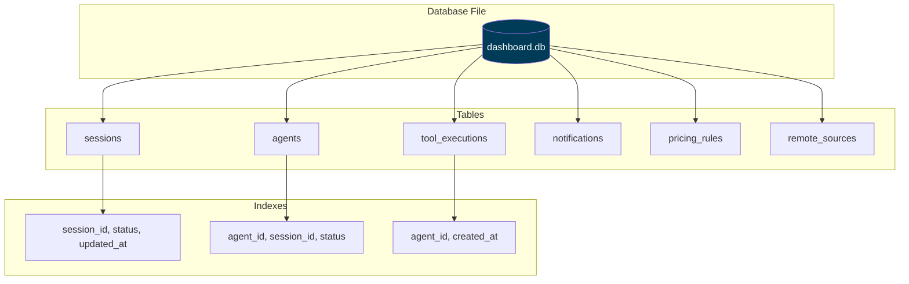

**Database Location:**
- **Canonical (default):** `~/.claude/agent-dashboard/dashboard.db` — shared by `npm start`, `npm run dev`, Docker (bind mount), and the desktop app when it uses the same data dir
- **Override:** set `DASHBOARD_DATA_DIR` (directory) or `DASHBOARD_DB_PATH` (file path) for tests or custom deployments
- **Legacy:** repo-local `./data/dashboard.db` is migrated into the canonical location on first launch (see `server/db.js`)

---

## Schema Diagram

### Entity-Relationship Diagram

```mermaid
erDiagram
    sessions ||--o{ agents : "has many"
    agents ||--o{ tool_executions : "has many"
    sessions ||--o{ notifications : "has many"
    remote_sources ||--o{ sessions : "tags (source)"
    
    sessions {
        integer id PK "Primary key"
        text session_id UK "Unique session identifier"
        text model "Raw model slug (e.g., claude-sonnet-4-5-20250514); UI displays via formatModelName()"
        text status "active | completed"
        real total_cost "Aggregated cost from all agents"
        text source "'local' or a remote_sources.id"
        text created_at "ISO8601 timestamp"
        text updated_at "ISO8601 timestamp (bumped on every hook)"
    }
    
    agents {
        integer id PK "Primary key"
        text agent_id UK "Unique agent identifier"
        text session_id FK "Foreign key to sessions"
        text agent_type "explore, task, general-purpose, etc."
        text status "running | completed | failed"
        text current_tool "Currently executing tool (or NULL)"
        integer input_tokens "Cumulative input tokens"
        integer output_tokens "Cumulative output tokens"
        real cost "Calculated cost for this agent"
        text created_at "ISO8601 timestamp"
        text updated_at "ISO8601 timestamp"
    }
    
    tool_executions {
        integer id PK "Primary key"
        text agent_id FK "Foreign key to agents"
        text tool_name "bash, view, edit, grep, etc."
        integer duration_ms "Execution time in milliseconds"
        integer success "1 = success, 0 = failure"
        text error_message "NULL if success, error details if failed"
        text created_at "ISO8601 timestamp"
    }
    
    notifications {
        integer id PK "Primary key"
        text session_id FK "Foreign key to sessions"
        text notification_type "backgroundTaskComplete, etc."
        text message "Notification message"
        text created_at "ISO8601 timestamp"
    }
    
    pricing_rules {
        integer id PK "Primary key"
        text pattern UK "Model pattern (e.g., claude-sonnet-4)"
        real input_cost_per_1m "Input cost per 1M tokens (USD)"
        real output_cost_per_1m "Output cost per 1M tokens (USD)"
        text created_at "ISO8601 timestamp"
    }

    remote_sources {
        text id PK "Remote-source id (also used as sessions.source)"
        text label "Human-readable name"
        text host "SSH destination user@host or ~/.ssh/config alias"
        integer ssh_port "Optional SSH port (NULL = SSH default)"
        text identity_file "Optional private-key path (NULL = SSH default)"
        text remote_home "Optional remote Claude home (NULL = remote ~/.claude)"
        integer enabled "1 = eligible for sync, 0 = disabled"
        text status "idle | syncing | ok | error"
        text last_error "Last failure message, or NULL"
        text last_sync_at "ISO8601 timestamp of last successful sync, or NULL"
        text last_sync_counts "JSON blob of last sync counters, or NULL"
        text created_at "ISO8601 timestamp"
        text updated_at "ISO8601 timestamp"
    }

    plans ||--o{ plan_items : "has many"
    sessions ||--o| session_focus : "declares focus"

    plans {
        text cwd PK "Working directory holding AGENT-PLAN.md"
        text title "First markdown heading"
        text file_path "Absolute path to the ingested AGENT-PLAN.md"
        text content_hash "Change fingerprint of the last ingest"
        integer item_count "Items parsed on the last ingest"
        text missing_at "Stamped when the file disappears (row kept), or NULL"
        text created_at "ISO8601 timestamp"
        text updated_at "ISO8601 timestamp"
    }

    plan_items {
        text cwd PK "FK to plans (composite PK with item_number)"
        integer item_number PK "The file's own item number"
        text text "Item text"
        text acceptance "Optional acceptance note, or NULL"
        integer checked "Mirrors the file's checkbox (human-owned)"
        integer position "File order"
        text declared_done_at "Agent's focus-done claim, or NULL"
        text declared_done_session "Declaring session id (no FK — audit trail)"
        text updated_at "ISO8601 timestamp"
    }

    session_focus {
        text session_id PK "FK to sessions, ON DELETE CASCADE"
        text cwd "Working directory whose plan the item belongs to"
        integer item_number "Declared plan item, or NULL"
        text note "Optional note from focus set, or NULL"
        text set_at "When the current item was declared"
        text detour_stack "JSON stack of in-flight detours (depth cap 10)"
        text drift_status "NULL | ok | drift | unknown (auditor-owned)"
        text drift_reason "Auditor's one-line justification, or NULL"
        text drift_checked_at "ISO8601 timestamp, or NULL"
        text updated_at "ISO8601 timestamp"
    }

    sessions ||--o| focus_inferences : "has inferred focus"

    focus_inferences {
        text session_id PK "FK to sessions, ON DELETE CASCADE"
        text cwd "Working directory whose plan the session was classified against"
        text kind "item, detour or unclassified"
        text item_id "Matched plan item's stable id, or NULL"
        text label "Generated detour title, or NULL"
        real confidence "Classifier confidence 0..1, or NULL"
        text method "llm or heuristic"
        text reason "Classifier's one-line justification, or NULL"
        text inferred_at "ISO8601 stamp of the verdict"
    }

    focus_summaries {
        text cache_key PK "Scope+window request identity of GET /api/focus-report/summary"
        text input_digest "Hash of the summary-relevant report slice - gates cache reuse"
        text bullets "JSON array of 2-4 stakeholder-readable bullet strings"
        text model "LLM model that produced it, e.g. haiku"
        text created_at "ISO8601 stamp of the synthesis"
    }

    focus_summary_access_log {
        integer id PK "Autoincrement"
        text cache_key "Same identity space as focus_summaries.cache_key"
        text level "window or day"
        text outcome "hit or miss"
        text project_id "Scope, or NULL"
        text session_id "Scope, or NULL"
        integer unassigned "Scope flag, 0 or 1"
        text model "LLM model, or NULL"
        integer bullet_count "Bullets in the resolved summary, or NULL"
        text access_day "UTC calendar day, reference only - queries use accessed_at range"
        text accessed_at "ISO8601 stamp of the resolution"
    }
```

### Relationship Cardinality

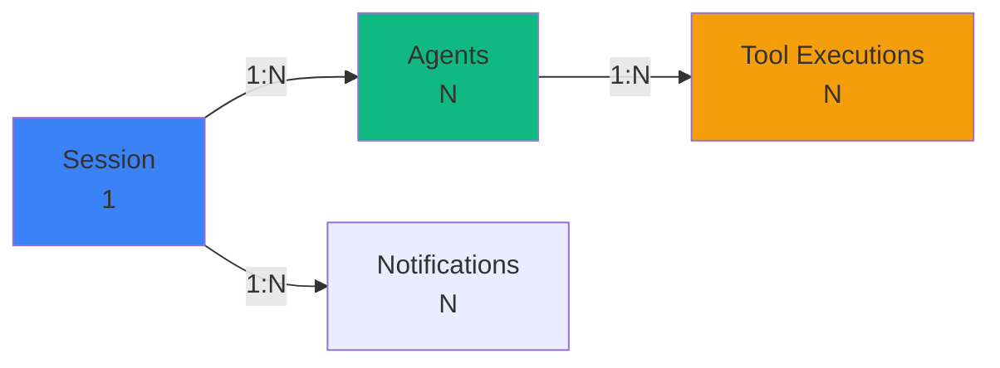

---

## Table Definitions

### sessions

Tracks Claude Code sessions (one per CLI invocation or background task). Schema mirrors `server/db.js`.

```sql
CREATE TABLE sessions (
    id TEXT PRIMARY KEY,                                              -- UUID from Claude Code
    name TEXT,
    status TEXT NOT NULL DEFAULT 'active'
        CHECK (status IN ('active','completed','error','abandoned')),
    cwd TEXT,
    model TEXT,
    started_at TEXT NOT NULL DEFAULT (strftime('%Y-%m-%dT%H:%M:%fZ','now')),
    ended_at TEXT,
    metadata TEXT,
    updated_at TEXT NOT NULL DEFAULT (strftime('%Y-%m-%dT%H:%M:%fZ','now')),
    awaiting_input_since TEXT,                                        -- NULL unless Waiting
    awaiting_reason TEXT,                                             -- notification|stop|session_start|interrupted|subagent|shell|monitor, or NULL
    transcript_path TEXT,                                             -- absolute path to JSONL transcript
    source TEXT NOT NULL DEFAULT 'local'                              -- data source: 'local' or a remote_sources.id
);
```

**Columns:**

| Column | Type | Nullable | Description |
|--------|------|----------|-------------|
| `id` | TEXT | NO | Session UUID (assigned by Claude Code) |
| `name` | TEXT | YES | Human-readable label. Synced from the transcript title by `routes/hooks.js` (and the 15 s watchdog) on every event: the `custom-title` line (`/rename`, `claude -n`, picker `Ctrl+R`) always wins, otherwise the auto-generated `ai-title` fills a placeholder/auto name, otherwise the session's first user prompt (60-char label) fills it. Falls back to `Session <id8>` |
| `status` | TEXT | NO | `active`, `completed`, `error`, or `abandoned` (CHECK-constrained). Besides the `SessionEnd` hook, the 15 s watchdog's **liveness reap** also lands `active` → `completed` when no running `claude` process has the session's `cwd` (a `SessionEnd` lost while the dashboard was down); gated by `DASHBOARD_LIVENESS_IDLE_SECONDS`, disabled via `DASHBOARD_LIVENESS_PROBE=0`. Sessions with a non-`local` `source` (Remote Data Sources) are exempt from the reap and both stale sweeps — their status is reconciled from the SSH mirror by `remote-sync.js` instead |
| `cwd` | TEXT | YES | Working directory the CLI was launched from |
| `model` | TEXT | YES | Claude model ID (e.g. `claude-opus-4-7`) |
| `started_at` | TEXT | NO | ISO 8601 timestamp |
| `ended_at` | TEXT | YES | ISO 8601 timestamp on terminal transition |
| `metadata` | TEXT | YES | JSON blob for extras (turn duration totals, thinking blocks, …) |
| `updated_at` | TEXT | NO | Bumped on every event for staleness detection |
| `awaiting_input_since` | TEXT | YES | ISO 8601 stamp set when the session is **Waiting** (Stop, SessionStart with source `startup`/`resume`/`clear`, permission Notification, or watchdog user-interrupt/Esc recovery). NULL otherwise. A SessionStart with source `compact` (auto-compaction fires mid-turn while Claude is working) leaves this column untouched, so a genuinely-active session is not mislabeled Waiting. A Stop that lands while a subagent is still `working` proactively stamps this too (reason `subagent`) rather than staying silent |
| `awaiting_reason` | TEXT | YES | Why the row is waiting: `notification`, `stop`, `session_start`, `interrupted`, `subagent`, `shell`, or `monitor`. Set/cleared in lock-step with `awaiting_input_since` (SessionStart→`session_start`, Stop→`stop` (or `subagent` when a subagent fleet is still working — downgraded to `stop` by the last SubagentStop once it drains), Notification→ re-derived by `classifyWaitingReason`: a permission/approval-worded message→`notification`, else a working subagent→`subagent`, else `current_tool==='Bash'`→`shell`, else `current_tool==='Monitor'`→`monitor`, else `notification`; watchdog/Esc recovery→`interrupted`). NULL otherwise. `subagent`/`shell`/`monitor` mean "still actively working via a child", NOT blocked on the human. Exception: a `compact`-source SessionStart preserves the existing value (neither stamps `session_start` nor clears it) |
| `transcript_path` | TEXT | YES | Absolute path to the session's JSONL transcript. Written by `routes/hooks.js` on the first event that carries it (subsequent events no-op via a SQL guard) and read by the periodic compaction sweep — so the sweep touches only active session rows instead of scanning the entire `events` table for `json_extract(data,'$.transcript_path')`. Backfilled once from `events` by the `db.js` migration |
| `source` | TEXT | NO | Data source this session was captured from. `'local'` for this machine's own Claude Code history (the default); otherwise the `remote_sources.id` of the remote SSH machine it was pulled from. Powers the `sources` query filter on `/api/sessions`, `/api/events`, `/api/agents`, `/api/stats`, and `/api/analytics`, and the `sources` facet on `/api/sessions/facets`. Indexed by `idx_sessions_source` |

**Constraints:**
- `status` must be one of the four enum values
- `awaiting_input_since` is ignored on non-`active` sessions for UI bucketing

**Lifecycle:**

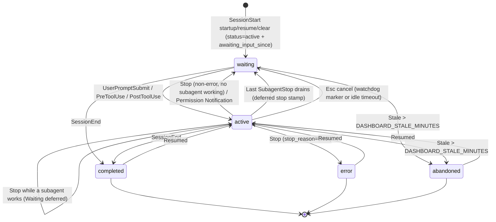

---

### agents

Tracks main agents and subagents within a session. Main agents have id `${session_id}-main`; subagents get a fresh UUID.

```sql
CREATE TABLE agents (
    id TEXT PRIMARY KEY,
    session_id TEXT NOT NULL,
    name TEXT NOT NULL,
    type TEXT NOT NULL DEFAULT 'main' CHECK (type IN ('main','subagent')),
    subagent_type TEXT,
    status TEXT NOT NULL DEFAULT 'idle'
        CHECK (status IN ('idle','connected','working','completed','error')),
    task TEXT,
    current_tool TEXT,
    started_at TEXT NOT NULL DEFAULT (strftime('%Y-%m-%dT%H:%M:%fZ','now')),
    ended_at TEXT,
    parent_agent_id TEXT,
    metadata TEXT,
    updated_at TEXT NOT NULL DEFAULT (strftime('%Y-%m-%dT%H:%M:%fZ','now')),
    awaiting_input_since TEXT,                                        -- main-agent waiting flag
    awaiting_reason TEXT,                                             -- notification|stop|session_start|interrupted|subagent|shell|monitor, or NULL
    FOREIGN KEY (session_id) REFERENCES sessions(id) ON DELETE CASCADE,
    FOREIGN KEY (parent_agent_id) REFERENCES agents(id) ON DELETE SET NULL
);
```

**Columns:**

| Column | Type | Nullable | Description |
|--------|------|----------|-------------|
| `id` | TEXT | NO | UUID (subagents) or `${session_id}-main` (main agent) |
| `session_id` | TEXT | NO | FK to `sessions.id`, cascades on delete |
| `name` | TEXT | NO | Display label (e.g. `Main Agent - {session name}` or subagent description) |
| `type` | TEXT | NO | `main` or `subagent` |
| `subagent_type` | TEXT | YES | `Explore`, `general-purpose`, `code-review`, `compaction`, … |
| `status` | TEXT | NO | `idle`, `connected`, `working`, `completed`, `error` (CHECK-constrained). The dashboard's **Waiting** badge is the UI overlay produced by `awaiting_input_since`; it is not a persisted status |
| `task` | TEXT | YES | Subagent prompt / brief |
| `current_tool` | TEXT | YES | Tool currently running (cleared on `PostToolUse`) |
| `parent_agent_id` | TEXT | YES | FK to the spawning agent for nested subagent trees (`ON DELETE SET NULL`). Set to the main agent at insert, then repointed to the true spawner by `reconcileSubagentParents` from each subagent transcript's Task tool result (`toolUseResult.agentId`), so subagents-of-subagents nest correctly instead of flattening under main |
| `metadata` | TEXT | YES | JSON blob for extras. For subagents it carries `model` (the subagent's own model, issue #185) and `tokens` — an array of per-agent token buckets parsed from the subagent's transcript. The agent-list endpoints price `tokens` at the current rates to attach a per-agent `cost` (so a subagent card shows its OWN cost, not the session total). Empty `[]` means the subagent did no billable work; absent means its transcript wasn't available to parse |
| `awaiting_input_since` | TEXT | YES | Mirrors the parent session's flag for the main agent. NULL on subagents |
| `awaiting_reason` | TEXT | YES | Why the row is waiting: `notification`, `stop`, `session_start`, `interrupted`, `subagent`, `shell`, or `monitor` (the last three mean "still actively working via a child", NOT blocked on the human). Set/cleared in lock-step with `awaiting_input_since`; explains why the main agent is waiting. NULL on subagents |

**Lifecycle:**

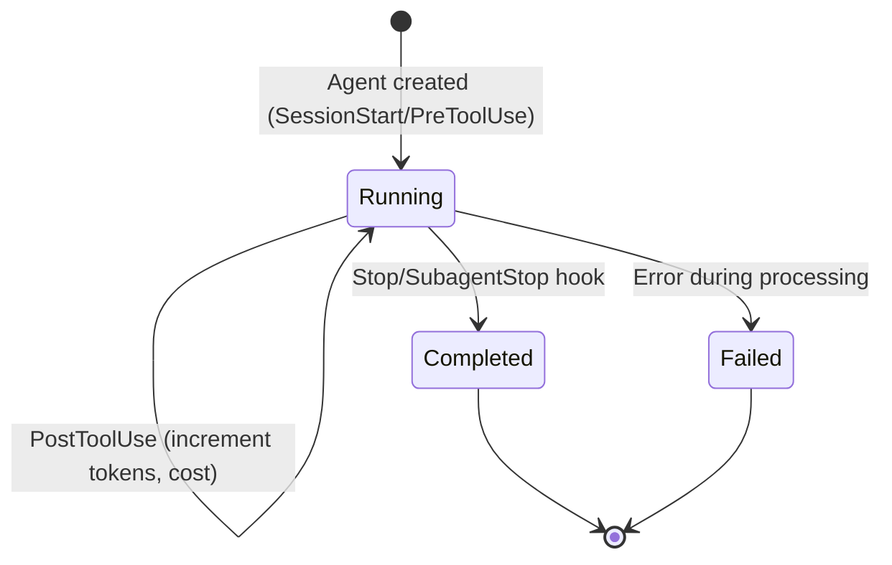

**current_tool Behavior:**
- Set to tool name on `PreToolUse` hook (e.g., `"bash"`, `"view"`)
- Cleared to `NULL` on `PostToolUse` hook
- Used to show real-time tool execution in UI

---

### tool_executions

Records each tool call made by agents.

```sql
CREATE TABLE tool_executions (
    id INTEGER PRIMARY KEY AUTOINCREMENT,
    agent_id TEXT NOT NULL,
    tool_name TEXT NOT NULL,
    duration_ms INTEGER,
    success INTEGER DEFAULT 1,
    error_message TEXT,
    created_at TEXT DEFAULT (datetime('now')),
    FOREIGN KEY (agent_id) REFERENCES agents(agent_id)
);
```

**Columns:**

| Column | Type | Nullable | Description |
|--------|------|----------|-------------|
| `id` | INTEGER | NO | Auto-increment primary key |
| `agent_id` | TEXT | NO | Foreign key to `agents.agent_id` |
| `tool_name` | TEXT | NO | Tool name (`bash`, `view`, `edit`, `grep`, etc.) |
| `duration_ms` | INTEGER | YES | Execution time in milliseconds |
| `success` | INTEGER | NO | 1 = success, 0 = failure |
| `error_message` | TEXT | YES | NULL if success, error details if failed |
| `created_at` | TEXT | NO | ISO8601 timestamp of execution |

**Common Tool Names:**
- `bash` - Shell command execution
- `view` - File/directory viewing
- `edit` - File editing
- `grep` - Code search
- `glob` - File pattern matching
- `task` - Sub-agent invocation
- `sql` - SQLite query execution

**Duration Distribution:**

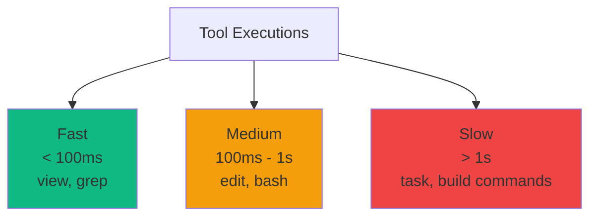

---

### notifications

Stores system notifications from Claude Code.

```sql
CREATE TABLE notifications (
    id INTEGER PRIMARY KEY AUTOINCREMENT,
    session_id TEXT NOT NULL,
    notification_type TEXT NOT NULL,
    message TEXT,
    created_at TEXT DEFAULT (datetime('now')),
    FOREIGN KEY (session_id) REFERENCES sessions(session_id)
);
```

**Columns:**

| Column | Type | Nullable | Description |
|--------|------|----------|-------------|
| `id` | INTEGER | NO | Auto-increment primary key |
| `session_id` | TEXT | NO | Foreign key to `sessions.session_id` |
| `notification_type` | TEXT | NO | Type of notification |
| `message` | TEXT | YES | Notification message content |
| `created_at` | TEXT | NO | ISO8601 timestamp |

**Common Notification Types:**
- `backgroundTaskComplete` - Background agent finished
- `errorOccurred` - Error during execution
- `systemMessage` - General system message

---

### model_pricing

Per-model pricing rules for cost calculation, keyed by `model_pattern` (a SQL-style glob; `%` matches any characters). Rates are per **million** tokens (USD).

```sql
CREATE TABLE model_pricing (
    model_pattern TEXT PRIMARY KEY,
    display_name TEXT NOT NULL,
    input_per_mtok REAL NOT NULL DEFAULT 0,
    output_per_mtok REAL NOT NULL DEFAULT 0,
    cache_read_per_mtok REAL NOT NULL DEFAULT 0,
    cache_write_per_mtok REAL NOT NULL DEFAULT 0,
    cache_write_1h_per_mtok REAL NOT NULL DEFAULT 0,   -- 1h-ephemeral cache-write tier
    fast_input_per_mtok REAL NOT NULL DEFAULT 0,       -- fast-mode premium rates
    fast_output_per_mtok REAL NOT NULL DEFAULT 0,
    -- Time-limited introductory (promo) rates. When intro_until is set, usage on
    -- or before that date (YYYY-MM-DD) is priced at the intro_* rates and usage
    -- after it at the standard rates. All 0 / NULL = no promo.
    intro_input_per_mtok REAL NOT NULL DEFAULT 0,
    intro_output_per_mtok REAL NOT NULL DEFAULT 0,
    intro_cache_read_per_mtok REAL NOT NULL DEFAULT 0,
    intro_cache_write_per_mtok REAL NOT NULL DEFAULT 0,
    intro_cache_write_1h_per_mtok REAL NOT NULL DEFAULT 0,
    intro_until TEXT,                                   -- promo cutoff YYYY-MM-DD, or NULL
    updated_at TEXT NOT NULL DEFAULT (strftime('%Y-%m-%dT%H:%M:%fZ','now'))
);
```

**Columns (highlights):**

| Column | Type | Nullable | Description |
|--------|------|----------|-------------|
| `model_pattern` | TEXT | NO | Primary key. SQL-style glob (e.g. `claude-opus-4-7%`, `claude-%-haiku`). Rules are matched longest-pattern-first |
| `display_name` | TEXT | NO | Human-readable model name shown in Settings |
| `input_per_mtok` / `output_per_mtok` | REAL | NO | Standard input / output rate per 1M tokens |
| `cache_read_per_mtok` / `cache_write_per_mtok` / `cache_write_1h_per_mtok` | REAL | NO | Cache read + 5m/1h cache-write rates |
| `fast_input_per_mtok` / `fast_output_per_mtok` | REAL | NO | Fast-mode premium rates (0 = no premium) |
| `intro_*_per_mtok` | REAL | NO | Introductory (promo) rates, mirroring the standard fields |
| `intro_until` | TEXT | YES | Promo cutoff `YYYY-MM-DD`. Usage on/before it uses the intro rates; NULL = no promo. Editable per-rule in Settings |
| `updated_at` | TEXT | NO | ISO8601 timestamp of the last edit |

Standard rates and intro rates are edited independently: the pricing update path writes intro columns only when the caller sends intro fields, so a standard-rate edit never disturbs a promo (and vice versa). Clearing `intro_until` also zeroes the intro rates.

**Example default rule (Claude Sonnet 5, with its launch promo):**

| Pattern | Input | Output | Intro Input | Intro Output | Intro Until |
|---------|-------|--------|-------------|--------------|-------------|
| `claude-sonnet-5%` | $3.00 | $15.00 | $2.00 | $10.00 | `2026-08-31` |

---

### remote_sources

Config for remote SSH machines the dashboard pulls Claude Code history from, so a single dashboard can consolidate sessions from several machines. **No secrets are stored** — SSH authentication defers entirely to the host's SSH stack (ssh-agent, `~/.ssh/config`, key files). Each row's `id` is used as the `source` value on every session imported from that machine (see `sessions.source`).

```sql
CREATE TABLE remote_sources (
    id TEXT PRIMARY KEY,
    label TEXT NOT NULL,
    host TEXT NOT NULL,
    ssh_port INTEGER,
    identity_file TEXT,
    remote_home TEXT,
    enabled INTEGER NOT NULL DEFAULT 1,
    status TEXT NOT NULL DEFAULT 'idle'
        CHECK (status IN ('idle','syncing','ok','error')),
    last_error TEXT,
    last_sync_at TEXT,
    last_sync_counts TEXT,
    created_at TEXT DEFAULT (strftime('%Y-%m-%dT%H:%M:%fZ','now')),
    updated_at TEXT DEFAULT (strftime('%Y-%m-%dT%H:%M:%fZ','now'))
);
```

**Columns:**

| Column | Type | Nullable | Description |
|--------|------|----------|-------------|
| `id` | TEXT | NO | Primary key. Also used as `sessions.source` for sessions pulled from this machine |
| `label` | TEXT | NO | Human-readable name shown in the UI |
| `host` | TEXT | NO | SSH destination (`user@host`) or a `~/.ssh/config` alias |
| `ssh_port` | INTEGER | YES | Optional SSH port; NULL defers to the SSH default / `~/.ssh/config` |
| `identity_file` | TEXT | YES | Optional private-key path passed to ssh (`-i`); NULL to omit |
| `remote_home` | TEXT | YES | Optional remote Claude home to read transcripts from; NULL defaults to remote `~/.claude` |
| `enabled` | INTEGER | NO | `1` = eligible for scheduled/manual syncs, `0` = disabled (default `1`) |
| `status` | TEXT | NO | Last sync status: `idle`, `syncing`, `ok`, or `error` (CHECK-constrained) |
| `last_error` | TEXT | YES | Error message from the last failed sync/test, or NULL |
| `last_sync_at` | TEXT | YES | ISO 8601 timestamp of the last successful sync, or NULL |
| `last_sync_counts` | TEXT | YES | JSON blob of the last sync's counters (imported/skipped/backfilled/errors/sessions_seen/sessions_tagged), or NULL |
| `created_at` | TEXT | YES | ISO 8601 creation timestamp |
| `updated_at` | TEXT | YES | ISO 8601 timestamp of the last edit |

Managed through the `/api/remote-sources/*` routes; sync/status changes are broadcast over the WebSocket as `remote_source.status`. See [docs/API.md → Remote Data Sources](./API.md#remote-data-sources).

---

### dashboard_layout

Global Kanban Board "Projects" view monitor layout — a **singleton row** (`id` pinned to `1`, enforced by the `CHECK`), not per-user: this app has no accounts, so the row holds the one layout every computer connected to the dashboard reads and writes. Three JSON blobs mirror the client's `MonitorLayoutPayload` shape (camelCase in the JSON, matching the wire format — the columns themselves are snake_case).

```sql
CREATE TABLE dashboard_layout (
    id INTEGER PRIMARY KEY CHECK (id = 1),
    monitors TEXT NOT NULL DEFAULT '[]',
    monitor_map TEXT NOT NULL DEFAULT '{}',
    collapsed_projects TEXT NOT NULL DEFAULT '{}',
    updated_at TEXT NOT NULL DEFAULT (strftime('%Y-%m-%dT%H:%M:%fZ', 'now'))
);
```

**Columns:**

| Column | Type | Nullable | Description |
|--------|------|----------|-------------|
| `id` | INTEGER | NO | Primary key, always `1` (CHECK-constrained singleton) |
| `monitors` | TEXT | NO | JSON array of `{ id, name, collapsed?, orientation?, wrap? }` — the monitor swimlanes, in display order. `wrap` is one of `"*"`/`"1"`/`"2"`/`"3"`/`"4"` (absent/`"*"` = no fixed wrap), capping how many project columns land per row/column before wrapping, independently of `orientation` |
| `monitor_map` | TEXT | NO | JSON object mapping a project id to the monitor id it's assigned to; a project id absent from the map is ungrouped |
| `collapsed_projects` | TEXT | NO | JSON object mapping a project id (or `__unassigned__`) to its collapsed state |
| `updated_at` | TEXT | NO | ISO 8601 timestamp of the last edit |

Managed through the `/api/monitors` route (`GET`/`PUT`); every `PUT` is broadcast over the WebSocket as `monitors_updated` so other connected clients pick up the change live. See [docs/API.md → Monitors](./API.md#monitors).

---

### color_thresholds

Global Usage-page color thresholds — a **singleton row** (`id` pinned to `1`, enforced by the `CHECK`), not per-user: this app has no accounts, so the row holds the one setting every computer connected to the dashboard reads and writes. Controls where the green/yellow/orange/red bands fall for every percentage-driven color on the Usage page (session/weekly rate-limit bars, the session-reset marker, the "capped by weekly" callout). Two independent scopes, `session` and `weekly`, since the session (5h) window and the weekly window are separate quotas that shouldn't have to share one ramp.

```sql
CREATE TABLE color_thresholds (
    id INTEGER PRIMARY KEY CHECK (id = 1),
    session_yellow_at REAL NOT NULL DEFAULT 50,
    session_orange_at REAL NOT NULL DEFAULT 80,
    session_red_at REAL NOT NULL DEFAULT 100,
    weekly_yellow_at REAL NOT NULL DEFAULT 50,
    weekly_orange_at REAL NOT NULL DEFAULT 80,
    weekly_red_at REAL NOT NULL DEFAULT 100,
    updated_at TEXT NOT NULL DEFAULT (strftime('%Y-%m-%dT%H:%M:%fZ', 'now'))
);
```

**Columns:**

| Column | Type | Nullable | Description |
|--------|------|----------|-------------|
| `id` | INTEGER | NO | Primary key, always `1` (CHECK-constrained singleton) |
| `session_yellow_at` / `session_orange_at` / `session_red_at` | REAL | NO | Percentage each band STARTS at for the session (5h) window; below `session_yellow_at` always renders green |
| `weekly_yellow_at` / `weekly_orange_at` / `weekly_red_at` | REAL | NO | Same, for the weekly window |
| `updated_at` | TEXT | NO | ISO 8601 timestamp of the last edit |

Managed through the `/api/color-thresholds` route (`GET`/`PUT`); every `PUT` is broadcast over the WebSocket as `color_thresholds_updated` so other connected clients pick up the change live. See [docs/API.md → Color Thresholds](./API.md#color-thresholds).

---

### playbook_practice_config / coach_observations

The Coach's Playbook. `playbook_practice_config` holds each practice's user-editable, server-shared config (a practice with no row is enabled with its catalog-defined defaults — `server/lib/playbook/practices.js` — so shipping a new practice never needs a migration or seed). `coach_observations` holds what the Playbook engine (`server/lib/playbook/engine.js`) actually detected.

```sql
CREATE TABLE IF NOT EXISTS playbook_practice_config (
    practice_id TEXT PRIMARY KEY,
    enabled INTEGER NOT NULL DEFAULT 1,
    config TEXT NOT NULL DEFAULT '{}',
    updated_at TEXT NOT NULL DEFAULT (strftime('%Y-%m-%dT%H:%M:%fZ', 'now'))
);

CREATE TABLE IF NOT EXISTS coach_observations (
    id INTEGER PRIMARY KEY AUTOINCREMENT,
    practice_id TEXT NOT NULL,
    scope_type TEXT NOT NULL CHECK(scope_type IN ('session','project','global')),
    scope_id TEXT,
    kind TEXT NOT NULL CHECK(kind IN ('risk','info','good')),
    severity TEXT NOT NULL,
    values_json TEXT NOT NULL DEFAULT '{}',
    status TEXT NOT NULL DEFAULT 'open' CHECK(status IN ('open','acknowledged','dismissed','resolved')),
    detected_at TEXT NOT NULL DEFAULT (strftime('%Y-%m-%dT%H:%M:%fZ', 'now')),
    responded_at TEXT
);
CREATE INDEX IF NOT EXISTS idx_coach_observations_open
    ON coach_observations (practice_id, scope_type, scope_id, status);
```

**Columns:**

| Column | Type | Nullable | Description |
|--------|------|----------|-------------|
| `playbook_practice_config.practice_id` | TEXT | NO | Primary key; matches a catalog practice's `id` (e.g. `session-token-ceiling`) |
| `playbook_practice_config.enabled` | INTEGER | NO | `0`/`1` — a disabled practice is never evaluated by the engine |
| `playbook_practice_config.config` | TEXT | NO | JSON blob of `{ fieldKey: number }` overrides, validated against that practice's own `fields` schema at the route layer, not here |
| `coach_observations.scope_type` / `scope_id` | TEXT | scope_id: YES | What the practice fired for — `session`/`project`/`global` and the matching id (`session_id` for a session-scoped practice; `scope_id` is `NULL` for a global-scoped practice, e.g. `account-weekly-balance`, since it isn't about any one session) |
| `coach_observations.kind` | TEXT | NO | `risk`/`info`/`good` — separate from `severity` so the Coach can recognize positive patterns, not just flag problems |
| `coach_observations.values_json` | TEXT | NO | JSON payload a client-side i18n template (keyed by `practice_id`) interpolates into display copy — this app has no server-side i18n, so no English text lives on the row |
| `coach_observations.status` | TEXT | NO | `open`/`acknowledged`/`dismissed`/`resolved`; the `idx_coach_observations_open` index is the engine's dedup lookup — a practice+scope with an already-`open` row never re-fires |

Managed through `/api/playbook/practices[/:id/config]` and `/api/coach/observations[/:id/respond]`; writes broadcast `playbook_practice_config_updated` / `coach_observation_created` / `coach_observation_updated` over the WebSocket. See [docs/API.md → Playbook](./API.md#playbook) and [→ Coach](./API.md#coach).

---

### projects / project_paths

A user-named grouping of one or more session working directories. `sessions` carries **no** `project_id` column — project membership is derived by joining `sessions.cwd` against `project_paths.cwd` at query time, so a session (existing or newly imported) retroactively belongs to a project the instant its folder is mapped, with no backfill required. A folder belongs to at most one project (`project_paths.cwd` is `UNIQUE`); a project may claim many folders.

```sql
CREATE TABLE projects (
    id TEXT PRIMARY KEY,
    name TEXT NOT NULL,
    created_at TEXT NOT NULL DEFAULT (strftime('%Y-%m-%dT%H:%M:%fZ','now')),
    updated_at TEXT NOT NULL DEFAULT (strftime('%Y-%m-%dT%H:%M:%fZ','now')),
    pinned INTEGER NOT NULL DEFAULT 0
);

CREATE TABLE project_paths (
    id INTEGER PRIMARY KEY AUTOINCREMENT,
    project_id TEXT NOT NULL,
    cwd TEXT NOT NULL UNIQUE,
    created_at TEXT NOT NULL DEFAULT (strftime('%Y-%m-%dT%H:%M:%fZ','now')),
    FOREIGN KEY (project_id) REFERENCES projects(id) ON DELETE CASCADE
);
```

**`projects` columns:**

| Column | Type | Nullable | Description |
|--------|------|----------|-------------|
| `id` | TEXT | NO | Primary key (UUID) |
| `name` | TEXT | NO | User-assigned display name |
| `created_at` | TEXT | NO | ISO 8601 creation timestamp |
| `updated_at` | TEXT | NO | ISO 8601 timestamp of the last rename or pin/unpin |
| `pinned` | INTEGER | NO | `0`/`1` boolean. `1` floats the project to the top of `GET /api/projects` (`ORDER BY pinned DESC, name COLLATE NOCASE ASC`), ahead of the regular alphabetical order. Set via `PATCH /api/projects/:id` |

**`project_paths` columns:**

| Column | Type | Nullable | Description |
|--------|------|----------|-------------|
| `id` | INTEGER | NO | Auto-increment primary key (the id passed to the remove-folder endpoint) |
| `project_id` | TEXT | NO | FK to `projects.id`, `ON DELETE CASCADE` — deleting a project drops its mappings, not its sessions |
| `cwd` | TEXT | NO | Working directory this project claims. `UNIQUE` — a folder can only belong to one project at a time |
| `created_at` | TEXT | NO | ISO 8601 timestamp the mapping was added |

Managed through the `/api/projects/*` routes. Every project mutation (create, rename, folder add/remove, delete) is plain CRUD, not broadcast over the WebSocket — re-fetched by the client after each mutation like `webhook_targets`. See [docs/API.md → Projects](./API.md#projects).

---

### plans / plan_items

Per-repo project plans mirrored from `<cwd>/AGENT-PLAN.md` (Plan-Aware Monitoring). Keyed by cwd — like sessions, plans have no `project_id`; a project's plans aggregate through the `project_paths` join. The file is the single source of truth, human-owned: `checked` mirrors its checkbox, while `declared_done_*` records the agent's `ccam focus done N` claim and `target_date` (an optional human-set `YYYY-MM-DD`, layer 5 pace tracking) is authored out-of-band via `POST /api/plans/items/target` / `ccam focus target` — all three survive re-ingest (`upsertPlanItem`'s `SET` clause never touches them). The dashboard now appends real content to the file itself through one audited path (`server/lib/plan-writeback.js`) when a layer-4 detour disposition is `fold_in`/`new_item`, then re-runs this same ingest — `plan_items` keeps exactly one writer either way. A plan file that disappears stamps `plans.missing_at` and keeps the row, because focus history still references its items; a file that parses to zero items keeps the last good state (far more likely a human mid-edit than an intentional wipe).

```sql
CREATE TABLE plans (
    cwd TEXT PRIMARY KEY,
    title TEXT,
    file_path TEXT NOT NULL,
    content_hash TEXT,
    item_count INTEGER NOT NULL DEFAULT 0,
    missing_at TEXT,
    created_at TEXT NOT NULL DEFAULT (strftime('%Y-%m-%dT%H:%M:%fZ','now')),
    updated_at TEXT NOT NULL DEFAULT (strftime('%Y-%m-%dT%H:%M:%fZ','now'))
);

CREATE TABLE plan_items (
    cwd TEXT NOT NULL,
    item_number INTEGER NOT NULL,
    text TEXT NOT NULL,
    acceptance TEXT,
    checked INTEGER NOT NULL DEFAULT 0,
    position INTEGER NOT NULL DEFAULT 0,
    declared_done_at TEXT,
    declared_done_session TEXT,
    updated_at TEXT NOT NULL DEFAULT (strftime('%Y-%m-%dT%H:%M:%fZ','now')),
    PRIMARY KEY (cwd, item_number),
    FOREIGN KEY (cwd) REFERENCES plans(cwd) ON DELETE CASCADE
);
```

**`plans` columns:**

| Column | Type | Nullable | Description |
|--------|------|----------|-------------|
| `cwd` | TEXT | NO | Primary key — the working directory holding `AGENT-PLAN.md` |
| `title` | TEXT | YES | The file's first markdown heading, or NULL |
| `file_path` | TEXT | NO | Absolute path of the ingested file |
| `content_hash` | TEXT | YES | Fingerprint of the last ingested content (skips no-op re-ingests) |
| `item_count` | INTEGER | NO | Number of items parsed on the last ingest |
| `missing_at` | TEXT | YES | ISO 8601 stamp set when the file disappears (row kept), or NULL |
| `created_at` | TEXT | NO | ISO 8601 creation timestamp |
| `updated_at` | TEXT | NO | ISO 8601 timestamp of the last ingest that changed anything |

**`plan_items` columns:**

| Column | Type | Nullable | Description |
|--------|------|----------|-------------|
| `cwd` | TEXT | NO | FK to `plans.cwd`, `ON DELETE CASCADE`; composite PK with `item_number` |
| `item_number` | INTEGER | NO | The file's **own** item number — the stable handle agents declare focus against |
| `text` | TEXT | NO | Item text |
| `acceptance` | TEXT | YES | Optional `acceptance:` note, or NULL |
| `checked` | INTEGER | NO | Mirrors the file's checkbox (human-owned; `1`/`0`) |
| `position` | INTEGER | NO | File order (items render in this order, not by number) |
| `declared_done_at` | TEXT | YES | When an agent declared this item done (`ccam focus done N`), or NULL. Survives re-ingest |
| `declared_done_session` | TEXT | YES | Declaring session id. **No FK on purpose** — the audit trail must outlive session deletion |
| `target_date` | TEXT | YES | Optional human-set `YYYY-MM-DD` (local calendar day, layer 5 pace tracking), authored out-of-band via `POST /api/plans/items/target` / `ccam focus target` — never parsed from the file, survives re-ingest like `declared_done_at`. See `server/lib/pace.js` |
| `updated_at` | TEXT | NO | ISO 8601 timestamp of the last change |

### session_focus

The **current** focus declaration per session: which plan item the session says it is serving, plus a stack of in-flight detours. Focus *history* is deliberately not stored here — every focus change also writes a `Focus` row to the `events` table, which the session timeline already renders (and `GET /api/sessions/:id/focus` rebuilds `history` from). The `drift_*` columns are written **only** by the background focus drift audit; declarations never touch them, so an agent cannot clear its own drift badge by re-declaring.

```sql
CREATE TABLE session_focus (
    session_id TEXT PRIMARY KEY,
    cwd TEXT,
    item_number INTEGER,
    note TEXT,
    set_at TEXT,
    detour_stack TEXT NOT NULL DEFAULT '[]',
    drift_status TEXT,
    drift_reason TEXT,
    drift_checked_at TEXT,
    updated_at TEXT NOT NULL DEFAULT (strftime('%Y-%m-%dT%H:%M:%fZ','now')),
    FOREIGN KEY (session_id) REFERENCES sessions(id) ON DELETE CASCADE
);
```

**Columns:**

| Column | Type | Nullable | Description |
|--------|------|----------|-------------|
| `session_id` | TEXT | NO | Primary key; FK to `sessions.id`, `ON DELETE CASCADE` |
| `cwd` | TEXT | YES | Working directory whose plan the declared item belongs to |
| `item_number` | INTEGER | YES | Declared plan item, or NULL (e.g. detour-only state) |
| `note` | TEXT | YES | Optional free-text note from `focus set`, or NULL |
| `set_at` | TEXT | YES | ISO 8601 stamp of when the current item was declared |
| `detour_stack` | TEXT | NO | JSON array of in-flight detours `{description, pushed_at, prior_item}` (depth cap 10) |
| `drift_status` | TEXT | YES | `NULL`, `ok`, `drift`, or `unknown` — written only by the drift auditor |
| `drift_reason` | TEXT | YES | The auditor's one-line justification, or NULL |
| `drift_checked_at` | TEXT | YES | ISO 8601 stamp of the last audit, or NULL |
| `updated_at` | TEXT | NO | ISO 8601 timestamp of the last change |

Written by the `PostToolUse` focus parsing in `routes/hooks.js` and the strict `POST /api/sessions/:id/focus` endpoint; changes broadcast over the WebSocket as `session_focus`. See [docs/API.md → Plans & Focus](./API.md#plans--focus).

### focus_inferences

The background **focus inference** classifier's verdict for sessions that never declared a focus (`server/lib/focus-inference.js`): the classifier digests a silent session's activity (prompts, files touched, commands run), matches it against the cwd's plan items, and records one row per session. The focus-time report consults this table **only** for sessions with zero declared `Focus` events — declarations are ground truth and are never overwritten or mixed with guesses. `item_id` references the plan item's *stable* id (never its display number), so a plan reorder can't re-point inferred time at the wrong item. A session that gains activity after `inferred_at` is re-classified on a later tick.

```sql
CREATE TABLE focus_inferences (
    session_id TEXT PRIMARY KEY,
    cwd TEXT NOT NULL,
    kind TEXT NOT NULL,
    item_id TEXT,
    label TEXT,
    confidence REAL,
    method TEXT NOT NULL,
    reason TEXT,
    inferred_at TEXT NOT NULL DEFAULT (strftime('%Y-%m-%dT%H:%M:%fZ','now')),
    FOREIGN KEY (session_id) REFERENCES sessions(id) ON DELETE CASCADE
);
```

**Columns:**

| Column | Type | Nullable | Description |
|--------|------|----------|-------------|
| `session_id` | TEXT | NO | Primary key; FK to `sessions.id`, `ON DELETE CASCADE` |
| `cwd` | TEXT | NO | Working directory whose plan the session was classified against |
| `kind` | TEXT | NO | `item` (matched a plan item), `detour` (real work matching no item), or `unclassified` (no confident verdict — the report keeps this an honest hole) |
| `item_id` | TEXT | YES | Matched plan item's stable `item_id` (`kind = 'item'`), or NULL |
| `label` | TEXT | YES | Short generated detour title (`kind = 'detour'`), or NULL |
| `confidence` | REAL | YES | Classifier confidence `0..1`, or NULL |
| `method` | TEXT | NO | `llm` (headless `claude -p`) or `heuristic` (keyword overlap) |
| `reason` | TEXT | YES | Classifier's one-line justification, or NULL |
| `inferred_at` | TEXT | NO | ISO 8601 stamp of the verdict; a session active after this becomes eligible for re-classification |

---

### detour_dispositions

**Layer 4**: a durable, resolvable decision about one detour — separate from `focus_inferences`' re-derivable observation, because a detour's identity does not survive re-inference of its session (one `focus_inferences` row per `session_id`, upserted every re-classification). `source` distinguishes an *inferred* detour (the classifier's guess, `source_ref` = `sessions.id`) from a *declared* one (`ccam focus bug|feature|push`, `source_ref` = `events.id`); either kind runs through the same `pending → fold_in|new_item|deliberate|discard` lifecycle. `fold_in`/`new_item` write real content into the cwd's `AGENT-PLAN.md` the moment they're decided (`server/lib/plan-writeback.js`'s `applyDisposition`) — the `write_*` audit columns and `resolved_item_id` (`plan_items.item_id`, not the integer PK, since it's the stable identity) make "which detour, which classification, when" answerable in one query in both directions. No FK on `session_id` — the audit trail must outlive session cleanup, same rule as `alert_events.session_id`. The `disposition`/`source`/`decided_by`/`write_status` `CHECK` constraints are complete as of the initial `CREATE TABLE` (SQLite cannot add a `CHECK` via `ALTER TABLE ADD COLUMN` — widening any of them later needs a full rebuild).

```sql
CREATE TABLE detour_dispositions (
    id INTEGER PRIMARY KEY AUTOINCREMENT,
    cwd TEXT NOT NULL,
    project_id TEXT,
    session_id TEXT,
    source TEXT NOT NULL CHECK(source IN ('inferred','declared')),
    source_ref TEXT NOT NULL,
    source_seen_at TEXT,
    label TEXT,
    item_id TEXT,
    disposition TEXT NOT NULL DEFAULT 'pending'
        CHECK(disposition IN ('pending','fold_in','new_item','deliberate','discard')),
    decided_by TEXT CHECK(decided_by IN ('rule','llm','human')),
    confidence REAL,
    reason TEXT,
    note TEXT,
    proposed_text TEXT,
    proposed_acceptance TEXT,
    proposed_detail TEXT,
    proposed_parent_item_id TEXT,
    write_status TEXT NOT NULL DEFAULT 'none'
        CHECK(write_status IN ('none','pending','written','failed','conflict')),
    write_attempted_at TEXT,
    write_completed_at TEXT,
    write_error TEXT,
    write_backup_path TEXT,
    write_content_hash_before TEXT,
    write_content_hash_after TEXT,
    suggested_markdown TEXT,
    resolved_item_id TEXT,
    created_at TEXT NOT NULL DEFAULT (strftime('%Y-%m-%dT%H:%M:%fZ','now')),
    resolved_at TEXT
);
```

**Columns (selected):**

| Column | Type | Nullable | Description |
|--------|------|----------|-------------|
| `id` | INTEGER | NO | Primary key, autoincrement |
| `cwd` / `session_id` | TEXT | NO/YES | The plan and (when known) session this detour belongs to |
| `project_id` | TEXT | YES | Stamped via `project_paths` (`getProjectPathByCwd`) at record time — an audit-trail convenience, no FK; lets `GET /api/detours?project_id=` and `writeback_conflict`/`writeback_failed` `decision_queue` rows resolve back to a project without a join |
| `source` / `source_ref` | TEXT | NO | `inferred` (`source_ref` = `sessions.id`) or `declared` (`source_ref` = `events.id`); unique with `cwd` so re-observation upserts in place |
| `disposition` | TEXT | NO | `pending` → one of `fold_in`/`new_item`/`deliberate`/`discard` — the verdict |
| `decided_by` | TEXT | YES | `rule`, `llm`, or `human` |
| `proposed_*` | TEXT | YES | What the rule/LLM/human decided should be added; sanitized by `plan-writeback.sanitizeLlmPlanText` before composition |
| `write_status` | TEXT | NO | `none` (nothing to write) → `pending` → `written`/`failed`/`conflict` |
| `write_backup_path` / `write_content_hash_before` / `_after` | TEXT | YES | The write audit — which backup, and the file's hash before/after |
| `resolved_item_id` | TEXT | YES | The `plan_items.item_id` this disposition created, once `write_status = 'written'` |
| `created_at` / `resolved_at` | TEXT | NO/YES | Observed vs. decided timestamps |

**Indexes:**

```sql
CREATE UNIQUE INDEX idx_detour_dispositions_src ON detour_dispositions(cwd, source, source_ref);
CREATE INDEX idx_detour_dispositions_cwd_created ON detour_dispositions(cwd, created_at);
CREATE INDEX idx_detour_dispositions_resolved_item ON detour_dispositions(resolved_item_id);
```

Managed through `/api/detours/*`; see [docs/API.md](./API.md).

---

### decision_queue

**Layer 6**: `server/lib/reconciliation.js`'s output — pace alerts, detour-volume flags, detours needing a human look, and stuck write-backs (`writeback_conflict`/`writeback_failed`, enqueued by `plan-writeback.applyDisposition` itself). Shaped like `alert_events` but deliberately separate: different audience (Sara reviewing portfolio health, not a fired alert rule) and a different trust boundary (some rows are LLM-classified). `kind`'s `CHECK` includes the write-back values from its initial `CREATE TABLE` for the same reason `detour_dispositions`' constraints do. No FK on `session_id`/`cwd` — an audit trail. `findOpenQueueItem` (`kind`+`ref_id`+`item_id`+`status='pending'`) prevents a still-unfixed condition from re-queuing every tick.

```sql
CREATE TABLE decision_queue (
    id INTEGER PRIMARY KEY AUTOINCREMENT,
    cwd TEXT,
    project_id TEXT,
    kind TEXT NOT NULL CHECK(kind IN ('pace_alert','detour_volume','detour_disposition','writeback_conflict','writeback_failed')),
    ref_id INTEGER,
    item_id TEXT,
    message TEXT NOT NULL,
    payload TEXT,
    input_digest TEXT,
    status TEXT NOT NULL DEFAULT 'pending' CHECK(status IN ('pending','resolved','dismissed')),
    created_at TEXT NOT NULL DEFAULT (strftime('%Y-%m-%dT%H:%M:%fZ','now')),
    resolved_at TEXT
);
```

**Columns:**

| Column | Type | Nullable | Description |
|--------|------|----------|-------------|
| `kind` | TEXT | NO | `pace_alert`, `detour_volume`, `detour_disposition` (needs-review), `writeback_conflict`, or `writeback_failed` |
| `ref_id` | INTEGER | YES | `detour_dispositions.id` for the detour/write-back kinds |
| `item_id` | TEXT | YES | `plan_items.item_id` for `pace_alert` |
| `message` | TEXT | NO | Plain-language, stakeholder-altitude summary |
| `payload` | TEXT | YES | JSON: rule inputs, and for write-back kinds, the attempted markdown + file hash |
| `status` | TEXT | NO | `pending` → `resolved`/`dismissed` |

**Indexes:**

```sql
CREATE INDEX idx_decision_queue_status_created ON decision_queue(status, created_at);
```

Managed through `/api/decision-queue/*` and `ccam decisions`; see [docs/API.md](./API.md).

---

### focus_summaries

Cached stakeholder-readable **window summaries** for `GET /api/focus-report/summary` (`server/lib/focus-summary.js`): 2–4 plain-language bullets synthesized by a one-shot LLM call from a report window's per-session focus segments. `cache_key` identifies the full scope+window request (project/session/unassigned/sources + from/to); `input_digest` hashes the summary-relevant report data, so a cached row is served only while the underlying data is unchanged — a finished day is generated exactly once and served forever, while a still-running day regenerates whenever new activity lands in the window. Generated on request, not by a background service; no FK — a summary describes a window, not one session.

```sql
CREATE TABLE focus_summaries (
    cache_key TEXT PRIMARY KEY,
    input_digest TEXT NOT NULL,
    bullets TEXT NOT NULL,
    model TEXT,
    created_at TEXT NOT NULL DEFAULT (strftime('%Y-%m-%dT%H:%M:%fZ','now'))
);
```

**Columns:**

| Column | Type | Nullable | Description |
|--------|------|----------|-------------|
| `cache_key` | TEXT | NO | Primary key; JSON string of the resolved scope+window request identity (`project_id`/`session_id`/`unassigned`/`sources`/`from`/`to`) |
| `input_digest` | TEXT | NO | SHA-1 of the summary-relevant report slice (per-session segment kinds/labels/reasons/times) — a mismatch on read triggers regeneration |
| `bullets` | TEXT | NO | JSON array of 2–4 stakeholder-readable bullet strings |
| `model` | TEXT | YES | The `claude -p` model that produced it (`DASHBOARD_FOCUS_SUMMARY_MODEL`, falling back to `DASHBOARD_FOCUS_INFER_MODEL`, then `haiku`) |
| `created_at` | TEXT | NO | ISO 8601 stamp of the synthesis (cache write time) |

---

### focus_summary_access_log

Access-history audit trail for the `focus_summaries` cache above, one row per hit-or-miss resolution (`server/lib/focus-summary.js`'s `recordAccess`, called from `generateDirectSummary`/`generateHierarchicalSummary`/`generateWindowSummary`). `focus_summaries` itself only holds the *current* row per `cache_key`, with no history — this table is what backs the Settings → Focus Summaries section's day timeline (`GET /api/settings/cache/timeline`) and per-day drill-down (`GET /api/settings/cache/day`). Both routes filter by an exact `accessed_at` instant range (`?from=&to=`) that the client computes from its own local midnight boundaries and bucket client-side into the viewer's local calendar day — `access_day` is written for reference but is not what those routes query by, since day bucketing depends on the viewer's timezone, which only the browser knows. `level` distinguishes a whole requested window (project/session/unassigned scope + from/to) from a per-day building block inside the hierarchical rollup path — both are independently-cacheable decisions worth logging. No FK, like `alert_events`/`webhook_deliveries` — an audit trail independent of the sessions/projects it describes. Retention follows the Data section's `purge_days` (`POST /api/settings/cleanup`); `POST /api/settings/clear-data` wipes it entirely. Neither purge touches `focus_summaries` itself — a finished cached summary is meant to be kept.

```sql
CREATE TABLE focus_summary_access_log (
    id INTEGER PRIMARY KEY AUTOINCREMENT,
    cache_key TEXT NOT NULL,
    level TEXT NOT NULL CHECK(level IN ('window','day')),
    outcome TEXT NOT NULL CHECK(outcome IN ('hit','miss')),
    project_id TEXT,
    session_id TEXT,
    unassigned INTEGER NOT NULL DEFAULT 0,
    model TEXT,
    bullet_count INTEGER,
    access_day TEXT NOT NULL,
    accessed_at TEXT NOT NULL
);
```

**Columns:**

| Column | Type | Nullable | Description |
|--------|------|----------|-------------|
| `id` | INTEGER | NO | Primary key, autoincrement |
| `cache_key` | TEXT | NO | Same identity space as `focus_summaries.cache_key` (a window request or a `dayCacheKey` building block). JSON: `{...scope, from, to}` for `level='window'`, `{day, scope}` for `level='day'`. This is the *covered* time range, distinct from `accessed_at` (when the row was last resolved) — `GET /api/settings/cache/day` decodes it into `window_from`/`window_to` per entry so the UI can show both. |
| `level` | TEXT | NO | `window` (a full requested window) or `day` (a hierarchical per-day building block) |
| `outcome` | TEXT | NO | `hit` (served from `focus_summaries`) or `miss` (regenerated and written) |
| `project_id` | TEXT | YES | Scope identity, mirrors the request; NULL when unscoped or session/unassigned-scoped |
| `session_id` | TEXT | YES | Scope identity, mirrors the request; NULL unless session-scoped |
| `unassigned` | INTEGER | NO | 1 when scoped to the "Unassigned" bucket, else 0 |
| `model` | TEXT | YES | The model that produced (or previously produced, on a hit) the cached bullets |
| `bullet_count` | INTEGER | YES | Bullets in the resolved summary, or NULL if generation failed before writing |
| `access_day` | TEXT | NO | UTC calendar day of `accessed_at`, written for reference; the timeline/drill-down routes query `accessed_at` by an explicit `[from, to)` instant range instead, since day-bucketing depends on the viewer's local timezone |
| `accessed_at` | TEXT | NO | ISO 8601 stamp of the resolution |

**Indexes:**

```sql
CREATE INDEX idx_focus_summary_access_log_day ON focus_summary_access_log(access_day);
CREATE INDEX idx_focus_summary_access_log_key ON focus_summary_access_log(cache_key);
```

---

### usage_captures

One row per Usage page capture — either the legacy path (`account_id` NULL: `server/lib/usage-capture.js` drives `claude` in a detached tmux session and screen-scrapes its `/status`/`/usage` TUI panels) or the multi-account path (`account_id` set: `server/lib/usage-fetch-oauth.js` fetches usage directly from Anthropic's API using a named account's CLI-stored OAuth credential — see `accounts` below). Both paths write the exact same row shape. The `*_json` columns hold the parts of `/usage` most likely to change shape between CLI versions (contributing-factor breakdowns, skills/subagents tables), and `raw_status_text`/`raw_usage_text` keep the full captured TUI panes (legacy path only) so a parser gap never silently loses data — only ever a NULL field.

```sql
CREATE TABLE usage_captures (
    id INTEGER PRIMARY KEY AUTOINCREMENT,
    captured_at TEXT NOT NULL DEFAULT (strftime('%Y-%m-%dT%H:%M:%fZ', 'now')),
    cwd TEXT NOT NULL,
    status TEXT NOT NULL DEFAULT 'ok' CHECK(status IN ('ok','partial','error')),
    error_message TEXT,
    account_email TEXT,
    account_org TEXT,
    login_method TEXT,
    cli_version TEXT,
    model TEXT,
    session_cost_usd REAL,
    session_duration_api_s REAL,
    session_duration_wall_s REAL,
    lines_added INTEGER,
    lines_removed INTEGER,
    session_input_tokens INTEGER,
    session_output_tokens INTEGER,
    session_cache_read_tokens INTEGER,
    session_cache_write_tokens INTEGER,
    session_window_pct REAL,
    session_window_reset_raw TEXT,
    week_window_pct REAL,
    week_reset_raw TEXT,
    week_pct_by_model_json TEXT,
    contributing_factors_json TEXT,
    skills_json TEXT,
    subagents_json TEXT,
    raw_status_text TEXT,
    raw_usage_text TEXT,
    account_id TEXT
);
```

**Columns (selected — the token/duration/lines/JSON-breakdown columns are internal detail, see `server/lib/usage-capture.js`):**

| Column | Type | Nullable | Description |
|--------|------|----------|-------------|
| `id` | INTEGER | NO | Primary key, autoincrement |
| `captured_at` | TEXT | NO | ISO 8601 timestamp of this capture |
| `cwd` | TEXT | NO | Legacy path: the working directory `claude` was launched in. Multi-account path: the account's `config_dir` |
| `status` | TEXT | NO | `ok` (key fields parsed), `partial` (legacy path only — captured but some fields didn't match), or `error` (capture/fetch itself failed) |
| `error_message` | TEXT | YES | Failure detail when `status = 'error'`, else NULL |
| `account_email` / `account_org` | TEXT | YES | Display info — from `/status` (legacy) or the config dir's `.claude.json` (multi-account) |
| `session_window_pct` / `session_window_reset_raw` | REAL / TEXT | YES | Rolling 5-hour rate-limit window: percentage used + reset time |
| `week_window_pct` / `week_reset_raw` | REAL / TEXT | YES | Weekly (7-day) rate-limit window: percentage used + reset time |
| `account_id` | TEXT | YES | NULL for the legacy single-account path; otherwise the `accounts.id` this capture belongs to (no FK constraint — an account can be deleted while its history is kept) |

**Indexes:**

```sql
CREATE INDEX idx_usage_captures_account_id ON usage_captures(account_id);
```

Managed through `/api/usage/*` (legacy capture path) and `/api/accounts/:id/capture` (multi-account path); see [docs/API.md → Usage](./API.md#usage) and [docs/API.md → Accounts](./API.md#accounts).

---

### accounts

Named Claude accounts for the multi-account Usage feature. Each row just points at a `CLAUDE_CONFIG_DIR` the user has already run `claude login` into — **no secret is ever stored here**: `label` and `config_dir` are the only inputs the user provides, and the live OAuth credential is read fresh from the CLI's own storage (`server/lib/claude-cli-credentials.js` — the macOS Keychain, or a `.credentials.json` file on other platforms) at capture time, never persisted by this app. (Not to be confused with dashboard *users* — this app still has no multi-user login system; these are named external Claude accounts this one dashboard tracks usage for.)

```sql
CREATE TABLE accounts (
    id TEXT PRIMARY KEY,
    label TEXT NOT NULL,
    config_dir TEXT NOT NULL UNIQUE,
    account_email TEXT,
    account_org TEXT,
    enabled INTEGER NOT NULL DEFAULT 1,
    status TEXT NOT NULL DEFAULT 'idle'
        CHECK(status IN ('idle','ok','needs_login','error')),
    last_error TEXT,
    last_capture_id INTEGER,
    last_capture_at TEXT,
    created_at TEXT NOT NULL DEFAULT (strftime('%Y-%m-%dT%H:%M:%fZ', 'now')),
    updated_at TEXT NOT NULL DEFAULT (strftime('%Y-%m-%dT%H:%M:%fZ', 'now'))
);
```

**Columns:**

| Column | Type | Nullable | Description |
|--------|------|----------|-------------|
| `id` | TEXT | NO | Primary key (`acct_<random hex>`) |
| `label` | TEXT | NO | Human-readable name the user picks |
| `config_dir` | TEXT | NO | The `CLAUDE_CONFIG_DIR` this account was logged into. Unique — one account per config dir |
| `account_email` / `account_org` | TEXT | YES | Cached display metadata, refreshed from the config dir's `.claude.json` on each capture |
| `enabled` | INTEGER | NO | Reserved for a future "pause this account" toggle; not currently read (default `1`) |
| `status` | TEXT | NO | `idle` (never captured), `ok`, `needs_login` (no/expired CLI login for this config dir), or `error` (the usage fetch itself failed) |
| `last_error` | TEXT | YES | Message from the last failed credential read or usage fetch, or NULL |
| `last_capture_id` | INTEGER | YES | The `usage_captures.id` of this account's most recent capture, or NULL |
| `last_capture_at` | TEXT | YES | ISO 8601 timestamp of that capture, or NULL |
| `created_at` / `updated_at` | TEXT | NO | ISO 8601 timestamps |

Managed through the `/api/accounts/*` routes. See [docs/API.md → Accounts](./API.md#accounts).

---

## Indexes

### sessions Indexes

```sql
CREATE INDEX idx_sessions_session_id ON sessions(session_id);
CREATE INDEX idx_sessions_status ON sessions(status);
CREATE INDEX idx_sessions_updated_at ON sessions(updated_at DESC);
CREATE INDEX idx_sessions_source ON sessions(source);   -- powers the `sources` query filter

-- Partial index covering only the rows the periodic compaction sweep reads:
-- active sessions with a known transcript_path. Writes to other sessions skip
-- the index entirely, so the maintenance cost stays bounded by the small set
-- of live sessions.
CREATE INDEX idx_sessions_active_tp
    ON sessions(status, transcript_path)
    WHERE status='active' AND transcript_path IS NOT NULL;
```

**Query Patterns:**
- `SELECT * FROM sessions WHERE session_id = ?` - Primary key lookup
- `SELECT * FROM sessions WHERE status = 'active'` - Filter by status
- `SELECT * FROM sessions WHERE source IN ('local', ?)` - Filter by data source (covered by `idx_sessions_source`)
- `SELECT * FROM sessions ORDER BY updated_at DESC LIMIT 50` - Recent sessions
- `SELECT id, transcript_path FROM sessions WHERE status='active' AND transcript_path IS NOT NULL ORDER BY updated_at DESC` — periodic compaction sweep (covered by the partial index above)

### agents Indexes

```sql
CREATE INDEX idx_agents_agent_id ON agents(agent_id);
CREATE INDEX idx_agents_session_id ON agents(session_id);
CREATE INDEX idx_agents_status ON agents(status);
```

**Query Patterns:**
- `SELECT * FROM agents WHERE agent_id = ?` - Primary key lookup
- `SELECT * FROM agents WHERE session_id = ?` - All agents for session
- `SELECT * FROM agents WHERE status = 'running'` - Active agents

### events Indexes

```sql
-- Keeps the per-tool-event dedup used by subagent import an index seek instead
-- of a full events scan. importSubagentFromJsonl checks
-- `... WHERE agent_id = ? AND event_type = ? AND data LIKE '%"tool_use_id":"X"%'`
-- before inserting; on a subagent-heavy re-import this drops a large sweep from
-- tens of seconds to sub-second.
CREATE INDEX idx_events_agent_type ON events(agent_id, event_type);
```

### tool_executions Indexes

```sql
CREATE INDEX idx_tools_agent_id ON tool_executions(agent_id);
CREATE INDEX idx_tools_created_at ON tool_executions(created_at DESC);
```

**Query Patterns:**
- `SELECT * FROM tool_executions WHERE agent_id = ?` - All tools for agent
- `SELECT * FROM tool_executions ORDER BY created_at DESC LIMIT 100` - Recent tools

### notifications Indexes

```sql
CREATE INDEX idx_notifications_session_id ON notifications(session_id);
```

**Query Patterns:**
- `SELECT * FROM notifications WHERE session_id = ?` - All notifications for session

### session_focus Indexes

```sql
CREATE INDEX idx_session_focus_cwd ON session_focus(cwd);
```

**Query Patterns:**
- `SELECT * FROM session_focus WHERE cwd = ?` - Per-repo focus rollup (the plan panel's per-item session chips)

---

## Migrations

### Schema Versioning

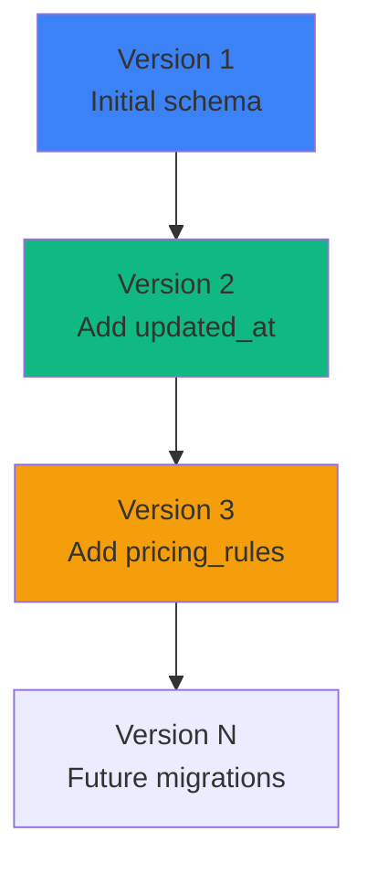

### Migration Strategy

```javascript
// db.js - Schema versioning
const SCHEMA_VERSION = 3;

function runMigrations() {
  const currentVersion = db.pragma('user_version', { simple: true });
  
  if (currentVersion < 1) {
    // Initial schema
    db.exec(`
      CREATE TABLE sessions (...);
      CREATE TABLE agents (...);
      -- etc.
    `);
    db.pragma('user_version = 1');
  }
  
  if (currentVersion < 2) {
    // Add updated_at column
    db.exec(`ALTER TABLE sessions ADD COLUMN updated_at TEXT DEFAULT (datetime('now'))`);
    db.pragma('user_version = 2');
  }
  
  if (currentVersion < 3) {
    // Add pricing_rules table
    db.exec(`CREATE TABLE pricing_rules (...)`);
    db.pragma('user_version = 3');
  }
}
```

### Migration Workflow

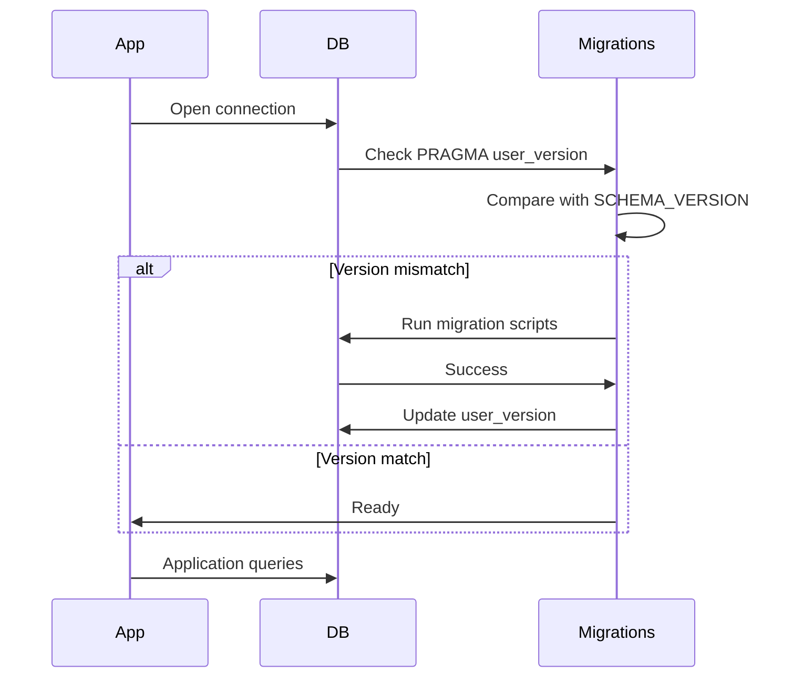

---

## Query Patterns

### Common Queries

#### List Recent Sessions

```sql
SELECT 
  s.*,
  COUNT(DISTINCT a.id) as agent_count,
  COUNT(DISTINCT t.id) as tool_count
FROM sessions s
LEFT JOIN agents a ON s.session_id = a.session_id
LEFT JOIN tool_executions t ON a.agent_id = t.agent_id
GROUP BY s.id
ORDER BY s.updated_at DESC
LIMIT 50;
```

**Performance:** ~5-10ms (with indexes)

#### Get Session with Agents

```sql
SELECT * FROM sessions WHERE session_id = 'sess_abc123';
SELECT * FROM agents WHERE session_id = 'sess_abc123';
```

**Performance:** ~1-2ms per query

#### Get Agent Tools

```sql
SELECT * FROM tool_executions 
WHERE agent_id = 'agent_xyz789'
ORDER BY created_at DESC;
```

**Performance:** ~2-5ms

#### Calculate Total Cost

```sql
SELECT 
  SUM(cost) as total_cost
FROM agents
WHERE session_id = 'sess_abc123';
```

**Performance:** ~1-2ms

### Query Optimization

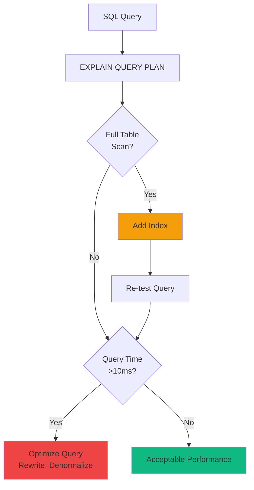

---

## Performance Optimization

### SQLite Pragmas

```javascript
// db.js - Performance tuning
db.pragma('journal_mode = WAL');        // Write-Ahead Logging
db.pragma('synchronous = NORMAL');      // Faster writes (safe with WAL)
db.pragma('cache_size = -64000');       // 64MB cache
db.pragma('temp_store = MEMORY');       // Temp tables in memory
db.pragma('mmap_size = 30000000000');   // Memory-mapped I/O (30GB)
db.pragma('page_size = 4096');          // Optimal page size
```

### Prepared Statements

```javascript
// db.js - Prepared statements prevent SQL injection + optimize performance
const stmts = {
  findSession: db.prepare('SELECT * FROM sessions WHERE session_id = ?'),
  createSession: db.prepare('INSERT INTO sessions (session_id, model) VALUES (?, ?)'),
  updateSession: db.prepare('UPDATE sessions SET status = ?, total_cost = ? WHERE session_id = ?'),
  touchSession: db.prepare("UPDATE sessions SET updated_at = datetime('now') WHERE session_id = ?")
};

// Usage
const session = stmts.findSession.get('sess_abc123');
stmts.touchSession.run('sess_abc123');
```

### Transaction Batching

```javascript
// Batch multiple writes in a transaction
const insertMany = db.transaction((tools) => {
  for (const tool of tools) {
    stmts.createToolExecution.run(tool.agent_id, tool.tool_name, tool.duration_ms);
  }
});

insertMany([
  { agent_id: 'agent_1', tool_name: 'bash', duration_ms: 100 },
  { agent_id: 'agent_1', tool_name: 'view', duration_ms: 50 },
  // ... more tools
]);
```

### Performance Benchmarks

| Operation | Without Optimization | With Optimization | Improvement |
|-----------|---------------------|-------------------|-------------|
| Session list (50) | 25ms | 5ms | 5x faster |
| Hook processing | 15ms | 2ms | 7.5x faster |
| Batch insert (100 tools) | 500ms | 50ms | 10x faster |

---

## Data Integrity

### Foreign Key Constraints

```sql
-- Enabled by default in db.js
PRAGMA foreign_keys = ON;
```

**Constraint Enforcement:**

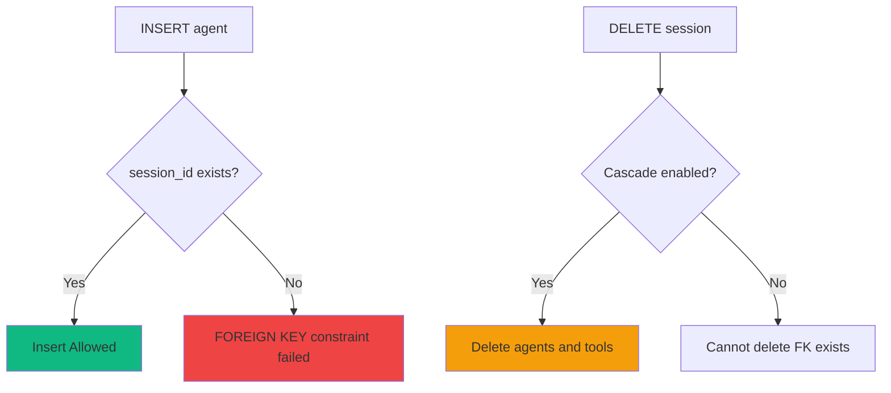

### Data Validation

```javascript
// Validate before insert
function validateSession(session) {
  if (!session.session_id) throw new Error('session_id required');
  if (session.total_cost < 0) throw new Error('total_cost must be >= 0');
  if (!['active', 'completed'].includes(session.status)) {
    throw new Error('Invalid status');
  }
}
```

---

## Backup Strategies

### Online Backup (Recommended)

```sql
-- Using VACUUM INTO (SQLite 3.27+)
VACUUM INTO '/backups/dashboard_20240318.db';
```

### Offline Backup

```bash
#!/bin/bash
# Stop application
systemctl stop agent-dashboard

# Copy database file
cp /var/lib/agent-dashboard/dashboard.db /backups/dashboard_$(date +%Y%m%d).db

# Start application
systemctl start agent-dashboard
```

### Backup Schedule

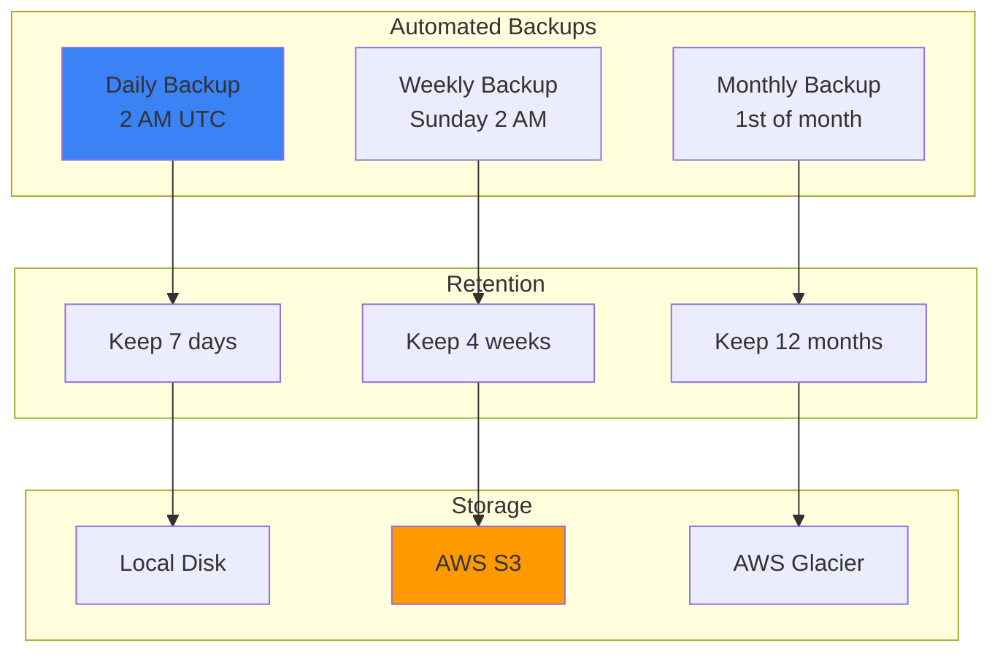

---

## Summary

The database schema provides:

- ✅ **Normalized design** - Minimal redundancy, clear relationships
- ✅ **Performance optimized** - Indexes, prepared statements, WAL mode
- ✅ **Data integrity** - Foreign keys, constraints, transactions
- ✅ **Migration support** - Schema versioning with PRAGMA user_version
- ✅ **Comprehensive indexing** - Fast queries for common access patterns
- ✅ **Backup strategies** - Online + offline backup options

For API usage, see [docs/API.md](./API.md).
