# Server Application

Enterprise-grade Node.js backend for Claude Code agent monitoring with real-time WebSocket updates.


---

## Table of Contents

- [Overview](#overview)
- [Architecture](#architecture)
- [Database Design](#database-design)
- [API Reference](#api-reference)
- [WebSocket Protocol](#websocket-protocol)
- [Hook Processing](#hook-processing)
- [Pricing System](#pricing-system)
- [Data Flow](#data-flow)
- [Error Handling](#error-handling)
- [Performance](#performance)
- [Testing](#testing)
- [Deployment](#deployment)
- [Configuration](#configuration)

---

## Overview

The server is a lightweight Express application that:

1. **Receives hook events** from Claude Code via HTTP POST (stdin → hook-handler.js → server)
2. **Persists data** in SQLite database with schema migrations
3. **Broadcasts updates** to connected web clients via WebSocket
4. **Serves REST API** for sessions, agents, events, stats, analytics, pricing, workflows, settings, and docs
5. **Manages pricing rules** for cost calculation and attribution

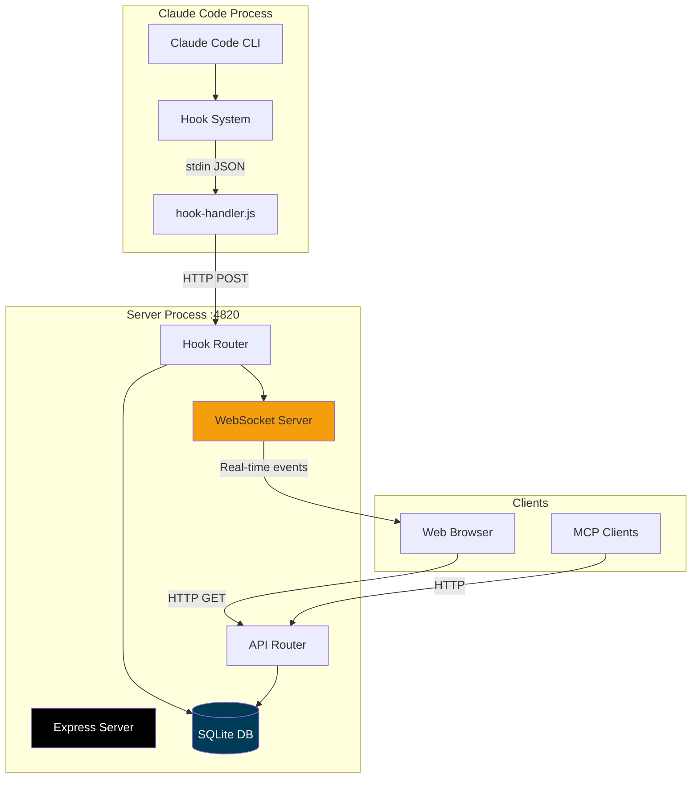

---

## Architecture

### Server Structure

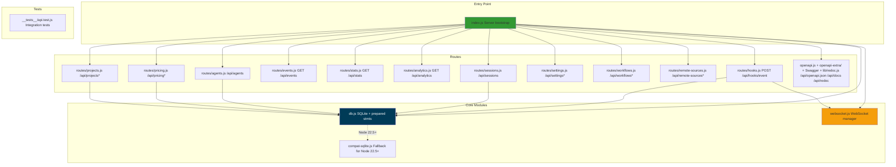

### Directory Structure

```
server/
├── index.js               # Express app + server bootstrap
├── db.js                  # SQLite connection + prepared statements
├── websocket.js           # WebSocket server + broadcast
├── compat-sqlite.js       # Fallback for node:sqlite (Node 22.5+)
│
├── routes/
│   ├── hooks.js           # Hook ingestion endpoints
│   ├── sessions.js        # Session CRUD API
│   ├── agents.js          # Agent CRUD API
│   ├── events.js          # Event list API
│   ├── stats.js           # Dashboard stats API
│   ├── analytics.js       # Analytics aggregate API
│   ├── pricing.js         # Pricing rules + cost API
│   ├── settings.js        # Ops/settings API
│   └── workflows.js       # Workflow intelligence API
│
├── openapi.js             # OpenAPI 3.0.3 spec generator (createOpenApiSpec)
├── openapi-extra/         # Supplementary OpenAPI fragments merged into the spec
│   ├── cc-config.js       #   /api/cc-config/* paths + schemas
│   ├── push.js            #   /api/push/* paths + schemas
│   ├── run.js             #   /api/run/* paths + schemas
│   └── misc.js            #   remaining route groups
│
├── lib/
│   └── redoc.js           # Serves ReDoc reference (/api/redoc) + self-hosted bundle
│
└── __tests__/
    └── api.test.js        # Integration tests
```

---

## Database Design

### Schema Overview

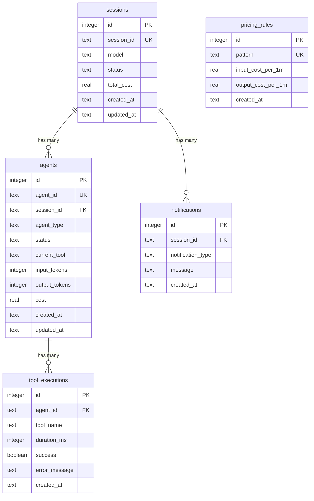

### Table Definitions

#### `sessions`

Tracks Claude Code sessions (one per CLI invocation or agent task).

```sql
CREATE TABLE sessions (
    id INTEGER PRIMARY KEY AUTOINCREMENT,
    session_id TEXT UNIQUE NOT NULL,
    model TEXT,
    status TEXT DEFAULT 'active',
    total_cost REAL DEFAULT 0,
    source TEXT NOT NULL DEFAULT 'local',   -- data source: 'local' or a remote_sources.id
    created_at TEXT DEFAULT (datetime('now')),
    updated_at TEXT DEFAULT (datetime('now'))
);

CREATE INDEX idx_sessions_session_id ON sessions(session_id);
CREATE INDEX idx_sessions_status ON sessions(status);
CREATE INDEX idx_sessions_updated_at ON sessions(updated_at DESC);
CREATE INDEX idx_sessions_source ON sessions(source);   -- powers the ?sources= data-scope filter
```

The `source` column is added migration-safe (additive `ALTER TABLE ... NOT NULL DEFAULT 'local'`), so every historical row keeps reading exactly as before; only sessions pulled from a configured remote carry a non-`local` source id.

#### `agents`

Tracks individual agents (main agent, explore, task, code-review, etc.).

```sql
CREATE TABLE agents (
    id INTEGER PRIMARY KEY AUTOINCREMENT,
    agent_id TEXT UNIQUE NOT NULL,
    session_id TEXT NOT NULL,
    agent_type TEXT,
    status TEXT DEFAULT 'running',
    current_tool TEXT,
    input_tokens INTEGER DEFAULT 0,
    output_tokens INTEGER DEFAULT 0,
    cost REAL DEFAULT 0,
    created_at TEXT DEFAULT (datetime('now')),
    updated_at TEXT DEFAULT (datetime('now')),
    FOREIGN KEY (session_id) REFERENCES sessions(session_id)
);

CREATE INDEX idx_agents_agent_id ON agents(agent_id);
CREATE INDEX idx_agents_session_id ON agents(session_id);
CREATE INDEX idx_agents_status ON agents(status);
```

#### `tool_executions`

Records each tool call (bash, view, edit, grep, etc.).

```sql
CREATE TABLE tool_executions (
    id INTEGER PRIMARY KEY AUTOINCREMENT,
    agent_id TEXT NOT NULL,
    tool_name TEXT NOT NULL,
    duration_ms INTEGER,
    success INTEGER DEFAULT 1,
    error_message TEXT,
    created_at TEXT DEFAULT (datetime('now')),
    FOREIGN KEY (agent_id) REFERENCES agents(agent_id)
);

CREATE INDEX idx_tools_agent_id ON tool_executions(agent_id);
CREATE INDEX idx_tools_created_at ON tool_executions(created_at DESC);
```

#### `notifications`

Stores system notifications (backgroundTaskComplete, etc.).

```sql
CREATE TABLE notifications (
    id INTEGER PRIMARY KEY AUTOINCREMENT,
    session_id TEXT NOT NULL,
    notification_type TEXT NOT NULL,
    message TEXT,
    created_at TEXT DEFAULT (datetime('now')),
    FOREIGN KEY (session_id) REFERENCES sessions(session_id)
);

CREATE INDEX idx_notifications_session_id ON notifications(session_id);
```

#### `pricing_rules`

Custom pricing rules for model pattern matching.

```sql
CREATE TABLE pricing_rules (
    id INTEGER PRIMARY KEY AUTOINCREMENT,
    pattern TEXT UNIQUE NOT NULL,
    input_cost_per_1m REAL NOT NULL,
    output_cost_per_1m REAL NOT NULL,
    created_at TEXT DEFAULT (datetime('now'))
);
```

#### `remote_sources`

Configured remote machines whose Claude Code history the dashboard pulls over SSH (see [Remote Data Sources](#remote-data-sources)). Config + operational status only — **no secrets** are stored; authentication defers to the host SSH stack.

```sql
CREATE TABLE remote_sources (
    id TEXT PRIMARY KEY,          -- also stamped onto sessions.source
    label TEXT NOT NULL,
    host TEXT NOT NULL,           -- ssh destination (user@host or ~/.ssh/config alias)
    ssh_port INTEGER,
    identity_file TEXT,           -- optional path to a key the user already controls
    remote_home TEXT,             -- remote home holding ~/.claude/projects
    enabled INTEGER NOT NULL DEFAULT 1,
    status TEXT NOT NULL DEFAULT 'idle',   -- idle | syncing | ok | error
    last_error TEXT,
    last_sync_at TEXT,
    last_sync_counts TEXT,        -- JSON import counters from the last sync
    created_at TEXT NOT NULL DEFAULT (strftime('%Y-%m-%dT%H:%M:%fZ','now')),
    updated_at TEXT NOT NULL DEFAULT (strftime('%Y-%m-%dT%H:%M:%fZ','now'))
);
```

#### `projects` / `project_paths`

A user-named grouping of one or more session working directories (see [Projects](#projects)). No `project_id` column on `sessions` — membership is derived by joining `sessions.cwd` against `project_paths.cwd`. A folder belongs to at most one project (`project_paths.cwd` is `UNIQUE`); a project may claim many folders.

```sql
CREATE TABLE projects (
    id TEXT PRIMARY KEY,
    name TEXT NOT NULL,
    created_at TEXT NOT NULL DEFAULT (strftime('%Y-%m-%dT%H:%M:%fZ','now')),
    updated_at TEXT NOT NULL DEFAULT (strftime('%Y-%m-%dT%H:%M:%fZ','now'))
);

CREATE TABLE project_paths (
    id INTEGER PRIMARY KEY AUTOINCREMENT,
    project_id TEXT NOT NULL,     -- FK -> projects.id, ON DELETE CASCADE
    cwd TEXT NOT NULL UNIQUE,     -- one project per folder
    created_at TEXT NOT NULL DEFAULT (strftime('%Y-%m-%dT%H:%M:%fZ','now'))
);
```

#### `plans` / `plan_items`

Per-repo plans mirrored from `<cwd>/AGENT-PLAN.md` (see [Plans & Focus](#plans--focus-plan-aware-monitoring)). Keyed by cwd — projects aggregate via the `project_paths` join, exactly like sessions. The file is the single source of truth, human-owned; `checked` mirrors the file's checkbox, `declared_done_*` is the agent's claim via `ccam focus done N`, and `target_date` (optional `YYYY-MM-DD`, layer 5 pace tracking) is authored out-of-band via `POST /api/plans/items/target` / `ccam focus target` — all three survive re-ingest (upserts never touch them). The dashboard now appends real content to the file itself through one audited path (`server/lib/plan-writeback.js`) when a layer-4 detour disposition resolves to `fold_in`/`new_item`, then re-runs this same ingest — `plan_items` keeps exactly one writer either way. `missing_at` is stamped when the file disappears — the row is kept because focus history still references its items.

```sql
CREATE TABLE plans (
    cwd TEXT PRIMARY KEY,         -- working directory holding AGENT-PLAN.md
    title TEXT,                   -- first markdown heading
    file_path TEXT NOT NULL,
    content_hash TEXT,            -- change fingerprint of the last ingest
    item_count INTEGER NOT NULL DEFAULT 0,
    missing_at TEXT,              -- stamped when the file disappears; row kept
    created_at TEXT NOT NULL DEFAULT (strftime('%Y-%m-%dT%H:%M:%fZ','now')),
    updated_at TEXT NOT NULL DEFAULT (strftime('%Y-%m-%dT%H:%M:%fZ','now'))
);

CREATE TABLE plan_items (
    cwd TEXT NOT NULL,            -- FK -> plans.cwd, ON DELETE CASCADE
    item_number INTEGER NOT NULL, -- the file's own number — the stable handle
    text TEXT NOT NULL,
    acceptance TEXT,              -- optional "acceptance:" note
    checked INTEGER NOT NULL DEFAULT 0,   -- mirrors the file checkbox (human-owned)
    position INTEGER NOT NULL DEFAULT 0,  -- file order
    declared_done_at TEXT,        -- agent's "ccam focus done N" claim
    declared_done_session TEXT,   -- no FK on purpose: audit trail outlives session deletion
    updated_at TEXT NOT NULL DEFAULT (strftime('%Y-%m-%dT%H:%M:%fZ','now')),
    PRIMARY KEY (cwd, item_number)
);
```

#### `session_focus`

The **current** focus per session: which plan item the session declared it is serving plus a stack of in-flight detours. History is *not* here — every focus change also writes a `Focus` row to `events`, which the timeline already renders. `drift_status` is written only by the focus drift audit; declarations never touch it.

```sql
CREATE TABLE session_focus (
    session_id TEXT PRIMARY KEY,  -- FK -> sessions.id, ON DELETE CASCADE
    cwd TEXT,
    item_number INTEGER,
    note TEXT,
    set_at TEXT,
    detour_stack TEXT NOT NULL DEFAULT '[]',  -- JSON stack, depth cap 10
    drift_status TEXT,            -- NULL | ok | drift | unknown (auditor-owned)
    drift_reason TEXT,
    drift_checked_at TEXT,
    updated_at TEXT NOT NULL DEFAULT (strftime('%Y-%m-%dT%H:%M:%fZ','now'))
);

CREATE INDEX idx_session_focus_cwd ON session_focus(cwd);  -- per-repo focus rollup
```

### Database Module (db.js)

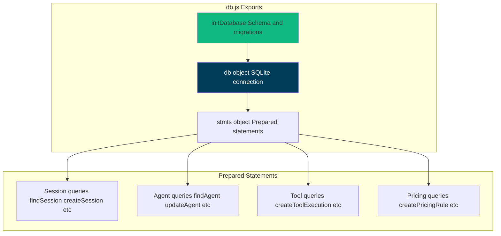

**Key Functions:**

```javascript
// Initialize database (create tables, indexes, defaults)
initDatabase();

// Prepared statements (prevents SQL injection, optimizes performance)
stmts.findSession.get(session_id);
stmts.createSession.run(session_id, model);
stmts.updateSession.run(status, total_cost, session_id);
stmts.touchSession.run(session_id); // Update updated_at

stmts.findAgent.get(agent_id);
stmts.createAgent.run(agent_id, session_id, agent_type);
stmts.updateAgent.run(status, input_tokens, output_tokens, cost, current_tool, agent_id);

stmts.createToolExecution.run(agent_id, tool_name, duration_ms, success, error_message);
stmts.createNotification.run(session_id, notification_type, message);
stmts.createPricingRule.run(pattern, input_cost_per_1m, output_cost_per_1m);
```

---

## API Reference

All endpoints return JSON unless noted. Error responses use:

```json
{
  "error": {
    "code": "SOME_CODE",
    "message": "Human-readable explanation"
  }
}
```

### OpenAPI / Swagger / ReDoc

| Method | Path                             | Description                                                                          |
| ------ | -------------------------------- | ------------------------------------------------------------------------------------ |
| `GET`  | `/api/openapi.json`              | Raw OpenAPI 3.0.3 spec                                                                |
| `GET`  | `/api/docs`                      | Interactive **Swagger UI** (try-it-out request execution)                            |
| `GET`  | `/api/redoc`                     | **ReDoc** reference — clean, read-optimized three-panel rendering of the same spec   |
| `GET`  | `/api/redoc/redoc.standalone.js` | Self-hosted ReDoc bundle (via the `redoc` dependency, never a CDN — works offline)   |

The OpenAPI spec is generated from `server/openapi.js` (`createOpenApiSpec()`), merged with supplementary fragments under `server/openapi-extra/`, and is the source of truth for request/response contracts. It now documents every backend route (75 path entries). Both Swagger UI and ReDoc (`server/lib/redoc.js`) render the same spec; the ReDoc bundle is served locally so the reference works offline / air-gapped. A committed `openapi.yaml` at the repo root mirrors the live spec — regenerate it after API changes with `npm run openapi:yaml` (never hand-edit it).

### Core Endpoints

| Method  | Path                | Description                                      |
| ------- | ------------------- | ------------------------------------------------ |
| `GET`   | `/api/health`       | Server health check                              |
| `GET`   | `/api/sessions`     | List sessions (`status`, `limit`, `offset`)     |
| `GET`   | `/api/sessions/:id` | Session detail (includes `agents` + `events`)   |
| `POST`  | `/api/sessions`     | Create session (idempotent by `id`)             |
| `PATCH` | `/api/sessions/:id` | Update session                                   |
| `GET`   | `/api/sessions/:id/transcripts` | List the session's transcript files (main + sub-agents) |
| `GET`   | `/api/sessions/:id/transcript`  | Cursor-paginated message stream for one transcript |
| `GET`   | `/api/agents`       | List agents (`status`, `session_id`, pagination)|
| `GET`   | `/api/agents/:id`   | Agent detail                                     |
| `POST`  | `/api/agents`       | Create agent (idempotent by `id`)               |
| `PATCH` | `/api/agents/:id`   | Update agent                                     |
| `GET`   | `/api/events`       | List events (`session_id`, `limit`, `offset`)   |
| `GET`   | `/api/stats`        | Dashboard aggregate counters                     |
| `GET`   | `/api/analytics`    | Analytics aggregates for charts/trends           |
| `GET`   | `/api/metrics`      | Prometheus / OpenMetrics exposition (text; v0.0.4) |

**Prometheus metrics (`GET /api/metrics`).** Exposes the dashboard's live counters — `ccam_sessions`/`ccam_agents` by status, `ccam_events_total`, `ccam_tokens_total` by kind, `ccam_websocket_clients`, `ccam_remote_sources` by enabled state, `ccam_process_uptime_seconds`/`ccam_process_resident_memory_bytes`, and `ccam_build_info{version}` — in the Prometheus v0.0.4 text-exposition format for scraping into Prometheus / Grafana (`server/routes/metrics.js`). Values come from the same `server/db.js` prepared statements the REST API uses, so they match the UI; status series are enumerated so a gauge never drops out of the exposition at zero. The route is read-only and, being under `/api`, sits behind both the Host-header (DNS-rebinding) guard and the optional `DASHBOARD_TOKEN` guard: a non-loopback scraper (e.g. Prometheus in Docker via `host.docker.internal`) must be allowlisted with `DASHBOARD_ALLOWED_HOSTS` or it gets `403 EBADHOST`, and must send the token when one is set. A ready-to-run Prometheus + Grafana stack with four auto-provisioned dashboards (default home **CCAM — Overview**) lives in [`monitoring/`](../monitoring/README.md).

**Data scope (`?sources=`).** `GET /api/sessions`, `/api/events`, `/api/agents`, `/api/stats`, and `/api/analytics` all accept an optional `sources` query param — a comma-separated list of source ids (`local` plus any remote source id, see [Remote Data Sources](#remote-data-sources)) — that narrows the result to sessions with a matching `sessions.source`. It is parsed by `server/lib/source-filter.js` into SQL predicates; `/api/stats` and `/api/analytics` route to the source-scoped aggregates in `server/lib/scoped-stats.js` only when a scope is present, leaving the unscoped fast paths unchanged. `GET /api/sessions/facets` additionally returns a `sources` facet enumerating the known source ids.

**Session names** are kept in sync with the transcript title: on every hook event (and in the 15 s watchdog) the ingestor reads the latest `custom-title` (`/rename`, `claude -n`, picker `Ctrl+R`) or `ai-title` (auto) from the JSONL and updates `sessions.name` — `custom-title` always wins, `ai-title` only fills a placeholder/auto name — broadcasting `session_updated` so the UI reflects renames in real time. When neither title exists, the session's first user prompt (tool-result / meta / slash-command plumbing entries skipped, 60-char label) fills the placeholder session name plus the main agent's placeholder name and empty task; a later `ai-title` can still replace a descriptor-filled name, and the agent fill passes the in-flight `current_tool` through so it is never wiped mid-turn.

**Transcript stream** (`GET /api/sessions/:id/transcript`) returns `user` / `assistant` messages plus: synthetic `session_event` rename markers (from `custom-title`), local slash-command I/O surfaced from `system`/`local_command` lines (the `<command-name>` pill + `<local-command-stdout>`/`stderr` output, e.g. `/color`, `/rename`, custom commands), and **mid-turn queued user messages** surfaced from `attachment`/`queued_command` lines — a message typed while Claude was still working is journaled as `queue-operation` bookkeeping plus a `queued_command` attachment (never as a `user` line), so the attachment is rendered as a user message at the point the model actually received it. The queue is shared with harness injections, so queued lines are only attributed to the human when they aren't harness traffic: `<task-notification>`/`[SYSTEM NOTIFICATION` payloads and any non-`human` `origin.kind` render as `system` (harness notification attachments carry no `origin` field at all; typed messages carry `origin.kind = "human"`). Content-less `local_command` lines, other `system` subtypes, `queue-operation` lines, and every other attachment subtype are dropped.

### Hook Ingestion

| Method | Path               | Description                                    |
| ------ | ------------------ | ---------------------------------------------- |
| `POST` | `/api/hooks/event` | Ingest one Claude Code hook event envelope     |

Request body shape:

```json
{
  "hook_type": "PreToolUse",
  "data": {
    "session_id": "abc-123",
    "tool_name": "Bash"
  }
}
```

### Pricing

| Method   | Path                      | Description                            |
| -------- | ------------------------- | -------------------------------------- |
| `GET`    | `/api/pricing`            | List pricing rules                     |
| `PUT`    | `/api/pricing`            | Create/update a pricing rule           |
| `DELETE` | `/api/pricing/:pattern`   | Delete pricing rule                    |
| `GET`    | `/api/pricing/cost`       | Total cost across all sessions         |
| `GET`    | `/api/pricing/cost/:id`   | Cost breakdown for one session         |

`PUT /api/pricing` also accepts optional **time-limited introductory rates** (`intro_*_per_mtok` + an `intro_until` `YYYY-MM-DD` cutoff): usage on/before the cutoff is priced at the intro rate, after it at the standard rate. Intro columns are written only when the caller sends them, so a standard-rate edit never disturbs a promo. Every rate field present must be a non-negative finite number — `NaN`/negative values are rejected with `400 INVALID_INPUT` before anything is written. The agent-list endpoints (`GET /api/agents`, `GET /api/sessions/:id/agents`) attach a per-agent `cost` — each subagent's OWN cost, computed from its `metadata.tokens` at current rates (0 for main agents, whose cost is the session total).

### Workflows

| Method | Path                          | Description                                                         |
| ------ | ----------------------------- | ------------------------------------------------------------------- |
| `GET`  | `/api/workflows`              | Aggregate workflow intelligence (`?status=active\|completed\|...`) |
| `GET`  | `/api/workflows/session/:id`  | Per-session drill-in (tree, timeline, swim lanes, events)          |

### Remote Data Sources

Live remote/multi-machine data collection over SSH. The dashboard pulls Claude Code history from other machines: `server/lib/remote-sync.js` rsyncs each remote's `~/.claude/projects` into a sandboxed per-source staging dir under the data dir, feeds it through the **same** importer used for local history (`scripts/import-history.js` `importFromDirectory`), and tags every imported session with the source id (`sessions.source`). Authentication defers entirely to the host SSH stack (ssh-agent / `~/.ssh/config` / identity file) — **no secrets are stored**; every command runs via `execFile`/`spawn` argument arrays (never a shell string) and `StrictHostKeyChecking` is left at its SSH default.

| Method   | Path                          | Description |
| -------- | ----------------------------- | ----------- |
| `GET`    | `/api/remote-sources`         | List configured sources (config + operational status) |
| `POST`   | `/api/remote-sources`         | Create a source |
| `PATCH`  | `/api/remote-sources/:id`     | Update a source |
| `DELETE` | `/api/remote-sources/:id`     | Delete a source; `?purge=true` also deletes that source's imported sessions |
| `POST`   | `/api/remote-sources/:id/test`| SSH connectivity probe |
| `POST`   | `/api/remote-sources/:id/sync`| Trigger an on-demand pull |
| `POST`   | `/api/remote-sources/sync-all`| Pull every enabled source now (sequential; per-source failures isolated) |

Every status transition broadcasts `remote_source.status` `{ id, status, error?, last_sync_at? }` over `/ws` (`status` one of `idle | syncing | ok | error | deleted`). Enabled sources are also pulled automatically by the background sync poller (`startRemoteSourceSync` in `server/index.js`) — see [Continuous Project Sync](#continuous-project-sync) and the environment table.

#### Setup & troubleshooting

Because sync runs non-interactively (`ssh -o BatchMode=yes`), the connection must already work without a prompt. Set a source up like this:

1. **Reach the host once, manually:** `ssh user@host` (or an alias from `~/.ssh/config`). This adds the host to `~/.ssh/known_hosts` — required, since `StrictHostKeyChecking` is left at its secure default (an unknown host key fails the sync rather than being trusted blindly).
2. **Make auth passwordless:** load your key into `ssh-agent` (`ssh-add`), or set an `IdentityFile` in `~/.ssh/config`, or point the source's optional `identity_file` at the key. Passphrase prompts and password auth will not work under `BatchMode`.
3. **Ensure `rsync` exists on _both_ machines** (it is the transport). Most systems have it; install it on the remote if missing.
4. **Add the source** (Settings → Remote Data Sources, or `ccam remote-sources add`), click **Test**, then **Sync**.

| Symptom (surfaced in `last_error` / the Test result) | Cause & fix |
| --- | --- |
| `Host key verification failed` | The host isn't in `known_hosts`. `ssh user@host` once to accept its key. |
| `Permission denied (publickey)` | No usable key for non-interactive auth. `ssh-add` your key, set `IdentityFile` in `~/.ssh/config`, or set the source's `identity_file`. |
| `… does not exist on the remote` | Claude Code's home is elsewhere on that machine. Set the source's **remote home** (default `~/.claude`). |
| `rsync: command not found` / `rsync error` | `rsync` isn't installed on the remote (or local). Install it. |
| Sync hangs then errors after ~10 min | Bounded by `DASHBOARD_REMOTE_SYNC_TIMEOUT_MS`; usually a network/host issue — verify with **Test** (bounded by `DASHBOARD_REMOTE_TEST_TIMEOUT_MS`). |

### Monitors

The Kanban Board's "Projects" view monitor layout (`routes/monitors.js`, `/api/monitors`) — a single **global** config, not per-user: this app has no accounts, so every computer connected to the dashboard reads and writes the same swimlane setup, and it's persisted server-side in the singleton `dashboard_layout` row instead of per-browser `localStorage`.

| Method | Path           | Description |
| ------ | -------------- | ----------- |
| `GET`  | `/api/monitors`| Current `{ monitors, monitorMap, collapsedProjects }` |
| `PUT`  | `/api/monitors`| Patch any subset of the three; `400 INVALID_LAYOUT` on a malformed field |

Every `PUT` broadcasts `monitors_updated` with the full resulting layout over `/ws`, so a change made from one connected computer shows up live on every other one — no reload needed.

### Color Thresholds

The Usage page's global green/yellow/orange/red color thresholds (`routes/color-thresholds.js`, `/api/color-thresholds`) — a single **global** config, not per-user: this app has no accounts, so every computer connected to the dashboard reads and writes the same thresholds, persisted server-side in the singleton `color_thresholds` row. Two independent scopes, `session` and `weekly`, since the session (5h) window and the weekly window are separate quotas.

| Method | Path                     | Description |
| ------ | ------------------------ | ----------- |
| `GET`  | `/api/color-thresholds`  | Current `{ session: {yellowAt,orangeAt,redAt}, weekly: {yellowAt,orangeAt,redAt} }` |
| `PUT`  | `/api/color-thresholds`  | Patch either/both scopes, and within a scope any subset of its three fields; `400 INVALID_THRESHOLDS` on an out-of-range value or a non-increasing ordering |

Every `PUT` broadcasts `color_thresholds_updated` with the full resulting config over `/ws`, so a change made from one connected computer shows up live on every other one — no reload needed.

### Coach's Playbook

The Coach's Playbook (`routes/playbook.js` + `routes/coach.js`, `/api/playbook/*` + `/api/coach/*`) — a rule-based system that watches usage patterns and surfaces recommendations. A **practice** is a named, built-in check (`lib/playbook/practices.js`; ships two: `session-token-ceiling`, scope session, and `account-weekly-balance`, scope global — the latter fires when two or more enabled Claude accounts still have weekly-quota headroom and the gap between the lowest- and highest-used of them crosses a configurable percentage-point threshold, recommending a switch to the lower-used account); each practice's config (enabled + thresholds) is a single **global** setting, same no-accounts/server-shared model as Monitors and Color Thresholds, persisted in `playbook_practice_config`. A detected occurrence of a practice firing for a scope is an **Observation** (`coach_observations`), produced by a background scheduler (`lib/playbook/engine.js`, mirrors `lib/reconciliation.js`'s tick shape — boot delay, `setInterval`, a `running` re-entrancy guard) that evaluates every enabled session-scoped practice against every active session, plus every enabled global-scoped practice once, every `DASHBOARD_PLAYBOOK_MS` (default 5 min; `DASHBOARD_PLAYBOOK_MODE=off` to disable), deduped so a practice+scope with an already-`open` Observation never re-fires.

| Method | Path                                       | Description |
| ------ | ------------------------------------------ | ----------- |
| `GET`  | `/api/playbook/practices`                  | Every catalog practice merged with its current config (or catalog defaults if never touched) |
| `PUT`  | `/api/playbook/practices/:id/config`       | Patch `{ enabled?, config? }`; `404 UNKNOWN_PRACTICE` / `400 INVALID_CONFIG` on an unknown field or an out-of-range value |
| `GET`  | `/api/coach/observations?status=`          | Most recent first; `status` optionally narrows to one of open/acknowledged/dismissed/resolved |
| `POST` | `/api/coach/observations/:id/respond`      | Body `{ response }`, one of acknowledged/dismissed/resolved; `404 NOT_FOUND` / `400 INVALID_RESPONSE` |

`PUT /api/playbook/practices/:id/config` broadcasts `playbook_practice_config_updated`; the engine's own tick broadcasts `coach_observation_created` when a practice fires; `POST .../respond` broadcasts `coach_observation_updated` — see [docs/API.md](../docs/API.md#playbook) for full request/response shapes.

### Projects

A user-named grouping of one or more session working directories (`routes/projects.js`, `/api/projects*`). A project claims one or more folders; a folder belongs to at most one project. There is **no `project_id` column on `sessions`** — membership is derived by joining `sessions.cwd` against `project_paths.cwd` at query time, so a session created before its folder was ever mapped retroactively belongs to that project the instant the mapping is added. `GET /api/projects` aggregates `session_count`/`active_count`/`last_activity` per project (and for an `unassigned` bucket of cwds with sessions but no project) in a single grouped query rather than N+1 per-project lookups.

| Method   | Path                              | Description |
| -------- | ---------------------------------- | ----------- |
| `GET`    | `/api/projects`                    | List every project (folders + aggregated session stats) plus the `unassigned` bucket |
| `POST`   | `/api/projects`                    | Create a project; `cwds` optionally attaches folders immediately (`409 ALREADY_MAPPED` if any is claimed elsewhere) |
| `PATCH`  | `/api/projects/:id`                | Rename a project and/or set `pinned` (floats it to the top of `GET /api/projects`, ahead of the regular alphabetical order) |
| `DELETE` | `/api/projects/:id`                | Delete a project; folder mappings cascade (`ON DELETE CASCADE`), sessions are untouched and fall back to unassigned |
| `POST`   | `/api/projects/:id/paths`          | Map an additional folder onto a project |
| `DELETE` | `/api/projects/:id/paths/:pathId`  | Unmap a folder (folder + its sessions are untouched) |
| `GET`    | `/api/projects/:id/repos`          | Repo/worktree topology — computed live by `lib/repo-topology.js`. See below |
| `GET`    | `/api/projects/:id/intake`         | Team-intake initiative status — computed live by `lib/intake-scan.js`. See below |

Project mutations are **not** broadcast over `/ws` — like `remote_sources` config CRUD, the client re-fetches after each change since this is a low-frequency, single-operator configuration surface, not a live monitoring feed.

#### Repo/worktree topology & team-intake status

Both back the **Project Detail** page (`client/src/pages/ProjectDetail.tsx`, route `/projects/:id`, reached from a project row's "open detail" icon in the Projects list) and are computed **live on every call** — nothing here is persisted, so a page refresh always reflects the current filesystem/git state.

`GET /api/projects/:id/repos` (`lib/repo-topology.js`): splits the project's mapped folders into actual git repos (has a `.git`) versus plain folders, lists each repo's live worktrees via `git worktree list --porcelain` (`git` invoked with `execFile` and an argument array — never a shell string — using the isolated env helper shared with `lib/update-check.js`, see `lib/git-env.js`), and each worktree's dirty state via `git status --porcelain` (capped at 25 dirty-checks per request; `dirty: null` means genuinely undetermined, render as "unknown" not "clean"). Also best-effort-detects sibling repos named in a mapped repo's own `PROJECT-CONTEXT.md` "Repo topology" section that aren't mapped to the project yet — surfaced as `detectedSiblings`, suggestions only; the client adds one explicitly via the existing `POST /api/projects/:id/paths`, nothing is added automatically. `404` for an unknown project id.

`GET /api/projects/:id/intake` (`lib/intake-scan.js`): scans each mapped folder's `intake/<slug>/` directories (the layout the `team-intake`/`team-qa`/`team-build`/`team-release` delivery-team pipeline skills produce) and infers a pipeline stage — `requested → planned → qa → built → released` — purely from which known artifact files exist (`request-brief.md`, `technical-plan.md`, `qa/qa-assessment.md`|`qa/test-plan.md`, `build/*/build-report.md`, `merge.json`); no markdown content is parsed. `404` for an unknown project id.

See [docs/API.md](../docs/API.md#projects) for full request/response shapes.

### Plans & Focus (Plan-Aware Monitoring)

Each monitored repo may keep a human-approved `AGENT-PLAN.md` at its root (a `# Title` plus numbered checkbox items). `server/lib/plan-ingest.js` mirrors it into the `plans`/`plan_items` tables, keyed by cwd — projects aggregate via the `project_paths` join exactly like sessions do. The file is still the single source of truth, human-owned, and `plan-ingest.js` is still the only place that knows what its syntax means; the dashboard now appends to it through one audited path (`server/lib/plan-writeback.js` — see "Detour dispositions & reconciliation" below) and reads it back through this same ingest like every other trigger. Sessions declare which item they are serving by running `ccam focus set|push|bug|feature|pop|done` in their Bash tool (parsed off the `PostToolUse` hook — see `routes/hooks.js`) or via the strict `POST /api/sessions/:id/focus` endpoint (`routes/plans.js`, plus the focus/todos additions in `routes/sessions.js`). `bug`/`feature` push a `kind`/`title`/`detail`-tagged detour frame. Every session's current focus — known item, plain detour, feature, or bug — renders as one icon-tagged line in the client's Plan view and session-card breadcrumb (`client/src/lib/types.ts`'s `focusKind()`/`FOCUS_KIND_CONFIG`), with bug/feature lines expanding on click for the full `detail`. Errors use the standard `{error:{code,message}}` envelope.

**Pace tracking (layer 5):** any top-level item may carry an optional `target_date` (`YYYY-MM-DD`, local calendar day), authored out-of-band via `POST /api/plans/items/target` / `ccam focus target <n> <date>|--clear` — never parsed from the file, so it survives every re-ingest untouched (mirrors `declared_done_at`). `server/lib/pace.js`'s `paceStatus()` is the single shared computation of `no_target | on_track | behind | done`; an item is `done` (never `behind`) once `checked` or `declared_done_at` is set, and `target_date === today` is `on_track` (the boundary is pinned — `behind` starts the next local day).

**Detour dispositions & reconciliation (layers 4 + 6):** `server/lib/detours.js` gives every detour — inferred by `focus-inference.js`'s classifier or declared via `ccam focus bug|feature`/`push` — a durable, resolvable row in `detour_dispositions` (`pending → fold_in|new_item|deliberate|discard`), separate from the classifier's re-derivable `focus_inferences` observation. A `fold_in`/`new_item` verdict writes real content into the cwd's `AGENT-PLAN.md` the moment it's decided — by a human via `POST /api/detours/:id/resolve`, or unattended by `server/lib/reconciliation.js`'s per-cwd tick (deterministic pace/detour-volume rules decide *whether* to escalate; only what's flagged gets one batched LLM classification pass). Both call sites share the exact same write path, `server/lib/plan-writeback.js`'s `applyDisposition()` — sanitize the LLM-influenced text, mint an `id:`, back up the file, optimistically lock against a concurrent human edit (retry once on conflict, then escalate to `decision_queue`), atomic-write, and re-run the real ingest. `decision_queue` (pace alerts, detour-volume flags, stuck write-backs) is readable via `GET /api/decision-queue` and `ccam decisions`. See `ARCHITECTURE.md` for the full design rationale.

**Portfolio summary (layer 7):** `server/lib/portfolio.js`'s `buildPortfolioSummary()` maps every real project through `pace.js` and the plan-items tables into the rollup the client's **Project Manager** page renders — per-project milestone completion (`{done,total}`, every item, sub-items included) and live pace status (`counts` bucketed by `no_target|on_track|behind|done`, plus a `behind` list pre-filtered to numbered items, mirroring `reconciliation.js`'s own R1 filter). Pure aggregation — no caching, no writes, recomputed on every request. `GET /api/portfolio/summary` → `{ projects: [{ project_id, milestones, pace: { counts, behind } }] }`. This is the first client consumer of layers 4-6 — they shipped server-only.

| Method | Path                          | Description |
| ------ | ----------------------------- | ----------- |
| `GET`  | `/api/plans`                  | Every known plan with its items — `{ plans: [{...plan, items:[...]}] }` |
| `GET`  | `/api/plans/for-cwd?cwd=`     | One working directory's plan (`{ plan, items }`; query-param form because cwds contain slashes) — `400` missing cwd, `404` no plan |
| `GET`  | `/api/plans/project/:projectId` | Per-project rollup — `{ project_id, plans: [{cwd, plan, items}] }`, one entry per mapped folder with a plan; `404` unknown project |
| `POST` | `/api/plans/refresh`          | `{cwd}` — force an ingest now (escape hatch when the poll is disabled); returns `{ changed, plan, items }` and broadcasts `plan_updated` on change |
| `GET`  | `/api/focus`                  | Bulk hydrate: every **active** session's declared focus as wire shapes — `{ focus: [...] }` |
| `GET`  | `/api/sessions/:id/focus`     | One session's focus + plan item + `plan_title` + `history` (rebuilt from the `Focus` rows in `events`, newest first, cap 50) |
| `POST` | `/api/sessions/:id/focus`     | Explicit (non-hook) focus write: `{verb: set\|push\|pop\|done, item_number?, note?, description?}` → `{ focus, deduped }`. Strict: `400` invalid input, `404` unknown session, `409` `UNKNOWN_ITEM`/`EMPTY_STACK`; a same-state declaration dedupes to a no-op (no `Focus` event) so CLI-write + hook-parse double delivery is harmless |
| `GET`  | `/api/sessions/:id/todos`     | The session's latest TodoWrite list, parsed on read from the newest `PostToolUse`/`TodoWrite` event — `{ todos\|null, updated_at }` |
| `GET`  | `/api/projects/:id/focus-report` | Project-scoped **focus-time report** (implemented in `routes/projects.js`, using `lib/focus-report.js`) — `404` unknown project. See below |
| `GET`  | `/api/focus-report`           | **Cross-project aggregate** focus-time report (`routes/focus-report.js`) — same report shape, but session selection via optional `project_id`/`session_id`/`unassigned`/`sources` and a **required** `from`/`to` ISO window every segment is clipped to. See `docs/API.md` |
| `GET`  | `/api/focus-report/summary`   | Stakeholder-readable **window summary**, grouped by project: plain-language LLM-synthesized bullets per project for the same window/scope (`lib/focus-summary.js`, cached in `focus_summaries` gated by input digests — group cache keys match the equivalent directly-scoped request, so nothing generates twice). `{ summary: { groups } }`, or `{ summary: null }` (200) when the LLM path is off/unavailable, the window is empty, or generation failed. See below |
| `GET`  | `/api/focus-report/summary/config` | `{ model }` — the model the next summary generation would use, so the client's loading state can already say "Summarizing this window using Claude X". No params, never errors |

The focus wire shape is `{ session_id, cwd, item_number, item_text, note, detour_stack: [{description, pushed_at, prior_item}], since, drift: true|false|null, drift_reason, updated_at }`. Applied declarations broadcast `new_event` + `session_focus` (and `plan_updated` after `done`, since `declared_done_*` changes the rollup); declarations never touch the `drift_*` columns — only the [focus drift audit](#focus-drift-audit) writes those.

#### Focus-time report

`GET /api/projects/:id/focus-report` reconstructs how long each of the project's sessions spent on a declared item versus a detour/feature/bug, from existing `Focus` event history — no new capture. `lib/focus-report.js` does two independent replays over the `events` table: `buildFocusSegments` walks a session's ordered `Focus` rows into timestamped segments (a detour's `item_number` is the item that was current when it *started* — its "prior_item"); `activeIntervals` walks every event for the session and credits each gap as active from its start for at most `DASHBOARD_FOCUS_IDLE_GRACE_SECONDS` (default `300`; `≤0` disables discounting) — the positioned intervals sum to each segment's `active_ms` and are unioned across sessions into `active_wall_clock_ms` (below). This is an event-gap proxy, not a replay of the guarded Waiting/Active state machine — a still-working subagent keeps emitting events, so its time stays counted, without duplicating `hooks.js`'s fleet-drain guards outside the code that owns them. Every segment also gets a `chunks` breakdown from `buildActivityChunks` — its span sliced into fixed 10-minute windows, each flagged `active` if any real event landed inside it (no grace-window credit, unlike `active_ms`/`idle_ms` — a chunk with zero events is idle, full stop) — so the client can color a segment's actually-quiet stretches distinctly from its worked ones instead of one solid block implying continuous activity all the way through. Both client views consume this today: `FocusCalendarView`'s swimlane blocks and `FocusReportModal`'s List-view per-session bar both overlay idle chunks via one shared client-side helper, while List view's per-item/project-split aggregate bars (no single segment's `chunks` to overlay) size directly off `active_ms` instead — no wire-shape change either way. `buildProjectFocusReport` composes both across every session under the project's mapped folders and returns:

```json
{
  "project_id": "...",
  "sessions": [{ "session_id": "...", "name": "...", "cwd": "...", "ended_at": null, "segments": [
    { "kind": "item|detour|feature|bug", "item_number": 4, "label": "...", "start": "...", "end": "...", "wall_ms": 0, "active_ms": 0, "idle_ms": 0, "inferred": false, "inferred_reason": null,
      "chunks": [{ "start": "...", "end": "...", "active": true }] }
  ]}],
  "items": [{ "cwd": "...", "item_number": 4, "text": "...", "totals": { "wall_ms": 0, "active_ms": 0, "idle_ms": 0, "by_kind": { "item": {}, "detour": {}, "feature": {}, "bug": {} } } }],
  "totals": { "wall_ms": 0, "active_ms": 0, "idle_ms": 0, "by_kind": { "...": {} } },
  "idle_grace_seconds": 300,
  "wall_clock_ms": 0,
  "concurrency_ratio": null,
  "active_wall_clock_ms": 0,
  "active_concurrency_ratio": null
}
```

A session with **zero** declared `Focus` history falls back to the background focus-inference verdict (`lib/focus-inference.js`, `focus_inferences` table) as one whole-session segment flagged `inferred: true` — attributed to a plan item (resolved via the item's stable id, reorder-safe) or an inferred detour with a generated title. Declared history always wins. When there's neither a declaration nor a usable inference — never classified (e.g. a currently-running session that hasn't gone quiet or ended long enough for `focus-inference.js` to pick it up), no plan in the cwd, or an `unclassified` verdict — `noFocusSegment()` fabricates one whole-session segment, `kind: "none"`, instead of the session being dropped from `sessions`. `"none"` is a report-only sentinel kind (`NONE_KIND`), never produced by a declaration or the classifier itself; it's excluded from every `by_kind` bucket and from the `items` rollup (no `item_number`), but still counts toward the aggregate `totals.wall_ms`/`active_ms`/`idle_ms` and `wall_clock_ms`/`concurrency_ratio` below. Every segment carries the `inferred` flag (`false` for declared and `"none"` segments) plus `inferred_reason` — the classifier's own one-sentence justification for the attribution (`focus_inferences.reason`), surfaced so the report doesn't just say *that* a session was guessed but *why*; `null` for declared/`"none"` segments. `items` only includes segments with a non-null `item_number` (an item-less detour still counts toward `totals`, just not toward any per-item rollup). Each session entry also carries `ended_at` (`null` while still active/waiting) straight through from the session row, so a client can distinguish "genuinely still running" from "just happened to end near fetch time" — see `client/README.md`'s `FocusCalendarView`.

Because this dashboard exists to watch multiple sessions run concurrently, `buildProjectFocusReport` also separates **effort** time from **wall-clock** time rather than reporting one number for both. `totals.active_ms` is effort — the plain sum across every session, which inflates with concurrency (three sessions active for the same 30 minutes sum to 90 minutes of effort). `wall_clock_ms` is the calendar-time counterpart: `mergeIntervals()` unions each session's own span (its first segment's start to its last segment's end) — three overlapping 30-minute sessions merge to 30 minutes of wall-clock coverage, not 90; sequential, non-overlapping sessions just add up as normal. Concurrency is measured at the session level (not per-segment or per-item — two sessions both declared on the same item at once still only counts once toward wall-clock coverage). `concurrency_ratio` (`totals.active_ms / wall_clock_ms`) turns "9h effort in a 3h window" into a legible "3x parallelism" rather than looking like the numbers don't add up; it's `null` when `wall_clock_ms` is `0`. Because a session's span runs to its end (or to "now" while open), an open-but-silent session — left running overnight — keeps extending `wall_clock_ms` and dilutes `concurrency_ratio` toward `0`. `active_wall_clock_ms` is the second denominator for that case: the union of every session's grace-credited active intervals (the same per-gap credit `active_ms` sums, kept positioned — `activeIntervals` above), i.e. the calendar time at least one session was actually doing something. `active_concurrency_ratio` (`totals.active_ms / active_wall_clock_ms`) reads "how parallel while work was actually happening" — always `≥ 1` when non-null, `null` when `active_wall_clock_ms` is `0`.

### Settings / Ops

| Method | Path                           | Description                                      |
| ------ | ------------------------------ | ------------------------------------------------ |
| `GET`  | `/api/settings/info`           | System info, DB stats, hooks status, cache stats. Also powers the Dashboard Health tab (server uptime, memory, CPU, DB record counts, WAL/journal mode, transcript cache hit/miss rates, and `focus_summary_cache` — the focus-window-summary cache's row count/hit-rate/total bullets, see below) |
| `POST` | `/api/settings/clear-data`     | Delete all sessions/agents/events/token usage (also wipes `focus_summary_access_log`; the `focus_summaries` cache itself is left alone) |
| `POST` | `/api/settings/reimport`       | Re-import legacy sessions from `~/.claude/`      |
| `POST` | `/api/settings/reinstall-hooks`| Reinstall Claude Code hooks                      |
| `POST` | `/api/settings/reset-pricing`  | Reset pricing table to defaults                  |
| `GET`  | `/api/settings/export`         | Export all data (sessions, agents, events, token_usage, workflows, dashboard_runs, alert_rules, model_pricing) as one versioned JSON attachment |
| `POST` | `/api/settings/import`         | Restore a bundle from `/export`. Multipart `file`, or JSON `{ path }` (server reads it). Idempotent + non-destructive: sessions already present are skipped whole |
| `POST` | `/api/settings/cleanup`        | Abandon stale sessions and purge old data (also purges `focus_summary_access_log` rows older than `purge_days`, reported as `purged_focus_summary_log`) |
| `GET`  | `/api/settings/cache/timeline` | Raw hit/miss timestamps for the focus-window-summary cache within `[from, to)` (`?from=&to=`, ISO instants; capped, with a `truncated` flag). No day-bucketing server-side — the client buckets into its own local calendar days for the Settings → Focus Summaries timeline chart |
| `GET`  | `/api/settings/cache/day`      | Summary + entry list for focus-summary-cache activity within `[from, to)` (`?from=&to=&outcome=&model=&level=`) — the caller passes its own local midnight-to-midnight range, backing the Focus Summaries drill-down table. Entries are `focus_summary_access_log` rows joined to their session/project for a `scope_label`; capped at 500 with a `truncated` flag |

### Claude Config Explorer (`/api/cc-config`)

Reads — and carefully gated mutations for low-risk text-file artifacts — for every Claude Code configuration surface. Mutations always create timestamped backups under `<root>/cc-config-backups/<type>/` before writing.

| Method   | Path                                  | Description |
| -------- | ------------------------------------- | ----------- |
| `GET`    | `/api/cc-config/overview`             | Roots + counts for every surface (used by the Overview tab) |
| `GET`    | `/api/cc-config/skills`               | Skills with parsed frontmatter, `?scope=user\|project\|all` |
| `GET`    | `/api/cc-config/agents`               | Subagents under `<scope>/.claude/agents/*.md` |
| `GET`    | `/api/cc-config/commands`             | Slash commands under `<scope>/.claude/commands/*.md` |
| `GET`    | `/api/cc-config/output-styles`        | Output styles under `<scope>/.claude/output-styles/*.md` |
| `GET`    | `/api/cc-config/plugins`              | Installed plugins joined with `enabledPlugins` + per-plugin `contributes` count + `plugin.json` metadata |
| `GET`    | `/api/cc-config/marketplaces`         | `known_marketplaces.json` enriched with each marketplace's own `marketplace.json` |
| `GET`    | `/api/cc-config/mcp`                  | MCP servers from `~/.claude.json` and `settings.json` |
| `GET`    | `/api/cc-config/hooks`                | Hooks aggregated across user / project / project-local `settings.json` |
| `GET`    | `/api/cc-config/hook-scripts`         | Files in `~/.claude/hooks/` (helper scripts referenced by hook commands) |
| `GET`    | `/api/cc-config/keybindings`          | `~/.claude/keybindings.json` parsed into context-grouped key/action pairs |
| `PUT`    | `/api/cc-config/keybindings`          | Overwrite `~/.claude/keybindings.json` from `{ groups: [{ context, bindings: [{ key, action }] }] }`. Backs the file up first, preserves top-level metadata (`$schema`/`$docs`), rejects duplicate contexts/keys (`EBADCONTENT`). Safe because — unlike `settings.json` — the CLI does not rewrite it mid-session |
| `GET`    | `/api/cc-config/statusline`           | `settings.json.statusLine` config + script content if present |
| `GET`    | `/api/cc-config/settings`             | User / project / project-local settings JSON, secret keys redacted |
| `GET`    | `/api/cc-config/memory`               | `CLAUDE.md` files at user + project scope. Also returns the per-project file-based memory store as `scope:"auto-memory"` items (each carrying `project`, `name`, `isIndex`, and parsed `frontmatter`) — every `*.md` under `~/.claude/projects/<slug>/memory/` |
| `GET`    | `/api/cc-config/file?path=…`          | Body of a single file (path-contained to allowed roots) |
| `GET`    | `/api/cc-config/backups[?scope=&type=]` | Listing of all timestamped backups. Also lists `scope:"auto-memory"` backups (each carrying `project`) |
| `PUT`    | `/api/cc-config/file`                 | Create or overwrite a text-file artifact (skills/agents/commands/output-styles/memory). Body: `{ scope, type, name?, content }`. Auto-backs-up if file exists. Atomic temp + rename. 256 KB cap. Per-project file-based memory is also editable via `{ scope: "auto-memory", type: "auto-memory", project, name }` — backups land under `<memory-dir>/.cc-config-backups/auto-memory/`, and an invalid project slug returns `EBADPROJECT` |
| `DELETE` | `/api/cc-config/file`                 | Backup-then-delete a text-file artifact. Skill dirs are backed up whole before recursive removal |

### Run Claude (`/api/run`)

HTTP surface for spawning and supervising `claude` subprocesses from the dashboard. Every route enforces a same-origin / loopback-Origin guard against browser CSRF.

| Method   | Path                          | Description |
| -------- | ----------------------------- | ----------- |
| `GET`    | `/api/run`                    | List handles + `maxConcurrent` + `activeCount` |
| `GET`    | `/api/run/binary`             | Probe whether `claude` is on `PATH` |
| `GET`    | `/api/run/cwds`               | Suggested cwds (dashboard, home, recent from sessions) |
| `GET`    | `/api/run/files?cwd=…&q=…`    | Fuzzy file search inside `cwd` for the Run page's `@`-file autocomplete. Skips `node_modules`, `.git`, `dist`, `build`, `.next`, `.cache`, `coverage`, `vendor`, etc. Cwd is required and must exist; results are capped and ranked by basename match |
| `POST`   | `/api/run`                    | Spawn. Body: `{ prompt, mode, cwd?, model?, permissionMode?, resumeSessionId?, effort? }`. `effort` (`low`/`medium`/`high`) maps to `--effort`. When `resumeSessionId` is set in conversation mode, `prompt` may be empty — the spawner skips the initial stdin write and `claude --resume` idles until the client POSTs a follow-up to `/api/run/:id/message`. Spawner always passes `--output-format stream-json --verbose --include-partial-messages` for character-by-character streaming. Concurrency is effectively uncapped by default (ceiling 10000, override with `RUN_MAX_CONCURRENT`) — the terminal TUI has no cap and neither does the dashboard; the ceiling is sanity-only to prevent fork-bomb footguns |
| `POST`   | `/api/run/:id/message`        | Send follow-up turn (conversation mode only). Body: `{ text }` |
| `GET`    | `/api/run/:id`                | Handle state. `?envelopes=1` includes the in-memory envelope log for re-attach |
| `DELETE` | `/api/run/:id`                | Stop (SIGTERM → SIGKILL after 5 s) |

### Usage (`/api/usage`)

HTTP surface for the Usage page's `/status` + `/usage` account-standing captures (`lib/usage-capture.js`). Same loopback same-origin guard as `/api/run` (`lib/origin-guard.js`, shared by both routers).

| Method   | Path                  | Description |
| -------- | --------------------- | ----------- |
| `GET`    | `/api/usage`          | Capture history, newest first. `?limit=` (default 50, max 500), `?accountId=` scopes to one named account (see Accounts below). Also returns `capturing: boolean` |
| `GET`    | `/api/usage/:id`      | One capture's full row, incl. raw captured `/status`/`/usage` pane text |
| `POST`   | `/api/usage/capture`  | Launch `claude` in a detached tmux session, drive `/status` then `/usage`, capture both panes, and persist the best-effort parsed result. Optional body `{ cwd? }`. Blocks for the tmux round-trip (~10-15s) instead of exposing a pollable handle. `409` if a capture is already running |

Every capture persists regardless of parse success (`status`: `ok`/`partial`/`error`); `raw_status_text`/`raw_usage_text` are always stored so a CLI-version format change degrades to a raw-text fallback in the UI instead of losing data. No WebSocket message — the client just awaits the `POST` response.

### Accounts (`/api/accounts`)

Named Claude accounts — a second, multi-account capture path alongside the tmux/TUI one above, sharing the same `usage_captures` table (scoped by `account_id`). An account is just `{ label, configDir }`: `configDir` is a `CLAUDE_CONFIG_DIR` the user already ran `claude login` into, held purely so this server can read a separate OAuth credential to poll that account's usage — real work is often done through whichever profile is logged into the *default* `~/.claude` dir instead. This server never sees a password, browser session cookie, or the account's own OAuth token — `POST /:id/capture` (and the automatic scheduler, `lib/account-capture-scheduler.js`) shares one capture flow (`lib/account-capture.js`) that reads that credential live via `lib/claude-cli-credentials.js` (macOS Keychain, or a `.credentials.json` file elsewhere) and, if usable, fetches usage via `lib/usage-fetch-oauth.js` (a minimal request straight to Anthropic's own API, reading rate-limit percentages off the response headers). Same same-origin guard as `/api/usage`. Every enabled account also captures automatically every `DASHBOARD_ACCOUNT_CAPTURE_MS` (default 5m; `DASHBOARD_ACCOUNT_CAPTURE_MODE=off` disables it), so percentages — and `last_used_at`/`is_active` below — stay fresh without a manual click.

| Method   | Path                        | Description |
| -------- | --------------------------- | ----------- |
| `GET`    | `/api/accounts`             | List accounts + each one's latest known session/weekly rate-limit %, plus `last_used_at`/`is_active` (real-usage gauge inferred from percentage movement between captures — distinct from `last_capture_at`, which only reflects manual Refresh clicks) |
| `POST`   | `/api/accounts`             | Add an account. Body: `{ label, configDir }`. `400` if `configDir` doesn't exist, `409` if already registered |
| `DELETE` | `/api/accounts/:id`         | Remove an account (its past captures keep their now-orphaned `account_id`) |
| `POST`   | `/api/accounts/:id/capture` | Read the credential and fetch + persist a fresh capture scoped to this account. `200` with `{ account, status, message }` (not a `500`) when the credential isn't usable yet (no login, expired, invalid) |
| `POST`   | `/api/accounts/:id/login-terminal` | Open a new Terminal.app window already running `CLAUDE_CONFIG_DIR=<dir> claude` (macOS only, `lib/terminal-focus.js`'s `openLoginTerminalForConfigDir`) — the click-through behind the Usage page's "Needs login" badge. `501` off-macOS, `500` on an automation failure |

This server never refreshes an expired access token itself — doing so could consume the CLI's own refresh token and break the user's real `claude` login. An expired/missing login surfaces as account status `needs_login`, resolved by running `CLAUDE_CONFIG_DIR=<dir> claude` once to (re-)authenticate that profile.

`last_used_at` (`lib/account-activity.js`'s `computeLastUsedAt`) walks an account's captures newest-first for the most recent pair where the session or weekly percentage rose (`pctIncreased`) and returns that newer capture's timestamp — a percentage *drop* means a window reset, not usage, and never counts. `is_active` is `true` when `last_used_at` is within the last 15 minutes (`ACCOUNT_ACTIVE_THRESHOLD_MS`), else `false`; `last_used_at` is `null` until two comparable `ok` captures exist or no rise was found in the retained lookback (`ACCOUNT_ACTIVITY_LOOKBACK`, the most recent 500 captures). Powers the Usage page's "Activity" card.

WebSocket message types added: `run_stream` (parsed stream-json envelope, including `stream_event` deltas from `--include-partial-messages`), `run_status` (status transitions), `run_input_ack` (stdin write confirmed), and `cc_config_changed` (broadcast by `lib/cc-watcher.js` on `fs.watch` events under `~/.claude/` and by `routes/cc-config.js` after every successful PUT/DELETE — debounced at 500 ms, payload `{ source: "dashboard"|"fs", action?, scope?, type?, name?, paths? }`).

### Import History

Bring existing Claude Code sessions into the dashboard. All four entry
points share the same JSONL parser (`parseSessionFile` +
`importSession`) used by live ingestion, so imported tokens and cost
calculations match real-time captured sessions exactly. Re-imports are
idempotent (dedupe by session ID; compaction `baseline_*` columns
prevent token double-counting).

Imported and live-scanned subagents also get their **nested hierarchy**
rebuilt: rows are inserted flat under the main agent, then
`reconcileSubagentParents` recovers each spawner from the subagent
transcript's Task tool result (`toolUseResult.agentId`) and repoints
`parent_agent_id` so subagents-of-subagents nest under their true spawner
instead of collapsing to one level. It is idempotent and additive (only
rewrites `parent_agent_id`) and runs in `importSession` and the live
`scanAndImportSubagents` path (which returns a `reparented` count).

| Method | Path                      | Description                                                              |
| ------ | ------------------------- | ------------------------------------------------------------------------ |
| `GET`  | `/api/import/guide`       | OS-aware paths, archive command, supported extensions, step instructions |
| `POST` | `/api/import/rescan`      | Rescan the default `~/.claude/projects` directory                        |
| `POST` | `/api/import/scan-path`   | Scan any absolute directory path (body: `{ path }`); walks recursively   |
| `POST` | `/api/import/upload`      | Multipart upload of `.jsonl`, `.meta.json`, `.zip`, `.tar(.gz)`, `.gz`   |

**Source files**

| File                           | Role                                                                                                   |
| ------------------------------ | ------------------------------------------------------------------------------------------------------ |
| `server/routes/import.js`      | Express router, request validation, temp-dir lifecycle, progress broadcasts                            |
| `server/lib/archive.js`        | Safe archive extractors (`.zip` / `.tar(.gz)` / `.gz`) with path-traversal and size-cap enforcement    |
| `scripts/import-history.js`    | Generalized directory walker (`importFromDirectory`) + shared `parseSessionFile` / `importSession`. Re-import is fully incremental: per-event-type high-water mark (`MAX(created_at) GROUP BY event_type` per session) drives `ts > cutoff[type]` dedup for Stop / PostToolUse / TurnDuration / ToolError, and `sessions.ended_at` is rolled forward when the JSONL has progressed past the stored value. After each batch imports, it calls `ingestWorkflowsForSession` (`server/lib/workflow-ingest.js`) per session — outside the SQLite transaction — so an offline/headless/CI/cluster **Workflow-tool** run (whose journal never reached a live server) has its inner agents linked to their `run_id` on a plain rescan / path import, not left orphaned (`workflow_run_id = NULL`) |
| `server/lib/transcript-cache.js` | Chunked 4 MiB sync byte-stream reader for JSONL transcripts — never materializes the whole file as a JS string, so files larger than V8's max string length (~512 MiB on 64-bit Node 20) parse without aborting Node with `FATAL ERROR: v8::ToLocalChecked Empty MaybeLocal` |

**Request flow (upload)**

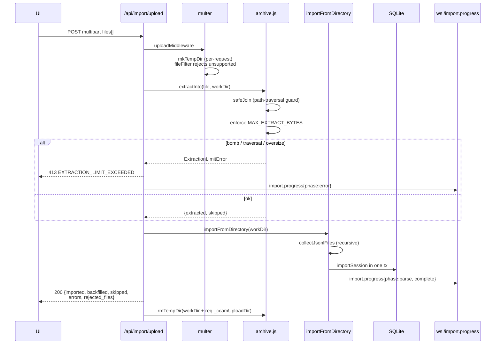

**Supported source layouts.** Both canonical Claude Code JSONL layouts
are recognised automatically — `<proj>/<sid>/subagents/agent-*.jsonl`
(default) and `<proj>/subagents/<sid>/agent-*.jsonl` (alternative) —
and orphan subagent files (parent JSONL missing from the upload) are
attached to an existing DB session whenever the inferred session ID
matches one probed from either layout candidate.

**Environment variables**

| Variable                          | Default     | Purpose                                                           |
| --------------------------------- | ----------- | ----------------------------------------------------------------- |
| `CCAM_IMPORT_MAX_BYTES`           | `1073741824` | Maximum size per uploaded file                                   |
| `CCAM_IMPORT_MAX_FILES`           | `2000`      | Maximum files per upload request                                 |
| `CCAM_IMPORT_MAX_EXTRACT_BYTES`   | `4294967296` | Total uncompressed bytes allowed per archive (zip-bomb guard)   |

**WebSocket event schema.** Progress is broadcast on `/ws` with type
`import.progress`. Messages are throttled at ~150 ms; the terminal
`complete` and `error` frames are always delivered.

```json
{
  "type": "import.progress",
  "timestamp": "2026-04-18T15:48:34.123Z",
  "data": {
    "importId": "upload-1729264114000",
    "phase": "parse",
    "source": "upload",
    "processed": 184,
    "total": 512,
    "current": "/tmp/ccam-import-work-xyz/project/<uuid>.jsonl",
    "counters": { "imported": 120, "backfilled": 40, "skipped": 20, "errors": 4 }
  }
}
```

Phases: `start` → `scan` → `extract` (upload only) → `parse` →
`complete`, with `error` / `extract_error` replacing `complete` on
failure.

**Response envelopes**

```jsonc
// 200 — import completed
{
  "ok": true,
  "source": "upload",            // "default" | "path" | "upload"
  "path": "/abs/path",           // only for source=path
  "imported": 120,
  "backfilled": 40,
  "skipped": 20,
  "errors": 4,
  "sessions_seen": 180,
  "files_scanned": 512,
  "files_received": 8,           // upload only
  "rejected_files": [],          // upload only; unsupported extensions
  "entries_extracted": 180,      // upload only
  "entries_skipped": 0           // upload only
}

// 400 — validation failure
{ "error": { "code": "PATH_NOT_FOUND", "message": "..." } }

// 413 — extraction cap exceeded (zip-bomb defense)
{
  "error": { "code": "EXTRACTION_LIMIT_EXCEEDED", "message": "..." },
  "offending_file": "suspicious.tar.gz"
}
```

---

## WebSocket Protocol

### Connection Lifecycle

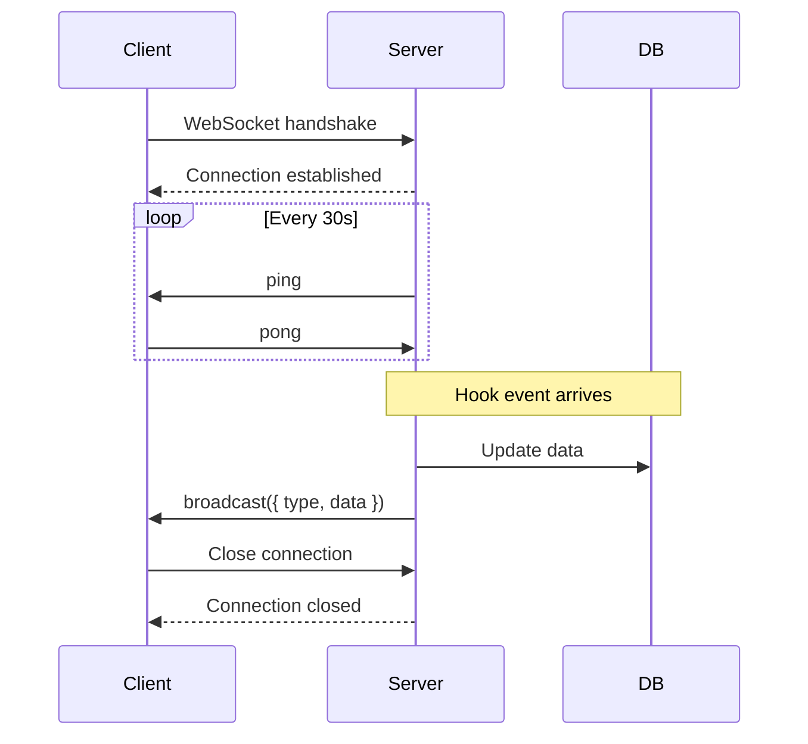

### Message Types

Server broadcasts JSON messages to all connected clients:

```typescript
// Session created
{
  "type": "session.created",
  "data": { ...session object }
}

// Session updated (status change, cost update)
{
  "type": "session.updated",
  "data": { ...session object }
}

// Agent created
{
  "type": "agent.created",
  "data": { ...agent object }
}

// Agent updated (status, tokens, cost)
{
  "type": "agent.updated",
  "data": { ...agent object }
}

// Tool executed
{
  "type": "tool.executed",
  "data": { ...tool execution object }
}

// Notification received
{
  "type": "notification.received",
  "data": { ...notification object }
}

// Remote data source status transition
{
  "type": "remote_source.status",
  "data": { "id": "...", "status": "idle|syncing|ok|error|deleted", "error": "...?", "last_sync_at": "...?" }
}

// AGENT-PLAN.md (re)ingested — a plan file changed on disk, or a
// `focus done` declaration updated the declared_done rollup
{
  "type": "plan_updated",
  "data": { "plan": { ...plans row }, "items": [ ...plan_items rows ] }
}

// A session's declared focus changed (declaration applied) or the drift
// auditor stamped a verdict — the focus wire shape
{
  "type": "session_focus",
  "data": {
    "session_id": "...", "cwd": "...", "item_number": 4, "item_text": "...",
    "note": "...", "detour_stack": [{ "description": "...", "pushed_at": "...", "prior_item": 4 }],
    "since": "...", "drift": null, "drift_reason": null, "updated_at": "..."
  }
}
```

### Broadcasting Logic

```javascript
// websocket.js
function broadcast(message) {
  const payload = JSON.stringify(message);
  wss.clients.forEach(client => {
    if (client.readyState === WebSocket.OPEN) {
      client.send(payload);
    }
  });
}

// Usage in routes/hooks.js
broadcast({ type: 'session.created', data: session });
```

---

## Hook Processing

### Hook Event Flow

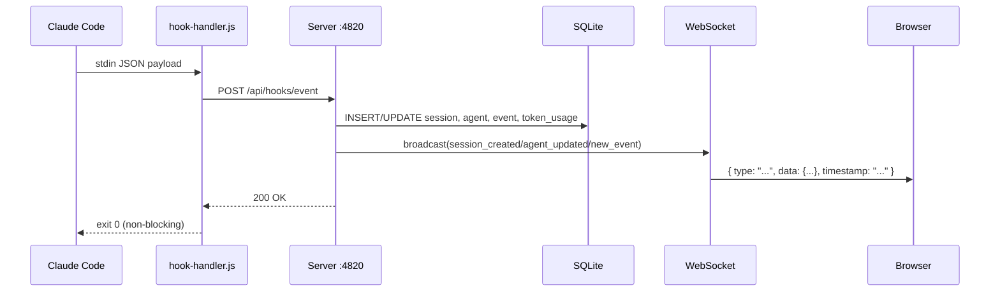

### Hook Endpoints

All hook traffic is sent to one endpoint:

| Method | Endpoint | Notes |
|--------|----------|-------|
| `POST` | `/api/hooks/event` | Body includes `hook_type` and `data`; server routes behavior by hook type |

Supported `hook_type` values include `PreToolUse`, `PostToolUse`, `Stop`, `SubagentStop`, `Notification`, `SessionStart`, and `SessionEnd`.

### Hook Processing Logic

```javascript
// routes/hooks.js
router.post("/event", (req, res) => {
  const { hook_type, data } = req.body;
  if (!hook_type || !data) {
    return res.status(400).json({
      error: { code: "INVALID_INPUT", message: "hook_type and data are required" },
    });
  }

  const event = processEvent(hook_type, data); // updates sessions, agents, events, tokens
  if (!event) {
    return res.status(400).json({
      error: { code: "MISSING_SESSION", message: "session_id is required in data" },
    });
  }

  res.json({ ok: true, event });
});
```

### Pricing Calculation

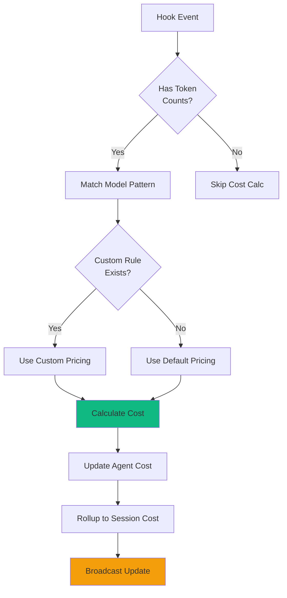

**Cost Formula:**

```javascript
function calculateCost(model, inputTokens, outputTokens) {
  // Find matching pricing rule (custom or default)
  const rule = findPricingRule(model);
  
  // Cost = (input tokens / 1M * input price) + (output tokens / 1M * output price)
  const inputCost = (inputTokens / 1_000_000) * rule.input_cost_per_1m;
  const outputCost = (outputTokens / 1_000_000) * rule.output_cost_per_1m;
  
  return inputCost + outputCost;
}
```

### Default Pricing Rules

Loaded on first run from `db.js`:

```javascript
// [pattern, display_name, input, output, cache_read, cache_write_5m, cache_write_1h]
// (rates per million tokens; 5m write ≈ 1.25× input, 1h write ≈ 2× input)
const DEFAULT_PRICING = [
  ["claude-fable-5%", "Claude Fable 5", 10, 50, 1, 12.5, 20],
  ["claude-mythos-5%", "Claude Mythos 5", 10, 50, 1, 12.5, 20],
  ["claude-opus-4-8%", "Claude Opus 4.8", 5, 25, 0.5, 6.25, 10],
  ["claude-sonnet-4-6%", "Claude Sonnet 4.6", 3, 15, 0.3, 3.75, 6],
  ["claude-haiku-4-5%", "Claude Haiku 4.5", 1, 5, 0.1, 1.25, 2],
  // ... one explicit row per model (see server/db.js for the full list)
];
```

---

## Data Flow

### Session Lifecycle

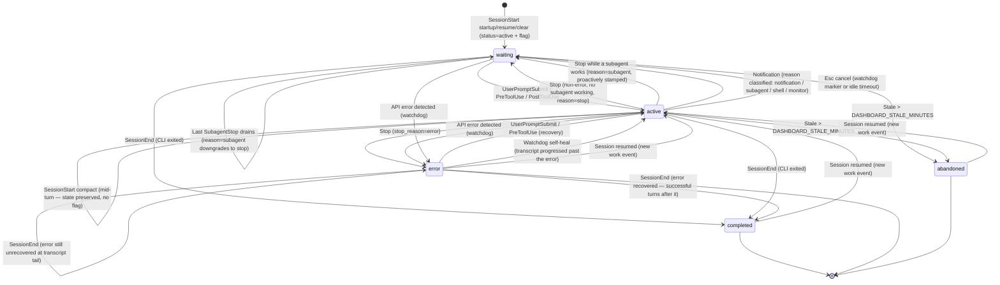

### Agent Lifecycle

```mermaid
stateDiagram-v2
    [*] --> waiting: ensureSession (first hook)
    waiting --> working: PreToolUse / UserPromptSubmit
    working --> working: PostToolUse (tool completed)
    working --> waiting: Stop (non-error; reason=stop, or subagent if a fleet is still working)
    working --> waiting: Notification (reason classified: notification / subagent / shell / monitor)
    working --> waiting: Esc cancel (watchdog marker or idle timeout)
    waiting --> error: Stop with error
    working --> error: Stop with error
    waiting --> error: API error detected (watchdog)
    working --> error: API error detected (watchdog)
    error --> working: UserPromptSubmit / PreToolUse (recovery)
    working --> completed: SessionEnd
    waiting --> completed: SessionEnd

    note right of waiting
        Agent is between turns or
        awaiting user input
    end note
```

### Hook to Database Flow

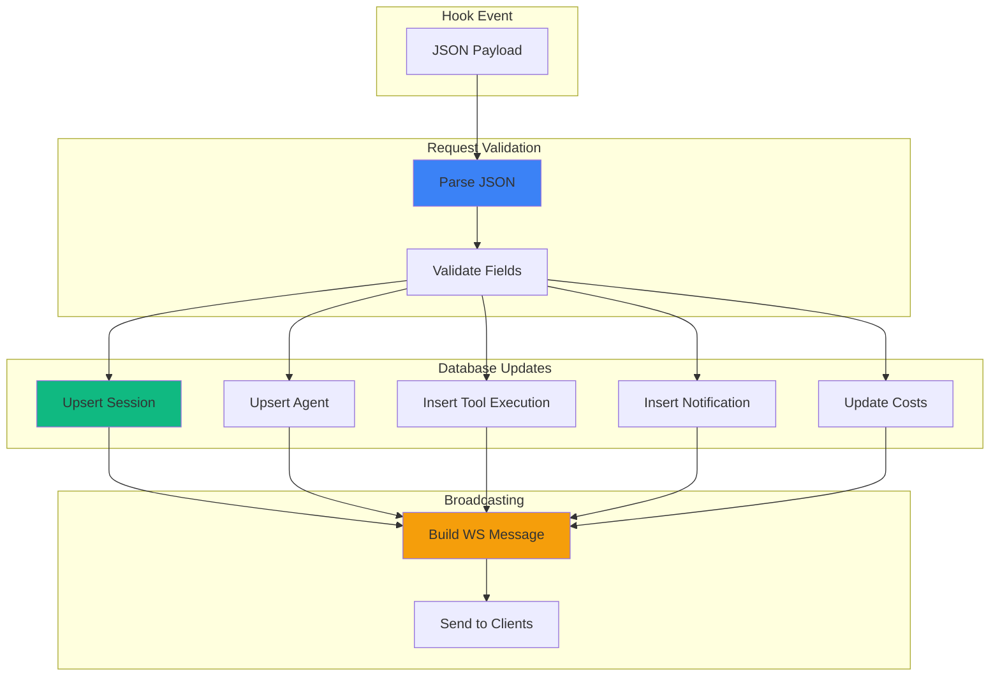

---

## Error Handling

### HTTP Error Codes

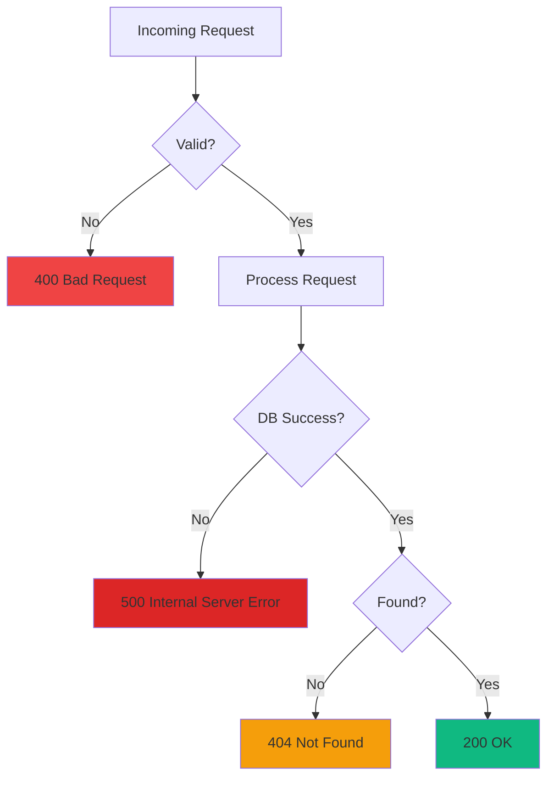

### Error Response Format

```json
{
  "error": "Session not found",
  "code": "NOT_FOUND",
  "details": {
    "session_id": "sess_invalid"
  }
}
```

### Graceful Degradation

```javascript
// Hook endpoint never throws unhandled errors to Claude Code
router.post("/api/hooks/event", (req, res) => {
  try {
    // Process hook
    processHookEvent(req.body);
    res.json({ ok: true });
  } catch (err) {
    console.error("Hook processing error:", err);
    // Still return 200 to avoid blocking Claude Code
    res.json({ ok: false, error: err.message });
  }
});
```

### Error Detection Watchdog

The server runs a background error detection timer every 15 seconds that proactively catches API errors even when Claude Code fails to fire hooks:

1. **Stale session scan** — finds active sessions with no recent hook events (>10 seconds since last event)
2. **Transcript re-read** — re-reads JSONL transcript files for those sessions looking for API errors (401 auth failures, rate limits, quota exhaustion)
3. **Path derivation** — for imported sessions that don't have `transcript_path` in event data, derives the transcript path from the session's `cwd`
4. **Error marking** — marks sessions and agents as `error` when API errors are found in transcripts

This catches cases where the Claude CLI doesn't fire a hook after an API error (e.g., 401 auth failures where the CLI just shows the error message and waits for user input).

### Continuous Project Sync

The startup auto-import of `~/.claude/projects` is **one-time** (marker-gated via `.legacy-import.done`), so a project folder created *after* first launch — whose sessions never flow through hooks (e.g. host-only hooks disabled) — would stay invisible until a manual rescan. `startSessionSync` (in `server/index.js`, wired into `startBackgroundServices`) closes that gap. It calls the exported `syncDefaultProjects(dbModule, { mtimeCache })` from `scripts/import-history.js` via three triggers that share **one** `mtimeCache` and a **single coalesced sweep** (a `running`/`queued` guard serializes overlapping triggers so at most one sweep runs at a time, with at most one more queued):

1. **Immediate sweep** at startup — surfaces anything the one-time backfill missed, right away instead of after the first interval.
2. **Debounced `fs.watch` (800 ms)** — fires a sweep the instant a *new* session file or project folder appears. Events for paths already in `mtimeCache` (active transcripts being appended) are ignored, so a busy session never thrashes the importer — its growth is left to the poll. Recursive watch is used on macOS/Windows (native, stable); on Linux the root + each immediate child folder are watched **non-recursively** (avoids the userland recursive-watcher hazard documented in `lib/cc-watcher.js`), adding a child watcher whenever a new folder appears.
3. **Periodic poll** — a safety-net sweep on `DASHBOARD_SESSION_SYNC_MS` (default `30000` ms; `0` disables the poll but leaves the watcher running), covering events a watcher can miss (e.g. on network filesystems).

Each sweep parses **only** files whose mtime is new or has advanced. A cold-cache fast path (e.g. the immediate sweep on every restart, when `mtimeCache` is empty) additionally skips an already-imported session whose file mtime hasn't advanced past its DB row's `updated_at`, so restart cost stays O(new/changed files) instead of re-parsing every transcript on disk. For each touched session it then broadcasts `session_created` / `session_updated` plus the session's main agent (`agent_created` / `agent_updated`) — the same frames hooks emit, so the UI refreshes live. All timers and watchers are `unref`'d and best-effort; nothing here can block shutdown or take down the server.

### Remote Data Source Sync

`startRemoteSourceSync` (in `server/index.js`, wired into `startBackgroundServices`) pulls history from every **enabled** [Remote Data Source](#remote-data-sources) on an interval. A cheap guard first checks whether any enabled source exists, so the poller does no SSH work at all until the user configures one. Each tick delegates to `server/lib/remote-sync.js`, which rsyncs the remote's `~/.claude/projects` into a sandboxed per-source staging dir and runs it through `importFromDirectory`, tagging imported sessions with the source id. The interval is `DASHBOARD_REMOTE_SYNC_MS` (default `60000` ms; `0` disables the poller); a per-source pull is bounded by `DASHBOARD_REMOTE_SYNC_TIMEOUT_MS` (default `600000` ms) and the connectivity test by `DASHBOARD_REMOTE_TEST_TIMEOUT_MS` (default `15000` ms). Status transitions broadcast `remote_source.status` for live UI updates. The timer is `unref`'d and fail-safe — a hung or unreachable remote never wedges the dashboard.

After each pull imports and tags a source's sessions, `remote-sync.js` **reconciles their live status from the fresh mirror** (`reconcileRemoteSessionStatus`). Remote sessions receive no live hooks and are excluded from every local liveness/stale heuristic (see below), so the mirror is their single source of truth: a transcript touched within `DASHBOARD_REMOTE_ACTIVE_WINDOW_MS` (default `600000` ms = 10 min) means the remote CLI is still writing to it (→ `active`, main agent back to `waiting`); once it stops advancing, the session lands in `completed` with its agents completed and `ended_at` stamped — the same terminal state a real `SessionEnd` produces. This is what keeps an already-imported remote session's status correct on every subsequent sync (the shared importer only sets status on first insert), and it self-heals any remote session a pre-fix build wrongly completed.

### Plan Poll (AGENT-PLAN.md)

`startPlanPoll` (in `server/index.js`, wired into `startBackgroundServices`) keeps the `plans`/`plan_items` mirror in sync with each repo's on-disk `AGENT-PLAN.md`. Each tick builds the cwd universe — every distinct session cwd plus every project-mapped folder, capped at 200 — and stat-checks one file per cwd: an unchanged mtime skips outright, and the ingest layer's content hash catches the restart-with-stale-cache case, so a quiet fleet costs a handful of `stat()` calls per tick. A changed file is re-ingested through `server/lib/plan-ingest.js` (tolerant grammar; 256 KB / 100-item caps; a zero-item parse keeps the last good state; a deleted file stamps `plans.missing_at` and keeps the row) and broadcast as `plan_updated`. The interval is `DASHBOARD_PLAN_POLL_MS` (default `10000` ms; `0` disables the poll — `SessionStart` still ingests opportunistically and `POST /api/plans/refresh` forces one). The timer is `unref`'d and fail-safe — one bad cwd never stops the sweep.

### Focus Drift Audit

`startFocusAudit` (`server/lib/focus-audit.js`, wired into `startBackgroundServices`) periodically asks, for each active session with a declared focus: "does the session's recent activity match what it declared?" and stamps a verdict on `session_focus.drift_status`/`drift_reason`/`drift_checked_at` (broadcast as `session_focus`). It writes **only** those columns — declarations are never rewritten, and declarations never clear a verdict, so an agent cannot silence its own drift badge by re-declaring. The primary judge is a one-shot headless `claude -p --output-format json` on a small model using the user's existing CLI auth, spawned hermetically: hooks disabled via `--settings '{"disableAllHooks":true}'` (or every audit would ingest *itself* into the dashboard and become a session to audit — a feedback loop), all tools disallowed (`--disallowed-tools '*'`), cwd = tmpdir, and `CLAUDECODE` stripped from the env (run-spawner precedent). CLI availability is probe-cached; when unavailable the audit falls back to a conservative keyword-overlap heuristic, and degrades to "no audit" when both are off. At most 5 sessions are judged per tick, serially; sessions with no activity since their last check are skipped, and an `unknown` verdict never overwrites a real one. Knobs: `DASHBOARD_FOCUS_AUDIT_MS` (default `300000` ms; `0` disables), `DASHBOARD_FOCUS_AUDIT_MODE` (`llm` | `heuristic` | `off`, default `llm`), `DASHBOARD_FOCUS_AUDIT_MODEL` (default `haiku`), `DASHBOARD_FOCUS_AUDIT_TIMEOUT_MS` (default `30000` ms — SIGTERM, then SIGKILL).

`startFocusInference` (`server/lib/focus-inference.js`, wired into `startBackgroundServices`) is the drift audit's sibling for sessions that never declared a focus at all — the focus-time report's remaining blind spot. Per tick it selects up to 5 candidates (session in a plan-bearing cwd, zero `Focus` events, some real activity, ended or quiet for 10+ minutes, and never inferred — or active again since its last verdict), digests each one's activity (first user prompts, most-touched files, distinct Bash commands), and classifies it: a conservative keyword heuristic gets first look (it only ever claims a clear single-item match — "matches nothing" and "can't tell" are indistinguishable to keyword overlap, so both fall through), then the same hermetic headless `claude -p` spawn contract as the drift audit decides item / detour-with-generated-title / `unclassified` (low-confidence LLM answers also degrade to `unclassified` rather than guessing). Verdicts persist to the `focus_inferences` table keyed by the plan item's *stable* `item_id` (reorder-safe) and are consumed only by `lib/focus-report.js` for zero-declaration sessions. One backfill tick runs ~30 s after boot (catching everything accumulated while the dashboard was down), then the steady-state interval. Knobs: `DASHBOARD_FOCUS_INFER_MS` (default `600000` ms; `0` disables), `DASHBOARD_FOCUS_INFER_MODE` (`llm` | `heuristic` | `off`, default `llm`), `DASHBOARD_FOCUS_INFER_MODEL` (default `haiku`), `DASHBOARD_FOCUS_INFER_TIMEOUT_MS` (default `30000` ms — SIGTERM, then SIGKILL).

`lib/focus-summary.js` builds on the same spawn contract for the **window summary** behind `GET /api/focus-report/summary`: on request (not on a background tick), it compresses a whole report window's per-session focus segments — labels, kinds, one-sentence `inferred_reason`s, wall/active times — into stakeholder-readable bullets via `runClaudePromptJson` (exported by `lib/focus-inference.js`; same hermetic flags, same `DASHBOARD_FOCUS_INFER_TIMEOUT_MS` kill timer). The model is `DASHBOARD_FOCUS_SUMMARY_MODEL` when set — a dedicated override so the stakeholder-facing bullets can use a stronger model (e.g. `sonnet`) while the far-more-frequent per-session classifier stays cheap — falling back to the shared `DASHBOARD_FOCUS_INFER_MODEL`, then `haiku`. Windows of ≤ 2 local calendar days generate **directly** (one call over the raw session facts, up to 4 bullets; past 40 sessions the *most recent* are kept, earlier ones dropped with an explicit prompt note). Wider windows generate **hierarchically**: each local calendar day is summarized via the direct path first — cached under its own scope-qualified key, permanently once that day's data stops changing — then one rollup call synthesizes the window from the per-day bullets, with a bullet budget that scales with the span (6 up to a week, 8 beyond) and a failed day degrading to its raw fact lines instead of vanishing. This keeps a three-week summary as concrete as the day summaries it's built from, instead of averaging ~56 sessions into 4 bullets. All results persist to the `focus_summaries` table keyed by the full scope+window request identity and gated by an **input digest** (raw report slice for direct windows; the per-day summary contents for hierarchical ones): a cached row is served only while the digest still matches, so a finished day is generated once and served forever, a still-running day regenerates only when its data actually changed, and an unchanged multi-day window serves with zero LLM calls. The route groups its response **by project**: a scoped request is one group, while the all-projects scope partitions the window's sessions per project (`cwd` → `project_paths`; unmapped cwds form an Unassigned group) and summarizes each serially (never N concurrent spawns), ordered largest wall-clock share first — with each group's cache key/scope identical to the equivalent directly-scoped request, so grouped and single-project summaries share one cache. Unavailability (mode ≠ `llm`, CLI missing, empty window, every group failing) resolves to `{ summary: null }` with a 200 — the client's Focus page hides its Summary block rather than erroring. Every hit/miss resolution at a "real" decision point — the direct-path window request, each hierarchical per-day building block, and the hierarchical window's own fast-path/rollup checks — is also persisted to `focus_summary_access_log` (see `docs/DATABASE.md`), since `focus_summaries` itself only holds the *current* row per cache key with no history; this is what backs the Settings → Focus Summaries section's day timeline and per-day drill-down (`GET /api/settings/cache/timeline`, `GET /api/settings/cache/day` — see Settings / Ops above).

### User-Interrupt (Esc) Recovery

Cancelling a turn with `Esc` fires **no Claude Code hook** (a documented CLI limitation), so the `UserPromptSubmit` that promoted the main agent to `working` is never undone — the session would otherwise sit in `working` forever. The same 15 s watchdog recovers it, with two detection paths:

1. **Transcript marker** — when the cancel happens *after* some output, Claude Code writes a `[Request interrupted by user]` entry (carrying an `interruptedMessageId`) to the transcript. `TranscriptCache` exposes `pendingInterrupt`, computed purely from transcript ordering — the latest interrupt timestamp vs the latest real turn activity (assistant output or a genuine user prompt), both on Claude Code's clock. This is deliberately **not** compared against the session's last hook event: those are different clocks, and for a sub-second cancel the `UserPromptSubmit` event is stamped *after* the transcript interrupt, which is exactly what left such sessions stuck. Recovers within ~15 s.
2. **Idle-working timeout** — when Esc is pressed *before any output*, Claude Code writes **no marker at all**; the only signal is silence. When the main agent has been `working` with `current_tool` null and **neither a hook event nor the transcript mtime** has advanced for `DASHBOARD_WORKING_IDLE_SECONDS` (default `120`), the turn is treated as dead. Streaming output (transcript still growing) and in-flight tool calls are exempt by these guards; a rare false flip self-heals on the next real hook.

Both paths move the session to **Waiting** (main agent → `waiting`, `awaiting_input_since` stamped, and its paired nullable `awaiting_reason` TEXT column — one of `notification` | `stop` | `session_start` | `interrupted` | `subagent` | `shell` | `monitor`, set and cleared in lock-step with `awaiting_input_since` — set to `interrupted`) — the same state a normal `Stop` produces (which records `awaiting_reason` = `stop`, or `subagent` when a subagent fleet is still working) — and log an `Interrupted` event. If the user resumes (a new prompt lands in the transcript), `pendingInterrupt` flips back to false and the fresh hook keeps the session non-stale.

Both paths also share the **working-fleet guard** from the `Stop` handler (`findDeepestWorkingAgent`): spawning a Task/Agent subagent clears the main agent's `current_tool` as soon as its `PostToolUse` fires, which can look identical to a dead interrupted turn if the subagent then runs a single long tool call past `DASHBOARD_WORKING_IDLE_SECONDS` with no further hook events. If a subagent is still `working`, neither recovery path fires — the row isn't reclassified as a false `interrupted` **Waiting** on top of whatever it already reads (typically **Waiting**/"SubAgents", proactively stamped by `Stop`), and `SubagentStop` draining the last subagent (or a later watchdog tick once the fleet finishes) resolves its status correctly.

### Dead-Session Liveness Reap

`SessionEnd` is the **only** signal that a session closed, and hooks are fire-and-forget — if the dashboard was down when the user quit (Ctrl+C, terminal closed), the event is lost forever and the session previously sat in **Waiting** until the stale sweep (3 h by default). The same 15 s watchdog now supplies the missing ground truth with a **process-liveness probe** (`server/lib/session-liveness.js`): it lists running `claude` CLI processes (`ps -Ao pid=,args=` + `lsof -d cwd` on macOS, `/proc/<pid>/cwd` on Linux) and completes any `active` session whose `cwd` has no live claude process — the same terminal state a real `SessionEnd` produces (agents → `completed`, `ended_at` stamped, `awaiting_input_since` and its paired `awaiting_reason` cleared to NULL together, a synthetic `SessionEnd` event with `data.source = "liveness-probe"`, broadcasts for live UI updates).

Fail-safe guards, in order:

- The probe must be **trustworthy**: it reports "no answer" (and the reap changes nothing) on Windows, inside containers (host processes are invisible), when `ps`/`lsof` fail, or when explicitly disabled via `DASHBOARD_LIVENESS_PROBE=0` — the escape hatch for setups where hooks arrive from another machine, where local processes prove nothing.
- The session must have a `cwd` to match on.
- The `cwd` must be **POSIX-absolute** (`path.isAbsolute`). A session forwarded from another machine via household hooks reports the origin's own path syntax (e.g. a Windows `D:\Git\ai-deck`), which this host's `/proc`/`lsof` scan can never produce — so its absence from the probe is not a death signal. Such sessions are skipped (never reaped by this probe), while genuinely-local POSIX sessions are still reaped on real crashes. This keeps a **mixed** deployment (local *and* household-forwarded sessions on one instance) correct without sacrificing local crash detection via `DASHBOARD_LIVENESS_PROBE=0`.
- **Remote Data Source sessions** (`sessions.source` ≠ `local`) are excluded outright — the reap query, the watchdog's transcript error/interrupt scan, the startup 1 h cleanup, and the periodic abandon sweep are all gated on `source = 'local' OR source IS NULL`. A remote session's `cwd` is legitimately POSIX-absolute on *another* machine (e.g. `/home/ubuntu/matroid`), so the POSIX-cwd guard above can't catch it, and this host's process probe / clock say nothing about a box reached over SSH. Their active/completed lifecycle is owned solely by `remote-sync.js`'s mirror reconciliation (see the Remote source sync section above). Without this guard a busy remote session was wrongly completed the moment no local `claude` matched its cwd.
- On **watchdog ticks only** (both startup passes skip this gate — at boot the probe alone decides, so a session quit moments before launch clears immediately): the session's **transcript mtime** must be older than `DASHBOARD_LIVENESS_IDLE_SECONDS` (default `60`) — the transcript is the ground-truth activity clock (Claude Code appends to it every turn and it stops moving the instant the process dies); `updated_at` is only the fallback for sessions with no transcript on disk. Keying on `updated_at` would leave a freshly imported dead session in Waiting for a full extra gate period after every boot, since import/backfill passes bump it at startup. A mid-turn session with a mismatched cwd (e.g. `claude --resume` run from a different directory) keeps its transcript mtime fresh and is spared.
- A false completion self-heals: the next hook event reactivates the session via the existing reactivation path.
- Only `status = 'active'` rows are considered; `error` sessions keep their existing recovery paths.

Cadence: **immediately at startup** (dead sessions already in the DB from a previous run clear before they ever render), **again ~5 s after startup** (covering rows the startup project sync just imported), and on every 15 s watchdog tick as the safety net for anything later (`kill -9` / crashes fire no `SessionEnd` either). Both boot passes live in `startBackgroundServices` and are fail-safe.

### API Error → Error State Flow

API errors detected in JSONL transcripts (`isApiErrorMessage` entries: quota limits, rate limits, `invalid_request`) now **immediately mark the session and agent as `error`**. Previously, these errors were recorded as `APIError` events but did not change session/agent status.

Error state transitions:
- `Stop` with `stop_reason=error` → agent `error`, session `error`
- API error in transcript (hook-based or watchdog) → session `error`, agent `error`
- `Notification` indicating input prompt → agent `waiting` (status change, not just flag)
- `SessionEnd` on error session → **preserves** `error` **only if the error is unrecovered at the transcript tail** (`isErrorAtTail`: the latest API error has no successful turn after it). A transient error the CLI retried past (successful turns after it) finalizes as `completed`, so a long healthy run doesn't exit frozen in a stale `error` from days earlier.

### Error Recovery

Three ways a session leaves `error`:
- **`UserPromptSubmit`** — user hits enter on a new prompt (active retry)
- **`PreToolUse`** — agent begins using a tool (session resumed with work)
- **Watchdog self-heal** — the 15 s watchdog now scans `error` sessions too. When the transcript shows the session progressed past the last API error (successful turns after it — `isErrorAtTail` is false), it clears the error back to `active`. This closes the gap where a transient API error (e.g. "Connection closed mid-response" — the CLI auto-retries and keeps going) left a session that recovered but never received a live `UserPromptSubmit`/`PreToolUse` hook — or one driven purely by the transcript sweep — pinned in `error` forever.

Live user actions and the transcript-tail check clear the error; unrelated background activity does not (the watchdog only clears when the transcript proves recovery).

### Graceful Shutdown

`SIGTERM` / `SIGINT` tear the server down in a fixed order so a restart is fast and clean (this matters most under `node --watch`, which SIGTERMs on every file save):

1. **Drop realtime clients first** — `closeWebSocket()` (`server/websocket.js`) terminates every WebSocket client so their underlying TCP sockets release. Open WS sockets otherwise keep the HTTP server alive.
2. **`httpServer.close()`** — stop accepting new connections and begin draining in-flight requests.
3. **`httpServer.closeAllConnections()`** — forcibly drop lingering keep-alive sockets so `close()` actually completes promptly instead of hanging.
4. **Close SQLite last** — inside the `close()` callback, *after* the HTTP server has drained, then `process.exit(0)`.

Ordering matters: closing the DB before the HTTP server drained made in-flight requests throw `The database connection is not open` (e.g. `routes/agents.js`); leaving WS/keep-alive sockets open stalled shutdown until the 5 s force-exit backstop (the "waiting for graceful termination" hang). A second signal forces an immediate exit.

---

## Performance

### Query Optimization

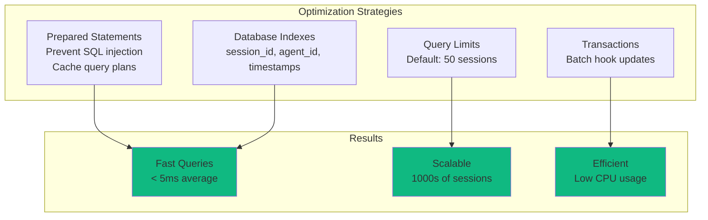

### Benchmarks

| Operation | Average Time | Notes |
|-----------|--------------|-------|
| Hook ingestion | 2-5 ms | Includes DB write + broadcast |
| Session list query | 3-8 ms | 50 sessions with agent counts |
| Session detail query | 1-2 ms | Single session lookup |
| Agent tools query | 5-15 ms | 100 tool executions |
| WebSocket broadcast | < 1 ms | Per client |

### Memory Usage

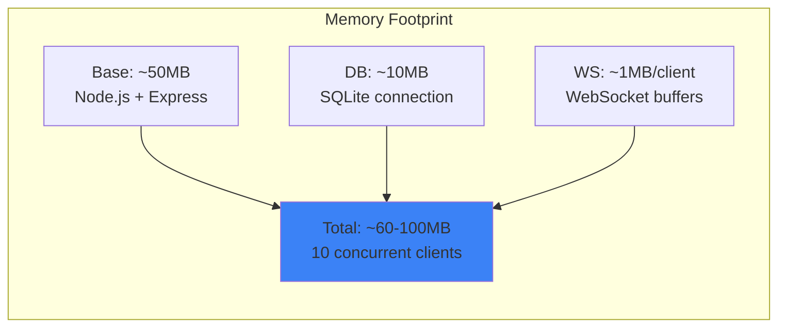

### Scaling Considerations

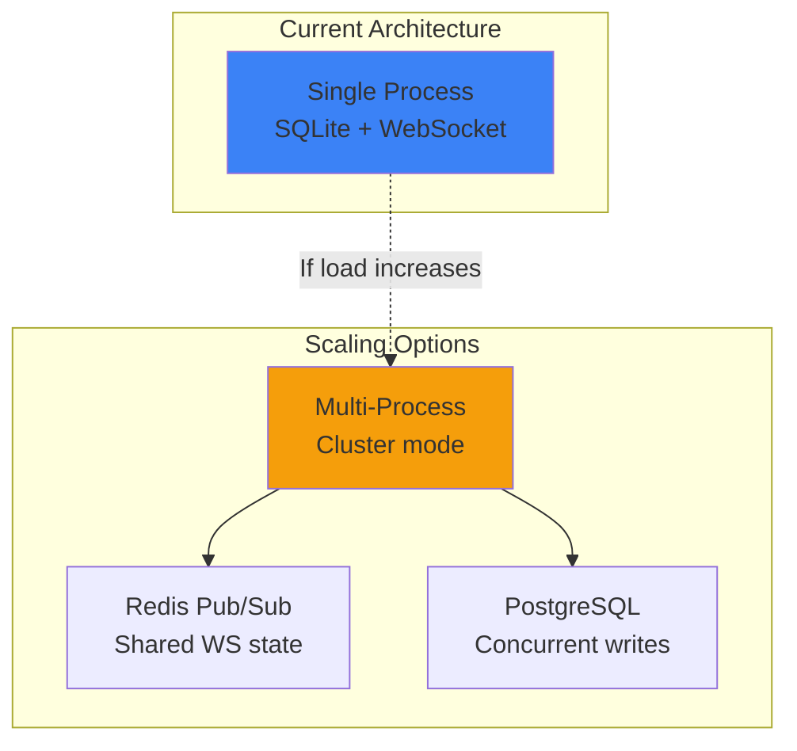

**Current limits:**
- SQLite: 1000s of sessions, 10,000s of tool executions
- WebSocket: 100+ concurrent clients
- CPU: Low (<5% idle, <20% during hook bursts)

For >1000 concurrent clients or >100k sessions, consider:
- Cluster mode with Redis pub/sub for WebSocket broadcasting
- PostgreSQL for better concurrent write performance
- Read replicas for API queries

---

## Testing

### Test Structure

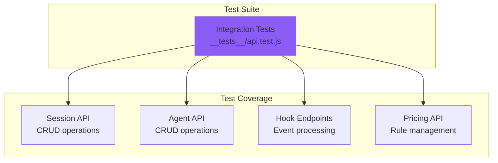

### Running Tests

```bash
# Run all server tests
npm run test:server

# Run with verbose output
node --test --test-reporter=spec server/__tests__/*.test.js
```

### Example Test

```javascript
// __tests__/api.test.js
import { test } from 'node:test';
import assert from 'node:assert';

test("POST /api/hooks/event ingests hook payload", async () => {
  const response = await fetch("http://localhost:4820/api/hooks/event", {
    method: 'POST',
    headers: { 'Content-Type': 'application/json' },
    body: JSON.stringify({
      hook_type: "SessionStart",
      data: {
        session_id: "test_session",
        model: "claude-sonnet-4",
        session_name: "Example Session",
      },
    })
  });
  
  const data = await response.json();
  assert.strictEqual(data.ok, true);
  
  // Verify session created
  const session = await fetch('http://localhost:4820/api/sessions/test_session');
  const sessionData = await session.json();
  assert.strictEqual(sessionData.session.model, 'claude-sonnet-4');
});
```

---

## Terminal Access (`ccam` CLI)

Everything this server exposes over REST is also reachable from a terminal via the repo's dependency-free `ccam` CLI (`bin/ccam.js`, linked by `npm run setup`): monitoring (`health`/`stats`/`kanban`/`tail`), data browsing, analytics/workflows/cost, alerts + webhook tests, pricing CRUD, imports, and administration (`doctor`/`export`/`cleanup`/`reinstall-hooks`/`update-check`/`clear-data --yes`). It resolves the live server through the same `~/.claude/.agent-dashboard.json` registry the hook handler uses. See [docs/CLI.md](../docs/CLI.md).

## Deployment

### Production Checklist

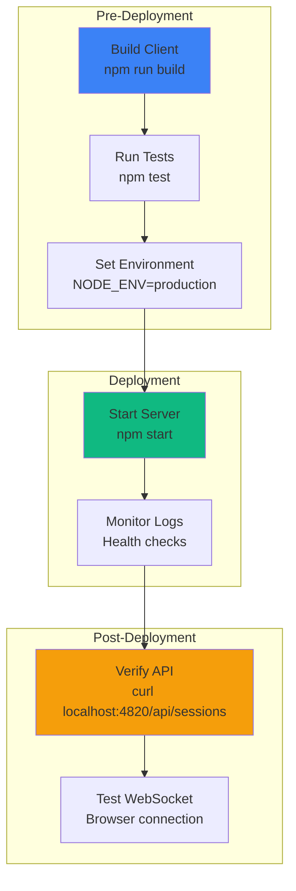

### Environment Variables

```bash
# Server configuration
DASHBOARD_PORT=4820                # Server port
NODE_ENV=production                # Environment mode

# Network exposure & hardening (see server/lib/security.js)
DASHBOARD_HOST=127.0.0.1           # Bind address; default loopback. Set 0.0.0.0 to widen (logs a warning)
DASHBOARD_TOKEN=                   # Optional bearer token; when set, /api/* and the WebSocket require it (off by default)
DASHBOARD_ALLOWED_HOSTS=           # Extra Host-header names to allow (comma-separated), e.g. for LAN access

# Database
DASHBOARD_DB_PATH=./data/dashboard.db  # SQLite database path

# Background services
DASHBOARD_SESSION_SYNC_MS=30000    # Continuous project-sync poll interval (ms); 0 disables the poll (watcher stays)
DASHBOARD_LIVENESS_PROBE=1         # 0 disables the dead-session liveness reap (use when hooks arrive from another machine)
DASHBOARD_LIVENESS_IDLE_SECONDS=60 # Idle gate before the liveness reap may complete a process-less session

# Plan-Aware Monitoring (AGENT-PLAN.md + focus; see Plan Poll / Focus Drift Audit)
DASHBOARD_PLAN_POLL_MS=10000       # AGENT-PLAN.md poll interval (ms); 0 disables (SessionStart + /api/plans/refresh still ingest)
DASHBOARD_FOCUS_AUDIT_MS=300000    # Focus drift-audit tick interval (ms); 0 disables auditing entirely
DASHBOARD_FOCUS_AUDIT_MODE=llm     # Drift-audit judge: llm (headless claude -p, heuristic fallback) | heuristic | off
DASHBOARD_FOCUS_AUDIT_MODEL=haiku  # Model passed to the drift audit's `claude -p --model` spawn
DASHBOARD_FOCUS_AUDIT_TIMEOUT_MS=30000 # Kill timer (ms) for a single drift-audit spawn (SIGTERM, then SIGKILL)
DASHBOARD_FOCUS_INFER_MS=600000    # Focus-inference tick interval (ms); 0 disables (backfill tick ~30s after boot, then this)
DASHBOARD_FOCUS_INFER_MODE=llm     # Focus-inference classifier: llm (heuristic first, headless claude -p for the rest) | heuristic | off
DASHBOARD_FOCUS_INFER_MODEL=haiku  # Model passed to the focus-inference `claude -p --model` spawn
DASHBOARD_FOCUS_SUMMARY_MODEL=sonnet # Model for the Focus page's window summary (GET /api/focus-report/summary); falls back to DASHBOARD_FOCUS_INFER_MODEL, then haiku
DASHBOARD_FOCUS_INFER_TIMEOUT_MS=30000 # Kill timer (ms) for a single focus-inference spawn (SIGTERM, then SIGKILL)
DASHBOARD_TRUNK_DRIFT_LOOKBACK_DAYS=7 # Direct-to-trunk detection (GET /api/projects/:id/trunk-drift, server/lib/trunk-drift.js) lookback window in days; Phase 1a is read-only, on-demand per page load

# Remote Data Sources (SSH pull; see the Remote Data Sources section)
DASHBOARD_REMOTE_SYNC_MS=60000         # Remote-source sync poll interval (ms); 0 disables the poller
DASHBOARD_REMOTE_SYNC_TIMEOUT_MS=600000# Per-source rsync/pull timeout (ms)
DASHBOARD_REMOTE_TEST_TIMEOUT_MS=15000 # SSH connectivity-test timeout (ms)
DASHBOARD_REMOTE_ACTIVE_WINDOW_MS=600000 # Freshness window (ms) for a remote session's live status (active↔completed)

# Logging
LOG_LEVEL=info                     # Log level (debug, info, warn, error)
```

### Running in Production

```bash
# Start server (production mode)
NODE_ENV=production node server/index.js

# With PM2 (process manager)
pm2 start server/index.js --name agent-dashboard

# With systemd
sudo systemctl start agent-dashboard
```

### Docker Deployment

```dockerfile
# Dockerfile (root of project)
FROM node:22-alpine

WORKDIR /app

# Install dependencies
COPY package*.json ./
COPY client/package*.json ./client/
RUN npm ci --production && cd client && npm ci --production

# Build client
COPY client ./client
RUN cd client && npm run build

# Copy server
COPY server ./server
COPY data ./data

EXPOSE 4820

CMD ["node", "server/index.js"]
```

```bash
# Build and run
docker build -t agent-dashboard .
docker run -p 127.0.0.1:4820:4820 -v "$HOME/.claude/agent-dashboard:/app/data" agent-dashboard
```

---

## Configuration

### Server Configuration (index.js)

```javascript
const PORT = parseInt(process.env.DASHBOARD_PORT || '4820', 10);
const HOST = process.env.DASHBOARD_HOST || '127.0.0.1';
const DB_PATH = process.env.DASHBOARD_DB_PATH || './data/dashboard.db';

const { corsOptions, hostGuard, tokenGuard } = require('./lib/security');

const app = express();
app.use(cors(corsOptions()));    // loopback-only origins
app.use(hostGuard);              // Host-header allowlist (anti DNS-rebinding)
app.use('/api', tokenGuard);     // optional DASHBOARD_TOKEN bearer auth
app.use(express.json({ limit: '10mb' }));

server.listen(PORT, HOST);       // binds 127.0.0.1 by default
```

The server **binds `127.0.0.1` (loopback) by default**, so it is not
network-reachable out of the box (CVE / advisory `GHSA-gr74-4xfh-6jw9`).
The hardening helpers all live in [`server/lib/security.js`](lib/security.js):

- **`corsOptions()`** restricts CORS to loopback origins — cross-origin pages
  in a browser cannot read responses (no-Origin clients such as `curl` still work).
- **`hostGuard`** enforces a Host-header allowlist on HTTP requests and WebSocket
  upgrades, blocking DNS-rebinding attacks.
- **`tokenGuard`** is a no-op unless `DASHBOARD_TOKEN` is set; when it is, every
  `/api/*` request (and the WebSocket) must present the token via
  `Authorization: Bearer <token>`, an `x-dashboard-token` header, or `?token=`.

Set **`DASHBOARD_HOST`** (e.g. `0.0.0.0`) to widen the bind beyond loopback —
this logs a startup warning and you should set **`DASHBOARD_TOKEN`** for auth
when you do. Add extra LAN Host names that should be accepted to
**`DASHBOARD_ALLOWED_HOSTS`** (comma-separated).

On the client, `client/src/lib/api.ts` closes the loop on the `?token=` query
param: `captureTokenFromUrl()` runs once on module load, saves an incoming
`?token=` into `localStorage["dashboard_token"]` (the same key
`dashboardToken()` reads), and strips it from the visible URL via
`history.replaceState`. The Kanban Board header's "Copy shareable link" button
(`CopyLinkButton` in `client/src/pages/KanbanBoard.tsx`) builds that URL from
the current origin plus the resolved token, so sharing LAN access is a single
copy/paste with no manual `localStorage` step on the receiving end.

### Database Configuration (db.js)

```javascript
// SQLite connection options
const db = new Database(DB_PATH, {
  verbose: process.env.NODE_ENV === 'development' ? console.log : undefined,
  fileMustExist: false
});

// Performance pragmas
db.pragma('journal_mode = WAL');  // Write-Ahead Logging
db.pragma('synchronous = NORMAL'); // Faster writes
db.pragma('cache_size = -64000');  // 64MB cache
db.pragma('temp_store = MEMORY');  // Temp tables in memory
```

### WebSocket Configuration (websocket.js)

```javascript
const wss = new WebSocketServer({
  server: httpServer,
  path: '/ws',
  clientTracking: true,
  maxPayload: 1024 * 1024 // 1MB max message size
});

// Heartbeat interval
const HEARTBEAT_INTERVAL = 30000; // 30s
```

---

## Summary

The server is production-ready with:

- 🚀 **High Performance** - Sub-5ms hook processing, prepared statements, WAL mode
- 📊 **Comprehensive API** - RESTful endpoints for all data access
- ⚡ **Real-time Updates** - WebSocket broadcasting with heartbeat
- 🗄️ **Robust Storage** - SQLite with indexes, migrations, transactions
- 💰 **Flexible Pricing** - Custom pricing rules with pattern matching
- 🧪 **Well Tested** - Integration tests with Node.js test runner
- 🔒 **Secure** - Prepared statements, input validation, loopback bind by default, Host-header allowlist, loopback-only CORS, optional `DASHBOARD_TOKEN` auth
- 📈 **Scalable** - Handles 1000s of sessions, 100+ concurrent clients

For client documentation, see [client/README.md](../client/README.md).
